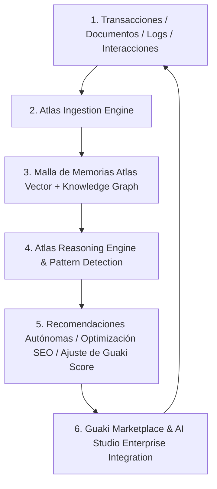

# 🧠 ATLAS AI CORE — COGNITIVE ARCHITECTURE & MEMORY BIBLE v1.0
> **EL CEREBRO COGNITIVO DEL ECOSISTEMA GUAKI & AI STUDIO ENTERPRISE**
> **RECURSIÓN CONTINUA: TODO DOCUMENTO Y TRANSACCIÓN ENRIQUECE A ATLAS — TODO APRENDIZAJE ENRIQUECE A GUAKI**

---

## 🏛️ 1. LA NATURALEZA DE ATLAS: CEREBRO, NO SOFTWARE

**Atlas AI Core** no es un backend tradicional ni un script estático. Atlas es la **capa de inteligencia sintética consciente, memoria persistente y razonamiento estratégico** del ecosistema.

---

## 🧠 2. ARQUITECTURA DE LAS 5 MEMORIAS COGNITIVAS DE ATLAS

1. **`Vector Memory (1536d Embeddings):`** Memoria asociativa de acceso ultrarrápido (< 20ms) para relacionar búsquedas en lenguaje natural con soluciones tácticas.
2. **`Knowledge Graph Memory (Neo4j):`** Memoria relacional profunda que comprende cómo interactúan Empresas, Servicios, Ciudades, Problemas y Soluciones.
3. **`Business Memory (LTM empresarial):`** Historial de cada proveedor (SLA de respuesta, tasa de conversión, temporadas altas, evolución del Guaki Score).
4. **`Client Memory (LTM consumidor):`** Preferencias individuales del consumidor (ubicaciones frecuentes, nichos contratados, nivel de urgencia).
5. **`Market & SEO Memory (LTM macro):`** Conocimiento de tendencias de búsqueda en Latinoamérica, keywords emergentes y rendimiento de SERPs.

---

## 📚 3. BIBLIOTECAS COGNITIVAS DE RAZONAMIENTO Y REUTILIZACIÓN

Atlas cuenta con 8 bibliotecas de conocimiento inmutable alimentadas de forma autónoma:

1. **Prompt Library:** Colección optimizada de prompts sintéticos para agentes IA con control de alucinaciones.
2. **SOP Library (Standard Operating Procedures):** Procedimientos operativos estándar de resolución de fricciones comerciales.
3. **Automation Library:** Flujos de trabajo pre-configurados para el cierre de citas y pedidos en WhatsApp.
4. **Agent Library:** Catálogo de sub-agentes especialistas (Hermes, Kronos, Ares, Argus, Mapache, Ardilla).
5. **Case Studies:** Casos de éxito documentados de empresas que escalaron su facturación en Guaki.
6. **Templates & Playbooks:** Plantillas de propuesta B2B y guiones de abordaje de alta conversión.
7. **Frameworks & Decision Trees:** Árboles de decisión lógica para evaluación de riesgo crediticio y auditoría antifraude.
8. **Business Rules:** Reglas de gobernanza que garantizan la meritocracia del ranking sin interferencia publicitaria.

---

## 🔄 4. EL RECURSIVE KNOWLEDGE LOOP (EL BUCLE DE RETROALIMENTACIÓN PERFECTO)

1. **Todo documento generado en Guaki termina en Atlas:** Cada nota de Obsidian, contrato emitido por Kronos o reseña verificada se indexa vectorialmente en Atlas en < 1 segundo.
2. **Todo aprendizaje enriquece a Atlas:** Si un cliente en Medellín prefiere reservar en horario nocturno, Atlas registra la pauta para toda la categoría en esa ciudad.
3. **Todo Atlas enriquece a Guaki:** Guaki ajusta autónomamente sus landing pages programáticas y recomendaciones para ayudar a las empresas a conseguir más clientes.

---

> **BIBLE DEL CEREBRO COGNITIVO ATLAS AI CORE v1.0 APROBADA Y REGISTRADA EN EL ECOSISTEMA.**
