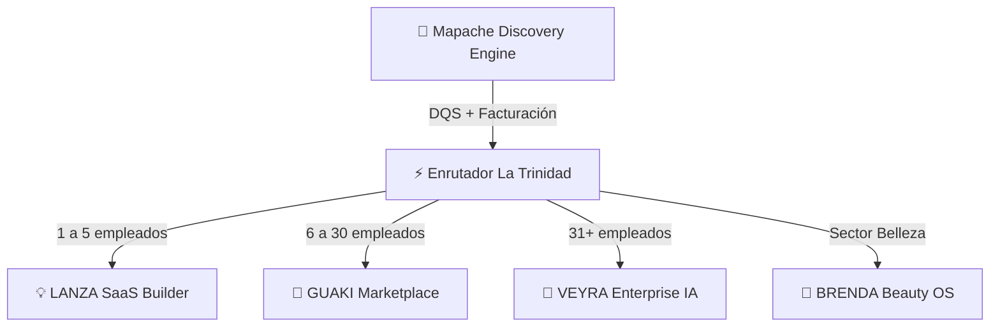

# 🌐 Backlog Maestro Total — Ecosistema Comercial & Tecnológico

> [!abstract] Resumen Estratégico del Holding
> **La Trinidad Comercial** orquesta el crecimiento empresarial en Latinoamérica mediante un enrutador inteligente de demanda que clasifica los prospectos captados por **Mapache Engine** y los distribuye según su tamaño de facturación y madurez digital:
> - 💡 **LANZA (1-5 empleados / 0 a 1):** Validación exprés de ideas, modelo financiero y MVP.
> - 🦜 **GUAKI (6-30 empleados / Marketplace):** Directorio verificado, agendamiento de citas y presencia local.
> - 🏢 **VEYRA (31+ empleados / Enterprise):** Diagnósticos Business MRI™, automatización de procesos e IA a medida.
> - 💅 **BRENDA BEAUTY OS (Vertical Especializada):** SaaS operativo para estéticas, cronómetro de mesa y costeo unitario.

---

## 🧭 Matriz del Ecosistema



---

## 📊 Estado Global de Gates Técnicos

| Proyecto | Core Tech | Estado | Tests / Suite | Siguiente Hito Inmediato |
| :--- | :--- | :---: | :---: | :--- |
| **🦜 GUAKI** | Next.js 14 / Tailwind / Schema.org | `PASS` | 64/64 ✅ | Ingesta masiva de 50+ proveedores por ciudad |
| **🦝 MAPACHE** | Node.js / PostgreSQL / Hostinger SMTP | `PASS` | 100% ✅ | Enriquecimiento automático DQS con Crawler |
| **🏢 VEYRA** | Next.js / React / Business MRI™ | `PASS` | Activo ✅ | Formulario Interactivo Business MRI™ en vivo |
| **💡 LANZA** | Next.js / TypeScript / Wompi | `READY` | Specs ✅ | Asistente de validación Idea → Primera Venta |
| **💅 BRENDA** | React Native Expo / Web | `READY` | Specs ✅ | Cronómetro háptico de mesa para manicuristas |
| **⚡ TRINIDAD** | Router Engine / Supabase | `PASS` | Activo ✅ | Enrutador automático Mapache $\rightarrow$ CRM |

---

## 🗂️ Backlog Detallado por Proyecto

### 🦜 1. GUAKI — Marketplace & Directorio Verificado
*Infraestructura de visibilidad, citas y reputación para negocios locales en Colombia.*

- [x] **GKI-00**: Arquitectura base, 0 errores TypeScript y 64 tests de integración.
- [x] **GKI-01**: Sistema de agendamiento directo de citas integrado en fichas públicas.
- [x] **GKI-02**: Sistema de reseñas y calificación de 1 a 5 estrellas con recálculo dinámico de promedios.
- [x] **GKI-03**: Generador e impresor de Stands con Código QR oficial del local (`/provider/dashboard?tab=qr`).
- [x] **GKI-04**: Integración Web Share API y botón de compartir en WhatsApp / Redes.
- [x] **GKI-05**: PWA Manifest (`manifest.ts`) y optimización para instalación móvil nativa.
- [x] **GKI-06**: Hubs SEO locales por categoría y ciudad (`/servicios/[category]/[city]`) con Schema.org `ItemList`.
- [x] **GKI-07**: Fichas públicas de proveedores con marcado Schema.org `LocalBusiness`.
- [ ] **GKI-08 [P0 - Pendiente]**: **Ingesta Masiva por Ciudades (Bogotá, Medellín, Cali, Barranquilla, Bucaramanga)**
  - *Criterio de Aceptación:* 50+ negocios verificados reales por cada ciudad principal.
  - *Comando / Script:* `npm run import:providers -- --city=all`
- [ ] **GKI-09 [P1 - Pendiente]**: **Búsqueda Semántica Vectorial con Atlas AI**
  - *Criterio de Aceptación:* Embeddings locales para resolver búsquedas complejas en <200ms con fallback léxico.
- [ ] **GKI-10 [P1 - Backlog]**: **Notificaciones Webhook de Leads por WhatsApp Business API**
  - *Criterio de Aceptación:* Notificación push instantánea al WhatsApp del proveedor cuando un cliente agenda o cotiza.

---

### 🦝 2. MAPACHE & HERMES — Motor de Prospección y Datos
*Crawler ético, enriquecimiento de empresas y servidor SMTP transaccional.*

- [x] **MAP-01**: Multi-tenant estricto con políticas Row Level Security (RLS) en Postgres.
- [x] **MAP-02**: Conexión SMTP autenticada con Hostinger para envíos transaccionales controlados.
- [x] **MAP-03**: Adaptador de búsqueda y discovery ético con deduplicación por dominio y teléfono.
- [ ] **MAP-04 [P1 - Pendiente]**: **Data Quality Score (DQS 0-1000) & Crawler de Presencia Digital**
  - *Criterio de Aceptación:* Evaluación automática de velocidad web, pixel de pauta de Meta/Google, certificado SSL y diseño responsive.
  - *Siguiente Acción:* Crear worker ligero en `mapache/workers/dqs_crawler.mjs`.

---

### 🏢 3. VEYRA — Enterprise IA & Diagnósticos Business MRI™
*Consultoría tecnológica y automatización de procesos para medianas y grandes empresas.*

- [x] **VEY-01**: Sistema de generación de reportes Business MRI™ con estados de auditoría en vivo.
- [x] **VEY-02**: Aprobación en 1 clic de reportes en el Centro de Comando (`/command-center`).
- [ ] **VEY-03 [P1 - Pendiente]**: **Diagnóstico Business MRI™ Interactivo en Web**
  - *Criterio de Aceptación:* Cuestionario interactivo de 12 preguntas en 4 ejes (Ventas, Operaciones, Finanzas, IA) con gráfica radar en tiempo real.
  - *Siguiente Acción:* Conectar endpoint `/api/veyra/assessment` con el webhook de Mapache.
- [ ] **VEY-04 [P2 - Backlog]**: **Migración a Base de Datos Supabase Cloud**
  - *Criterio de Aceptación:* Sincronización automática de PostgreSQL local 5435 a Supabase de producción.

---

### 💡 4. LANZA — SaaS & Venture Builder
*Plataforma de aceleración e incubación de ideas de negocio para microempresarios.*

- [ ] **LNZ-01 [P1 - Pendiente]**: **Asistente de Validación Rápida (Idea → Primera Venta)**
  - *Criterio de Aceptación:* Generador guiado por IA que entrega propuesta de valor, estructura de costos y landing de preventa en 60 segundos.
  - *Siguiente Acción:* Programar asistente conversacional en `lanza/src/components/IdeaWizard.tsx`.
- [ ] **LNZ-02 [P2 - Backlog]**: **Integración Pasarela de Pagos Wompi / PSE**
  - *Criterio de Aceptación:* Cobro automático en pesos colombianos ($COP) con confirmación de webhook.

---

### 💅 5. BRENDA — Beauty OS & Academia Profesional
*Software especializado de gestión de tiempos, citas y costeo para profesionales de la belleza.*

- [ ] **BRD-01 [P0 - Pendiente]**: **Protocolo y Cronómetro de Mesa Profesional**
  - *Criterio de Aceptación:* Cronómetro por fases (Setup 3 min, Diagnóstico, Aplicación, Curado, Cobro) con alertas hápticas y sonoras para maximizar facturación/hora.
  - *Siguiente Acción:* Implementar pantalla `TableTimerScreen.tsx` en Expo React Native.
- [ ] **BRD-02 [P1 - Pendiente]**: **Menú de Experiencia Sensorial con Costeo Unitario por Insumo**
  - *Criterio de Aceptación:* Desglose de $2.500 COP por insumo para calcular ganancia neta exacta de la manicurista por servicio.

---

### ⚡ 6. LA TRINIDAD — Enrutador Inteligente & Gobernanza
*Cerebro central que coordina y distribuye los flujos comerciales de todo el grupo.*

- [x] **TRN-00**: Centro de Comando unificado (`/command-center`) con pestañas por proyecto y métricas en vivo.
- [x] **TRN-01**: `TrinidadRouterCard` integrada para previsualización de distribución de leads.
- [ ] **TRN-02 [P0 - Pendiente]**: **Middleware de Enrutamiento Automático Mapache $\rightarrow$ CRM**
  - *Criterio de Aceptación:* Asignación automática de prospectos:
    - $\le 5$ empleados $\rightarrow$ **LANZA**
    - $6-30$ empleados $\rightarrow$ **GUAKI**
    - $31+$ empleados $\rightarrow$ **VEYRA**
- [x] **TRN-03**: Backup diario de base de datos verificado con SHA-256 válido.
- [x] **TRN-04**: Sitemap dinámico por ciudad/categoría y robots.txt activos.

---

## 💻 Instrucciones para Continuar en Open Code

> [!tip] Prompt Listo para Ejecutar en Open Code
> Cuando abras este repositorio en **Open Code**, copia y pega la siguiente instrucción de arranque:

```markdown
Hola Open Code. Estamos desarrollando el ecosistema de La Trinidad (Guaki, Mapache, Veyra, Lanza y Brenda).
Por favor lee el archivo BACKLOG_TOTAL_OBSIDIAN.md en la raíz del proyecto para conocer el estado actual.

Nuestras prioridades inmediatas son:
1. Ejecutar la suite de validación: `node --test tests/*.test.mjs` y `npx tsc --noEmit`.
2. Avanzar en la tarea [GKI-08]: Ingesta y poblamiento masivo de proveedores verificados por ciudad en `src/lib/business_store.ts`.
3. Conectar el enrutador de La Trinidad [TRN-02] en el Centro de Comando.

Mantén el código 100% tipado, sin errores y con todas las pruebas en verde.
```

---

## 🛠️ Comandos de Verificación Rápida

```bash
# 1. Comprobar tipado estricto TypeScript
npx tsc --noEmit

# 2. Ejecutar suite completa de 64 pruebas automatizadas
node --test tests/*.test.mjs

# 3. Iniciar servidor local de desarrollo
npm run dev -- -p 3100
```
