# 🤖 GUAKI — AI AGENTS ARMY MASTER BIBLE v1.0
> **ARQUITECTURA COMPLETA DEL EJÉRCITO DE AGENTES ESPECIALIZADOS DE GUAKI**
> **23 AGENTES AUTÓNOMOS + HERMES ORCHESTRATOR + ATLAS MANAGER**

---

## 🏛️ PARTE I — ESTRUCTURA GENERAL DEL EJÉRCITO AGÉNICO

Guaki funciona mediante un **Ejército de Agentes Sintéticos Especializados**, orquestados jerárquicamente por **Hermes OS** (Operaciones) y alimentados cognitivamente por **Atlas AI Core** (Conocimiento). Ningún agente opera como un "chatbot aislado": son procesos autónomos con roles, permisos, memorias vectoriales y pipelines de ejecución coordinados.

```mermaid
flowchart TD
    subgraph DIRECCIÓN COGNITIVA Y OPERATIVA
        HERMES[Hermes Orchestrator - COO] <--> ATLAS[Atlas Manager - Brain]
    end

    subgraph DEPARTAMENTO DE ATRACCIÓN Y CONTENIDO
        HERMES --> SEO[SEO Agent]
        HERMES --> CONTENT[Content Agent]
        HERMES --> VIDEO[Video Agent]
        HERMES --> IMAGE[Image Agent]
        HERMES --> SEM[SEM Agent]
    end

    subgraph DEPARTAMENTO COMERCIAL Y PROSPECCIÓN
        HERMES --> SALES[Sales Agent]
        HERMES --> GROWTH[Growth Agent]
        HERMES --> BIZ[Business Agent]
        HERMES --> RESEARCH[Research Agent]
    end

    subgraph DEPARTAMENTO DE OPERACIONES Y RETENCIÓN
        HERMES --> CS[Customer Success Agent]
        HERMES --> SUPPORT[Support Agent]
        HERMES --> ONB[Onboarding Agent]
        HERMES --> COMM[Community Agent]
        HERMES --> EDU[Education Agent]
    end

    subgraph DEPARTAMENTO DE SEGURIDAD Y REPUTACIÓN
        HERMES --> VERIF[Verification Agent]
        HERMES --> FRAUD[Fraud Agent]
        HERMES --> RANK[Ranking Agent]
        HERMES --> MOD[Moderation Agent]
    end

    subgraph DEPARTAMENTO DE SOPORTE ESTRUCTURAL
        HERMES --> LEGAL[Legal Agent]
        HERMES --> FIN[Finance Agent]
        HERMES --> ANALYTICS[Analytics Agent]
        HERMES --> KNOWLEDGE[Knowledge Agent]
    end

    SEO & CONTENT & SALES & CS & VERIF & LEGAL --> |Reportan & Actualizan| ATLAS
```

---

## 📋 PARTE II — ESPECIFICACIÓN DETALLADA DE LOS 23 AGENTES ESPECIALIZADOS

---

### 01. HERMES ORCHESTRATOR (COO Autónomo del Sistema)
- **Objetivo:** Orquestar, supervisar y balancear las cargas de trabajo de los 22 agentes especializados, garantizando el cumplimiento de SLAs, resolución de bloqueos y la estabilidad operativa 24/7.
- **Herramientas:** Agent Task Scheduler, Kafka Event Monitor, Kubernetes/Vercel Scaler, Incident Logger, Priority Queue Manager.
- **Entradas:** Eventos del sistema, alertas P0-P3, métricas de latencia, fallos de ejecución de agentes, tickets de escalamiento.
- **Salidas:** Asignación de tareas a agentes, reinicio de agentes bloqueados, reportes ejecutivos diarios, directivas de balanceo.
- **Memoria:** Memoria Operativa en Redis (estado del sistema en tiempo real) + Histórico de ejecuciones en ClickHouse (Silver Data Layer).
- **Permisos:** Administrador Total del Ecosistema de Agentes (Crear, Pausar, Matar, Reasignar procesos).
- **Automatizaciones:** Reintento automático de tareas fallidas (máx 3), fallback a modelos LLM de respaldo en caso de latencia, balanceo de carga.
- **Integraciones:** Kafka, Redis, Supabase, Vercel, Sentry, PagerDuty, Slack, WhatsApp (Alertas CEO).
- **KPIs:** System Uptime (>99.9%), Tasa de Resolución Agénica (>95%), Latencia promedio de orquestación (<200ms).
- **Colaboración:** Directo superior de todos los agentes. Consulta a Atlas Manager para decisiones contextuales complejas.
- **Aprendizaje & Atlas:** Transmite métricas de rendimiento de agentes a Atlas para optimizar la asignación predictiva de recursos.

---

### 02. ATLAS MANAGER (Cerebro Cognitivo Central)
- **Objetivo:** Mantener, estructurar y consultar el Grafo de Conocimiento del ecosistema, garantizando razonamiento de alto nivel, entrenamiento predictivo y recomendaciones hiper-precisas.
- **Herramientas:** Vector Database Manager (Qdrant/pgvector), Knowledge Graph Query Engine (GQL), Embedding Pipelines, ML Model Trainer.
- **Entradas:** Eventos sin procesar de Bronze Lake, retroalimentación de agentes, búsquedas de usuarios, datos de mercado.
- **Salidas:** Predictions (Platinum Data), vectores de contexto, scores (Health, Guaki, Business), respuestas a queries complejas.
- **Memoria:** Grafo de Conocimiento Epistemológico + Memoria Vectorial Semántica Indefinida.
- **Permisos:** Acceso de lectura/escritura a todas las capas de datos (Bronze, Silver, Gold, Platinum).
- **Automatizaciones:** Re-indexación vectorial nocturna, recalibración de weights de scoring, purga de embeddings obsoletos.
- **Integraciones:** Apache Iceberg, ClickHouse, CockroachDB, OpenAI/Gemini/Claude APIs, LangChain/LlamaIndex.
- **KPIs:** Accuracy de predicciones (>85%), Precision@K en recomendaciones, Tiempo de respuesta de consulta semántica (<300ms).
- **Colaboración:** Alimenta cognitivamente a todos los agentes. Recibe supervisión de salud operativa por Hermes.
- **Aprendizaje & Atlas:** Es el núcleo del aprendizaje. Cada interacción del ecosistema perfecciona sus pesos predictivos.

---

### 03. SEO AGENT (Fábrica Programática de Posicionamiento)
- **Objetivo:** Detectar palabras clave, diseñar la arquitectura de información y supervisar la generación masiva de landing pages optimizadas para motores tradicionales e IA (GEO).
- **Herramientas:** Google Search Console API, Ahrefs/SEMrush Scrapers, Sitemap Compiler, Schema JSON-LD Generator, Keyword Clusterer.
- **Entradas:** Oportunidades de búsqueda detectadas por Atlas, nuevas categorías/ciudades agregadas, datos de competencia.
- **Salidas:** Especificaciones de nuevas páginas, código Schema orgánico, alertas de deindexación, reportes de ranking.
- **Memoria:** Registro de keywords posicionadas, histórico de cambios en SERP, clusters de intenciones de búsqueda.
- **Permisos:** Escritura en repositorio de páginas SEO (Git/Vercel), lectura en Data Warehouse.
- **Automatizaciones:** Compilación nocturna de nuevas URLs en Vercel, auditoría automática de canibalización de palabras clave.
- **Integraciones:** Google Search Console, Vercel ISR, Dataform, IndexNow API, Argus QA.
- **KPIs:** Tráfico Orgánico Mensual, Tasa de Indexación (>90%), Posición Promedio en Top 10 (<5).
- **Colaboración:** Solicita textos a Content Agent, imágenes a Image Agent y envía compilaciones a Argus QA antes de publicar.
- **Aprendizaje & Atlas:** Registra qué estructuras de contenido rankean mejor para que Atlas refine las plantillas SEO.

---

### 04. CONTENT AGENT (Generador de Activos Cognitivos)
- **Objetivo:** Transformar investigaciones madre en múltiples formatos de contenido escrito optimizado para 18 canales de distribución.
- **Herramientas:** Markdown Generator, Prompt Cascade Engine, Tone & Style Enforcement Engine, Multilingual Translator.
- **Entradas:** Investigaciones de Research Agent, requerimientos de SEO Agent, briefs de Marketing.
- **Salidas:** Blogs (1500+ palabras), scripts para videos, carruseles, newsletters, copies para redes sociales, FAQs.
- **Memoria:** Banco de briefs de contenido, guía de estilo de marca Guaki, histórico de rendimiento por formato.
- **Permisos:** Lectura/Escritura en CMS de Contenido, lectura en Data Lake.
- **Automatizaciones:** Cascada automática de 1 estudio a 12 formatos escritos, envío de publicaciones a colas de distribución.
- **Integraciones:** Ghost CMS, Resend (Email), Notion API, Buffer/Hootsuite APIs, Atlas AI.
- **KPIs:** Piezas producidas/mes (>500), Content Score Promedio (>70), CTR de contenidos generados.
- **Colaboración:** Trabaja con Image/Video Agents para contenido multimedia; entrega textos a SEO y Social Agents.
- **Aprendizaje & Atlas:** Analiza métricas de engagement recibidas de Analytics Agent para adaptar el tono y estructura.

---

### 05. VIDEO AGENT (Productor de Contenido Audiovisual)
- **Objetivo:** Generar scripts, locuciones con IA, selección de B-roll y ensamblado automático de Shorts, Reels y videos explicativos.
- **Herramientas:** ElevenLabs API (Voz), HeyGen/Synthesia (Avatares), Runway/Pika API (B-roll), FFmpeg Engine, CapCut API.
- **Entradas:** Scripts de video generados por Content Agent, briefs de producto de Marketing.
- **Salidas:** Archivos de video MP4 renderizados, miniaturas de video, subtítulos SRT, metadatos de publicación.
- **Memoria:** Banco de voces de marca, librería de clips de stock, plantillas de subtítulos y efectos.
- **Permisos:** Acceso a Object Storage (S3/GCS) para renderizado y almacenamiento de medios.
- **Automatizaciones:** Renderizado en lote de 3 Shorts/Reels por cada blog madre compilado, generación automática de subtítulos.
- **Integraciones:** YouTube Data API, TikTok Content Posting API, Instagram Graph API, AWS S3.
- **KPIs:** Videos generados/mes, Retention Rate a los 3 segundos (>60%), Reproducciones totales.
- **Colaboración:** Recibe guiones de Content Agent, solicita portadas a Image Agent y distribuye vía Community Agent.
- **Aprendizaje & Atlas:** Identifica qué ganchos visuales/auditivos generan mayor retención de audiencia.

---

### 06. IMAGE AGENT (Diseñador Visual Autónomo)
- **Objetivo:** Generar imágenes publicitarias, infografías, portadas de blog, diagramas y miniaturas manteniendo la identidad visual de Guaki.
- **Herramientas:** Midjourney API / Stable Diffusion XL, Flux.1 Engine, Canva API, SVG Diagram Generator, Image Optimizer.
- **Entradas:** Prompts de imagen de Content/SEO Agents, especificaciones de tamaño y marca.
- **Salidas:** Imágenes en WebP/PNG optimizadas, infografías SVG, banners publicitarios en múltiples dimensiones.
- **Memoria:** Identity Brand Book (colores HSL, tipografías, reglas de composición), histórico de assets visuales.
- **Permisos:** Lectura/Escritura en CDN/Bucket de Assets Visuales.
- **Automatizaciones:** Generación automática de OpenGraph images por cada página creada en la SEO Factory.
- **Integraciones:** Cloudflare Images, AWS S3, Figma API, Midjourney Engine.
- **KPIs:** Tasa de conversión de anuncios visuales, tiempo de generación (<15s), cumplimiento de marca (100%).
- **Colaboración:** Proveedor de assets visuales para SEO, Content, SEM y Social Agents.
- **Aprendizaje & Atlas:** Recibe feedback de A/B testing de SEM Agent para ajustar estilos visuales de alta conversión.

---

### 07. SEM AGENT (Gestor de Anuncios y Performance)
- **Objetivo:** Crear, monitorear, testear A/B y optimizar presupuestos de campañas pagadas en Google Ads, Meta Ads y TikTok Ads.
- **Herramientas:** Google Ads API, Meta Marketing API, TikTok Ads API, Bidding Strategy Optimizer, Copy A/B Tester.
- **Entradas:** Presupuesto publicitario mensual, objetivos de CAC/ROAS, copies y diseños multimedia.
- **Salidas:** Campañas publicitarias activas, ajustes de puja en tiempo real, alertas de CPA descontrolado.
- **Memoria:** Histórico de rendimiento de audiencias, anuncios ganadores (winners), reglas de pausa de campañas.
- **Permisos:** Acceso de gestión en cuentas publicitarias (Google/Meta/TikTok Ads), lectura en Data Warehouse.
- **Automatizaciones:** Pausa automática de anuncios con CPA > 1.5x target, reasignación de presupuesto a variaciones ganadoras.
- **Integraciones:** Google Ads, Meta Business Manager, TikTok Ads Manager, Google Analytics 4.
- **KPIs:** ROAS (>5x), CPA Proveedor (<$10 USD), Quality Score Promedio (>7/10).
- **Colaboración:** Recibe variaciones de texto de Content Agent y creativos de Image/Video Agents.
- **Aprendizaje & Atlas:** Reporta datos de conversión pagada a Atlas para entender la intencionalidad inmediata de compra.

---

### 08. SALES AGENT (Kronos Closer - Automatización Comercial)
- **Objetivo:** Diagnosticar necesidades de prospectos B2B, generar propuestas comerciales dinámicas, gestionar objeciones y cerrar contratos.
- **Herramientas:** Business MRI Generator, Proposal Compiler, Dynamic Pricing Calculator, Stripe/MercadoPago Link Generator.
- **Entradas:** Leads calificados por Research Agent, interacciones en chat/email, datos de diagnóstico.
- **Salidas:** Propuestas comerciales en PDF/Web, enlaces de pago, borradores de contrato, registros en CRM.
- **Memoria:** Matriz de objeciones y respuestas, histórico de negociaciones cerradas, perfiles de compradores BANT.
- **Permisos:** Lectura/Escritura en CRM, generación de links de cobro en pasarelas de pago.
- **Automatizaciones:** Envío de propuesta 5 minutos después del diagnóstico, secuencia de seguimiento automatizada días 1, 3 y 7.
- **Integraciones:** HubSpot/CRM Interno, Stripe API, DocuSign/SignNow API, WhatsApp Business API.
- **KPIs:** Tasa de Cierre de Leads Calificados (>25%), Tiempo de Ciclo de Venta (<7 días), Tasa de Conversión a Pago.
- **Colaboración:** Solicita datos de prospección a Research Agent y deriva clientes cerrados a Onboarding Agent.
- **Aprendizaje & Atlas:** Alimenta a Atlas con las objeciones más frecuentes para perfeccionar los argumentos de venta.

---

### 09. GROWTH AGENT (Impulsor del Volante de Crecimiento)
- **Objetivo:** Disenar y ejecutar bucles de viralidad, programas de referidos, tácticas de crecimiento orgánico y optimización de conversión (CRO).
- **Herramientas:** Referral Program Engine, A/B Testing Platform (Statsig/PostHog), Viral Loop Trigger, Gamification Manager.
- **Entradas:** Clientes con Health Score > 80, datos de flujo de usuarios, puntos de abandono en funnels.
- **Salidas:** Experimentos A/B activos, campañas de referidos enviadas por WhatsApp, incentivos entregados.
- **Memoria:** Registro de experimentos pasados (ganadores/perdedores), mapa de incentivos virales por país.
- **Permisos:** Configuración de experimentos en frontend, lectura de analítica en tiempo real.
- **Automatizaciones:** Disparo automático de invitación a referir cuando un cliente recibe 10 calificaciones de 5 estrellas.
- **Integraciones:** PostHog, WhatsApp API, Guaki Referral Engine, Redis.
- **KPIs:** Tasa de Adquisición por Referidos (>20%), Tasa de Conversión CRO (+15% YoY), Viral Coefficient (K-factor > 1.1).
- **Colaboración:** Coordina con Customer Success Agent para identificar clientes embajadores y con Content Agent para copys.
- **Aprendizaje & Atlas:** Registra qué mecánicas de incentivo generan mayor virabilidad según la cultura de cada país.

---

### 10. BUSINESS AGENT (Auditor de Salud Negocial)
- **Objetivo:** Evaluar las 9 dimensiones de madurez empresarial de los proveedores y generar diagnósticos ejecutivos (Business MRI).
- **Herramientas:** Business MRI Diagnostic Engine, Financial Margin Calculator, Competitor Benchmarker, Maturity Matrix.
- **Entradas:** Respuestas a cuestionarios de diagnóstico, métricas operativas del proveedor, precios de competencia.
- **Salidas:** Reportes Business MRI (PDF/Web), planes de acción recomendados, Business Score (0-100).
- **Memoria:** Matrices de madurez por industria (Salud, Belleza, Legal, etc.), promedios de desempeño sectorial.
- **Permisos:** Lectura en Data Warehouse, generación de documentos ejecutivos.
- **Automatizaciones:** Recálculo semanal del Business Score de todos los proveedores activos.
- **Integraciones:** Atlas AI Core, PDFKit / Puppeteer, Data Platform.
- **KPIs:** Proveedores diagnosticados/mes, Precisión del Business Score, Adopción de recomendaciones (>60%).
- **Colaboración:** Alimenta a Sales Agent con diagnósticos pre-venta y a Customer Success Agent con planes de crecimiento.
- **Aprendizaje & Atlas:** Perfecciona los benchmarks sectoriales a medida que acumula más datos de negocios reales.

---

### 11. RESEARCH AGENT (Inteligencia de Mercado y Prospectos)
- **Objetivo:** Raspar, investigar y enriquecer datos de empresas y profesionales en la web (Mapache/Ardilla Engine) para generar listas BANT calificadas.
- **Herramientas:** Web Scraper (Apify/Playwright), OSINT Intelligence Engine, Email Verifier (ZeroBounce), Social Graph Analyzer.
- **Entradas:** Criterios de búsqueda (categoría, ciudad, tamaño), URLs de directorios públicos, listados comerciales.
- **Salidas:** Perfiles de leads enriquecidos (Nombre, Teléfono, Email, Redes, Tamaño, Nivel Digital), BANT Score.
- **Memoria:** Registro de dominios raspados para evitar duplicación, mapas de densidad empresarial por coordenadas.
- **Permisos:** Ejecución de tareas de web scraping, escritura en staging de base de datos de leads.
- **Automatizaciones:** Raspado continuo de nuevos registros mercantiles o licencias comerciales en ciudades target.
- **Integraciones:** Apify API, Hunter.io, Proxy Mesh, Data Lake Bronze Layer.
- **KPIs:** Leads enriquecidos/día (>1,000), Tasa de validez de emails/teléfonos (>95%), Costo por lead raspado (<$0.02 USD).
- **Colaboración:** Entrega leads verificados a Sales Agent y datos geográficos a SEO Agent.
- **Aprendizaje & Atlas:** Identifica zonas geográficas con baja oferta digital para alertar sobre vacíos de mercado.

---

### 12. SUPPORT AGENT (Atención al Cliente Nivel 1 & 2)
- **Objetivo:** Resolver dudas, problemas técnicos y solicitudes de usuarios y proveedores 24/7 vía chat y WhatsApp con respuesta instantánea.
- **Herramientas:** Customer Support AI Agent, FAQ Retrieval Engine, Ticket Router, Escalation Engine, CSAT Survey Bot.
- **Entradas:** Mensajes entrantes de usuarios/proveedores por WhatsApp, Web Chat o App Brenda.
- **Salidas:** Respuestas resueltas en chat, tickets escalados a humanos (Nivel 3), encuestas de satisfacción.
- **Memoria:** Base de conocimientos de soporte Guaki, histórico de conversaciones del usuario, estado de la plataforma.
- **Permisos:** Consulta de estado de cuenta/suscripción del usuario, reinicio de contraseñas, emisión de tickets.
- **Automatizaciones:** Respuesta inmediata (<10s) a preguntas frecuentes, escalamiento automático si detecta frustración/enojo.
- **Integraciones:** Zendesk / Freshdesk API, WhatsApp API, Brenda App SDK, Atlas AI.
- **KPIs:** Tasa de Resolución de Primer Contacto (FCR > 85%), Tiempo de Respuesta (<10s), CSAT de Soporte (>92%).
- **Colaboración:** Notifica incidentes técnicos recurrentes a Hermes y alertas de churn a Customer Success Agent.
- **Aprendizaje & Atlas:** Detecta preguntas ambiguas no documentadas y las envía a Knowledge Agent para actualizar la KB.

---

### 13. CUSTOMER SUCCESS AGENT (Gestor de Retención y Crecimiento)
- **Objetivo:** Acompañar al cliente en su ciclo de vida (Nuevo → Referente), monitorear el Health Score y ejecutar playbooks de retención y upselling.
- **Herramientas:** Health Score Engine, Churn Predictor, Automated Playbook Trigger, Quarterly Business Review (QBR) Generator.
- **Entradas:** Health Score diario, métricas de uso de plataforma, alertas de riesgo de churn, fecha de renovación.
- **Salidas:** Intervenciones automatizadas (WhatsApp/Email), reportes de valor entregado, agendamiento de QBRs.
- **Memoria:** Histórico del ciclo de vida del cliente, registro de intervenciones pasadas, preferencias de comunicación.
- **Permisos:** Modificación de etapas del ciclo de vida en CRM, emisión de descuentos/créditos de retención autorizados.
- **Automatizaciones:** Activación inmediata de Playbook de Rescate cuando Health Score cae de 60 puntos.
- **Integraciones:** Atlas AI Core, CRM, Resend (Email), WhatsApp API, Dashboard CS.
- **KPIs:** Logo Retention (>97%), Net Revenue Retention (>115%), Promedio de Health Score del Ecosistema (>75).
- **Colaboración:** Asigna renovaciones en riesgo a closers humanos; solicita materiales educativos a Education Agent.
- **Aprendizaje & Atlas:** Alimenta a Atlas con las causas reales de churn para perfeccionar el modelo predictivo de supervivencia.

---

### 14. ONBOARDING AGENT (Acelerador de Activación Inicial)
- **Objetivo:** Guiar al nuevo proveedor durante sus primeros 7 días para configurar su perfil al 100%, subir catálogo y recibir su primer cliente.
- **Herramientas:** Onboarding Flow Wizard, Profile Completion Checklist, WhatsApp Setup Assistant, Image Auto-Enhancer.
- **Entradas:** Registro de nuevo proveedor, datos básicos del negocio, fotos subidas por el usuario.
- **Salidas:** Perfil publicado al 100%, catálogo de servicios configurado, bot de WhatsApp conectado, notificación de bienvenida.
- **Memoria:** Estado de avance del checklist de onboarding por proveedor, plantilla de catálogo según industria.
- **Permisos:** Escritura en perfil público del proveedor, envío de secuencias de activación por WhatsApp.
- **Automatizaciones:** Recordatorios automáticos en días 1, 3 y 5 si el perfil no ha alcanzado el 100% de completitud.
- **Integraciones:** WhatsApp Business API, Cloudflare Images, Guaki App, DB Proveedores.
- **KPIs:** Activation Rate (>70%), Time-to-First-Value (<7 días), % Perfiles 100% Completos en Día 7.
- **Colaboración:** Solicita verificación de documentos a Verification Agent y entrega el cliente activado a CS Agent.
- **Aprendizaje & Atlas:** Mide qué pasos del registro generan mayor fricción para simplificar el flujo continuamente.

---

### 15. COMMUNITY AGENT (Gestor de Comunidades y Embajadores)
- **Objetivo:** Fomentar la interacción en comunidades de WhatsApp/Telegram de proveedores por ciudad y gestionar la red de embajadores.
- **Herramientas:** Community Bot Manager, Event Scheduler, Ambassador Leaderboard, Content Broadcast Engine.
- **Entradas:** Mensajes en grupos de comunidad, solicitudes para ser embajador, eventos locales programados.
- **Salidas:** Moderación de grupos, difusión de novedades/tips, premiación de embajadores top, convocatorias a eventos.
- **Memoria:** Registro de miembros de comunidad por ciudad, ranking de embajadores más activos, historial de eventos.
- **Permisos:** Gestión de grupos oficiales de WhatsApp/Telegram, asignación de medallas/beneficios de embajador.
- **Automatizaciones:** Publicación semanal de tip de negocios exclusivo, bienvenida automática a nuevos miembros del grupo.
- **Integraciones:** WhatsApp Group API, Telegram Bot API, Luma Event API, Guaki Core.
- **KPIs:** Engagement Rate en comunidades (>40%), Número de embajadores activos, Proveedores derivados por embajadores.
- **Colaboración:** Recibe contenidos de Content Agent para compartir en comunidades; trabaja con Growth Agent en referidos.
- **Aprendizaje & Atlas:** Captura el sentimiento general de la comunidad sobre la plataforma para detectar insatisfacciones tempranas.

---

### 16. EDUCATION AGENT (Director de la Guaki Academy)
- **Objetivo:** Producir y entregar micro-capacitaciones operativas y de ventas para ayudar a las PYMEs a digitalizarse y cerrar más clientes.
- **Herramientas:** Course Builder Engine, Interactive Quiz Generator, Micro-learning WhatsApp Bot, Certificate Issuer.
- **Entradas:** Brechas de competencias detectadas por Business Agent, solicitudes de capacitación de proveedores.
- **Salidas:** Lecciones en video/texto por WhatsApp, quizes interactivos, certificados digitales de competencia.
- **Memoria:** Catálogo de cursos de la Guaki Academy, progreso de aprendizaje por proveedor, calificaciones.
- **Permisos:** Emisión de certificados digitales, actualización de estado educativo en el perfil del proveedor.
- **Automatizaciones:** Envío automático de micro-lección de 2 minutos por WhatsApp cada martes y jueves.
- **Integraciones:** Guaki Academy LMS, WhatsApp API, Canva API (Certificados), YouTube Unlisted.
- **KPIs:** Tasa de Finalización de Cursos (>65%), Impacto en Ventas de Proveedores Capacitados (+20%), CSAT Cursos (>90%).
- **Colaboración:** Recibe necesidades de capacitación de CS Agent y Business Agent; entrega badges a Ranking Agent.
- **Aprendizaje & Atlas:** Correlaciona la capacitación de proveedores con su incremento en ingresos para validar el ROI del contenido.

---

### 17. VERIFICATION AGENT (Auditor de Identidad y Calidad)
- **Objetivo:** Validar la autenticidad legal, identidad y existencia real de las empresas y profesionales antes de otorgar el sello "Guaki Verificado".
- **Herramientas:** Document OCR Reader, Government DB Checker (RUES/DIAN/Tax DBs), Facial Verification Engine, Address Validator.
- **Entradas:** Documentos de identidad, registros mercantiles, comprobantes de domicilio, fotos de local físico.
- **Salidas:** Estado de verificación (Aprobado/Rechazado/Pendiente), insignias de verificación asignadas, alertas de fraude.
- **Memoria:** Registro de patrones de documentos falsificados, histórico de verificaciones por país.
- **Permisos:** Modificación del estado "Verificado" en perfiles de proveedor, bloqueo cautelar de perfiles sospechosos.
- **Automatizaciones:** Verificación instantánea (<30s) mediante OCR y consulta automática a bases de datos gubernamentales.
- **Integraciones:** APIs de Registros Públicos Nacionales, AWS Textract (OCR), Veriff/Jumio API.
- **KPIs:** Tiempo de Verificación (<2 minutos), Tasa de Falsos Positivos (<0.1%), % Proveedores Verificados en Plataforma (>80%).
- **Colaboración:** Reporta intentos de fraude a Fraud Agent y autoriza la publicación completa a Onboarding Agent.
- **Aprendizaje & Atlas:** Entrena modelos de visión artificial para detectar manipulaciones digitales en documentos oficiales.

---

### 18. FRAUD AGENT (Shield de Seguridad y Reseñas Falsas)
- **Objetivo:** Detectar y neutralizar comportamientos maliciosos, reseñas falsas, suplantaciones de identidad y patrones de estafa en tiempo real.
- **Herramientas:** Anomaly Detection ML Model, Device Fingerprinting, IP Reputation Scanner, Behavioral Pattern Analyzer.
- **Entradas:** Eventos de la plataforma en tiempo real (creación de reseñas, pagos, inicios de sesión, clics sospechosos).
- **Salidas:** Bloqueo automático de IP/cuentas, flag de reseñas sospechosas para revisión, alertas P0 de seguridad.
- **Memoria:** Lista negra de IPs/dispositivos fraudulentos, firmas de comportamiento de bots maliciosos.
- **Permisos:** Suspensión preventiva de cuentas, anulación de reseñas fraudulentas, bloqueo de pasarelas de pago.
- **Automatizaciones:** Congelamiento automático de transacciones o reseñas con score de fraude > 85/100.
- **Integraciones:** FingerprintJS, Cloudflare WAF, Data Platform Real-time Stream, Sentry.
- **KPIs:** Tasa de Detección de Fraude (>99%), Tasa de Falsos Bloqueos (<0.05%), Tiempo de Respuesta a Amenazas (<1s).
- **Colaboración:** Notifica incidentes críticos a Hermes Orchestrator y trabaja con Moderation Agent en contenido dañino.
- **Aprendizaje & Atlas:** Alimenta continuamente a Atlas con nuevos vectores de ataque detectados para fortalecer la defensa.

---

### 19. RANKING AGENT (Guardián del Algoritmo Meritocrático)
- **Objetivo:** Calcular y actualizar continuamente el Guaki Score de cada proveedor para ordenar los resultados de búsqueda con estricta meritocracia.
- **Herramientas:** Guaki Score Algorithm Engine, Meritocratic Weight Adjuster, Penalty Engine, A/B Search Ranker.
- **Entradas:** Reseñas, SLA de respuesta, tasa de no-shows, completitud de perfil, certificaciones, antigüedad, plan activo.
- **Salidas:** Guaki Score actualizado (0-1000) por proveedor, ordenamiento de posiciones en resultados de búsqueda.
- **Memoria:** Histórico de posiciones y scores de todos los proveedores, registro de penalizaciones aplicadas.
- **Permisos:** Re-ordenamiento en tiempo real de los índices de búsqueda del Data Warehouse / ElasticSearch.
- **Automatizaciones:** Recálculo instantáneo del Guaki Score tras recibir una nueva reseña verificada o violar un SLA de respuesta.
- **Integraciones:** ClickHouse OLAP, Algolia/ElasticSearch, Data Layer Gold.
- **KPIs:** Correlación entre Guaki Score y Conversión Real (>0.85), Transparencia del Algoritmo, Satisfacción de Búsqueda.
- **Colaboración:** Recibe inputs de Verification, Support, CS y Review Agents para alimentar la fórmula de puntuación.
- **Aprendizaje & Atlas:** Evalúa si los proveedores con puntuaciones altas realmente generan mayor satisfacción al consumidor final.

---

### 20. MODERATION AGENT (Filtro de Contenido y Políticas)
- **Objetivo:** Monitorear y filtrar textos, imágenes y comentarios publicados por usuarios y proveedores para asegurar el cumplimiento de políticas legales y éticas.
- **Herramientas:** NLP Moderation Model, Image Safety Detector (NSFW/Violence), Text Toxicity Classifier, Policy Enforcement Engine.
- **Entradas:** Publicaciones de catálogo, textos de perfil, fotos de servicios, reseñas de usuarios, comentarios en la comunidad.
- **Salidas:** Aprobación/Rechazo de publicaciones, difuminado automático de imágenes sensibles, advertencias al usuario.
- **Memoria:** Diccionario de palabras prohibidas por país, catálogo de imágenes violatorias de políticas.
- **Permisos:** Ocultamiento inmediato de contenido violatorio, emisión de strikes a usuarios/proveedores.
- **Automatizaciones:** Escaneo pre-publicación en tiempo real (<500ms) de todo contenido generado por el usuario (UGC).
- **Integraciones:** OpenAI Moderation API, AWS Rekognition, Cloudflare WAF, DB de Contenidos.
- **KPIs:** Tiempo de Moderación (<1s), Precisión de Clasificación de Violaciones (>98%), Contenido Inapropiado Expuesto (0%).
- **Colaboración:** Reporta violaciones graves a Fraud Agent y notifica rechazos de contenido a Onboarding/Content Agents.
- **Aprendizaje & Atlas:** Ajusta los umbrales de sensibilidad de moderación según las leyes y cultura de cada país de LATAM.

---

### 21. LEGAL AGENT (Supervisión Normativa y Contratos)
- **Objetivo:** Redactar, revisar y actualizar términos de servicio, políticas de privacidad por país, contratos de adhesión y acuerdos de confidencialidad.
- **Herramientas:** Legal Contract Generator, Multi-Jurisdiction Compliance Checker, Privacy Policy Updater, Terms Enforcement.
- **Entradas:** Regulaciones cambiantes por país (Habeas Data, GDPR local, normativas de consumo), nuevos servicios lanzados.
- **Salidas:** Términos de servicio actualizados, contratos personalizados en PDF, matrices de cumplimiento normativo.
- **Memoria:** Base de datos de legislación comercial y de protección de datos de 10+ países de Latinoamérica.
- **Permisos:** Lectura de contratos firmados, generación de apéndices legales y cláusulas de servicio.
- **Automatizaciones:** Actualización anual automática de términos de uso y solicitud de re-aceptación a usuarios.
- **Integraciones:** DocuSign API, Repository Legal de Guaki, Atlas Knowledge Engine.
- **KPIs:** Cumplimiento Normativo por País (100%), Tiempo de Generación de Contrato (<30s), Litigios/Reclamaciones (0).
- **Colaboración:** Entrega plantillas de contrato a Sales Agent y audita procesos de datos con Verification/Fraud Agents.
- **Aprendizaje & Atlas:** Monitorea boletines oficiales de gobiernos para anticipar cambios normativos en mercados donde opera Guaki.

---

### 22. FINANCE AGENT (Kronos Finance - Auditor Financiero)
- **Objetivo:** Automatizar la facturación electrónica, recaudo, conciliación bancaria, pago de comisiones y análisis de Unit Economics en tiempo real.
- **Herramientas:** Electronic Invoicing Engine (DIAN/SAT/Facturación Local), Billing Reconciliation Engine, Revenue Recognition, P&L Calculator.
- **Entradas:** Transacciones de pago de pasarelas (Stripe, Mercado Pago, Wompi), facturas emitidas, gastos de infraestructura.
- **Salidas:** Facturas electrónicas enviadas por email, reportes de P&L diarios, conciliaciones bancarias, alertas de liquidez.
- **Memoria:** Libros contables digitales, registros de impuestos por país, historial de transacciones por cliente.
- **Permisos:** Emisión de facturas oficiales ante entes tributarios, consulta de cuentas en pasarelas de pago.
- **Automatizaciones:** Generación y envío automático de factura electrónica 5 segundos después de confirmado el pago.
- **Integraciones:** Stripe API, MercadoPago API, Siigo/Aleph/Tax Engine APIs, Banking Open APIs.
- **KPIs:** Conciliación Financiera Automática (100%), Errores Facturación (<0.01%), Visibilidad de MRR/ARR en tiempo real.
- **Colaboración:** Reporta cobros fallidos a CS Agent para retención y alimenta con datos financieros a Analytics Agent.
- **Aprendizaje & Atlas:** Proyecta el cash flow futuro del negocio basándose en la tasa de renovación predicha por Atlas.

---

### 23. KNOWLEDGE AGENT (Archivista del Cerebro de Guaki)
- **Objetivo:** Sintetizar, catalogar y documentar todo el aprendizaje generado por la empresa, convirtiendo interacciones desordenadas en conocimiento reutilizable.
- **Herramientas:** Auto-Documentation Engine, Knowledge Base Synthesizer, Markdown Documentation Compiler, QA Checklist Generator.
- **Entradas:** Transcripciones de llamadas, resúmenes de soporte, tickets resueltos, bitácoras de incidentes de Hermes, reportes de agentes.
- **Salidas:** Artículos de base de conocimiento (KB) internos y externos, biblias operativas actualizadas, SOPs revisados.
- **Memoria:** Repositorio maestro de documentación de Guaki (Archivos Markdown en GitHub/Notion).
- **Permisos:** Lectura/Escritura en repositorio de documentación y base de conocimiento oficial.
- **Automatizaciones:** Actualización semanal de artículos de soporte basándose en los 20 temas más consultados al Support Agent.
- **Integraciones:** GitHub API, Notion API, Atlas Knowledge Graph, Vector Store.
- **KPIs:** Cobertura de Documentación del Ecosistema (>95%), Reducción de Preguntas Repetidas a Soporte (-30%).
- **Colaboración:** Documenta el trabajo de todos los agentes y provee contexto fresco a Support, Onboarding y Education Agents.
- **Aprendizaje & Atlas:** Condensa la sabiduría colectiva de la empresa y la indexa directamente en el Grafo de Conocimiento de Atlas.

---

## 📊 PARTE III — RESUMEN DE GOBERNANZA AGÉNICA DE HERMES OS

| Categoría Agénica | Agentes Incluidos | Mecanismo de Supervisión de Hermes OS | Protocolo en Caso de Fallo / Bloqueo |
|:---|:---|:---|:---|
| **Atracción & SEO** | SEO, Content, Video, Image, SEM | Auditoría de calidad pre-deployment vía Argus QA y control de gasto diario. | Reintento automático de compilación; pausa de campañas si CPA supera límite. |
| **Comercial & Prospección** | Sales, Growth, Business, Research | Verificación de conversión de funnels y control de volumen de mensajes enviados. | Reasignación de leads a canal secundario o alerta a closer humano en deals Enterprise. |
| **Operaciones & Retención** | Support, CS, Onboarding, Community, Education | Monitoreo de SLAs de respuesta en tiempo real (<10s) y fluctuaciones de Health Score. | Escalamiento inmediato de tickets no resueltos a equipo humano Nivel 3. |
| **Seguridad & Reputación** | Verification, Fraud, Ranking, Moderation | Evaluación continua de tasa de falsos positivos y monitoreo de WAF/Alertas P0. | Congelamiento preventivo de cuentas y notificación instantánea a PagerDuty/CEO. |
| **Soporte Estructural** | Legal, Finance, Analytics, Knowledge | Auditoría de firmas de contratos, conciliación bancaria 100% y actualización de KB. | Re-intento de timbrado fiscal ante fallos de pasarela y log de errores contables. |

---

> **GUAKI AI AGENTS ARMY MASTER BIBLE v1.0 — ESPECIFICACIÓN Y GOBERNANZA DE LOS 23 AGENTES AUTÓNOMOS DOCUMENTADA Y APROBADA.**
