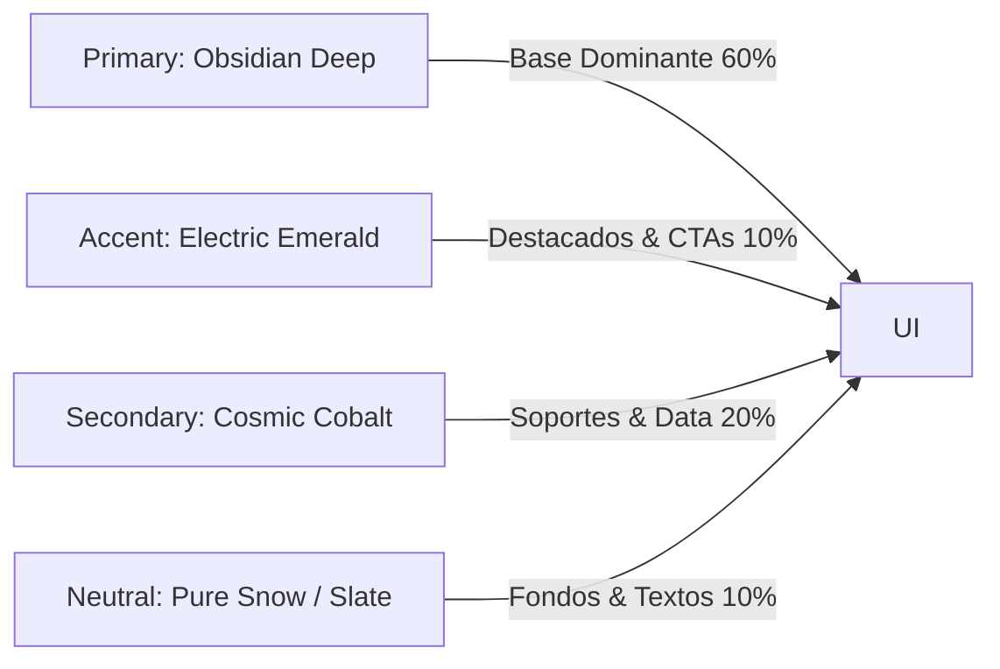

# 🎨 GUAKI — BRAND GOVERNANCE & IDENTITY SYSTEM BIBLE v1.0
> **SISTEMA MAESTRO DE GOBIERNO DE MARCA, IDENTIDAD VISUAL, TONO DE COMUNICACIÓN Y COHERENCIA OMNICANAL**
> **GUAKI HABLA CON UNA SOLA VOZ Y SE VE CON UNA SOLA ESTÉTICA EN TODOS LOS CANALES, AGENTES Y PUNTOS DE CONTACTO**

---

## 🏛️ PARTE I — FILOSOFÍA Y PILARES DE LA MARCA GUAKI

La marca Guaki representa **Confianza, Innovación Útil y Crecimiento Accesible**. Guaki no transmite frialdad corporativa ni tecnicismos complejos: es el aliado inteligente y accesible que empodera a negocios y personas en Latinoamérica.

Cada línea de texto, imagen, video, landing page, correo o mensaje de WhatsApp generado por humanos o agentes sintéticos debe obedecer a este **Sistema de Gobierno de Marca**.

### 🌟 Los 4 Pilares de Identidad:
1. **Claridad Radikal (No Bullshit):** Explicamos lo complejo con extrema sencillez. Cero jerga innecesaria.
2. **Meritocracia & Transparencia:** La calidad y la reputación real sobre los discursos vacíos.
3. **Estética Suiza Moderna (Swiss Design System):** Limpieza, tipografías sólidas, alto contraste, layouts con aire y colores tailored.
4. **Vibrancia Latinoamericana Contenida:** Cercanía humana, empatía y energía sin caer en el desorden visual.

---

## 🎨 PARTE II — GUÍA DE ESTÁNDAR VISUAL & DISEÑO

---

### 01. PALETA DE COLORES (Tailored Palette en HSL / HEX)

| Rol de Color | Nombre | HEX | HSL | Uso Obligatorio |
|:---|:---|:---|:---|:---|
| **Dominante Dark** | Obsidian Deep | `#0A0D14` | `hsl(222, 33%, 6%)` | Fondos de UI, headers, modo oscuro principal. |
| **Acento Primario** | Electric Emerald | `#10B981` | `hsl(160, 84%, 39%)` | Botones de acción (CTAs), insignias de verificado, highlights. |
| **Secundario** | Cosmic Cobalt | `#3B82F6` | `hsl(217, 91%, 60%)` | Enlaces, gráficos de datos de Atlas, badges secundarios. |
| **Neutral Claro** | Pure Snow | `#F9FAFB` | `hsl(210, 40%, 98%)` | Fondos de modo claro, texto sobre fondo oscuro. |
| **Neutral Muted** | Slate Gray | `#64748B` | `hsl(215, 16%, 47%)` | Subtítulos, bordes de cards, descripciones secundarias. |
| **Alerta P0** | Crimson Risk | `#EF4444` | `hsl(0, 84%, 60%)` | Errores, alertas de churn, caídas de SLA. |

---

### 02. TIPOGRAFÍA Y JERARQUÍA VISUAL

- **Tipografía Primaria (Titulares & UI):** `Outfit` o `Inter` (Google Fonts).
- **Tipografía Secundaria (Cuerpo de texto & Lectura larga):** `Inter` o `Roboto`.
- **Tipografía de Código / Datos (Data & Agentes):** `JetBrains Mono` o `Fira Code`.

#### Jerarquía Tipográfica Escala Modular:
- **Display 1 (Landing Pages / Hero):** `64px` / SemiBold / Tracking -0.02em.
- **H1 (Títulos de Página):** `40px` / Bold / Line-height 1.2.
- **H2 (Secciones Principales):** `28px` / SemiBold / Line-height 1.3.
- **H3 (Tarjetas & Subsecciones):** `20px` / Medium / Line-height 1.4.
- **Body Large (Intros & Leads):** `18px` / Regular / Line-height 1.6.
- **Body Standard (Párrafos):** `15px` / Regular / Line-height 1.5.
- **Caption / Metadata:** `12px` / Medium / UpperCase / Tracking +0.05em.

---

### 03. FOTOGRAFÍA Y ESTILO AUDIOVISUAL (AI Prompting Rules)

#### Reglas para `Image Agent` (Midjourney / Flux.1):
- **Estilo Fotográfico:** Fotoperiodismo moderno, iluminación natural de hora dorada o estudio suave, enfoque nítido en el sujeto principal.
- **Sujetos:** Emprendedores y profesionales reales de Latinoamérica en sus entornos de trabajo autogestionados (clínicas, talleres, oficinas, estudios).
- **Prohibiciones Absolutas:**
  - ❌ Fotos de stock genéricas con sonrisas falsas mirando a la cámara.
  - ❌ Trajes ejecutivos de Wall Street descontextualizados de la realidad de PYMEs en LATAM.
  - ❌ Renderizados 3D hiper-estilizados o caricaturescos sin textura.
- **Prompt Base para Midjourney:**
  > `/imagine prompt: authentic latin american small business owner in modern clinic, natural lighting, documentary photography style, shot on 35mm lens, f/1.8, warm color palette, clean background, ultra-detailed, professional quality --ar 16:9 --style raw`

#### Reglas para `Video Agent` (Reels / Shorts):
- **Formato:** Vertical 9:16 para TikTok/Reels/Shorts, 16:9 para YouTube.
- **Ritmo de Edición:** Corte inicial en los primeros 1.5 segundos. Subtítulos dinámicos con resaltado de palabra hablada en Electric Emerald (`#10B981`).
- **Música:** Pistas instrumentales Lo-Fi / Synthwave sutiles; jamás música estridente que opaque la voz.

---

### 04. ICONOGRAFÍA Y ELEMENTOS DE UI

- **Librería Oficial:** `Lucide Icons` o `Heroicons` (Estilo Outline / Stroke 1.5px).
- **Consistencia:** Todos los iconos deben usar bordes redondeados y el mismo grosor de línea (`stroke-width: 1.5`).
- **Uso de Sombras & Vidrio (Glassmorphism):**
  - Card Standard: `background: rgba(10, 13, 20, 0.6); backdrop-filter: blur(12px); border: 1px solid rgba(255, 255, 255, 0.08);`

---

## ✍️ PARTE III — GUÍA DE COPYWRITING & TONO DE COMUNICACIÓN

---

### 01. EL ARQUETIPO DE VOZ DE GUAKI
Guaki habla como **El Mentor Experto y Pragmático**.
- **Cercano pero Profesional:** Tutear con respeto (Uso de "Tú", pero sin caer en slang excesivo o juvenilizado).
- **Enfocado en Resultados:** Hablar de ingresos, ahorro de tiempo, clientes reales y simplicidad.
- **Transparente:** Sin promesas milagrosas. Hablamos de procesos, herramientas y trabajo meritocrático.

---

### 02. MATRIZ DE TONO SEGÚN EL CANAL Y ACTOR

| Canal / Audiencia | Tono Predominante | Palabras Clave Aprobadas | Palabras Prohibidas |
|:---|:---|:---|:---|
| **WhatsApp a Proveedores** | Directo, conciso, humano, útil | Crecimiento, clientes, agendar, listo, automático | Sinergias, disruptivo, webinar, formulario |
| **Landing Pages (SEO/Web)** | Claro, autorizado, escaneable | Verificado, garantía, directo, simple, ROI | El mejor del mundo, revolucionario, sin esfuerzo |
| **Emails Comerciales (B2B)** | Consultivo, analítico, enfocado en ROI | Métricas, margen, diagnóstico, sistema, evidencia | Oferta imperdible, gratis por hoy, compra ya |
| **Redes Sociales (Shorts/Reels)** | Entretenido, educativo, dinámico | Truco, error, resultado, secreto, lección | Suscríbete al canal, dale like y comparte |
| **Soporte & Atención (Chat)** | Empático, resolutivo, calmado | Resuelto, cuenta conmigo, revisemos, de inmediato | Lamentablemente, no es nuestra culpa, política |

---

### 03. EJEMPLOS ANTES VS DESPUÉS (COPYWRITING REFACTORING)

#### ❌ Incorrecto (Genérico / Corporativo / Pobre):
> *"Bienvenido a Guaki. Somos la plataforma líder en soluciones digitales donde podrás encontrar a los mejores profesionales para tu empresa con un servicio integral de alta calidad."*

#### ✅ Correcto (Estilo Guaki):
> *"Conéctate con proveedores verificados en tu ciudad. Sin intermediarios, sin sorpresas de precio y con garantía de respuesta en menos de 60 segundos."*

---

## 📋 PARTE IV — MATRIZ DE CHECKLISTS DE APROBACIÓN DE MARCA POR DEPARTAMENTO

---

### CHECKLIST 01: PUBLICACIÓN WEB / SEO (Para `SEO Agent` & `Argus QA`)
- [ ] ¿El título H1 incluye la categoría y la ciudad objetivo?
- [ ] ¿Los colores cumplen con el contraste ratio WCAG AA (mínimo 4.5:1)?
- [ ] ¿No hay imágenes de stock con caras no auténticas?
- [ ] ¿Las tipografías usadas son estrictamente `Outfit` e `Inter`?
- [ ] ¿El CTA principal usa el color Electric Emerald (`#10B981`)?

### CHECKLIST 02: MENSAJES DE WHATSAPP (Para `CS Agent` & `Support Agent`)
- [ ] ¿El mensaje tiene menos de 400 caracteres (escaneable sin hacer scroll largo)?
- [ ] ¿Usa párrafos de máximo 2 líneas?
- [ ] ¿Tiene un solo llamado a la acción (CTA) claro con link o respuesta simple?
- [ ] ¿Evita palabras corporativas frías ("Estimado usuario", "Por medio de la presente")?
- [ ] ¿Incluye el nombre de pila del destinatario?

### CHECKLIST 03: PROPUESTAS COMERCIALES (Para `Sales Agent (Kronos)`)
- [ ] ¿El documento incluye el logotipo oficial de Guaki en alta resolución sobre fondo Obsidian Deep?
- [ ] ¿Contiene un Diagnóstico Business MRI con datos cuantitativos reales?
- [ ] ¿El desglose de precios es transparente y sin costos ocultos?
- [ ] ¿Incluye los términos de la Garantía de ROI de 14 días?

---

## 🚫 PARTE V — ERRORES COMUNES Y MATRIZ DE INFRACCIONES

| Infracción de Marca | Por Qué Daña a Guaki | Corrección Automatizada |
|:---|:---|:---|
| **Uso de jerga técnica compleja en WhatsApp** | Confunde y aleja a los dueños de PYMEs. | `Content Agent` reescribe el texto usando analogías sencillas. |
| **Uso de botones rojos para acciones positivas** | El rojo en Guaki se reserva exclusivamente para alertas P0 y borrados. | `Argus QA` fuerza la clase CSS `.btn-emerald` en compilación. |
| **Publicación de imágenes pixeladas o mal recortadas** | Transmite descuido y destruye la percepción de calidad. | `Image Agent` rechaza assets < 1080p y re-procesa mediante CDN. |
| **Uso de tipografías Comic Sans, Impact o no autorizadas** | Arruina la Estética Suiza y la autoridad del producto. | Purga CSS en compilación de Next.js eliminando fuentes externas. |
| **Prometer resultados milagrosos sin evidencia** | Genera expectativas falsas y causa churn prematuro. | `Legal & Moderation Agents` bloquean publicaciones que prometan "ventas 10x garantizadas sin trabajar". |

---

## 👁️ PARTE VI — GOBERNANZA Y AUDITORÍA DE MARCA POR HERMES OS

`Hermes OS` ejecuta un **Auditor de Marca en Tiempo Real (Brand Compliance Inspector)** que evalúa cada activo generado por los 23 agentes sintéticos antes de ser entregado al usuario o publicado en la web:

1. **Scoring de Coherencia:** Asigna un Brand Score (0-100) basado en cumplimiento de paleta HSL, tipografía, legibilidad y tono.
2. **Auto-Corrección:** Si el score es entre 70 y 89, el `Content/Image Agent` corrige los desvíos automáticamente.
3. **Rechazo:** Si el score es < 70, la publicación se bloquea y se emite un registro de lección en la `Biblioteca de Diseño`.

---

> **BRAND GOVERNANCE & IDENTITY SYSTEM BIBLE v1.0 — SISTEMA MAESTRO DE COHERENCIA DE MARCA OMNICANAL DOCUMENTADO Y APROBADO.**
