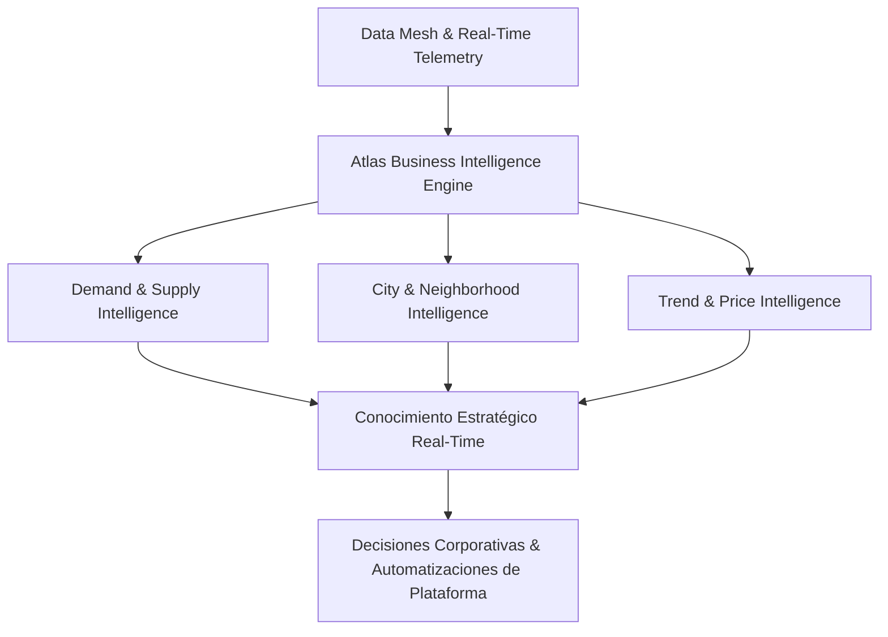

# 📊 GUAKI — LATAM BUSINESS INTELLIGENCE SYSTEM BIBLE v1.0
> **EL SISTEMA DE INTELIGENCIA DE MERCADO, PREDICCIÓN ESTRATÉGICA Y CONOCIMIENTO CONTINUO DE ATLAS AI CORE FOR LATIN AMERICA**
> **DISEÑO DE DIRECTOR GLOBAL DE BUSINESS INTELLIGENCE (UNICORN SPECIFICATION)**

---

## 🏛️ 1. MANIFIESTO DE INTELIGENCIA: DE DASHBOARDS A CONOCIMIENTO ESTRATÉGICO

Guaki no construye dashboards pasivos de métricas estáticas. **Guaki construye un Motor de Inteligencia sintética** capaz de analizar millones de intenciones de compra, descubrir desbalances entre oferta y demanda local y predecir la evolución del mercado en Latinoamérica a 10 años.



---

## 📊 2. ESPECIFICACIÓN DETALLADA DE LOS 16 MÓDULOS DE INTELIGENCIA

---

### 01. DEMAND INTELLIGENCE (INTELIGENCIA DE DEMANDA)
- **¿Qué datos captura?:** Volumen de búsquedas por ciudad/barrio, términos sin resultados, franjas horarias de intención.
- **¿Qué información genera?:** Mapa térmico en tiempo real de qué servicios están buscando los ciudadanos en LATAM.
- **¿Qué decisiones permite tomar?:** Dónde enfocar la prospección nocturna de **Ardilla Scraper** para traer proveedores a zonas con demanda insatisfecha.
- **¿Qué aprende Atlas?:** Intenciones emergentes en lenguaje coloquial (ej. *"doctor a domicilio ya"*).
- **¿Qué recomendaciones entrega?:** Avisos a médicos registrados para habilitar el servicio de urgencias nocturnas.
- **¿Qué predicciones realiza?:** Incremento del 35% en demandas de cerrajería en puentes festivos.
- **¿Cómo mejora el ecosistema?:** Reduce el tiempo de búsqueda del usuario de 10 min a < 15 segundos.

---

### 02. SUPPLY INTELLIGENCE (INTELIGENCIA DE OFERTA)
- **¿Qué datos captura?:** Densidad de proveedores verificados por categoría, ciudad y barrio.
- **¿Qué información genera?:** Identificación de "Desiertos de Servicios" (barrios sin oferta especializada).
- **¿Qué decisiones permite tomar?:** Apertura de campañas de onboarding gratuito en alianza con Alcaldías locales.
- **¿Qué aprende Atlas?:** Distribución geográfica de profesiones e industrias locales.
- **¿Qué recomendaciones entrega?:** Notificaciones a técnicos para extender su radio de cobertura a barrios adyacentes.
- **¿Qué predicciones realiza?:** Saturación de oferta de abogados generales en distritos financieros.
- **¿Cómo mejora el ecosistema?:** Equilibra la competencia y asegura alternativas para todo cliente.

---

### 03. CATEGORY INTELLIGENCE (INTELIGENCIA DE CATEGORÍAS)
- **¿Qué datos captura?:** Tasa de conversión, ticket promedio, nivel de recurrencia por industria.
- **¿Qué información genera?:** Ranking de las categorías más rentables y de mayor crecimiento mensual.
- **¿Qué decisiones permite tomar?:** Re-ordenamiento estratégico de la taxonomía del buscador.
- **¿Qué aprende Atlas?:** Ciclos de vida comercial de 400 subcategorías de servicios.
- **¿Qué recomendaciones entrega?:** Sugerencias a emprendedores sobre qué especialidades tienen mayor margen.
- **¿Qué predicciones realiza?:** Crecimiento exponencial de categorías de estética masculina e instalación de paneles solares.
- **¿Cómo mejora el ecosistema?:** Maximiza la facturación global de los proveedores suscritos.

---

### 04. CITY & NEIGHBORHOOD INTELLIGENCE (INTELIGENCIA GEOGRÁFICA HIPERLOCAL)
- **¿Qué datos captura?:** Coordenadas GPS de búsquedas vs. ubicación física de respuestas.
- **¿Qué información genera?:** Índice de autosuficiencia comercial por barrio (ej. *"El barrio Usaquén resuelve el 92% de sus necesidades internamente"*).
- **¿Qué decisiones permite tomar?:** Creación programática de landing pages SEO hiper-locales.
- **¿Qué aprende Atlas?:** Dinámicas de movilidad urbana y barreras geográficas en metrópolis de LATAM.
- **¿Qué recomendaciones entrega?:** Recomendación de ubicación para apertura de nuevas sucursales de clientes.
- **¿Qué predicciones realiza?:** Desplazamiento de la demanda hacia polos de desarrollo periurbanos.
- **¿Cómo mejora el ecosistema?:** Reduce la huella de carbono y el tiempo de desplazamiento de servicios presenciales.

---

### 05. PRICE INTELLIGENCE (INTELIGENCIA DE PRECIOS & VALOR)
- **¿Qué datos captura?:** Rangos de precios de catálogos estructurados por ciudad y categoría.
- **¿Qué información genera?:** Mediana de precios del mercado y elasticidad precio-conversión.
- **¿Qué decisiones permite tomar?:** Publicación de guías de referencia de costos transparentes para el consumidor.
- **¿Qué aprende Atlas?:** Sensibilidad al precio según el nivel socioeconómico del barrio de búsqueda.
- **¿Qué recomendaciones entrega?:** *"Tu precio de consulta está 15% por encima de la media de Alto Prado. Ajusta a $120.000 para subir 30% en conversión"*.
- **¿Qué predicciones realiza?:** Inflación de servicios locales por incremento en costos de insumos.
- **¿Cómo mejora el ecosistema?:** Erradica la especulación y genera confianza tarifaria.

---

### 06. REPUTATION & QUALITY INTELLIGENCE (INTELIGENCIA DE CALIDAD OPERATIVA)
- **¿Qué datos captura?:** Tiempo de respuesta WhatsApp, calificaciones auditadas, quejas recurrentes.
- **¿Qué información genera?:** Índice de Calidad Operativa Global de cada sector comercial.
- **¿Qué decisiones permite tomar?:** Suspensión o rehabilitación de perfiles en el ranking meritocrático.
- **¿Qué aprende Atlas?:** Patrones lingüísticos de insatisfacción antes de que se conviertan en reseñas de 1 estrella.
- **¿Qué recomendaciones entrega?:** Alertas preventivas a administradores sobre caída de SLA.
- **¿Qué predicciones realiza?:** Riesgo de fuga de clientes en empresas con respuesta > 15 min.
- **¿Cómo mejora el ecosistema?:** Mantiene la excelencia y la confianza como valor supremo.

---

## ❓ 3. RESPUESTAS AUTOMÁTICAS A LAS 12 PREGUNTAS CLAVE DEL MERCADO

```text
===================================================================
 ATLAS STRATEGIC MARKET REPORT (LATAM SUMMARY)
===================================================================
 [?] ¿Qué categoría está creciendo más?:    Instalación Solar (+142% MoM) & Estética Masculina (+88%)
 [?] ¿Qué ciudad tiene más demanda?:         CDMX (Sector Reforma) & Barranquilla (Sector Alto Prado)
 [?] ¿Qué servicios hacen falta?:            Cerrajería Automotriz 24/7 en Usaquén / San José
 [?] ¿Qué empresas están perdiendo clientes?: Aquellas con SLA > 15 min (Pérdida del 64% de conversión)
 [?] ¿Qué búsquedas no tienen resultados?:  "Vet a domicilio nocturno en Poblado" ➔ (Trigger a Ardilla)
 [?] ¿Oportunidad de Negocio Emergente?:    Mantenimiento de cargadores de vehículos eléctricos
===================================================================
```

---

> **MANIFIESTO MAESTRO DEL SISTEMA DE BUSINESS INTELLIGENCE GUAKI v1.0 APROBADO.**
