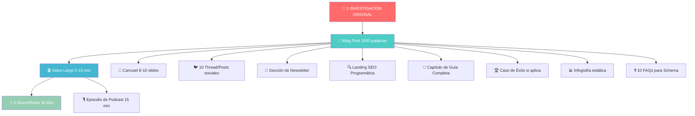
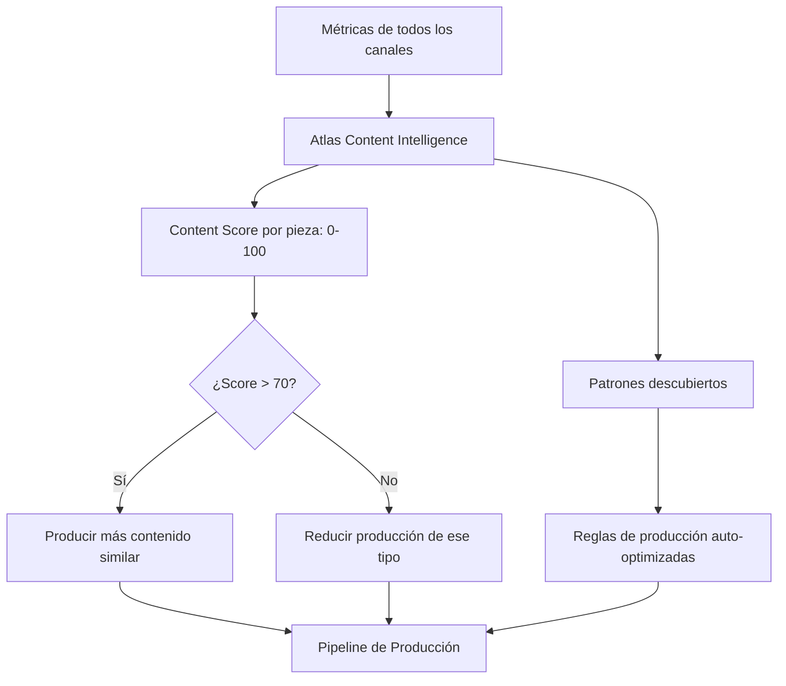

# 🏭 GUAKI — CONTENT FACTORY & OMNICHANNEL RECYCLING ENGINE BIBLE v1.0
> **FÁBRICA INDUSTRIAL DE CONTENIDO PARA 18 PLATAFORMAS + AI OVERVIEWS**
> **UNA INVESTIGACIÓN → 12 FORMATOS → 18 CANALES → ATLAS APRENDE QUÉ FUNCIONA**

---

## 🏛️ PARTE I — FILOSOFÍA: NO ESCRIBIMOS CONTENIDO. FABRICAMOS ACTIVOS COGNITIVOS.

### El Error de Todas las Empresas LATAM
Todas las empresas crean contenido como artesanía: una persona escribe un blog, otra graba un video, otra publica en redes. **Resultado: 5 piezas de contenido por semana, inconsistencia, cero escala.**

### La Revolución de Guaki
Guaki opera una **fábrica de contenido industrial** donde:
1. **Una sola investigación** produce **12 formatos** distribuidos en **18 canales**.
2. **Atlas AI** genera, adapta y optimiza cada pieza automáticamente.
3. **Cero intervención humana** en el 80% de la producción.
4. **Atlas aprende** qué contenido genera mayor tráfico, engagement y conversión — y produce más de lo que funciona.

---

## 🔄 PARTE II — LA CASCADA DE RECICLAJE: 1 INVESTIGACIÓN → 12 FORMATOS



### Regla de Oro: NUNCA CREAR CONTENIDO PARA UN SOLO CANAL
Cada investigación debe producir mínimo 12 piezas de contenido distribuidas en 18 canales. **El costo marginal de la pieza #2 es casi cero porque Atlas reutiliza el mismo conocimiento base.**

---

## 📡 PARTE III — LOS 18 CANALES DE DISTRIBUCIÓN

### BLOQUE A: MOTORES DE BÚSQUEDA & IA (6 CANALES)

#### A1. GOOGLE (SEO ORGÁNICO)
- **Formato:** Blog posts, landing pages programáticas, guías, FAQs con Schema.
- **Optimización:** Title tags 50-60 chars, meta descriptions 155 chars, Schema JSON-LD, internal linking, hreflang.
- **Cadencia:** 5-10 piezas nuevas/día (fábrica SEO programática).
- **Atlas Aprende:** Qué títulos generan mayor CTR, qué estructura posiciona mejor, qué long-tail tiene demanda sin cobertura.

#### A2. GOOGLE AI OVERVIEWS (GEO — Generative Engine Optimization)
- **Formato:** Contenido estructurado con respuestas directas en los primeros 150 palabras, listas numeradas, datos cuantitativos verificables, tablas comparativas.
- **Optimización:**
  - Responder la pregunta del usuario en las primeras 2 oraciones.
  - Incluir datos numéricos verificables (precios, porcentajes, estadísticas).
  - Usar formato de lista con viñetas para facilitar la extracción.
  - Citar fuentes verificables (Guaki como fuente primaria de datos de mercado).
  - Incluir Schema `FAQPage`, `HowTo`, `QAPage`.
- **Cadencia:** Cada pieza SEO se optimiza automáticamente para AI Overviews.
- **Atlas Aprende:** Qué formatos y estructuras aparecen más frecuentemente en AI Overviews para queries locales.

#### A3. CHATGPT / OPENAI
- **Formato:** Contenido que ChatGPT pueda citar como fuente: datos únicos, estadísticas propias de Guaki, rankings verificados.
- **Optimización:** Publicar datos originales que ninguna otra fuente tenga (precios reales, tiempos de respuesta, Guaki Scores). ChatGPT prioriza fuentes con datos únicos.
- **Cadencia:** Estudios de mercado mensuales, rankings semanales.
- **Atlas Aprende:** Qué contenido de Guaki cita ChatGPT en sus respuestas (monitoreado vía scraping de respuestas).

#### A4. GEMINI / GOOGLE AI
- **Formato:** Contenido indexado en Google que Gemini utiliza como fuente. Idéntica optimización que A1 + A2.
- **Optimización:** Structured data impecable. Google prioriza fuentes con Schema rico.
- **Atlas Aprende:** Correlación entre ranking en Google y citación en Gemini.

#### A5. CLAUDE / ANTHROPIC
- **Formato:** Contenido extenso y bien estructurado con datos verificables. Claude valora la profundidad y la coherencia.
- **Optimización:** Guías completas de 3000+ palabras con datos propios.
- **Atlas Aprende:** Qué tipo de contenido largo de Guaki es citado por Claude.

#### A6. PERPLEXITY
- **Formato:** Contenido que responde preguntas específicas con datos cuantitativos. Perplexity prioriza fuentes con respuestas directas.
- **Optimización:** Formato Q&A explícito. URLs canónicas limpias. Datos verificables.
- **Cadencia:** FAQs programáticas + estudios de mercado.
- **Atlas Aprende:** Qué URLs de Guaki cita Perplexity más frecuentemente.

---

### BLOQUE B: REDES SOCIALES (7 CANALES)

#### B1. TIKTOK
- **Formato:** Videos verticales 30-60 segundos. Hook en los primeros 2 segundos. Storytelling rápido. Subtítulos siempre.
- **Tipos de Contenido:**
  - "¿Sabías que...?" — Datos curiosos del mercado local.
  - "Top 3 errores al contratar un [servicio]" — Educativo.
  - "Así funciona [servicio] por dentro" — Behind the scenes de proveedores.
  - "Antes vs. Después de usar Guaki" — Caso de éxito visual.
- **Cadencia:** 3-5 videos/semana.
- **Atlas Aprende:** Qué hooks generan mayor retención de audiencia, qué categorías tienen mayor viralidad en TikTok.

#### B2. INSTAGRAM (FEED + REELS + STORIES)
- **Formato Feed:** Carruseles de 8-10 slides con diseño premium. Datos + tips + CTA.
- **Formato Reels:** Reutilización de TikTok con ajuste de ratio y CTA de perfil.
- **Formato Stories:** Encuestas, quizzes, swipe-up a landing pages.
- **Cadencia:** 5 posts/semana (2 carruseles + 3 reels) + stories diarias.
- **Atlas Aprende:** Qué tipo de carrusel genera mayor guardado (saves), correlación entre saves y posicionamiento.

#### B3. FACEBOOK
- **Formato:** Posts con imagen + copy corto (< 100 palabras) + enlace a blog. Videos nativos de 1-3 minutos.
- **Audiencia:** Demografía 35-55 años. Dueños de negocio de ciudades medianas.
- **Cadencia:** 3 posts/semana.
- **Atlas Aprende:** Qué mensajes resuenan con la demografía de Facebook (dueños de PYME 35-55).

#### B4. LINKEDIN
- **Formato:** Posts de texto largo del CEO (thought leadership), artículos nativos, carruseles PDF.
- **Tipos de Contenido:**
  - Reflexiones sobre emprendimiento en LATAM.
  - Datos del mercado generados por Atlas BI.
  - Anuncios de producto y partnerships.
  - Casos de éxito B2B (para captar Enterprise).
- **Cadencia:** 5 posts/semana (CEO) + 2 posts/semana (marca Guaki).
- **Atlas Aprende:** Qué tipo de post genera mayor engagement profesional, correlación con pipeline Enterprise.

#### B5. YOUTUBE
- **Formato Largo:** Videos de 5-15 minutos: tutoriales, entrevistas con proveedores exitosos, estudios de mercado en video.
- **Formato Shorts:** Reutilización de TikTok/Reels con bumper de YouTube.
- **Cadencia:** 1 video largo/semana + 3 Shorts/semana.
- **Atlas Aprende:** Retención por segundo del video, correlación entre YouTube SEO y Google SEO.

#### B6. PINTEREST
- **Formato:** Infografías verticales (1000×1500px), guías visuales, tablas comparativas de precios.
- **Optimización:** Keywords en descripción del pin, tableros organizados por categoría de servicio, link directo a landing SEO.
- **Cadencia:** 10 pins/semana (repurposed de infografías e imágenes de blog).
- **Atlas Aprende:** Qué infografías generan mayor tráfico referido a Guaki.

#### B7. X (TWITTER)
- **Formato:** Threads de 5-10 tweets con datos del mercado. Encuestas. Citas de estudios propios.
- **Cadencia:** 3 threads/semana + 2 tweets individuales/día.
- **Atlas Aprende:** Qué threads generan mayor retweet y tráfico.

---

### BLOQUE C: CANALES PROPIOS (5 CANALES)

#### C1. NEWSLETTER ("GUAKI WEEKLY")
- **Formato:** Email semanal con 3 secciones: dato de mercado de la semana, caso de éxito destacado, 3 tips prácticos para proveedores.
- **Segmentación:** Diferente versión por plan (Start, Growth, Pro, Premium, Enterprise) y por categoría.
- **Cadencia:** 1/semana (Martes 09:00 AM hora local del suscriptor).
- **Atlas Aprende:** Tasa de apertura por tipo de subject line, CTR por sección, correlación con retención.

#### C2. PODCAST ("GUAKI TALKS")
- **Formato:** Episodios de 15-25 minutos. 2 formatos: entrevista con empresario exitoso + monólogo educativo del CEO.
- **Distribución:** Spotify, Apple Podcasts, Google Podcasts, YouTube (versión video).
- **Cadencia:** 1 episodio/semana.
- **Atlas Aprende:** Qué temas generan mayor escucha completa, qué episodios generan más suscriptores.

#### C3. VIDEO (YOUTUBE + EMBEDS)
- **Formato:** Producción semi-profesional. Tours de negocios exitosos, tutoriales de uso de Guaki, análisis de mercado en video.
- **Cadencia:** 1 video largo/semana.
- **Atlas Aprende:** Retención por minuto, correlación entre video y conversión de proveedores.

#### C4. EMAIL TRANSACCIONAL (ATLAS COACH)
- **Formato:** Informes semanales personalizados de Atlas Coach para cada proveedor suscrito. No es marketing — es producto.
- **Cadencia:** 1/semana por proveedor activo.
- **Atlas Aprende:** Qué recomendaciones del informe el proveedor ejecuta, cuáles ignora.

#### C5. GUAKI ACADEMY (MICRO-CURSOS)
- **Formato:** Cápsulas educativas de 3-5 minutos: video + slides + quiz. Temas por categoría y nivel de madurez.
- **Cadencia:** 2 nuevos micro-cursos/semana.
- **Atlas Aprende:** Qué cursos completan los proveedores más exitosos, correlación entre educación y crecimiento.

---

## ⚙️ PARTE IV — EL PIPELINE DE PRODUCCIÓN INDUSTRIAL

### FASE 1: INVESTIGACIÓN ORIGINAL (Input)

Atlas Demand Intelligence identifica el tema de mayor impacto potencial basado en:

| Señal | Peso |
|:---|:---:|
| Volumen de búsqueda en Google para el tema | 30% |
| Preguntas frecuentes de usuarios en WhatsApp/chat | 25% |
| Tendencias emergentes en redes sociales (TikTok, IG) | 20% |
| Gaps de contenido donde Guaki no tiene presencia | 15% |
| Estacionalidad (picos de demanda próximos) | 10% |

**Output:** Un brief de investigación con: tema, keyword principal, keywords secundarias, audiencia target, datos propios de Atlas disponibles, ángulo diferenciador.

### FASE 2: CONTENIDO MADRE (Blog Post)

Atlas AI genera el **Blog Post Madre** de 1500-2000 palabras:

```
Input: Brief de investigación
    ↓
Atlas AI genera:
├── H1 optimizado para SEO + CTR
├── Meta description (155 chars, única)
├── Párrafo introductorio con hook + respuesta directa (para AI Overviews)
├── 5-8 secciones H2 con contenido sustancial
├── Datos cuantitativos de Atlas BI (precios, estadísticas, tendencias)
├── 3+ internal links a silos relacionados
├── CTA contextual
├── Schema JSON-LD (Article + FAQ + HowTo)
└── FAQ generadas (5-10 preguntas)
    ↓
Argus QA valida (18 checks)
    ↓
Deploy en Vercel SSR
```

### FASE 3: CASCADA DE RECICLAJE AUTOMÁTICO

Una vez aprobado el Blog Post Madre, Atlas ejecuta la cascada completa:

```
BLOG POST MADRE
    │
    ├──→ 🎬 VIDEO SCRIPT (5-10 min)
    │       Atlas reescribe el blog como guión de video:
    │       - Hook de 5 segundos
    │       - 3 puntos principales
    │       - CTA final
    │       → Se graba con avatar AI o se asigna al equipo de video
    │
    ├──→ ⚡ 3 SHORTS/REELS SCRIPTS (30-60s cada uno)
    │       Atlas extrae los 3 datos más impactantes del blog
    │       y genera 3 guiones de video corto independientes:
    │       - Short 1: "¿Sabías que...?" (dato sorprendente)
    │       - Short 2: "Top 3 errores al..." (educativo)
    │       - Short 3: "Así se ve un buen [servicio]" (visual)
    │
    ├──→ 🎠 CARRUSEL (8-10 slides)
    │       Atlas extrae los puntos clave y los formatea como:
    │       - Slide 1: Hook/Pregunta
    │       - Slides 2-8: Un punto por slide con dato
    │       - Slide 9: Resumen
    │       - Slide 10: CTA + marca
    │
    ├──→ 🐦 10 POSTS SOCIALES
    │       Atlas genera 10 variantes de post:
    │       - 3 para LinkedIn (formato thought leadership)
    │       - 3 para Instagram (caption + hashtags)
    │       - 2 para Facebook (pregunta + dato)
    │       - 2 para X/Twitter (dato contundente + enlace)
    │
    ├──→ 🎙️ PODCAST SCRIPT (15 min)
    │       Atlas reescribe como monólogo conversacional:
    │       - Intro con contexto personal
    │       - 3 puntos con anécdotas/ejemplos
    │       - Cierre con reflexión + CTA
    │
    ├──→ 📧 SECCIÓN DE NEWSLETTER
    │       Atlas extrae el dato más revelador + 1 tip práctico
    │       para incluir en la próxima edición de "Guaki Weekly"
    │
    ├──→ 🔍 LANDING SEO PROGRAMÁTICA
    │       Si el tema corresponde a una categoría/ciudad/servicio,
    │       Atlas compila una landing programática en el silo correspondiente
    │
    ├──→ 📖 CAPÍTULO DE GUÍA
    │       Si el tema forma parte de una guía mayor,
    │       Atlas lo integra como capítulo con linking interno
    │
    ├──→ 📊 INFOGRAFÍA
    │       Atlas extrae 5-7 datos clave y genera un JSON
    │       con la estructura de infografía para el diseñador/template
    │
    ├──→ ❓ 10 FAQs CON SCHEMA
    │       Atlas genera preguntas basadas en Google Autocomplete
    │       + preguntas reales de usuarios en WhatsApp
    │       → Inyecta Schema FAQPage en el blog y en landing
    │
    └──→ 🏆 CASO DE ÉXITO (si aplica)
            Si el blog menciona un proveedor exitoso,
            Atlas genera un caso de éxito independiente
```

### FASE 4: DISTRIBUCIÓN AUTOMÁTICA

| Canal | Herramienta | Timing |
|:---|:---|:---|
| Blog en Guaki | Vercel SSR | Inmediato post-QA |
| Google (indexación) | Google Indexing API + Sitemap | Inmediato |
| Instagram Feed/Reels | Meta Business Suite API | Programado (mejor hora por audiencia) |
| TikTok | TikTok Creator API | Programado |
| Facebook | Meta Business Suite API | Programado |
| LinkedIn | LinkedIn Marketing API | Programado |
| YouTube / Shorts | YouTube Data API | Programado |
| Pinterest | Pinterest API | Programado |
| X/Twitter | X API | Programado |
| Newsletter | Resend API | Martes 09:00 AM local |
| Podcast | RSS Feed + Spotify for Podcasters | Semanal |
| Email Atlas Coach | Sistema interno | Personalizado por proveedor |

**Atlas determina el mejor horario de publicación** por canal × país × audiencia basado en datos históricos de engagement.

### FASE 5: MEDICIÓN CENTRALIZADA

Todos los canales reportan métricas a Atlas Content Intelligence:

| Métrica | Fuente | Frecuencia |
|:---|:---|:---|
| Impresiones orgánicas | Google Search Console | Diaria |
| Tráfico al blog | PostHog/Mixpanel | Real-time |
| Engagement en redes (likes, shares, saves) | APIs de cada plataforma | Diaria |
| Citaciones en AI (ChatGPT, Gemini, Perplexity) | Scraping periódico | Semanal |
| Tasa de apertura newsletter | Resend Analytics | Post-envío |
| Escuchas de podcast | Spotify for Podcasters API | Semanal |
| Conversión contenido → registro proveedor | Attribution model interno | Real-time |
| Conversión contenido → contacto de usuario | Attribution model interno | Real-time |

### FASE 6: FEEDBACK LOOP DE ATLAS



**Lo que Atlas Aprende de Cada Pieza de Contenido:**

| Aprendizaje | Acción Automática |
|:---|:---|
| Qué títulos generan > 8% CTR en Google | Favorecer ese patrón en futuros títulos |
| Qué hooks de TikTok retienen > 80% a los 3s | Replicar ese formato de hook |
| Qué tipo de carrusel genera > 5% saves en IG | Producir más carruseles de ese tipo |
| Qué newsletters tienen > 40% open rate | Replicar subject line y estructura |
| Qué categorías generan más viralidad | Priorizar producción en esas categorías |
| Qué datos propios citan los LLMs | Producir más contenido con datos únicos |
| Qué episodios de podcast se escuchan > 80% | Replicar ese formato y duración |
| Qué contenido convierte proveedores | Maximizar producción de conversion content |

---

## 📅 PARTE V — CADENCIA DE PRODUCCIÓN SEMANAL

### Calendario de la Fábrica de Contenido

| Día | Acción de Producción | Output |
|:---|:---|:---|
| **Lunes** | Atlas selecciona los 5 temas de la semana basado en demanda | 5 briefs de investigación |
| **Lunes noche** | Atlas genera los 5 Blog Posts Madre | 5 blogs publicados |
| **Martes** | Cascada automática: blogs → videos, shorts, carruseles, posts | 60+ piezas generadas |
| **Martes 09:00** | Newsletter "Guaki Weekly" con los highlights de la semana | 1 newsletter enviada |
| **Miércoles** | Publicación en Instagram (2 carruseles + 1 reel) | 3 posts en IG |
| **Miércoles** | Publicación en TikTok (2 shorts) | 2 videos en TikTok |
| **Jueves** | Publicación en LinkedIn (2 posts CEO + 1 post marca) | 3 posts en LinkedIn |
| **Jueves** | Publicación en YouTube (1 video largo + 2 Shorts) | 3 videos en YT |
| **Viernes** | Publicación en Facebook (2 posts) + Pinterest (5 pins) | 7 piezas |
| **Viernes** | Episodio de podcast "Guaki Talks" | 1 episodio publicado |
| **Sábado** | Atlas analiza métricas de la semana y ajusta pesos | Feedback loop |
| **Domingo** | Preparación automática de la próxima semana | Briefs pre-generados |

### Producción Semanal Total

| Tipo de Contenido | Cantidad/Semana |
|:---|:---:|
| Blog Posts (contenido madre) | 5 |
| Videos largos (YouTube) | 1-2 |
| Shorts/Reels/TikToks | 10-15 |
| Carruseles (Instagram/LinkedIn) | 5-8 |
| Posts sociales (todas las redes) | 20-30 |
| Newsletter | 1 |
| Episodio de podcast | 1 |
| Infografías | 3-5 |
| FAQs con Schema | 25-50 |
| Landings SEO programáticas | 50-100 (fábrica SEO nocturna) |
| **TOTAL SEMANAL** | **120-215 piezas** |
| **TOTAL MENSUAL** | **480-860 piezas** |
| **TOTAL ANUAL** | **5,760-10,320 piezas** |

---

## 🧠 PARTE VI — CONTENT INTELLIGENCE DASHBOARD

### Métricas de la Fábrica (Real-Time)

| Métrica | Target Año 1 | Target Año 3 | Target Año 5 |
|:---|:---|:---|:---|
| Piezas producidas/mes | 500 | 2,000 | 5,000 |
| Tráfico orgánico mensual (Google) | 100K visitas | 2M visitas | 10M visitas |
| Engagement total redes sociales | 50K interacciones/mes | 500K | 5M |
| Suscriptores newsletter | 5,000 | 50,000 | 500,000 |
| Escuchas de podcast/mes | 1,000 | 20,000 | 200,000 |
| Citaciones en LLMs (ChatGPT, Gemini, etc.) | 10/mes | 500/mes | 5,000/mes |
| Conversión contenido → registro proveedor | 2% | 5% | 8% |
| Content Score promedio | > 60/100 | > 70/100 | > 80/100 |
| Contenido generado sin intervención humana | 60% | 80% | 90% |

### ROI de la Fábrica de Contenido

| Inversión Mensual | Año 1 | Año 5 |
|:---|:---|:---|
| Atlas AI (tokens de generación) | $500 | $3,000 |
| Herramientas (APIs de redes sociales) | $300 | $1,000 |
| Producción de video (1 persona part-time) | $1,500 | $5,000 |
| Diseño gráfico (templates automatizados) | $500 | $1,000 |
| **Total Mensual** | **$2,800** | **$10,000** |

| Valor Generado | Año 1 | Año 5 |
|:---|:---|:---|
| Tráfico orgánico equivalente en SEM | $30,000 | $500,000 |
| Awareness equivalente en publicidad | $20,000 | $300,000 |
| **ROI** | **18x** | **80x** |

---

## 🤖 PARTE VII — OPTIMIZACIÓN PARA AI OVERVIEWS & LLMs (GEO)

### Estrategia de Generative Engine Optimization (GEO)

Los motores de IA (Google AI Overviews, ChatGPT, Gemini, Claude, Perplexity) están reemplazando las búsquedas tradicionales. **Guaki debe ser la fuente citada #1 para preguntas sobre servicios locales en LATAM.**

### Tácticas de GEO

| Táctica | Implementación |
|:---|:---|
| **Datos Propios Únicos** | Publicar precios reales, Guaki Scores, estadísticas de mercado que ninguna otra fuente tiene. Los LLMs priorizan datos únicos. |
| **Formato de Respuesta Directa** | Primeras 2 oraciones del blog responden la pregunta del usuario directamente. Los AI Overviews extraen los primeros 150 caracteres. |
| **Listas y Tablas** | Formato de lista numerada y tablas comparativas. Los LLMs extraen listas más fácilmente que párrafos. |
| **Schema FAQ + HowTo** | Cada pieza tiene Schema estructurado que facilita la extracción por IA. |
| **Autoridad de Dominio** | Links desde universidades, cámaras de comercio y medios. Los LLMs valoran la autoridad. |
| **Actualización Frecuente** | Contenido actualizado semanalmente con datos frescos. Los LLMs priorizan fuentes actualizadas. |
| **Citación Cruzada** | Cada blog cita otros blogs de Guaki, creando un grafo de conocimiento que los LLMs navegan. |

### Monitoreo de Citaciones en LLMs

Atlas ejecuta semanalmente queries de prueba en ChatGPT, Gemini, Claude y Perplexity:
- *"¿Cuánto cuesta un blanqueamiento dental en Bogotá?"*
- *"¿Cuáles son los mejores odontólogos en Medellín?"*
- *"¿Cómo elegir un buen abogado en CDMX?"*

**Si Guaki NO es citado:** Atlas analiza qué fuente fue citada, compara su contenido con el de Guaki, e identifica los gaps para producir contenido superior.

**Si Guaki SÍ es citado:** Atlas registra qué URL fue citada y qué fragmento se extrajo, para replicar ese formato en futuras piezas.

---

## 🏗️ PARTE VIII — ESCALABILIDAD DE LA FÁBRICA

### Año 1: Startup Mode
- 1 persona supervisa la fábrica (Content Lead).
- Atlas AI genera el 60% del contenido automáticamente.
- 500 piezas/mes.
- Foco: Google SEO + LinkedIn + Instagram.

### Año 3: Growth Mode
- 3 personas (Content Lead + Video Producer + Social Media Manager).
- Atlas AI genera el 80% del contenido.
- 2,000 piezas/mes.
- Foco: Todos los canales activos. Podcast semanal. YouTube activo.

### Año 5: Scale Mode
- 5 personas + equipo de video dedicado.
- Atlas AI genera el 90% del contenido.
- 5,000+ piezas/mes.
- Foco: Dominancia absoluta en contenido sobre servicios locales en LATAM.
- Guaki es LA fuente citada por ChatGPT, Gemini y Perplexity para servicios en LATAM.

---

> **CONTENT FACTORY & OMNICHANNEL RECYCLING ENGINE BIBLE v1.0 — LA FÁBRICA DE CONTENIDO MÁS EFICIENTE DE LATINOAMÉRICA — APROBADO.**
