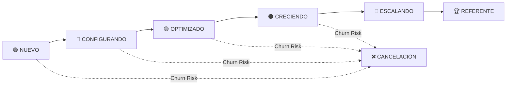
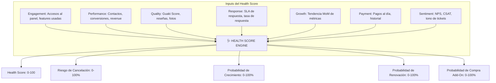
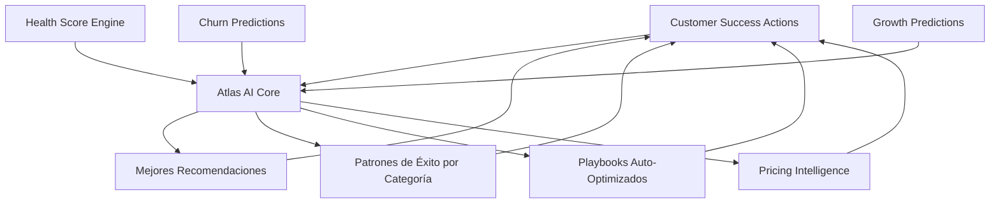

# 🏆 GUAKI — CUSTOMER SUCCESS & BUSINESS GROWTH ENGINE BIBLE v1.0
> **EL MEJOR SISTEMA DE CUSTOMER SUCCESS DE LATINOAMÉRICA: NO ATENDEMOS CLIENTES, HACEMOS CRECER NEGOCIOS**
> **6 ETAPAS DEL CICLO DE VIDA × 11 DIMENSIONES + SISTEMA DE SALUD PREDICTIVO ALIMENTADO POR ATLAS AI**

---

## 🏛️ PARTE I — FILOSOFÍA: CUSTOMER SUCCESS ≠ SOPORTE

### El Error de Todas las Plataformas LATAM
Todas las plataformas de la región tratan Customer Success como un departamento de soporte glorificado. Responden tickets. Envían emails genéricos. Miden CSAT. **Y sus clientes se van igual.**

### La Filosofía de Guaki
Customer Success en Guaki **no es un departamento de atención**. Es un **motor de crecimiento empresarial autónomo** alimentado por Atlas AI que:

1. **Diagnostica** — Entiende la situación actual del negocio en 9 dimensiones de madurez.
2. **Prescribe** — Recomienda las 3 acciones exactas con mayor ROI estimado.
3. **Ejecuta** — Automatiza la implementación de mejoras cuando el proveedor autoriza.
4. **Mide** — Demuestra el impacto de cada acción con datos reales.
5. **Evoluciona** — Ajusta las recomendaciones basado en los resultados obtenidos.

**El proveedor no tiene un "agente de soporte". Tiene un consultor de negocios autónomo que trabaja 24/7 para que su empresa crezca.**

---

## 🔄 PARTE II — EL CICLO DE VIDA DEL PROVEEDOR EN GUAKI (6 ETAPAS)

**Regla Fundamental:** Cada proveedor avanza de etapa cuando cumple los criterios de graduación. Atlas monitorea automáticamente y notifica al proveedor cuando asciende. **Cada ascenso se celebra con un badge visible en su perfil.**

---

## 🟢 ETAPA 1: NUEVO (DÍA 0-7)

> *"El proveedor acaba de registrarse. No sabe qué esperar. Necesita ver valor en las primeras 48 horas o se irá."*

### Objetivos
- Activar el perfil completo en < 48h.
- Generar el primer contacto de un cliente real en < 7 días.
- Crear el hábito de entrar al panel de Guaki diariamente.

### Criterios de Graduación a "Configurando"
- Perfil completado al 100% (fotos, servicios, precios, horarios, WhatsApp).
- Al menos 1 vista de su perfil por un usuario real.

### Automatizaciones
- **Hora 0:** Email + WhatsApp de bienvenida con video de 60 segundos mostrando los 3 pasos para configurar su perfil.
- **Hora 2:** Si no completó el perfil, WhatsApp recordatorio con guía paso a paso.
- **Hora 24:** Si completó el perfil, WhatsApp celebratorio: *"¡Tu perfil ya está visible! Aquí tienes tu enlace para compartir."*
- **Hora 24:** Si NO completó, llamada automática de Atlas IA Assistant preguntando si necesita ayuda.
- **Día 3:** Primera micro-cápsula educativa: *"3 claves para que tu perfil destaque en Guaki."*
- **Día 5:** Notificación: *"Tu perfil ha sido visto X veces esta semana. Así te ven los clientes."*
- **Día 7:** Reporte de primera semana: visualizaciones, clics, posición en ranking.

### Seguimientos
- Trigger automático de CS humano si el proveedor no completa el perfil en 72h (planes Pro+).
- Chat proactivo de IA Assistant si detecta frustración (abandona el formulario 2+ veces).

### Alertas
- 🔴 Perfil no completado en 72h → Trigger de intervención.
- 🟡 Proveedor accedió al panel pero no subió fotos → WhatsApp con tips de fotos.
- 🟢 Primer cliente contactó al proveedor → Celebración automática.

### KPIs
- Tasa de activación completa < 48h (target: > 70%).
- Time-to-first-value: tiempo hasta el primer contacto real de un cliente (target: < 7 días).
- Abandono en onboarding (target: < 15%).

### Playbooks
- **PB-NEW-001: Proveedor Perdido.** Si el proveedor no accede en 72h, secuencia de recuperación: WhatsApp D3 → Email D5 → Llamada IA D7 → Llamada humana D10 (solo Pro+).
- **PB-NEW-002: Proveedor Entusiasta.** Si completa todo en < 2h, oferta flash de upgrade a Growth con 30% descuento primer mes.

### Correos Automáticos
- `EMAIL-NEW-001`: Bienvenida con CTA de completar perfil.
- `EMAIL-NEW-002`: Recordatorio D3 con tutorial paso a paso.
- `EMAIL-NEW-003`: Reporte de primera semana con métricas.

### Mensajes WhatsApp
- `WA-NEW-001`: *"¡Bienvenido a Guaki! 🎉 Tu perfil ya está creado. Complétalo en 3 pasos y empieza a recibir clientes: [enlace]"*
- `WA-NEW-002`: *"Te falta subir fotos a tu perfil. Los perfiles con fotos reciben 4x más contactos. ¿Necesitas ayuda? Responde SÍ."*
- `WA-NEW-003`: *"🎉 ¡Tu primer cliente vio tu perfil! Así se ve tu negocio en Guaki: [screenshot]"*

### Recomendaciones IA (Atlas Coach)
- *"Sube al menos 5 fotos profesionales de tu negocio. Los perfiles con +5 fotos convierten 280% más."*
- *"Agrega precios visibles. El 73% de los usuarios abandonan perfiles sin precios."*
- *"Conecta tu WhatsApp Business. El 89% de los contactos en Guaki se inician por WhatsApp."*

### Business Review
- No aplica en esta etapa (demasiado pronto).

### QBR
- No aplica en esta etapa.

---

## 🔵 ETAPA 2: CONFIGURANDO (DÍA 8-30)

> *"El proveedor completó su perfil. Ahora necesita entender cómo funciona el ecosistema y empezar a recibir valor constante."*

### Objetivos
- Generar los primeros 5 contactos de clientes reales.
- Activar al menos 1 feature diferenciador (agendamiento, catálogo completo, respuesta rápida).
- Establecer un patrón de respuesta rápida (< 30 min).

### Criterios de Graduación a "Optimizado"
- +5 contactos de clientes recibidos.
- SLA de respuesta promedio < 30 minutos.
- Al menos 1 reseña positiva recibida.

### Automatizaciones
- **Día 10:** Atlas Coach genera primera recomendación personalizada basada en el sector y la ciudad.
- **Día 14:** Informe de 2 semanas con comparativo vs. promedio de su categoría.
- **Día 21:** Micro-curso Atlas Academy: *"Cómo convertir una consulta en un cliente."*
- **Día 28:** Primer informe mensual completo con Business Score inicial.

### Seguimientos
- Si SLA de respuesta > 2h: WhatsApp automático *"Respondiste en 2h15m. El promedio de tu categoría es 18 minutos. ¿Necesitas automatizar tu WhatsApp?"*
- Si 0 contactos en 14 días: análisis automático de Atlas *"Tu perfil aparece en posición X. Para subir, te recomendamos: [3 acciones]."*

### Alertas
- 🔴 0 contactos en 14 días → Revisión manual de perfil por QA.
- 🔴 SLA de respuesta > 4h consistentemente → Recomendación de IA Assistant 24/7.
- 🟡 Proveedor no accede al panel en 7 días → Secuencia de re-engagement.
- 🟢 Primera reseña recibida → Celebración + recomendación de pedir más reseñas.

### KPIs
- Contactos recibidos en primeros 30 días (target: > 5).
- SLA de respuesta promedio (target: < 30 min).
- Features activadas (target: > 2).
- Primera reseña recibida (target: 100% antes del día 30).

### Playbooks
- **PB-CONF-001: Sin Contactos.** Si 0 contactos en 14 días: auditar SEO del perfil → verificar categorización → sugerir boost temporal.
- **PB-CONF-002: Respuesta Lenta.** Si SLA > 2h: educar sobre impacto en ranking → ofrecer Guaki IA Assistant → mostrar ROI de respuesta rápida.
- **PB-CONF-003: Sin Reseñas.** Día 25: activar campaña automática de solicitud de reseñas a los últimos 3 clientes contactados.

### Correos Automáticos
- `EMAIL-CONF-001`: Informe de 2 semanas con métricas.
- `EMAIL-CONF-002`: Micro-curso "Cómo convertir consultas en clientes".
- `EMAIL-CONF-003`: Primer informe mensual con Business Score.

### Mensajes WhatsApp
- `WA-CONF-001`: *"📊 Tu informe de 2 semanas: X vistas, Y contactos, posición #Z en tu categoría. [Ver recomendaciones]"*
- `WA-CONF-002`: *"⚡ Respondiste en Xh a tu último cliente. Los proveedores que responden en <15min cierran 3x más."*

### Recomendaciones IA
- *"Tu competidor más cercano tiene 12 fotos y tú tienes 3. Los perfiles con más fotos aparecen más arriba."*
- *"No tienes precios en 4 de tus 8 servicios. Agregar precios aumenta los contactos en un 45%."*
- *"Pide una reseña a tu último cliente satisfecho. La primera reseña aumenta tu Guaki Score en un 15%."*

### Business Review
- Primer Business Review automatizado al día 30: resumen del primer mes con Atlas Coach.

### QBR
- No aplica aún.

---

## 🟡 ETAPA 3: OPTIMIZADO (DÍA 31-90)

> *"El proveedor está activo, recibe contactos y responde. Ahora necesita optimizar su conversión y empezar a crecer consistentemente."*

### Objetivos
- Incrementar la tasa de conversión contacto → cliente a > 25%.
- Alcanzar un Guaki Score > 70/100.
- Establecer un flujo constante de reseñas (> 1 por semana).

### Criterios de Graduación a "Creciendo"
- Guaki Score > 70/100.
- +20 contactos mensuales.
- Tasa de conversión > 25%.
- +10 reseñas acumuladas con promedio > 4.5★.

### Automatizaciones
- **Semanal:** Informe de Atlas Coach con 3 acciones recomendadas y ROI estimado.
- **Día 45:** Atlas genera diagnóstico completo de las 9 dimensiones de madurez (Business Score).
- **Día 60:** Análisis comparativo: *"Así te comparas con los 10 mejores de tu categoría en tu ciudad."*
- **Día 90:** QBR automático del primer trimestre.

### Seguimientos
- Revisión mensual automática de Atlas Coach con plan de acción priorizado.
- Si Guaki Score baja > 5 puntos en una semana: alerta + diagnóstico de causa.
- Si aparece un nuevo competidor en su barrio: notificación + recomendación defensiva.

### Alertas
- 🔴 Guaki Score cae > 10 puntos → Intervención de CS humano.
- 🔴 SLA de respuesta se degrada > 50% → Recomendación urgente de automatización.
- 🟡 Reseña negativa (< 3★) → Alerta + guía de respuesta profesional.
- 🟢 Guaki Score sube a > 80 → Celebración + badge "Empresa Optimizada".

### KPIs
- Guaki Score (target: > 70/100).
- Contactos mensuales (target: > 20).
- Tasa de conversión contacto → cliente (target: > 25%).
- Reseñas acumuladas (target: > 10 con promedio > 4.5★).
- Revenue incremento del proveedor (target: > +25% vs. pre-Guaki).

### Playbooks
- **PB-OPT-001: Guaki Score Bajo.** Diagnosticar las 3 dimensiones más débiles → generar plan de mejora con timeline → ofrecer add-ons relevantes.
- **PB-OPT-002: Reseña Negativa.** Template de respuesta profesional → guía para resolver offline → seguimiento a los 7 días.
- **PB-OPT-003: Competidor Nuevo.** Análisis comparativo automático → 3 diferenciadores para destacar → sugerir boost temporal si es necesario.

### Correos Automáticos
- `EMAIL-OPT-001`: Informe semanal de Atlas Coach con 3 acciones.
- `EMAIL-OPT-002`: Diagnóstico de Business Score (Día 45).
- `EMAIL-OPT-003`: Análisis comparativo (Día 60).

### Mensajes WhatsApp
- `WA-OPT-001`: *"📈 Esta semana: X contactos nuevos, Y conversiones, posición #Z. Tu Guaki Score: [N]/100. [Ver 3 acciones para mejorar]"*
- `WA-OPT-002`: *"⭐ [Cliente] dejó una reseña de 5★. ¡Felicidades! Compártela en tus redes: [enlace]"*
- `WA-OPT-003`: *"⚠️ Tu Guaki Score bajó 7 puntos esta semana. La razón principal: tiempo de respuesta. [Ver cómo mejorar]"*

### Recomendaciones IA
- *"Tu tasa de conversión es del 18%. Los proveedores con IA Assistant 24/7 convierten al 32%. Diferencia: $X de ingresos mensuales adicionales."*
- *"Tienes 0 videos en tu perfil. Los perfiles con video reciben 3.5x más engagement. ¿Agendamos una sesión de producción audiovisual?"*
- *"Tus precios son un 15% superiores al promedio de tu categoría en tu barrio. Esto puede estar afectando tu conversión."*

### Business Review
- Business Review mensual automatizado por Atlas Coach: métricas, tendencias y plan de acción.

### QBR (Quarterly Business Review)
- **QBR-01 (Día 90):** Primer QBR completo.
  - Resumen de 90 días: métricas de funnel completo.
  - Business Score con evolución por dimensión.
  - Top 3 logros del trimestre.
  - Top 3 oportunidades de mejora con ROI estimado.
  - Plan de acción para el próximo trimestre.
  - Para Premium/Enterprise: QBR presencial o videollamada con CS Manager.

---

## 🟠 ETAPA 4: CRECIENDO (DÍA 91-365)

> *"El proveedor ya es exitoso en Guaki. Recibe clientes consistentemente. Ahora necesita escalar: múltiples sucursales, más servicios, mayor ticket promedio."*

### Objetivos
- Incrementar el revenue del proveedor > +50% vs. período pre-Guaki.
- Activar upsells/cross-sells de add-ons y planes superiores.
- Convertir al proveedor en embajador orgánico que refiera a otros.

### Criterios de Graduación a "Escalando"
- Guaki Score > 85/100.
- +50 contactos mensuales.
- Revenue incremento demostrado > +50%.
- Al menos 1 referido verificado.
- Antigüedad > 6 meses.

### Automatizaciones
- Atlas Coach entrega informe semanal con 5 acciones prescriptivas + ROI estimado por acción.
- Detección automática de oportunidades de upsell basadas en uso.
- Campaña automática de referidos: *"Recomienda Guaki a un colega y ambos reciben 1 mes gratis de add-on."*
- Atlas detecta picos estacionales de demanda y alerta al proveedor para prepararse.

### Seguimientos
- QBRs trimestrales automáticos con evolución de Business Score.
- Para Premium: revisiones mensuales con CS Manager humano.
- Para Enterprise: revisiones quincenales con equipo dedicado.

### Alertas
- 🔴 Revenue del proveedor cae > 20% MoM → Diagnóstico urgente.
- 🟡 Uso de features del plan < 50% → Educación sobre features no utilizadas.
- 🟢 Proveedor refiere exitosamente → Celebración + reward.
- 🟢 Proveedor alcanza Guaki Score > 90 → Nominación a "Referente".

### KPIs
- Revenue incremento vs. pre-Guaki (target: > +50%).
- Net Revenue Retention (target: > 115%).
- Referidos generados (target: > 1 cada 3 meses).
- Feature adoption (target: > 80% del plan contratado).
- Guaki Score (target: > 85/100).

### Playbooks
- **PB-GROW-001: Upsell Consultivo.** Identificar features no contratadas que resolverían problemas actuales → mostrar ROI → ofrecer upgrade.
- **PB-GROW-002: Activación de Referidos.** Invitación personalizada → incentivo → tracking → celebración.
- **PB-GROW-003: Preparación Estacional.** Atlas detecta pico de demanda → alertar 30 días antes → sugerir boost + producción audiovisual.

### Correos Automáticos
- `EMAIL-GROW-001`: Informe semanal con 5 acciones prescriptivas.
- `EMAIL-GROW-002`: Invitación a programa de referidos.
- `EMAIL-GROW-003`: Alerta de temporada alta con plan de acción.

### Mensajes WhatsApp
- `WA-GROW-001`: *"🚀 Este mes recibiste X contactos (+Y% vs. mes anterior). Tu negocio está creciendo. [Ver 3 oportunidades para acelerar]"*
- `WA-GROW-002`: *"🎁 Recomienda Guaki a un colega. Si se registra, ambos reciben 1 mes gratis de [add-on]. [Enlace de referido]"*

### Recomendaciones IA
- *"Tienes 1 sucursal. Tus competidores con 3+ sucursales capturan el 40% de la demanda de tu categoría. ¿Consideras abrir otra ubicación?"*
- *"Tu ticket promedio es $X. Agregar el servicio [Y] a tu catálogo podría incrementarlo un 25% basado en la demanda de tu zona."*
- *"Estás usando solo el 60% de las features de tu plan Pro. Activa [agendamiento automatizado] para reducir no-shows un 60%."*

### Business Review
- Business Review mensual con evolución de las 9 dimensiones.

### QBR
- QBR trimestral con Atlas Coach. Para Premium/Enterprise: presencial o videollamada.

---

## 🔴 ETAPA 5: ESCALANDO (AÑO 1-3)

> *"El proveedor es un caso de éxito. Tiene múltiples sucursales, equipo creciendo, y Guaki es su canal principal de captación."*

### Objetivos
- Convertir al proveedor en caso de éxito documentado para Marketing.
- Escalar a múltiples sucursales dentro de la plataforma.
- Preparar para Enterprise si aplica.

### Criterios de Graduación a "Referente"
- Guaki Score > 95/100.
- +100 contactos mensuales.
- +3 sucursales activas en Guaki.
- Antigüedad > 18 meses.
- Al menos 5 referidos verificados exitosos.
- +50 reseñas con promedio > 4.7★.

### Automatizaciones
- Atlas genera reportería multi-sucursal consolidada.
- Dashboard ejecutivo automático para el dueño/gerente.
- Detección de oportunidades de expansión geográfica basada en demanda no cubierta.

### Seguimientos
- CS Manager dedicado para Premium y Enterprise.
- QBRs presenciales con el equipo directivo del proveedor.

### Alertas
- 🔴 Sucursal con rendimiento < 50% del promedio → Diagnóstico + plan de rescate.
- 🟢 Nueva categoría de servicio con demanda alta en su zona → Oportunidad de expansión.

### KPIs
- Revenue total del proveedor en Guaki (target: > $10K USD/mes generado para el proveedor).
- Sucursales activas (target: > 3).
- Feature adoption (target: > 95%).

### Playbooks
- **PB-SCALE-001: Caso de Éxito.** Solicitar testimonial en video → producir caso de éxito → publicar en website y redes → compartir en Guaki Summit.
- **PB-SCALE-002: Multi-Sucursal.** Onboarding de nueva sucursal < 24h → configuración automática → sincronización de marca.
- **PB-SCALE-003: Upgrade a Enterprise.** Presentación consultiva → demo de API/White-Label → propuesta personalizada.

### Recomendaciones IA
- *"Hay demanda no cubierta de tu categoría en [barrio X]. Abrir una sucursal allí podría generar +$Y mensuales."*
- *"Tu marca tiene reconocimiento en 3 barrios. Considera el plan Enterprise para unificar tu presencia con dominio propio."*

### Business Review
- Business Review mensual ejecutivo con dashboard multi-sucursal.

### QBR
- QBR presencial o videollamada cada trimestre con el equipo directivo.

---

## 🏆 ETAPA 6: REFERENTE (AÑO 3+)

> *"El proveedor es una leyenda en Guaki. Es el caso de éxito que inspira a miles. Es embajador oficial. Su voz influye en el roadmap de producto."*

### Objetivos
- Retención indefinida (churn = 0%).
- El proveedor se convierte en co-creador de la plataforma.
- Su caso de éxito inspira la expansión a nuevas ciudades y categorías.

### Automatizaciones
- Invitación automática al Guaki Advisory Board (consejo consultivo de proveedores referentes).
- Acceso anticipado a beta features.
- Reportería ejecutiva personalizada generada por Atlas.

### Seguimientos
- Relación directa con el CEO de Guaki (para Enterprise).
- Invitación a todos los eventos Guaki Summit como speaker.

### Alertas
- 🔴 Cualquier degradación de experiencia del Referente → P0 inmediato.

### KPIs
- NPS individual (target: 10/10 — promotor incondicional).
- Referidos activos generados en la historia (target: > 20).
- Participación en eventos Guaki (target: > 2 por año).

### Playbooks
- **PB-REF-001: Advisory Board.** Invitación formal → onboarding al consejo → reuniones trimestrales con equipo de Producto.
- **PB-REF-002: Co-Creación.** Acceso a beta features → feedback directo al PM → reconocimiento público cuando el feature se lanza.

### Recomendaciones IA
- *"Basado en tu experiencia de 3 años, Atlas ha aprendido [X insights] de tu operación que están ayudando a miles de proveedores nuevos."*

### Business Review
- Business Review estratégico semestral con el CEO de Guaki.

### QBR
- QBR semestral de alto nivel con visión estratégica compartida.

---

## 🩺 PARTE III — SISTEMA DE SALUD DEL CLIENTE (HEALTH SCORE ENGINE)

### Arquitectura del Health Score

El Health Score es un número de 0-100 calculado por Atlas AI en tiempo real que predice la probabilidad de éxito, retención y crecimiento de cada proveedor.

---

### Componentes del Health Score (7 Dimensiones × Peso)

| Dimensión | Peso | Señales Positivas | Señales Negativas |
|:---|:---:|:---|:---|
| **Engagement** | 20% | Accede diariamente, usa 80%+ features, revisa informes | No accede en 7+ días, ignora recomendaciones |
| **Performance** | 25% | Contactos creciendo MoM, alta conversión | Contactos decreciendo, baja conversión |
| **Quality** | 15% | Guaki Score > 80, +20 reseñas, fotos profesionales | Score < 50, 0 reseñas, fotos borrosas |
| **Response** | 15% | SLA < 15 min, 100% respuesta | SLA > 4h, mensajes sin responder |
| **Growth** | 10% | Revenue creciendo > 10% MoM | Revenue estancado o decreciendo |
| **Payment** | 10% | Siempre al día, pago automático | Pagos atrasados, tarjeta rechazada |
| **Sentiment** | 5% | NPS 9-10, tickets con tono positivo | NPS < 6, tickets con tono negativo |

---

### Clasificación de Health Score

| Rango | Estado | Color | Acción Automática |
|:---:|:---|:---:|:---|
| 90-100 | **Excelente** | 🟢 | Candidato a Referente. Activar programa de referidos. |
| 75-89 | **Saludable** | 🔵 | Monitoreo estándar. Recomendaciones de optimización. |
| 60-74 | **Atención** | 🟡 | Intervención proactiva. Atlas Coach con plan urgente. |
| 40-59 | **Riesgo** | 🟠 | CS Manager humano interviene. Playbook anti-churn. |
| 0-39 | **Crítico** | 🔴 | Escalación a CS Lead. Llamada de retención inmediata. |

---

### Predicciones del Health Score Engine

#### 1. Riesgo de Cancelación (Churn Probability)
- **Modelo:** Regresión logística entrenada con historial de cancelaciones.
- **Features:** Días sin acceso, tendencia de SLA, pagos atrasados, NPS reciente, tickets negativos.
- **Output:** Probabilidad de cancelación en los próximos 30 días (0-100%).
- **Trigger:** Si > 60%, Hermes activa playbook anti-churn automáticamente.
- **Atlas Aprende:** Qué patrones de comportamiento preceden a una cancelación con 15 días de anticipación.

#### 2. Probabilidad de Crecimiento (Growth Probability)
- **Modelo:** Gradient Boosting entrenado con proveedores que escalaron exitosamente.
- **Features:** Guaki Score, contactos MoM, feature adoption, revenue trend.
- **Output:** Probabilidad de que el proveedor ascienda de etapa en los próximos 90 días (0-100%).
- **Trigger:** Si > 80%, CS activa campaña de upsell consultivo.
- **Atlas Aprende:** Qué acciones aceleran el crecimiento de un proveedor por categoría y ciudad.

#### 3. Probabilidad de Renovación (Renewal Probability)
- **Modelo:** Survival Analysis con Cox Regression.
- **Features:** Health Score histórico, pagos al día, engagement trend, NPS, tiempo en la plataforma.
- **Output:** Probabilidad de renovación al próximo ciclo de cobro (0-100%).
- **Trigger:** Si < 70% y faltan < 15 días para la renovación, CS interviene.
- **Atlas Aprende:** Qué factores predicen mejor la renovación por plan y antigüedad.

#### 4. Probabilidad de Compra de Add-Ons (Expansion Probability)
- **Modelo:** Collaborative Filtering + reglas de negocio.
- **Features:** Plan actual, features usadas, búsquedas de features no contratadas, categoría, tamaño del negocio.
- **Output:** Ranking de add-ons con mayor probabilidad de compra (0-100% por add-on).
- **Trigger:** Si probabilidad > 70% para un add-on específico, CS envía oferta personalizada.
- **Atlas Aprende:** Qué secuencias de add-ons generan mayor retención y lifetime value.

---

### Recirculación Cognitiva: Todo Alimenta a Atlas

**Atlas aprende de cada interacción de Customer Success:**
- Qué recomendaciones generaron resultados reales (feedback loop).
- Qué playbooks anti-churn fueron efectivos (por categoría, ciudad, plan).
- Qué secuencias de onboarding producen activación más rápida.
- Qué timing de intervención tiene mayor tasa de retención.
- Qué proveedores con características similares tuvieron éxito (collaborative filtering).

---

> **CUSTOMER SUCCESS & BUSINESS GROWTH ENGINE BIBLE v1.0 — EL SISTEMA MÁS COMPLETO DE CUSTOMER SUCCESS DE LATINOAMÉRICA — APROBADO.**
