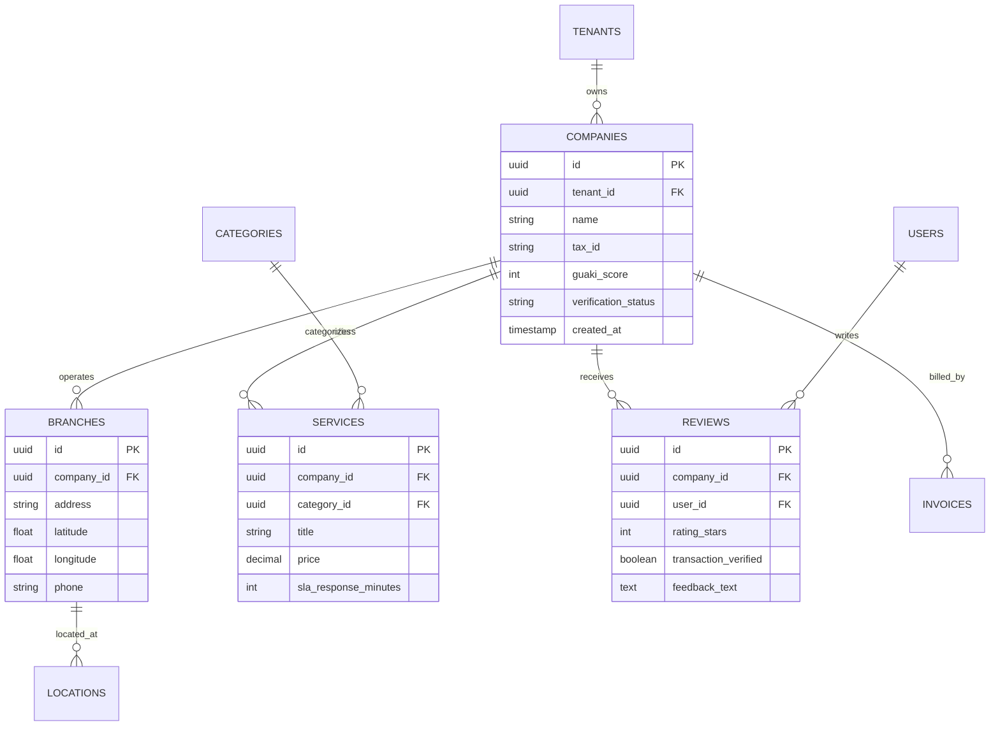

# 🗄️ GUAKI — MULTI-MODEL DATABASE ARCHITECTURE BIBLE v1.0
> **ESPECIFICACIÓN COMPLETA DE MODELADO POLÍGLOTA DE DATOS DISEÑADA PARA PERDURAR DÉCADAS**
> **INCLUYE: MODELO SQL ER, DDD AGGREGATES, EVENT SOURCING, NOSQL, VECTORIAL & SEARCH ENGINE**

---

## 🏛️ 1. GUÍA DE PERSISTENCIA POLÍGLOTA (CUÁNDO USAR CADA MOTOR)

| Modelo de Datos | Tecnología de Motor | Caso de Uso Primario | Criterio de Selección |
| :--- | :--- | :--- | :--- |
| **1. SQL Relacional / Distributed** | CockroachDB / Google Spanner | Usuarios, Empresas, Sucursales, Facturas, Pagos | Consistencia estricta ACID, transacciones monetarias y RLS multi-tenant. |
| **2. NoSQL Documental** | MongoDB / DynamoDB | Historial de chats, borradores de catálogo, logs de eventos | Lectura/escritura masiva de esquemas flexibles sin JOINs complejos. |
| **3. Event Sourcing / Event Log** | Apache Kafka + EventStoreDB | Auditoría de reputación, cambios de Guaki Score, historial de cambios | Registro inmutable de eventos pasados para reproducir estados en cualquier momento. |
| **4. VectorDB (Vectorial)** | Qdrant Cluster (1536d) | Búsqueda semántica por voz/texto, matchmaking Atlas | Similitud coseno en memoria para coincidencia de intención en < 20ms. |
| **5. Search Engine** | Elasticsearch / Meilisearch | Búsquedas por facetas, autocompletado, SEO programático | Indexación de texto completo con resaltado y ponderación por relevancia. |
| **6. Knowledge Graph** | Neo4j Distributed | Grafo de relaciones (Empresa ➔ Servicio ➔ Problema ➔ Geolocalización) | Consultas relacionales profundas no jerárquicas. |

---

## 📐 2. MODELO SQL ER (ENTIDAD-RELACIÓN MULTI-TENANT)



---

## 🔷 3. MODELO DDD (DOMAIN-DRIVEN DESIGN AGGREGATES)

### 3.1 AGREGADO: `CompanyAggregate`
- **Root Entity:** `Company`
- **Internal Entities:** `Branch`, `ServiceCatalog`, `Certification`, `OperatingHours`.
- **Value Objects:** `GuakiScore`, `GPSCoordinates`, `PhoneNumber`, `TaxIdentification`.
- **Regla de Invariante:** No se puede publicar una `Branch` si las `GPSCoordinates` no han sido validadas por el módulo de geolocalización.

---

## 📜 4. MODELO EVENT SOURCING (EVENTOS INMUTABLES)

Todos los cambios en la reputación se registran como eventos inmutables en **EventStoreDB**:

```json
{
  "eventId": "evt_99481829491",
  "eventType": "VendorSlaThresholdBreached",
  "aggregateId": "comp_barranquilla_odontologia_01",
  "timestamp": "2026-08-05T21:25:30Z",
  "payload": {
    "expectedSlaMinutes": 3,
    "actualResponseMinutes": 14,
    "scorePenaltyApplied": -5,
    "newGuakiScore": 93
  }
}
```

---

## 🧠 5. MODELO VECTORIAL & SEARCH ENGINE (ATLAS VECTOR SCHEMAS)

### 5.1 ESQUEMA DE EMBEDDINGS EN QDRANT (1536D)
```json
{
  "vector_id": "vec_comp_sonrisa_real_88",
  "vector": [0.0124, -0.0941, 0.3121, "... 1536 dimensiones"],
  "payload": {
    "company_id": "comp_barranquilla_odontologia_01",
    "category_slug": "odontologia",
    "city_slug": "barranquilla",
    "guaki_score": 98,
    "keywords": ["implantes dentales", "dolor de muela", "urgencia odontologica"]
  }
}
```

---

> **BIBLE DE ARQUITECTURA DE BASE DE DATOS Y MODELADO POLÍGLOTA GUAKI v1.0 APROBADA.**
