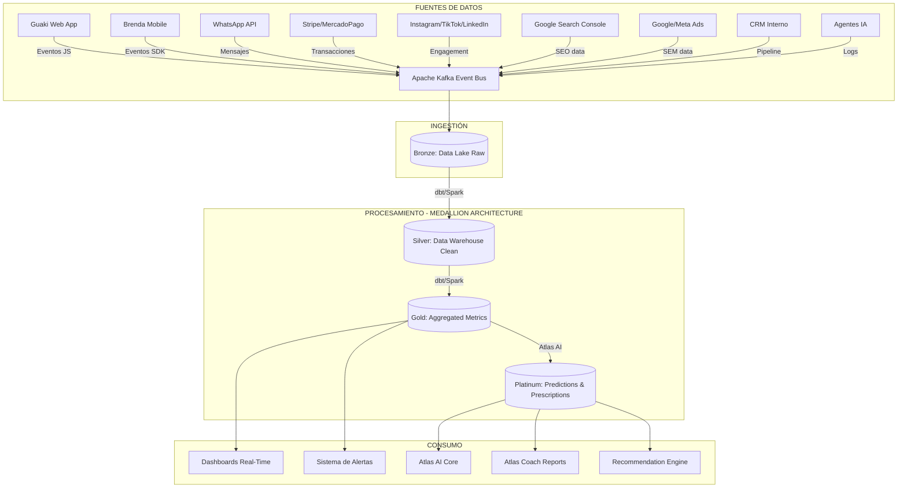
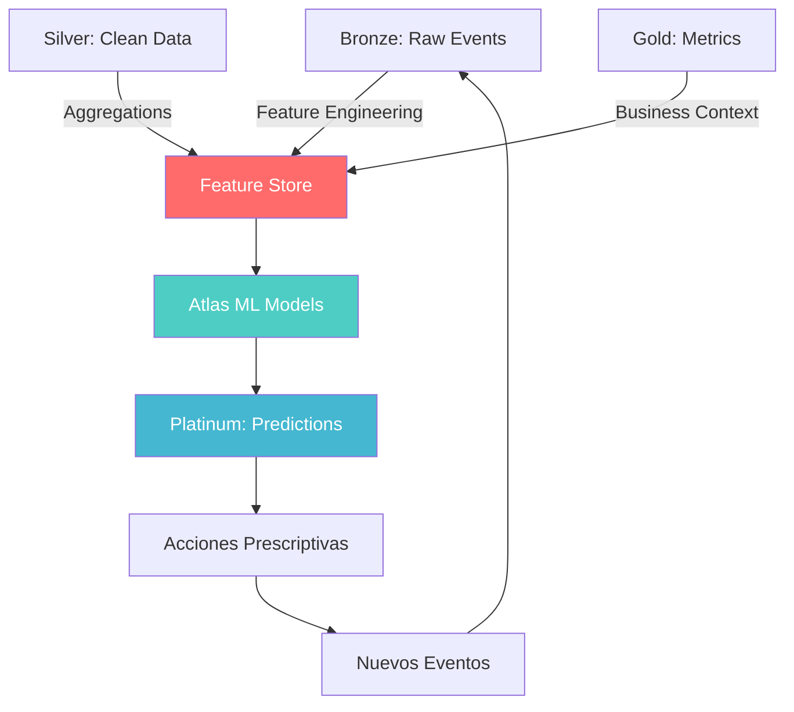

# 📊 GUAKI — DATA PLATFORM & ANALYTICS INTELLIGENCE BIBLE v1.0
> **PLATAFORMA DE DATOS COMPLETA: DATA WAREHOUSE + DATA LAKE + EVENTOS + MÉTRICAS + DASHBOARDS + PREDICCIONES**
> **TODO SE MIDE. TODO ALIMENTA A ATLAS. ATLAS APRENDE CONTINUAMENTE.**

---

## 🏛️ PARTE I — FILOSOFÍA: SI NO SE MIDE, NO EXISTE

### Principio 1: CAPTURA TODO
Cada interacción, cada clic, cada scroll, cada milisegundo de espera, cada mensaje de WhatsApp, cada búsqueda, cada conversión y cada abandono se captura como un evento inmutable.

### Principio 2: ALMACENA PARA SIEMPRE
Los datos crudos nunca se borran. Se comprimen, se archivan, pero nunca se eliminan. **El valor de los datos crece con el tiempo** — un patrón invisible hoy puede ser un insight transformador mañana.

### Principio 3: PROCESA EN CAPAS
Los datos crudos se refinan en capas: Bronze (crudos) → Silver (limpios) → Gold (agregados) → Platinum (predicciones de Atlas AI).

### Principio 4: ATLAS CONSUME TODO
Cada capa de datos alimenta a Atlas AI Core. Atlas no es un dashboard — es un cerebro que razona sobre los datos para prescribir acciones.

---

## 🏗️ PARTE II — ARQUITECTURA DE LA PLATAFORMA DE DATOS



---

## 🗄️ PARTE III — ARQUITECTURA DE ALMACENAMIENTO

### CAPA 1: DATA LAKE (BRONZE) — Datos Crudos Inmutables

| Atributo | Especificación |
|:---|:---|
| **Tecnología** | Apache Iceberg sobre Object Storage (S3/GCS) |
| **Formato** | Apache Parquet (columnar, comprimido) |
| **Particionamiento** | `año/mes/día/hora/source` |
| **Retención** | Indefinida (nunca se borra) |
| **Schema** | Schema-on-read (flexible, sin schema forzado) |
| **Volumen Año 1** | ~50 GB/mes |
| **Volumen Año 5** | ~5 TB/mes |
| **Volumen Año 10** | ~50 TB/mes |

**Contenido:** Todos los eventos crudos tal como llegan de Kafka. Sin transformación. Sin deduplicación. Inmutables. Timestamped. Source-tagged.

### CAPA 2: DATA WAREHOUSE (SILVER) — Datos Limpios y Modelados

| Atributo | Especificación |
|:---|:---|
| **Tecnología** | CockroachDB (OLTP) + ClickHouse (OLAP) |
| **Modelado** | Star Schema (Facts + Dimensions) |
| **Transformación** | dbt (data build tool) con tests de calidad |
| **Retención** | 3 años de detalle + agregados históricos indefinidos |
| **Refresh** | Incremental cada 15 minutos |

**Tablas Dimensionales (Dimensions):**

| Dimensión | Descripción | Campos Clave |
|:---|:---|:---|
| `dim_providers` | Proveedores verificados | id, name, category, subcategory, city, neighborhood, plan, guaki_score, created_at |
| `dim_users` | Usuarios consumidores | id, city, device, source, created_at |
| `dim_categories` | Taxonomía de servicios | id, parent_id, name, slug, depth |
| `dim_cities` | Geografía | id, country, state, city, neighborhood, lat, lon, polygon |
| `dim_plans` | Planes SaaS | id, name, price_usd, tier |
| `dim_pages` | Páginas SEO | id, url, type, category_id, city_id, created_at |
| `dim_campaigns` | Campañas SEM | id, platform, budget, target_audience |
| `dim_agents` | Agentes IA | id, name, type, status |
| `dim_dates` | Calendario | date, year, quarter, month, week, day, is_weekend, is_holiday |

**Tablas de Hechos (Facts):**

| Fact Table | Granularidad | Métricas |
|:---|:---|:---|
| `fact_events` | 1 fila por evento | event_type, timestamp, user_id, provider_id, page_id, metadata_json |
| `fact_searches` | 1 fila por búsqueda | query, city_id, category_id, results_count, position_clicked, timestamp |
| `fact_page_views` | 1 fila por vista | page_id, user_id, time_on_page_ms, scroll_depth_pct, source |
| `fact_contacts` | 1 fila por contacto | user_id, provider_id, channel (WA/call/chat), response_time_ms |
| `fact_appointments` | 1 fila por cita | user_id, provider_id, status (confirmed/no-show/completed), amount |
| `fact_payments` | 1 fila por pago | provider_id, plan_id, amount_usd, method, status, gateway |
| `fact_reviews` | 1 fila por reseña | user_id, provider_id, rating, sentiment_score, text |
| `fact_seo` | 1 fila por página/día | page_id, impressions, clicks, position, ctr |
| `fact_sem` | 1 fila por campaña/día | campaign_id, impressions, clicks, cost, conversions |
| `fact_whatsapp` | 1 fila por mensaje | provider_id, user_id, direction, response_time_ms, resolved |
| `fact_agent_tasks` | 1 fila por tarea | agent_id, task_type, duration_ms, status, cost_tokens |
| `fact_content` | 1 fila por pieza/día | content_id, channel, impressions, engagement, clicks, conversions |

### CAPA 3: MÉTRICAS AGREGADAS (GOLD)

| Atributo | Especificación |
|:---|:---|
| **Tecnología** | ClickHouse materialized views + Redis para real-time |
| **Refresh** | Real-time para métricas críticas, horario para agregados |

**Métricas Agregadas Pre-Calculadas:**

| Métrica | Granularidad | Fórmula |
|:---|:---|:---|
| `mrr_daily` | Día | SUM(pagos activos del día) |
| `arr_monthly` | Mes | MRR × 12 |
| `cac_monthly` | Mes | (Gasto SEM + Gasto Marketing) / Nuevos proveedores pagos |
| `ltv_cohort` | Cohorte/Mes | Revenue acumulado / Proveedores del cohorte |
| `churn_monthly` | Mes | Cancelaciones / Proveedores activos al inicio |
| `nrr_monthly` | Mes | (MRR inicio + Expansión - Churn) / MRR inicio |
| `conversion_funnel` | Día/Ciudad | Búsquedas → Vistas → Contactos → Citas → Pagos |
| `seo_traffic_daily` | Día/Página | SUM(clics orgánicos) |
| `guaki_score_daily` | Día/Proveedor | Calculado por algoritmo meritocrático |
| `health_score_daily` | Día/Proveedor | Calculado por Health Score Engine |
| `business_score_weekly` | Semana/Proveedor | 9 dimensiones de madurez |
| `response_sla_hourly` | Hora/Proveedor | AVG(response_time_ms) |
| `content_roi_weekly` | Semana/Canal | Conversiones atribuidas / Costo de producción |

### CAPA 4: PREDICCIONES (PLATINUM — Atlas AI)

| Atributo | Especificación |
|:---|:---|
| **Tecnología** | Atlas AI Core (modelos ML desplegados en GPU) |
| **Modelos** | Gradient Boosting, LSTM, Transformers, Collaborative Filtering |
| **Refresh** | Diario para predicciones, real-time para scoring |

**Predicciones Generadas por Atlas:**

| Predicción | Modelo | Input | Output | Frecuencia |
|:---|:---|:---|:---|:---|
| Churn Probability | Logistic Regression | Health Score, engagement, payments | 0-100% por proveedor | Diaria |
| Growth Probability | Gradient Boosting | Guaki Score, contactos trend, feature adoption | 0-100% por proveedor | Diaria |
| Renewal Probability | Cox Survival | Health Score hist., pagos, NPS, antigüedad | 0-100% por proveedor | Diaria |
| Demand Forecast | LSTM Time Series | Búsquedas hist., estacionalidad, eventos | Demanda a 30/60/90 días | Semanal |
| Price Elasticity | Regression | Precios, conversiones, categoría, ciudad | Precio óptimo sugerido | Mensual |
| Content Performance | Gradient Boosting | Título, formato, canal, hora, categoría | Score 0-100 de performance esperada | Por pieza |
| Lead Score (BANT) | Random Forest | Tamaño empresa, respuesta, digital presence | 0-100 por lead | Real-time |
| Category Opportunity | Clustering | Demanda/oferta ratio, competencia, precios | Oportunidades rankeadas | Semanal |
| SEO Ranking Prediction | XGBoost | Contenido, backlinks, authority, CTR | Posición estimada en 30 días | Semanal |
| Fraud Detection | Anomaly Detection | Patrones de reseñas, IPs, timing | Probabilidad de fraude 0-100% | Real-time |

---

## 📡 PARTE IV — CATÁLOGO COMPLETO DE EVENTOS (EVENT TAXONOMY)

### Convención de Nomenclatura
```
{dominio}.{entidad}.{acción}
```
Ejemplo: `search.query.executed`, `provider.profile.viewed`, `payment.subscription.renewed`

### Catálogo de Eventos (120+ eventos)

#### DOMINIO: SEARCH (Búsquedas)
| Evento | Descripción | Datos |
|:---|:---|:---|
| `search.query.executed` | Usuario ejecuta búsqueda | query, city, category, results_count, timestamp |
| `search.results.viewed` | Usuario ve resultados | query, positions_visible, scroll_depth |
| `search.result.clicked` | Usuario clickea un resultado | provider_id, position, query |
| `search.filter.applied` | Usuario aplica filtro | filter_type, filter_value |
| `search.zero_results` | Búsqueda sin resultados | query, city, category |
| `search.suggestion.clicked` | Usuario clickea sugerencia | suggestion_text, original_query |

#### DOMINIO: PROVIDER (Perfiles de Proveedor)
| Evento | Descripción | Datos |
|:---|:---|:---|
| `provider.profile.viewed` | Vista del perfil | provider_id, user_id, source, time_on_page_ms |
| `provider.profile.scroll` | Scroll en el perfil | provider_id, scroll_depth_pct |
| `provider.gallery.viewed` | Ve la galería de fotos | provider_id, photos_viewed_count |
| `provider.price.viewed` | Ve los precios | provider_id, service_id |
| `provider.review.read` | Lee reseñas | provider_id, reviews_scrolled |
| `provider.map.clicked` | Clickea el mapa | provider_id, action (directions/zoom) |
| `provider.share.clicked` | Comparte el perfil | provider_id, channel (WA/copy/social) |

#### DOMINIO: CONTACT (Contactos)
| Evento | Descripción | Datos |
|:---|:---|:---|
| `contact.whatsapp.clicked` | Click en botón WhatsApp | provider_id, user_id |
| `contact.whatsapp.sent` | Mensaje enviado por WA | provider_id, user_id, message_length |
| `contact.whatsapp.replied` | Proveedor responde | provider_id, response_time_ms |
| `contact.call.initiated` | Llamada iniciada | provider_id, user_id |
| `contact.call.completed` | Llamada completada | provider_id, duration_seconds |
| `contact.chat.started` | Chat in-app iniciado | provider_id, user_id |
| `contact.ia_assistant.triggered` | IA Assistant responde | provider_id, response_time_ms, resolved |

#### DOMINIO: APPOINTMENT (Citas/Agendamiento)
| Evento | Descripción | Datos |
|:---|:---|:---|
| `appointment.slot.viewed` | Ve disponibilidad | provider_id, date_range |
| `appointment.created` | Cita creada | provider_id, user_id, date, service_id |
| `appointment.confirmed` | Cita confirmada (depósito pagado) | appointment_id, amount |
| `appointment.reminder.sent` | Recordatorio enviado | appointment_id, channel, hours_before |
| `appointment.completed` | Cita completada | appointment_id, rating |
| `appointment.no_show` | No-show | appointment_id, side (user/provider) |
| `appointment.cancelled` | Cancelación | appointment_id, reason, canceller |
| `appointment.rescheduled` | Reagendamiento | appointment_id, new_date |

#### DOMINIO: PAYMENT (Pagos)
| Evento | Descripción | Datos |
|:---|:---|:---|
| `payment.subscription.created` | Suscripción creada | provider_id, plan_id, amount_usd, gateway |
| `payment.subscription.renewed` | Renovación | provider_id, plan_id, period |
| `payment.subscription.upgraded` | Upgrade de plan | provider_id, from_plan, to_plan |
| `payment.subscription.downgraded` | Downgrade | provider_id, from_plan, to_plan |
| `payment.subscription.cancelled` | Cancelación | provider_id, plan_id, reason |
| `payment.invoice.generated` | Factura generada | invoice_id, amount, country |
| `payment.failed` | Pago fallido | provider_id, error_code, gateway |
| `payment.deposit.collected` | Depósito de reserva cobrado | appointment_id, amount |
| `payment.addon.purchased` | Add-on comprado | provider_id, addon_id, amount |

#### DOMINIO: REVIEW (Reseñas)
| Evento | Descripción | Datos |
|:---|:---|:---|
| `review.submitted` | Reseña enviada | provider_id, user_id, rating, text |
| `review.replied` | Proveedor responde reseña | review_id, response_time_hours |
| `review.flagged` | Reseña reportada como falsa | review_id, reason |
| `review.sentiment.analyzed` | Sentimiento analizado | review_id, sentiment_score (-1 to 1) |

#### DOMINIO: SEO
| Evento | Descripción | Datos |
|:---|:---|:---|
| `seo.page.indexed` | Página indexada por Google | page_id, url |
| `seo.page.deindexed` | Página deindexada | page_id, reason |
| `seo.impression` | Impresión en SERP | page_id, query, position |
| `seo.click` | Click desde SERP | page_id, query, position |
| `seo.page.compiled` | Página compilada por fábrica | page_id, type, compilation_time_ms |

#### DOMINIO: SEM
| Evento | Descripción | Datos |
|:---|:---|:---|
| `sem.impression` | Impresión de anuncio | campaign_id, platform, cost |
| `sem.click` | Click en anuncio | campaign_id, cpc, landing_page |
| `sem.conversion` | Conversión atribuida | campaign_id, conversion_type, value |

#### DOMINIO: CONTENT (Fábrica de Contenido)
| Evento | Descripción | Datos |
|:---|:---|:---|
| `content.piece.created` | Pieza producida | content_id, type, channel, source_investigation |
| `content.piece.published` | Pieza publicada | content_id, channel, scheduled_time |
| `content.engagement` | Engagement recibido | content_id, channel, likes, shares, saves, comments |
| `content.conversion` | Conversión atribuida | content_id, conversion_type |

#### DOMINIO: AGENT (Agentes IA)
| Evento | Descripción | Datos |
|:---|:---|:---|
| `agent.task.assigned` | Tarea asignada | agent_id, task_type, priority |
| `agent.task.completed` | Tarea completada | agent_id, task_id, duration_ms, tokens_used |
| `agent.task.failed` | Tarea fallida | agent_id, task_id, error |
| `agent.health.check` | Health check | agent_id, status, latency_ms |

#### DOMINIO: CS (Customer Success)
| Evento | Descripción | Datos |
|:---|:---|:---|
| `cs.lifecycle.stage_changed` | Cambio de etapa | provider_id, from_stage, to_stage |
| `cs.health_score.calculated` | Health Score recalculado | provider_id, score, components |
| `cs.churn_risk.detected` | Riesgo de churn detectado | provider_id, probability, reason |
| `cs.intervention.triggered` | Intervención activada | provider_id, type, playbook_id |
| `cs.atlas_report.generated` | Informe de Atlas generado | provider_id, recommendations_count |

---

## 📈 PARTE V — CATÁLOGO MAESTRO DE KPIs (80+ KPIs)

### UNIT ECONOMICS

| KPI | Fórmula | Target | Frecuencia |
|:---|:---|:---|:---|
| MRR | SUM(suscripciones activas × precio) | Crecimiento > 12% MoM | Diaria |
| ARR | MRR × 12 | — | Mensual |
| CAC | (Gasto Marketing + Ventas) / Nuevos clientes pagos | < $8 USD | Mensual |
| LTV | ARPU × (1 / Churn Rate) | > $500 USD | Mensual |
| LTV/CAC | LTV / CAC | > 8x | Mensual |
| ARPU | MRR / Proveedores activos pagos | > $80 USD | Mensual |
| Gross Margin | (Revenue - COGS) / Revenue | > 75% | Mensual |
| Burn Rate | Gastos mensuales totales | — | Mensual |
| Runway | Cash / Burn Rate | > 12 meses | Mensual |
| Payback Period | CAC / ARPU mensual | < 3 meses | Mensual |

### GROWTH

| KPI | Fórmula | Target | Frecuencia |
|:---|:---|:---|:---|
| Gross Churn | Cancelaciones / Activos inicio | < 3% mensual | Mensual |
| Net Revenue Retention | (MRR inicio + Expansión - Churn) / MRR inicio | > 115% | Mensual |
| Logo Retention | 1 - (Cancelaciones / Activos inicio) | > 97% | Mensual |
| Expansion Revenue | Revenue de upgrades + add-ons | > 20% del MRR total | Mensual |
| Quick Ratio | (New MRR + Expansion) / (Churn + Downgrade) | > 4 | Mensual |
| Activation Rate | Proveedores con perfil 100% / Registrados | > 70% | Semanal |
| Time-to-First-Value | Días hasta primer contacto de cliente | < 7 días | Por cohorte |

### ENGAGEMENT

| KPI | Fórmula | Target | Frecuencia |
|:---|:---|:---|:---|
| DAU/MAU | Usuarios activos diarios / mensuales | > 40% | Diaria |
| Feature Adoption | Features usadas / Features disponibles del plan | > 70% | Semanal |
| Session Duration | AVG(tiempo en plataforma por sesión) | > 3 min | Diaria |
| Pages per Session | Páginas vistas / Sesiones | > 3 | Diaria |
| Return Rate | Usuarios que vuelven en 7 días | > 50% | Semanal |

### MARKETPLACE

| KPI | Fórmula | Target | Frecuencia |
|:---|:---|:---|:---|
| Search-to-Contact Rate | Contactos / Búsquedas | > 8% | Diaria |
| Contact-to-Appointment Rate | Citas / Contactos | > 25% | Semanal |
| Appointment-to-Complete Rate | Completadas / Citas | > 85% | Semanal |
| No-Show Rate | No-shows / Citas confirmadas | < 10% | Semanal |
| Average Response Time | AVG(response_time_ms) | < 15 min | Real-time |
| Supply/Demand Ratio | Proveedores / Búsquedas por categoría/ciudad | Equilibrado | Semanal |
| Liquidity | Categorías con > 5 proveedores / Total categorías | > 80% | Mensual |

### SEO

| KPI | Fórmula | Target | Frecuencia |
|:---|:---|:---|:---|
| Organic Traffic | Total clics desde Google | > 100K/mes (Año 1) | Diaria |
| Pages Indexed | URLs indexadas en GSC | > 15,000 (Año 1) | Semanal |
| Average Position | AVG posición en SERPs para keywords target | < 5 | Semanal |
| Organic CTR | Clics / Impresiones | > 6% | Semanal |
| Zero-Click Rate | Impresiones sin clic / Total impresiones | Monitoreado | Semanal |
| AI Overview Citations | Veces que Guaki aparece en AI Overviews | Crecimiento MoM | Mensual |
| LLM Citations | Veces que Guaki es citado por ChatGPT/Gemini/etc. | Crecimiento MoM | Mensual |

### SEM

| KPI | Fórmula | Target | Frecuencia |
|:---|:---|:---|:---|
| CPA Provider | Gasto / Nuevos proveedores por SEM | < $10 USD | Semanal |
| CPA User | Gasto / Nuevos usuarios por SEM | < $0.50 USD | Semanal |
| ROAS | Revenue generado / Gasto SEM | > 5x | Mensual |
| Quality Score | Promedio Quality Score de Google Ads | > 7/10 | Semanal |

### CUSTOMER SUCCESS

| KPI | Fórmula | Target | Frecuencia |
|:---|:---|:---|:---|
| Health Score Average | AVG(health_score) de todos los proveedores | > 75/100 | Diaria |
| Churn Prediction Accuracy | Predicciones correctas / Total predicciones | > 85% | Mensual |
| NPS | Promotores - Detractores | > 70 | Trimestral |
| CSAT | Satisfechos / Total encuestados | > 90% | Semanal |
| Time-to-Resolution | AVG(tiempo de resolución de tickets) | < 4h | Diaria |

### CONTENT

| KPI | Fórmula | Target | Frecuencia |
|:---|:---|:---|:---|
| Content Pieces Produced | Total piezas producidas | > 500/mes | Semanal |
| Content Score Average | AVG(content_score) de piezas publicadas | > 70/100 | Semanal |
| Content-to-Registration Rate | Registros atribuidos a contenido / Total visitas de contenido | > 2% | Mensual |
| Newsletter Open Rate | Aperturas / Enviados | > 35% | Por envío |

---

## 📺 PARTE VI — SISTEMA DE DASHBOARDS

### DASHBOARD 01: CEO COMMAND CENTER
- **Audiencia:** CEO, Board, Inversores.
- **Refresh:** Real-time.
- **Métricas:** MRR (gauge), ARR (trend), CAC/LTV (trend), Churn (trend), NRR (trend), Runway (countdown), Revenue por plan (donut), Proveedores activos (counter).

### DASHBOARD 02: GROWTH OPERATIONS
- **Audiencia:** Head of Growth, Marketing, Ventas.
- **Métricas:** Funnel completo (búsqueda → contacto → cita → pago), CAC por canal, conversion rates por ciudad, pipeline de ventas, leads en cola.

### DASHBOARD 03: MARKETPLACE HEALTH
- **Audiencia:** Head of Product, Engineering.
- **Métricas:** Supply/Demand ratio por categoría/ciudad, liquidity score, response times, Core Web Vitals (LCP, CLS, INP), error rates.

### DASHBOARD 04: SEO FACTORY
- **Audiencia:** SEO Lead, Content Lead.
- **Métricas:** Páginas indexadas, tráfico orgánico, posiciones promedio, CTR, canibalizaciones, producción nocturna, pages compiled/deployed/rejected.

### DASHBOARD 05: CONTENT FACTORY
- **Audiencia:** Content Lead, Marketing.
- **Métricas:** Piezas producidas, Content Score, engagement por canal, conversiones atribuidas, newsletter metrics, podcast metrics, LLM citations.

### DASHBOARD 06: CUSTOMER SUCCESS
- **Audiencia:** CS Lead, CS Managers.
- **Métricas:** Health Score distribution, churn risk heatmap, lifecycle stage distribution, NPS/CSAT, interventions triggered, playbook effectiveness.

### DASHBOARD 07: ATLAS AI CORE
- **Audiencia:** AI Lead, CTO.
- **Métricas:** Prediction accuracy, model drift, Knowledge Graph health, Vector Search latency, recommendation precision@k, embeddings freshness.

### DASHBOARD 08: FINANCIAL
- **Audiencia:** CFO, CEO, Board.
- **Métricas:** P&L, cash flow, burn rate, runway, revenue by plan/country, aging de cartera, unit economics cohort analysis.

### DASHBOARD 09: HERMES OPERATIONS
- **Audiencia:** COO (Hermes), Engineering.
- **Métricas:** Agent uptime, task queue, SLA compliance, incidents P0/P1/P2, MTTR, agent cost (tokens).

### DASHBOARD 10: COUNTRY EXPANSION
- **Audiencia:** CEO, Head of Expansion.
- **Métricas:** Providers by country/city, revenue by country, SEO traffic by country, CAC by country, market penetration.

---

## 🚨 PARTE VII — SISTEMA DE ALERTAS INTELIGENTES

### Clasificación de Alertas

| Severidad | Nombre | Tiempo de Respuesta | Notificación |
|:---:|:---|:---|:---|
| 🔴 P0 | **Crítico** | < 15 minutos | WhatsApp + Llamada + Slack |
| 🟠 P1 | **Alto** | < 1 hora | WhatsApp + Slack |
| 🟡 P2 | **Medio** | < 4 horas | Slack + Email |
| 🔵 P3 | **Bajo** | < 24 horas | Email |

### Catálogo de Alertas (50+ Alertas)

#### ALERTAS FINANCIERAS
| Alerta | Condición | Severidad |
|:---|:---|:---:|
| MRR Drop | MRR cae > 5% en 7 días | 🔴 P0 |
| Payment Gateway Down | 0 pagos procesados en 30 min | 🔴 P0 |
| Churn Spike | Cancelaciones > 2x promedio diario | 🟠 P1 |
| Failed Payments Spike | Pagos fallidos > 10% del total diario | 🟠 P1 |
| CAC Rising | CAC sube > 50% MoM | 🟡 P2 |

#### ALERTAS DE PRODUCTO
| Alerta | Condición | Severidad |
|:---|:---|:---:|
| Site Down | Error rate > 50% o latencia > 10s | 🔴 P0 |
| LCP Degraded | LCP > 4s en > 20% de páginas | 🟠 P1 |
| Search Zero Results Spike | Zero results > 20% de búsquedas | 🟠 P1 |
| Conversion Drop | Search-to-contact cae > 30% en 24h | 🟠 P1 |

#### ALERTAS SEO
| Alerta | Condición | Severidad |
|:---|:---|:---:|
| Mass Deindexation | > 1,000 páginas deindexadas en 24h | 🔴 P0 |
| Organic Traffic Drop | Tráfico orgánico cae > 20% WoW | 🟠 P1 |
| Core Position Loss | Keyword core cae > 10 posiciones | 🟡 P2 |

#### ALERTAS DE CUSTOMER SUCCESS
| Alerta | Condición | Severidad |
|:---|:---|:---:|
| Enterprise Churn Risk | Proveedor Enterprise con Health Score < 40 | 🔴 P0 |
| Mass Churn Signal | > 10 proveedores con churn risk > 80% en 24h | 🟠 P1 |
| NPS Drop | NPS cae > 15 puntos en trimestre | 🟡 P2 |

#### ALERTAS DE AGENTES IA
| Alerta | Condición | Severidad |
|:---|:---|:---:|
| Agent Down | Agente no responde a health check en 60s | 🔴 P0 |
| Queue Overflow | Cola de tareas > 100 pendientes | 🟠 P1 |
| Model Drift | Precision de recomendaciones < 75% | 🟡 P2 |

---

## 🔮 PARTE VIII — ATLAS COGNITIVE FEEDBACK LOOP

### Cómo Atlas Consume la Plataforma de Datos



**El ciclo virtuoso:**
1. **Eventos** generan datos en Bronze.
2. **dbt** los limpia y modela en Silver/Gold.
3. **Atlas** consume Gold para entrenar modelos y generar predicciones en Platinum.
4. **Las predicciones** generan acciones (recomendaciones, alertas, intervenciones).
5. **Las acciones** generan nuevos eventos → el ciclo se repite.
6. **Cada ciclo** Atlas mejora sus modelos con los resultados de las acciones anteriores.

**Atlas nunca deja de aprender. La plataforma de datos es su alimento infinito.**

---

> **DATA PLATFORM & ANALYTICS INTELLIGENCE BIBLE v1.0 — TODO SE MIDE, TODO ALIMENTA A ATLAS — APROBADO.**
