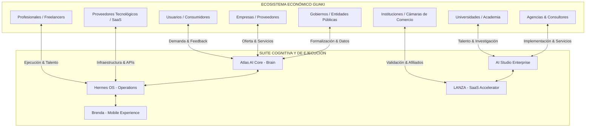

# 🌐 GUAKI — ECOSYSTEM MASTER PLAN BIBLE v1.0
> **DOCUMENTO MAESTRO DEL ECOSISTEMA ECONÓMICO Y VOLANTE DE CRECIMIENTO COMPUESTO (FLYWHEELS)**
> **GUAKI NO ES UN MARKETPLACE: ES LA INFRAESTRUCTURA ECONÓMICA Y COGNITIVA DE LATINOAMÉRICA**

---

## 🏛️ PARTE I — VISIÓN Y ARQUITECTURA DEL ECOSISTEMA ECONÓMICO

Guaki trasciende la definición tradicional de "directorio" o "marketplace". Funciona como un **Ecosistema Económico Digital Orquestado por Inteligencia Artificial**, donde múltiples actores (humanos, institucionales y sintéticos/agénicos) interactúan continuamente, generando valor, intercambiando conocimiento y acumulando capital relacional y de datos.



---

## 🔁 PARTE II — MATRIZ MAESTRA DE FLUJO DE VALOR ENTRE ACTORES

| Actor | ¿Qué Aporta al Ecosistema? | ¿Qué Recibe del Ecosistema? | Información Generada | Información Consumida por Atlas |
|:---|:---|:---|:---|:---|
| **Usuarios / Consumidores** | Intención de compra, búsquedas, contexto de necesidades, opiniones, datos de consumo real. | Recomendaciones hiper-precisas, garantías de calidad, ahorro de tiempo, soporte IA 24/7. | Queries de búsqueda, patrones de comportamiento, ratings, conversiones. | Intención contextual, elasticidad de precio percibida, grafos de preferencia local. |
| **Empresas / Proveedores** | Capacidad operativa, inventario de servicios, oferta comercial, transacciones, presupuesto SaaS. | Demanda calificada, automatización operativa, optimización de ingresos, crecimiento continuo. | Catálogo de precios, SLA de respuesta, capacidad instalada, métricas operativas. | Performance comercial, tasa de conversión por categoría, márgenes reales. |
| **Profesionales / Freelancers** | Talento especializado, servicios de nicho, ejecución de proyectos complejos. | Acceso a clientes B2B, herramientas de IA de vanguardia, monetización constante. | Habilidades, disponibilidad, entregables, métricas de desempeño. | Matchmaking óptimo de habilidades vs demandas complejas de empresas. |
| **Instituciones / Cámaras** | Credibilidad, red de afiliados, validación de empresas, presencia territorial. | Digitalización de sus afiliados, dashboards de salud empresarial regional, valor agregado. | Padrón de empresas formales, certificaciones, datos sectoriales. | Indicadores macro de salud comercial regional, tasas de formalización. |
| **Gobiernos** | Normativa, programas de fomento, datos de formalización, infraestructura pública. | Visibilidad de economía local, incremento en formalización tributaria, analítica de comercio. | Registros fiscales, incentivos económicos, zonas de inversión. | Densidad de oferta formal vs informal por municipio/barrio. |
| **Universidades** | Investigación, practicantes de alto nivel, incubación de proyectos, validación metodológica. | Casos de estudio reales, acceso a tecnología de IA de punta (AI Studio), bolsa de empleo. | Talento emergente, investigaciones aplicadas, proyectos de innovación. | Evolución de competencias del mercado laboral y tendencias tecnológicas. |
| **Proveedores Tecnológicos** | APIs, infraestructura cloud, pasarelas de pago (Stripe, Wompi), conectividad (Twilio, Resend). | Volumen masivo de transacciones, uso de infraestructura, canales de distribución. | Uptime de servicios, latencia, costos por transacción. | Optimización de costos marginales por infraestructura y routing de APIs. |
| **Agencias & Consultores** | Servicios de implementación de alto nivel, estrategia personalizada para clientes Enterprise. | Plataforma de marca blanca, flujo constante de clientes, tecnología de Atlas/Hermes. | Casos de éxito, metodologías sectoriales, configuraciones avanzadas. | Best practices de verticalización e implementación industrial. |
| **AI Studio Enterprise** | Ingeniería de IA B2B, consultoría de transformación digital, desarrollo custom. | Proyectos Enterprise de alto valor ($2,850+ USD), pipeline de clientes calificados. | Blueprints de automatización, arquitecturas personalizadas. | Patrones de fricción operativa en grandes empresas para ser productoizado. |
| **Atlas AI Core** | Razonamiento cognitivo, modelos predictivos, personalización, grafos de conocimiento. | Datos continuos de todas las interacciones del ecosistema para auto-entrenamiento. | Scores (Health, Guaki, Business), predicciones de Churn/Growth. | **TODO** (Eventos, clicks, mensajes, transacciones, búsquedas). |
| **Hermes OS** | Orquestación operativa 24/7, supervisión de agentes sintéticos, gestión de SLAs. | Feedback de rendimiento de agentes, directivas estratégicas de Atlas. | Logs de ejecución, resolución de incidentes, eficiencia de agentes. | Métricas de rendimiento de trabajo sintético vs trabajo humano. |
| **LANZA** | Aceleración SaaS para negocios, infraestructura de software plug-and-play. | Proveedores listos para escalar que requieren herramientas SaaS especializadas. | Métricas de uso de software, adopción de funcionalidades. | Patrones de madurez de software en PYMEs latinoamericanas. |
| **Brenda** | Experiencia nativa móvil con IA para el consumidor final. | Captura de contexto móvil (ubicación real, voz, cámara, uso diario). | Datos de geolocalización, interacciones por voz, uso situacional. | Contexto situacional y de movimiento del consumidor en tiempo real. |

---

## 🎡 PARTE III — SISTEMA DE 10 FLYWHEELS INTERCONECTADOS

```
                    ┌──────────────────────────────────────────┐
                    │ 1. FLYWHEEL DE CONTENIDO & TRAFICO (SEO) │
                    └────────────────────┬─────────────────────┘
                                         │
                    ┌────────────────────▼─────────────────────┐
                    │  2. FLYWHEEL COGNITIVO DE DATA & ATLAS   │
                    └────────────────────┬─────────────────────┘
                                         │
                    ┌────────────────────▼─────────────────────┐
                    │ 3. FLYWHEEL DE LIQUIDEZ Y CONVERSIÓN     │
                    └──────────────────────────────────────────┘
```

---

### FLYWHEEL 01: CONTENIDO, SEO Y CAPTACIÓN ORGÁNICA (SEO-Content Engine)
**Bucle:**
`Más Proveedores Registrados` → `Más Datos de Servicios & Precios` → `Más Páginas Programáticas Generadas (SEO Factory)` → `Mayor Indexación y Posicionamiento` → `Más Tráfico Orgánico de Usuarios` → `Más Solicitudes de Servicio` → `Más Proveedores Atraídos al Plataforma`.

- **Aceleradores:** Compilación ISR de Next.js en Vercel, optimización Schema JSON-LD automática por Argus QA, reciclaje de 1 contenido madre a 12 formatos.
- **KPIs:** Clics orgánicos mensuales, URLs indexadas en GSC, tiempo de indexación de nuevas páginas.
- **Riesgos & Quiebres:** Penalización de algoritmo de Google por contenido duplicado o de baja calidad.
- **Mitigación:** Argus QA valida 18 puntos de calidad pre-deployment en cada página generada.

---

### FLYWHEEL 02: APRENDIZAJE COGNITIVO DE ATLAS (Data-AI Intelligence)
**Bucle:**
`Más Interacciones (Búsquedas, Mensajes, Transacciones)` → `Mayor Volumen de Datos en Bronze Data Lake` → `Entrenamiento Continuo del Grafo de Conocimiento (Atlas)` → `Predicciones de Recomendación Más Precisas` → `Mayor Tasa de Satisfacción del Usuario (CSAT/NPS)` → `Mayor Retención y Uso Repetido` → `Más Interacciones Generadas`.

- **Aceleradores:** Re-indexación vectorial nocturna, aprendizaje por refuerzo basado en retroalimentación del usuario (RLHF implícito).
- **KPIs:** Precision@K en recomendaciones, Accuracy de modelos de Churn/Growth (>85%), latencia de respuesta de Atlas.
- **Riesgos & Quiebres:** Data drift (datos desactualizados) o sesgos en el Grafo de Conocimiento.
- **Mitigación:** Recalibración diaria automatizada con dbt y pipelines de validación en Platinum Data Layer.

---

### FLYWHEEL 03: CONVERSIÓN Y MONETIZACIÓN DE PROVEEDORES (Monetization Loop)
**Bucle:**
`Mejor Recomendación de Atlas` → `Mayor Tasa de Conversión (Search-to-Contact)` → `Más Clientes Reales para Proveedores` → `Demostración Directa de ROI` → `Upgrades a Planes Superiores (Start → Pro → Enterprise)` → `Mayor MRR y Recursos para Guaki` → `Mayor Inversión en Producto y Captación` → `Mejor Recomendación de Atlas`.

- **Aceleradores:** Cierres automatizados por Kronos Closer Agent, triggers de upselling basados en Health Score > 85.
- **KPIs:** Net Revenue Retention (NRR > 115%), ARPU, Tasa de Upgrade mensual.
- **Riesgos & Quiebres:** Proveedores desatienden contactos (SLA alto) rompiendo la percepción de ROI.
- **Mitigación:** Asistente IA automatizado en WhatsApp contesta en <60 segundos si el proveedor no responde.

---

### FLYWHEEL 04: RED SOCIAL Y REPUTACIÓN MERITOCRÁTICA (Trust & Network Effect)
**Bucle:**
`Más Transacciones Completadas` → `Más Reseñas y Ratings Auténticos Capturados` → `Incremento en la Densidad de Confianza del Perfil` → `Mayor Posicionamiento en el Algoritmo Meritocrático (Guaki Score)` → `Más Visibilidad y Contactos para Proveedores Top` → `Incentivo para Proveedores de Mejorar SLA y Calidad` → `Más Transacciones Completadas`.

- **Aceleradores:** Solicitud automatizada de reseña por WhatsApp tras cita completada, detección de reseñas falsas por IA.
- **KPIs:** Número de reseñas verificadas/mes, Guaki Score promedio del ecosistema, tiempo promedio de respuesta (SLA).
- **Riesgos & Quiebres:** Reseñas falsas o spam que minen la confianza pública.
- **Mitigación:** Algoritmo de Detección de Fraude en tiempo real bloquea valoraciones no vinculadas a transacciones/contactos reales.

---

### FLYWHEEL 05: ADOPCIÓN INSTITUCIONAL Y EXPANSIÓN TERRITORIAL (Partner & Expansion Engine)
**Bucle:**
`Mayor Cobertura de Negocios Locales en una Ciudad` → `Interés de Cámaras de Comercio y Gobiernos Locales` → `Alianzas Institucionales y Programas de Digitalización Massiva` → `Ingreso Masivo de Proveedores Verificados en Bloque` → `Dominio de Oferta Local` → `Incentivo para Lanzar en Ciudades Adyacentes` → `Mayor Cobertura de Negocios`.

- **Aceleradores:** Convenios marco de digitalización con cero costo inicial para municipalidades, dashboards de impacto económico regional para gobiernos.
- **KPIs:** Número de convenios activos, proveedores ingresados por canal institucional, penetración de mercado por ciudad (% del padrón comercial).
- **Riesgos & Quiebres:** Burocracia pública frena el onboarding masivo.
- **Mitigación:** Onboarding autogestionado en 3 clics vía WhatsApp facilitado por gremios comerciales.

---

### FLYWHEEL 06: DESARROLLO DE PRODUCTO Y ACELERACIÓN SAAS (LANZA & App Integration)
**Bucle:**
`Más Proveedores Usando Guaki` → `Identificación de Necesidades Operativas Comunes (Citas, Inventario, Invoicing)` → `Despliegue de Módulos SaaS Dedicados vía LANZA` → `Mayor Incrustación Operativa del Negocio en la Plataforma` → `Mayor Switching Cost (Lock-in Positivo)` → `Reducción Drástica del Churn (<3%)` → `LTV Acumulado Más Alto` → `Más Inversión en LANZA`.

- **Aceleradores:** Plantillas por industria de Hephaestus Agent (Salud, Estética, Servicios Técnicos, Educación).
- **KPIs:** Feature Adoption Rate (>70%), Logo Retention (>97%), Churn mensual (<3%).
- **Riesgos & Quiebres:** Complejidad de software que abrume a PYMEs no digitalizadas.
- **Mitigación:** Interfaces ultra-simples enfocadas en WhatsApp como panel de control principal.

---

### FLYWHEEL 07: ADQUISICIÓN Y COMPROMISO MÓVIL DE CONSUMIDORES (Brenda Mobile Engine)
**Bucle:**
`Más Usuarios Descargan App Brenda` → `Mayor Captura de Contexto Situacional (Ubicación, Rutinas, Voz)` → `Respuestas Instantáneas de IA Asistente en Movimiento` → `Mayor Uso Frecuente (DAU/MAU > 40%)` → `Más Solicitudes Directas de Servicios Cercanos` → `Exclusividad de Tráfico para Proveedores Guaki` → `Más Usuarios Descargan Brenda`.

- **Aceleradores:** Widgets móviles, comandos por voz nativos, integración con geocercas activas.
- **KPIs:** DAU/MAU, retención día 30 en app móvil, conversiones iniciadas por comandos de voz.
- **Riesgos & Quiebres:** Desinstalación por consumo de batería o notificaciones invasivas.
- **Mitigación:** Notificaciones predictivas contextuales ejecutadas únicamente cuando la necesidad es inminente.

---

### FLYWHEEL 08: SERVICIOS ENTERPRISE Y PIPELINE DE INNOVACIÓN (AI Studio B2B Loop)
**Bucle:**
`Crecimiento de Marcas Grandes en Guaki` → `Demanda de Soluciones Custom de IA y Automatización Compleja` → `Contratación de AI Studio Enterprise ($2,850+ USD/mes)` → `Desarrollo de Nuevos Agentes y Módulos Avanzados` → `Inyección de la Tecnología Desarrollada de Vuelta al Núcleo de Guaki/Atlas` → `Mejora Masiva de la Plataforma para PYMEs` → `Atracción de Más Marcas Grandes`.

- **Aceleradores:** Metodología Business MRI, arquitectura modular reutilizable de agentes.
- **KPIs:** MRR de AI Studio, número de soluciones Enterprise convertidas en features de plataforma.
- **Riesgos & Quiebres:** Distracción del foco del producto core por atender proyectos custom complejos.
- **Mitigación:** Estricta reutilización de arquitectura; solo se aceptan proyectos cuya tecnología alimente el core de Atlas/Hermes.

---

### FLYWHEEL 09: VIRALIDAD ORGANICA Y COMUNIDAD DE EMBAJADORES (Referral & Community Loop)
**Bucle:**
`Proveedores Exitosos Obtienen ROI Elevado` → `Programa de Referidos Activado por Customer Success` → `Recomendación Boca a Boca entre Negocios Locales` → `Ingreso de Nuevos Proveedores con CAC $0 USD` → `Mayor Margen Bruto de la Plataforma` → `Incentivos y Eventos para la Comunidad de Embajadores` → `Proveedores Más Leales y Activos`.

- **Aceleradores:** Descuentos automatizados en cuota mensual por cada referido activo, insignias de "Embajador Guaki".
- **KPIs:** Tasa de adquisición por referidos (% sobre total nuevos clientes), CAC promedio ponderado.
- **Riesgos & Quiebres:** Saturación de mensajes de recomendación percibidos como spam.
- **Mitigación:** Activación del bucle únicamente cuando el Health Score del proveedor supera los 80 puntos.

---

### FLYWHEEL 10: EFICIENCIA OPERATIVA DE TRABAJO SINTÉTICO (Hermes Execution Engine)
**Bucle:**
`Mayor Volumen de Operaciones Internas (SEO, Ventas, Soporte, QA)` → `Mayor Delegación en Agentes Sintéticos Supervisados por Hermes OS` → `Reducción del Costo Operativo Marginal por Tarea` → `Capacidad de Ofrecer Planes Más Accesibles (Guaki Start)` → `Mayor Adopción Masiva de PYMEs` → `Mayor Escala de Datos para Entrenar a Hermes` → `Mayor Eficiencia Operativa Sintética`.

- **Aceleradores:** Modelos LLM especializados de bajo costo (Flash/Lite), cacheo de respuestas recurrentes.
- **KPIs:** Costo operativo por proveedor activo, porcentaje de tareas resueltas 100% por IA (>80%), MTTR de incidentes.
- **Riesgos & Quiebres:** Fallos en cadena de agentes por cambios en APIs externas.
- **Mitigación:** Argus QA monitorea la ejecución de agentes en tiempo real con fallback inmediato a supervisión humana.

---

## 📊 PARTE IV — MATRIZ DE ACOMPAÑAMIENTO Y MEDICIÓN DE FLYWHEELS

| Flywheel | Métrica Principal (North Star) | Punto de Fricción / Atasco | Acción de Desatasco Automatizada |
|:---|:---|:---|:---|
| **01. SEO & Contenido** | Clics Orgánicos / Mes | Páginas desindexadas por Google | Re-compilación automática con nuevas estructuras de Schema JSON-LD vía Argus QA. |
| **02. Atlas Cognitivo** | Precision@K en Recom. | Data Drift en preferencias locales | Re-entrenamiento nocturno con embeddings frescos usando datos del Data Lake Silver. |
| **03. Monetización** | Net Revenue Retention (NRR) | Proveedor no ve valor en plan gratuito | Kronos activa secuencia demostrativa enviando reporte de clientes perdidos por no estar optimizado. |
| **04. Reputación** | Vol. Reseñas Verificadas | Falta de hábito de pedir reseñas | Bot de WhatsApp envía solicitud automática con link de 1 clic al finalizar cada cita. |
| **05. Institucional** | % Penetración Comercial | Burocracia en convenios gremiales | Despliegue de landing self-service para afiliados a cámaras de comercio con beneficio automático. |
| **06. LANZA SaaS** | Logo Retention (>97%) | Complejidad de uso en PYMEs | Atlas simplifica la UI ofreciendo resúmenes diarios por WhatsApp en lugar de dashboards extensos. |
| **07. Brenda Mobile** | DAU / MAU (>40%) | Pérdida de interés en la app | Notificaciones push hiper-locales basadas en intención detectada y geolocalización. |
| **08. AI Studio** | MRR Enterprise | Sobrecarga de entregables custom | Hephaestus estandariza configuraciones en plantillas `tenant_config.json` reutilizables. |
| **09. Viralidad** | % Adquisición por Referidos | Olvido del programa de incentivos | Triggers de CS activan oferta de crédito de suscripción al cumplir 30 días con Health Score perfecto. |
| **10. Hermes Operativo** | Costo Operativo / Cliente | Aumento en consumo de tokens IA | Routing inteligente de modelos (uso de modelos ligeros para tareas repetitivas y potentes solo para razonamiento). |

---

> **GUAKI ECOSYSTEM MASTER PLAN BIBLE v1.0 — ECOSISTEMA ECONÓMICO Y VOLANTE DE CRECIMIENTO COMPUESTO DOCUMENTADO Y APROBADO.**
