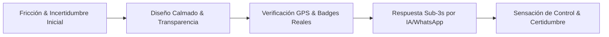

# 🎨 GUAKI — EMOTIONAL EXPERIENCE & UX BIBLE v1.0
> **MANIFIESTO ARQUITECTÓNICO DE EMOCIONES, REDUCCIÓN DE ANSIEDAD Y FIDELIZACIÓN**
> **INSPIRACIÓN GLOBAL: APPLE · STRIPE · AIRBNB · NOTION · LINEAR · GOOGLE MAPS · MERCADO LIBRE**

---

## 🎭 SECCIÓN 1: EL MAPA DE ARQUITECTURA EMOCIONAL

### 1. PRIMEROS 5 SEGUNDOS (LA IMPRESIÓN INICIAL)
- **Emoción Buscada:** **ALIVIO INMEDIATO & CLARIDAD ABSOLUTA (Apple / Notion).**
- **Sensación del Usuario:** El usuario llega estresado buscando una solución urgente. En 500ms siente: *"Al fin encuentro un lugar limpio, sin publicidad molesta, donde no me van a engañar ni a hacer perder el tiempo"*.
- **Diseño de la Emoción:** Tipografía impoluta, ausencia total de banners estridentes, interfaz calmada y enfocado 100% en la barra de búsqueda contextual.

### 2. DURANTE LA BÚSQUEDA
- **Emoción Buscada:** **CONTROL & FLUIDEZ INHERENTE (Linear / Google Maps).**
- **Sensación del Usuario:** Siente que la plataforma comprende su intención en lenguaje natural antes de que termine de escribir. Sin latencia, sin recargas bruscas.
- **Diseño de la Emoción:** Micro-animaciones táctiles de 60fps, autocompletado predictivo hiper-local y mapas con carga progresiva ultrasuave.

### 3. AL ELEGIR UNA EMPRESA
- **Emoción Buscada:** **CERTEZA Y CONFIANZA INQUEBRANTABLE (Airbnb / Mercado Libre).**
- **Sensación del Usuario:** Ver la ficha le genera paz: *"Esta empresa tiene badge de verificación física real, 4.9 estrellas en 140 reseñas auditadas y responde en menos de 2 minutos"*.
- **Diseño de la Emoción:** Fichas con Rich Badges, desglose de reputación por métricas reales (no solo opiniones) y testimonios verificados con foto y coordenadas GPS.

### 4. AL CONTRATAR (EL CLÍMAX TRANSACCIONAL)
- **Emoción Buscada:** **PODER & SIMPLICIDAD MAGISTRAL (Stripe / Apple Pay).**
- **Sensación del Usuario:** Toca un solo botón de WhatsApp o Agendar y la IA o el proveedor atienden en < 3s: *"Esto fue increíblemente rápido, ya tengo mi cita confirmada sin haber hablado por teléfono"*.
- **Diseño de la Emoción:** Flujo de 1 solo clic. Sin formularios de 10 campos. Confirmación visual con animación de ticket completado.

### 5. AL REGRESAR
- **Emoción Buscada:** **PERTENENCIA & RECONOCIMIENTO (Notion / Airbnb).**
- **Sensación del Usuario:** *"Guaki recuerda mis ubicaciones, mis empresas favoritas y mis preferencias. Es mi infraestructura de confianza"*.
- **Diseño de la Emoción:** Dashboard personal limpio con historial de servicios contratados, acceso directo en 1 clic y sugerencias relevantes de mantenimiento o revisión periódica.

### 6. LO QUE SIENTE EL PROVEEDOR (CLIENTE B)
- **Emoción Buscada:** **DIGNIDAD, CRECIMIENTO & EMPODERAMIENTO (Linear / Stripe).**
- **Sensación del Proveedor:** *"No soy un anunciante desesperado. Soy un negocio profesional reconocido por mi esfuerzo. Guaki me envía clientes calificados sin tener que suplicar o regalar mi trabajo"*.
- **Diseño de la Emoción:** Panel de control de alto nivel estético (Linear Dark Mode), gráficas claras de conversión y recomendaciones precisas que lo guían paso a paso para escalar.

---

## 🛡️ SECCIÓN 2: LOS INGENIEROS DE LA CONFIANZA

### 1. CÓMO GENERAR CONFIANZA INMEDIATA
- **Insignias de Verificación Física:** No basta con verificar un correo. Guaki muestra el pin GPS real verificado presencialmente.
- **Métricas Operativas Transparentes:** Se muestra el tiempo medio real de respuesta (*"Responde en 2 min"*) y la tasa de resolución.
- **Sin Publicidad Engañosa:** Las empresas no pueden pagar para ocultar malas reseñas o comprar badges de certificación.

### 2. CÓMO REDUCIR LA ANSIEDAD
- **Garantía de SLA:** El usuario ve exactamente qué ocurre si el proveedor no atiende a tiempo.
- **Sin Sorpresas de Precio:** Catálogo con precios y rangos claros antes de iniciar el contacto.
- **Privacidad Protegida:** El número del cliente se protege mediante enlaces de WhatsApp cifrados.

### 3. CÓMO ELIMINAR LA FRICCIÓN
- **Cero Registros Obligatorios para Buscar:** El usuario puede buscar, comparar y contactar sin crear cuenta previa.
- **Agendamiento en 1 Clic:** Integración nativa con WhatsApp y calendarios.

---

## 📈 SECCIÓN 3: MOTORES DE CONVERSIÓN, PERMANENCIA Y RECOMENDACIÓN

| Dimensión UX | Estrategia de Diseño Emocional | Inspiración | KPI de Impacto |
| :--- | :--- | :--- | :--- |
| **Aumentar Conversión** | Botón de contacto omnipresente con respuesta garantizada en < 3s. | **Stripe / Apple** | Tasa de conversión > 18% |
| **Aumentar Permanencia** | Interfaz limpia, velocidad de carga < 800ms, micro-interacciones placenteras. | **Linear / Notion** | Tiempo en sitio > 3 min |
| **Aumentar Recomendación** | Flujo pos-atención fluido: *"Recomienda esta empresa a un amigo en WhatsApp en 1 clic"*. | **Airbnb / Mercado Libre** | NPS > 75 |

---

> **DOCUMENTO MAESTRO DE EXPERIENCIA EMOCIONAL GUAKI v1.0 REGISTRADO EN EL ECOSISTEMA.**
