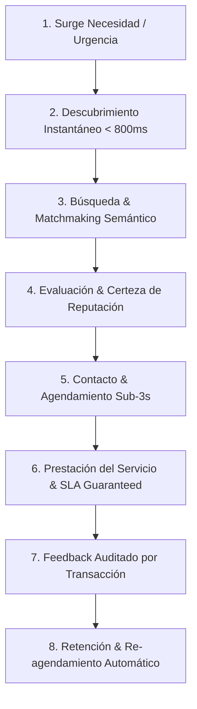

# 🗺️ GUAKI — END-TO-END USER JOURNEY & FRICTIONLESS BIBLE v1.0
> **EL MAPA COMPLETO DEL VIAJE DEL CONSUMIDOR DESDE LA NECESIDAD INICIAL HASTA LA RECOMENDACIÓN RECURRENTE Y FIDELIZACIÓN**

---

## 🗺️ 1. EL BLUEPRINT COMPLETO DEL VIAJE (8 FASES FLUIDAS)

---

## 🔍 2. DESGLOSE DETALLADO DE FRICCIONES, MIEDOS Y RESOLUCIÓN

| Fase del Viaje | Miedos & Objeciones del Usuario | Solución Arquitectónica Guaki | Emoción Resultante | Velocidad |
| :--- | :--- | :--- | :--- | :--- |
| **1. Descubrimiento** | *"¿Perderé tiempo navegando en sitios lentos o falsos?"* | Carga Edge SSR en < 800ms, cero publicidad invasiva. | **Alivio Instantáneo** | < 800ms |
| **2. Búsqueda** | *"¿No sé la palabra técnica del servicio que necesito?"* | Buscador NLP que entiende sintomatología en lenguaje natural. | **Control Total** | < 300ms |
| **3. Selección** | *"¿Será una estafa? ¿Tendrán fotos robadas?"* | Badges de Verificación Presencial GPS + Reseñas Auditadas. | **Certeza & Paz** | Instantáneo |
| **4. Contacto** | *"¿Me irán a hacer esperar horas por WhatsApp?"* | Métrica de SLA visible (*"Responde en < 2 min"*) + Guaki Assistant IA 24/7. | **Poder & Rapidez** | < 3s |
| **5. Cita / Pago** | *"¿Cobrarán más de lo acordado?"* | Catálogo con precios transparentes y garantía de tarifa. | **Seguridad Financiera** | 1 Clic |
| **6. Servicio** | *"¿Cumplirán con el horario?"* | Recordatorio coordinado por WhatsApp y botón de soporte. | **Confianza Plena** | Real-time |
| **7. Reseña** | *"¿Nadie leerá mi opinión?"* | Sistema de valoraciones auditadas que altera el Guaki Score. | **Reconocimiento** | < 1 min |
| **8. Retención** | *"¿Tendré que buscar todo de nuevo la próxima vez?"* | Historial de preferencias guardado y alertas preventivas. | **Pertenencia** | Proactivo |

---

## 🚫 3. PRINCIPIO DE NAVEGACIÓN "NUNCA PERDIDO" (ZERO DEAD-ENDS)

- **Cero Páginas sin Resultados:** Si una búsqueda no devuelve proveedores exactos en un barrio, el sistema sugiere automáticamente negocios verificados en distritos adyacentes a menos de 5 minutos y notifica a **Hermes OS** para activar la prospección.
- **Navegación Asistida por Atlas AI Core:** Banner flotante no invasivo que permite pedir ayuda conversacional en cualquier punto de la navegación.

---

> **MANIFIESTO MAESTRO DEL VIAJE COMPLETO DEL CONSUMIDOR GUAKI v1.0 APROBADO.**
