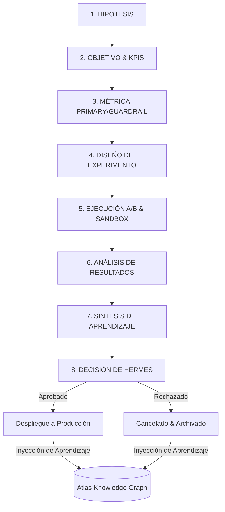

# 🧪 GUAKI — EXPERIMENTATION LAB & HYPOTHESIS ENGINE BIBLE v1.0
> **LABORATORIO DE EXPERIMENTACIÓN CIENTÍFICA CULTURA TIPO AMAZON / BOOKING.COM**
> **NINGUNA IMPLEMENTACIÓN SIN EVIDENCIA EMPÍRICA. TODO CAMBIO COMIENZA COMO HIPÓTESIS, SE PRUEBA EN SANDBOX, ATLAS ALMACENA Y HERMES DECIDE.**

---

## 🏛️ PARTE I — FILOSOFÍA: NUNCA ASUMIR, SIEMPRE EXPERIMENTAR

En Guaki, las opiniones, la intuición y el "me parece que" están estrictamente prohibidos para tomar decisiones de producto, marketing, ventas o infraestructura. **Toda modificación al ecosistema es una hipótesis científica hasta que los datos demuestren lo contrario.**

Guaki opera un **Laboratorio de Experimentación Permanente (Guaki Experimentation Engine)** inspirado en las culturas de alta velocidad de experimentación de Amazon, Booking.com y Netflix, pero orquestado al 100% por Inteligencia Artificial:

1. **Sin Evidencia Empírica, No Hay Producción:** Ninguna funcionalidad, prompt, campaña o cambio de UI se despliega masivamente sin haber pasado por un Experimento A/B o Sandbox verificado.
2. **Falla Rápido, Falla Barato, Aprende Siempre:** Un experimento fallido no es una pérdida de tiempo: es un activo cognitivo que se inyecta en la Biblioteca de Experimentos de Atlas para evitar cometer el mismo error dos veces.
3. **Hermes Decide, Atlas Registra:** `Hermes OS` evalúa la significancia estadística y decide la graduación a producción o la cancelación del experimento. `Atlas AI` absorbe los resultados para calibrar sus modelos predictivos.

---

## 🔄 PARTE II — EL PROCESO CIENTÍFICO EN 8 PASOS



---

### PASO 1: HIPÓTESIS (Hypothesis Formulation)
- **Definición:** Declaración clara y falsable que establece una relación de causa-efecto esperada.
- **Estructura Obligatoria:**
  > *"Si [Cambio Específico], entonces [Efecto Esperado], porque [Razón/Insight de Atlas]."*
- **Ejemplo:** *"Si sustituimos el formulario de registro de 5 pasos por un onboarding conversacional de WhatsApp (Cambio), aumentará la Tasa de Activación del 50% al 70% (Efecto), porque los proveedores en LATAM tienen mayor familiaridad con interfaces de mensajería (Insight)."*

### PASO 2: OBJETIVO (Goal Alignment)
- **Definición:** Definir a qué pilar estratégico de Guaki contribuye el experimento (Growth, Monetización, Retención, SEO, Eficiencia Operativa).
- **Criterio de Inclusión:** El experimento debe mover directamente una métrica North Star definida en las Biblias Maestras.

### PASO 3: MÉTRICA (Primary Metric & Guardrail Metrics)
- **Métrica Primaria:** El indicador clave que determinará el éxito (ej. Tasa de Conversión Search-to-Contact).
- **Métricas Guardrail (De Control):** Indicadores que **NO** deben degradarse durante el experimento (ej. Latencia de carga, CSAT, Fraud Rate).
- **Regla Estricta:** Si la métrica primaria mejora un 30%, pero la métrica guardrail se degrada un 5%, el experimento se declara **FALLIDO**.

### PASO 4: EXPERIMENTO (Experiment Design)
- **Diseño Técnico:** Definición del tamaño de muestra, asignación de tráfico (ej. 50% Control vs 50% Tratamiento), duración del test y nivel de confianza estadística deseado ($\alpha = 0.05$, Potencia $\beta = 0.80$).
- **Aislamiento:** Segmentación por cohortes, ciudad o tipo de usuario para evitar contaminación de datos.

### PASO 5: EJECUCIÓN (A/B Testing & Sandbox)
- **Orquestación:** `Growth Agent` / `DevOps Agent` despliegan la variante mediante Statsig/PostHog o feature flags de Vercel.
- **Monitoreo de Anomalías:** `Argus QA` monitorea en tiempo real si la variante tratamiento genera errores HTTP 500 o fallos de agente.

### PASO 6: ANÁLISIS DE RESULTADOS (Statistical Evaluation)
- **Evaluación:** `Analytics Agent` calcula el p-valor, intervalo de confianza y tamaño del efecto (Lift).
- **Criterio de Significancia:** $p < 0.05$ (Confianza estadística > 95%).

### PASO 7: APRENDIZAJE (Cognitive Synthesis)
- **Síntesis:** `Atlas AI Core` extrae la lección aprendida independientemente del resultado (ganador o perdedor) e indexa el reporte en la `Biblioteca de Experimentos`.

### PASO 8: DECISIÓN DE HERMES (Executive Decision)
- **Vedicto de Hermes OS:**
  - 🟢 **SHIP (Graduar):** Desplegar la variante tratamiento al 100% de los usuarios.
  - 🔴 **KILL (Cancelar):** Revertir la variante y registrar la causa raíz del fallo.
  - 🟡 **ITERATE (Ajustar):** Modificar parámetros y lanzar versión 2 del experimento.

---

## 🧪 PARTE III — TIPOLOGÍA Y MATRIZ DE EXPERIMENTOS EN GUAKI

---

### 01. EXPERIMENTOS DE CONVERSIÓN & UI (CRO Labs)
- **Enfoque:** Optimización del flujo de usuarios en App Brenda, Web y WhatsApp.
- **Herramientas:** PostHog A/B, Statsig, Vercel Edge Config.
- **Métrica Primaria:** Search-to-Contact Rate, Click-Through Rate (CTR).
- **Métrica Guardrail:** Time on Page, Error Rate.
- **Ejemplo:** Comparación de orden de botones de contacto (WhatsApp vs Llamada Directa).

### 02. EXPERIMENTOS DE PRICING & MONETIZACIÓN (Monetization Labs)
- **Enfoque:** Evaluación de la elasticidad de precio, duraciones de trial, packaging de planes (Start/Growth/Pro).
- **Herramientas:** Dynamic Pricing Engine, Stripe Test Cohorts.
- **Métrica Primaria:** Net Revenue Retention (NRR), Average Revenue Per User (ARPU).
- **Métrica Guardrail:** Logo Retention (Churn Rate).
- **Ejemplo:** Evaluación de cuota de instalación inicial vs cuota de suscripción mensual pura en Plan Pro.

### 03. EXPERIMENTOS DE PROMPTS Y AGENTES (AI Prompt Labs)
- **Enfoque:** Comparación de System Prompts, arquitecturas Chain-of-Thought y modelos LLM (Flash vs Pro vs Claude).
- **Herramientas:** Prompt Evaluation Framework, LangSmith / Braintrust.
- **Métrica Primaria:** Tasa de Resolución de Tarea (Task Completion), CSAT de Respuesta.
- **Métrica Guardrail:** Costo por Token, Latencia de Respuesta (<2s).
- **Ejemplo:** Comparación de respuesta de Sales Agent usando modelo Flash (barato) vs Pro (razonador).

### 04. EXPERIMENTOS DE ALGORITMO SEO & CONTENIDO (SEO/GEO Labs)
- **Enfoque:** Estructuras de contenido, densidad de Schema JSON-LD, longitud de artículos y formatos de miniaturas.
- **Herramientas:** Google Search Console API, IndexNow, Schema Validator.
- **Métrica Primaria:** CTR en SERP, Tasa de Indexación (<24h).
- **Métrica Guardrail:** Bounce Rate, Posición Promedio.
- **Ejemplo:** Evaluación de impacto en rankings al incluir FAQs en formato Accordion vs Texto Plano.

### 05. EXPERIMENTOS DE RETENCIÓN & CUSTOMER SUCCESS (CS Labs)
- **Enfoque:** Frecuencia de mensajes de seguimiento de WhatsApp, formato de informes de ROI, alertas de Health Score.
- **Herramientas:** Customer Success Engine, WhatsApp API Stream.
- **Métrica Primaria:** Health Score Recovery Rate, Tasa de Lectura de QBRs.
- **Métrica Guardrail:** Tasa de Bloqueo en WhatsApp (Opt-out).
- **Ejemplo:** Formato de informe semanal en PDF vs Resumen de Texto Directo en WhatsApp.

---

## 📋 PARTE IV — PLANTILLA ESTÁNDAR DE FICHA DE EXPERIMENTO (EXP-CARD)

```markdown
---
id: EXP-2026-089
titulo: "Test de Onboarding Conversacional en WhatsApp vs Formulario Web"
departamento: "Customer Success / Onboarding"
autor_agente: "Growth Agent"
fecha_inicio: 2026-08-01
fecha_fin: 2026-08-15
estado: "COMPLETED"
resultado_hermes: "SHIP"
---

### 1. Hipótesis
Si sustituimos el formulario web de registro de 5 pasos por un flujo de onboarding conversacional asistido por IA en WhatsApp (Tratamiento), aumentaremos la Tasa de Activación en 7 días del 50% al 70% (Efecto), porque el 85% de los proveedores en LATAM operan su negocio primordialmente desde sus teléfonos móviles (Insight de Atlas).

### 2. Métricas
- **Métrica Primaria:** Activation Rate a 7 días (% perfiles 100% completos).
- **Métricas Guardrail:** Error Rate de WhatsApp (<1%), Tasa de Abandono en paso 1 (<10%), Tiempo de Onboarding (<15 min).

### 3. Diseño del Experimento
- **Muestra:** 2,000 nuevos proveedores registrados en Bogotá y Medellín.
- **División:** 50% Control (Formulario Web) | 50% Tratamiento (WhatsApp Flow).
- **Nivel de Confianza:** 95% ($\alpha = 0.05$).

### 4. Resultados Obtenidos
- **Grupo Control (Web):** Tasa de Activación = 51.2%
- **Grupo Tratamiento (WhatsApp):** Tasa de Activación = 74.8%
- **Lift Obtenido:** +23.6% de incremento absoluto (+46.1% relativo).
- **Significancia Estadística:** $p = 0.0012$ (Estadísticamente significativo).
- **Impacto en Guardrail:** Tiempo de onboarding se redujo de 35 minutos a 8 minutos. Tasa de abandono cayó del 22% al 4%.

### 5. Aprendizaje Sintetizado por Atlas
Los proveedores de servicios en LATAM prefieren enviar fotos de sus locales y listas de precios por notas de voz o mensajes de WhatsApp en lugar de subir archivos en formularios de navegador móvil.

### 6. Decisión de Hermes OS
🟢 **SHIP (GRADUAR A PRODUCCIÓN):** Establecer WhatsApp Flow como el método predeterminado de onboarding para el 100% de los proveedores en todos los países de LATAM.
```

---

## 📊 PARTE V — GOBERNANZA DEL LABORATORIO DE EXPERIMENTACIÓN

| Rol | Agente / Entidad | Responsabilidad En El Laboratorio |
|:---|:---|:---|
| **Diseñador de Experimentos** | `Growth Agent` / `SEM Agent` | Formular la hipótesis, elegir métricas y definir la muestra. |
| **Validador de Código/QA** | `Argus QA Agent` | Asegurar que la variante no introduzca bugs ni degradación de performance. |
| **Calculador Estadístico** | `Analytics Agent` | Procesar los datos en tiempo real, calcular p-valores y determinar significancia. |
| **Archivista Cognitivo** | `Atlas AI Core` | Indexar la ficha del experimento en la `Biblioteca de Experimentos` (ADR/RAG). |
| **Juez Decisor (COO)** | `Hermes OS` | Emitir el veredicto final: SHIP, KILL o ITERATE basándose en la evidencia. |

---

> **EXPERIMENTATION LAB & HYPOTHESIS ENGINE BIBLE v1.0 — METODOLOGÍA CIENTÍFICA DE EXPERIMENTACIÓN CONTINUA DOCUMENTADA Y APROBADA.**
