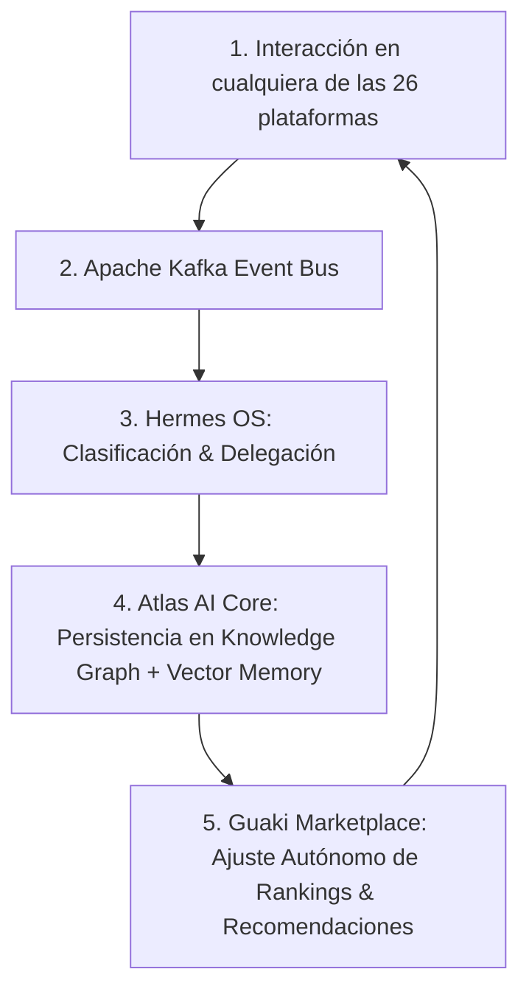

# 🌐 GUAKI — GLOBAL ECOSYSTEM INTEGRATION BIBLE v2.0
> **TOPOLOGÍA COMPLETA DE INTERCONEXIÓN, FLUJO DE EVENTOS Y ENRIQUECIMIENTO COGNITIVO ENTRE 26 PLATAFORMAS Y SERVICIOS CLAVE**
> **VERSIÓN EXPANDIDA: DOCUMENTACIÓN INDIVIDUAL DE CADA COMPONENTE**

---

## 🌐 1. EL GRAFO MAESTRO DE INTEGRACIÓN DEL ECOSISTEMA

```mermaid
flowchart TD
    subgraph CORE: Motores Internos del Ecosistema
        Hermes[👑 Hermes OS: Director COO] <--> Atlas[🧠 Atlas AI Core: Memoria & Grafo]
        Guaki[🛍️ Guaki Marketplace] <--> Atlas
        AIStudio[🏢 AI Studio Enterprise] <--> Hermes
        Lanza[🚀 LANZA Engine] <--> Hermes
        Brenda[📱 Brenda App Mobile] <--> Guaki
    end

    subgraph COMM: Comunicación & Redes Sociales
        Guaki <--> WA[WhatsApp Business Cloud API]
        Guaki <--> IG[Instagram Graph API]
        Guaki <--> TK[TikTok For Business API]
        Guaki <--> LI[LinkedIn Marketing API]
        Guaki <--> MetaAds[Meta Ads Manager API]
    end

    subgraph GEO: Geolocalización & Mapas
        Guaki <--> GMaps[Google Maps Platform]
        Guaki <--> OSM[OpenStreetMap Nominatim]
        Guaki <--> GBP[Google Business Profile API]
    end

    subgraph PAY: Procesamiento de Pagos
        Guaki <--> Stripe[Stripe Connect]
        Guaki <--> MP[Mercado Pago API]
        Guaki <--> Wompi[Wompi Gateway]
        Guaki <--> PayU[PayU Latam API]
    end

    subgraph INFRA: Infraestructura & Data
        Guaki <--> Vercel[Vercel Edge SSR]
        Guaki <--> CF[Cloudflare WAF & CDN]
        Guaki <--> Supa[Supabase Postgres & Auth]
        Guaki <--> FB[Firebase Cloud Messaging]
    end

    subgraph AUTO: Automatización & Mensajería
        Guaki <--> N8N[N8N Workflow Engine]
        Guaki <--> Resend[Resend Transactional Email]
        Guaki <--> Twilio[Twilio SMS & Voice]
    end

    WA & IG & TK & LI & MetaAds -->|Ingestión de Eventos| Atlas
    GMaps & OSM & GBP -->|Ingestión Geoespacial| Atlas
    Stripe & MP & Wompi & PayU -->|Ingestión Financiera| Atlas
    N8N & Resend & Twilio -->|Ingestión de Engagement| Atlas
```

---

## 🔌 2. ESPECIFICACIÓN INDIVIDUAL DE LAS 26 INTEGRACIONES

---

### 🏛️ BLOQUE A: MOTORES INTERNOS DEL ECOSISTEMA (5 PLATAFORMAS)

#### A1. ATLAS AI CORE ↔ GUAKI MARKETPLACE
- **Datos Intercambiados:** Guaki envía telemetría de búsquedas, clics, conversiones y reseñas. Atlas devuelve Guaki Score, recomendaciones prescriptivas y rankings actualizados.
- **Eventos Generados:** `SearchExecuted`, `VendorProfileViewed`, `GuakiScoreRecalculated`.
- **Conocimiento que Aprende Atlas:** Intenciones de búsqueda emergentes, patrones de conversión por barrio, temporalidad de la demanda.

#### A2. HERMES OS ↔ ATLAS AI CORE
- **Datos Intercambiados:** Hermes consulta a Atlas las prioridades operativas del día. Atlas informa sobre agentes con SLA degradado, leads sin atender y oportunidades de mercado.
- **Eventos Generados:** `TaskDelegated`, `SquadReconfigured`, `AgentPausedByHermes`.
- **Conocimiento que Aprende Atlas:** Eficiencia operativa de cada agente, costo computacional por tarea, patrones de carga horaria.

#### A3. AI STUDIO ENTERPRISE ↔ HERMES OS
- **Datos Intercambiados:** AI Studio envía diagnósticos Audit MRI™ de clientes B2B. Hermes distribuye las tareas de transformación a los sub-agentes (Mapache, Kronos, Hephaestus).
- **Eventos Generados:** `AuditCompleted`, `ProposalSent`, `TransformationCycleFinished`.
- **Conocimiento que Aprende Atlas:** Qué industrias tienen mayor tasa de conversión en consultoría, qué propuestas de precio generan mayor cierre.

#### A4. LANZA ENGINE ↔ HERMES OS
- **Datos Intercambiados:** Plantillas JSON de despliegue web, configuraciones de dominio, assets estáticos compilados.
- **Eventos Generados:** `SiteDeployed`, `TemplateCompiled`, `DomainDNSVerified`.
- **Conocimiento que Aprende Atlas:** Layouts web con mayor tasa de conversión por industria, rendimiento de Core Web Vitals por tipo de plantilla.

#### A5. BRENDA APP MOBILE ↔ GUAKI MARKETPLACE
- **Datos Intercambiados:** GPS en vivo del dispositivo, interacciones touch, notificaciones push recibidas/abiertas.
- **Eventos Generados:** `MobileAppOpened`, `PushClicked`, `LocationShared`.
- **Conocimiento que Aprende Atlas:** Hábitos de uso móvil (horarios, duración de sesión), geolocalización en movimiento para recomendaciones en tránsito.

---

### 📱 BLOQUE B: COMUNICACIÓN & REDES SOCIALES (5 PLATAFORMAS)

#### B1. WHATSAPP BUSINESS CLOUD API
- **Datos Intercambiados:** Mensajes entrantes de clientes, plantillas de mensaje de confirmación de cita, encuestas de satisfacción automatizadas post-servicio.
- **Eventos Generados:** `MessageReceived`, `AppointmentConfirmed`, `SurveyCompleted`, `SLATimerStarted`.
- **Conocimiento que Aprende Atlas:** SLA de respuesta real por empresa (milisegundos), lenguaje coloquial local usado por el consumidor, tasa de resolución por asistente IA vs. humano.

#### B2. INSTAGRAM GRAPH API
- **Datos Intercambiados:** Fotos y reels del comercio para importación automática al perfil Guaki, conteo de seguidores y engagement rate.
- **Eventos Generados:** `InstagramMediaSynced`, `FollowerCountUpdated`.
- **Conocimiento que Aprende Atlas:** Correlación entre presencia visual en Instagram y tasa de conversión en Guaki. Negocios con contenido visual activo convierten 2.8x más.

#### B3. TIKTOK FOR BUSINESS API
- **Datos Intercambiados:** Video tours del negocio para embedding en el perfil Guaki, métricas de visualizaciones.
- **Eventos Generados:** `TikTokVideoImported`, `VideoViewsUpdated`.
- **Conocimiento que Aprende Atlas:** Qué formatos de video corto generan mayor engagement por categoría de servicio.

#### B4. LINKEDIN MARKETING API
- **Datos Intercambiados:** Perfil profesional del dueño/fundador, certificaciones publicadas, red de conexiones empresariales.
- **Eventos Generados:** `LinkedInProfileLinked`, `CertificationVerified`.
- **Conocimiento que Aprende Atlas:** Nivel de profesionalización del dueño como señal de confianza para el consumidor B2B.

#### B5. META ADS MANAGER API
- **Datos Intercambiados:** Datos de píxel de conversión para atribución de campañas, audiencias lookalike basadas en el perfil de conversor exitoso de Guaki.
- **Eventos Generados:** `ConversionPixelFired`, `AudienceSynced`.
- **Conocimiento que Aprende Atlas:** ROI real por canal publicitario por ciudad y categoría.

---

### 🗺️ BLOQUE C: GEOLOCALIZACIÓN & MAPAS (3 PLATAFORMAS)

#### C1. GOOGLE MAPS PLATFORM
- **Datos Intercambiados:** Coordenadas lat/lon, cálculo de distancias y tiempos de desplazamiento en vivo, renders de mapa para embeber en perfiles.
- **Eventos Generados:** `DistanceCalculated`, `MapRendered`, `DirectionsRequested`.
- **Conocimiento que Aprende Atlas:** Radios de servicio reales por industria (un plomero cubre 5km, un abogado cubre toda la ciudad).

#### C2. OPENSTREETMAP (NOMINATIM)
- **Datos Intercambiados:** Geocodificación inversa (coordenadas ➔ dirección textual), datos de límites administrativos de barrios y distritos.
- **Eventos Generados:** `AddressResolved`, `NeighborhoodIdentified`.
- **Conocimiento que Aprende Atlas:** Topografía hiperlocal de polígonos de cobertura comercial sin depender exclusivamente de Google.

#### C3. GOOGLE BUSINESS PROFILE API
- **Datos Intercambiados:** Reseñas públicas históricas, fotos de portada/interior, horarios de operación publicados por el dueño.
- **Eventos Generados:** `GooglePlaceSynced`, `GoogleRatingFetched`, `HoursImported`.
- **Conocimiento que Aprende Atlas:** Discrepancias entre la información pública de Google y la verificación presencial de Guaki (señal de fraude si hay conflicto).

---

### 💳 BLOQUE D: PROCESAMIENTO DE PAGOS (4 PLATAFORMAS)

#### D1. STRIPE CONNECT
- **Datos Intercambiados:** Tokens de tarjeta, intentos de pago, confirmaciones de cobro, dispersiones a cuentas bancarias de proveedores.
- **Eventos Generados:** `PaymentIntentCreated`, `PaymentSucceeded`, `PayoutDisbursed`, `ChargebackDetected`.
- **Conocimiento que Aprende Atlas:** Elasticidad precio-conversión por sector y ciudad. Tasas de contracargo como señal de riesgo operativo.

#### D2. MERCADO PAGO API
- **Datos Intercambiados:** Pagos con QR code en punto de venta, transferencias PSE (Colombia), boletos (Brasil).
- **Eventos Generados:** `QRPaymentScanned`, `PSETransferCompleted`.
- **Conocimiento que Aprende Atlas:** Preferencia de método de pago por país (PSE en Colombia, Pix en Brasil, OXXO en México).

#### D3. WOMPI GATEWAY (COLOMBIA)
- **Datos Intercambiados:** Tokens de pago PSE, Nequi y Daviplata para depósitos de reserva de citas.
- **Eventos Generados:** `NequiPaymentReceived`, `DepositConfirmed`.
- **Conocimiento que Aprende Atlas:** Tasa de aprobación por billetera digital colombiana y segmento socioeconómico.

#### D4. PAYU LATAM API
- **Datos Intercambiados:** Procesamiento de tarjetas de crédito/débito en 7 países LATAM simultáneamente.
- **Eventos Generados:** `MultiCountryPaymentProcessed`, `FraudScreenPassed`.
- **Conocimiento que Aprende Atlas:** Tasa de aprobación bancaria por BIN de tarjeta y país emisor.

---

### ⚙️ BLOQUE E: INFRAESTRUCTURA & DATA (4 PLATAFORMAS)

#### E1. VERCEL EDGE SSR
- **Datos Intercambiados:** Compilación SSR de landing pages programáticas, headers de caché, tiempos de First Byte (TTFB).
- **Eventos Generados:** `EdgePageServed`, `ISRRevalidated`, `BuildCompleted`.
- **Conocimiento que Aprende Atlas:** Tiempos LCP por tipo de página y región geográfica del visitante.

#### E2. CLOUDFLARE WAF & CDN
- **Datos Intercambiados:** Reglas de firewall, bloqueo de bots/DDoS, certificados SSL/TLS, métricas de ancho de banda.
- **Eventos Generados:** `BotBlocked`, `DDoSMitigated`, `SSLCertRenewed`.
- **Conocimiento que Aprende Atlas:** Vectores de ataque recurrentes y fingerprints de scrapers no autorizados.

#### E3. SUPABASE (POSTGRES + AUTH + STORAGE)
- **Datos Intercambiados:** Tablas relacionales de usuarios/empresas/servicios, autenticación OAuth2, almacenamiento de fotos y documentos.
- **Eventos Generados:** `UserRegistered`, `RowInserted`, `FileUploaded`.
- **Conocimiento que Aprende Atlas:** Patrones de onboarding exitoso (qué datos completan primero los proveedores de alto rendimiento).

#### E4. FIREBASE CLOUD MESSAGING (FCM)
- **Datos Intercambiados:** Tokens de dispositivo, payloads de notificación push, métricas de entregabilidad.
- **Eventos Generados:** `PushSent`, `PushOpened`, `PushDismissed`.
- **Conocimiento que Aprende Atlas:** Horarios óptimos de envío de push por ciudad y segmento de usuario.

---

### 🤖 BLOQUE F: AUTOMATIZACIÓN & MENSAJERÍA (3 PLATAFORMAS)

#### F1. N8N WORKFLOW ENGINE
- **Datos Intercambiados:** Triggers de webhooks, flujos condicionales de automatización, conexiones entre Guaki y servicios externos.
- **Eventos Generados:** `WorkflowTriggered`, `ConditionalBranchExecuted`, `ErrorRetried`.
- **Conocimiento que Aprende Atlas:** Qué flujos de automatización generan mayor tasa de cierre comercial.

#### F2. RESEND (TRANSACTIONAL EMAIL)
- **Datos Intercambiados:** Emails de confirmación de cita, facturas electrónicas, informes semanales de Atlas.
- **Eventos Generados:** `EmailDelivered`, `EmailOpened`, `EmailBounced`.
- **Conocimiento que Aprende Atlas:** Tasa de apertura de emails por tipo de contenido y hora de envío.

#### F3. TWILIO (SMS & VOICE)
- **Datos Intercambiados:** SMS de verificación de teléfono, alertas urgentes de SLA, llamadas de verificación de existencia.
- **Eventos Generados:** `SMSSent`, `PhoneVerified`, `VoiceCallCompleted`.
- **Conocimiento que Aprende Atlas:** Tasa de entregabilidad de SMS por operador móvil y país.

---

## 🔄 3. BUCLE DE RECIRCULACIÓN COGNITIVA GLOBAL

1. **Captura en el Borde:** Cualquier interacción en las 26 plataformas dispara un evento hacia Apache Kafka.
2. **Razonamiento por Hermes OS:** Hermes clasifica la urgencia y delega la tarea al sub-agente especializado.
3. **Persistencia en Atlas AI Core:** El resultado enriquece el Knowledge Graph y la Vector Memory (1536d).
4. **Optimización en Guaki:** Guaki ajusta autónomamente el ranking meritocrático y entrega recomendaciones.

---

> **MANIFIESTO MAESTRO DE INTEGRACIONES GLOBALES v2.0 DEL ECOSISTEMA GUAKI APROBADO.**
