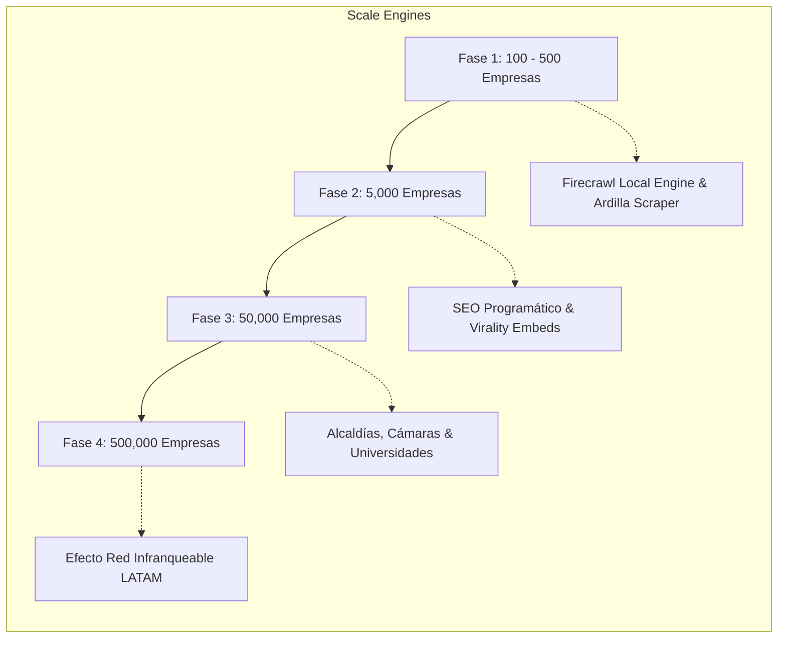
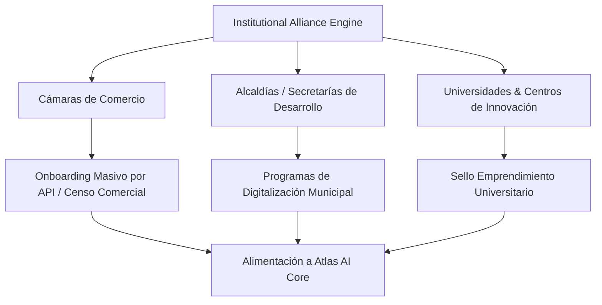

# 🚀 GUAKI — SYSTEMIC GROWTH ENGINE & FLYWHEEL BIBLE v1.0
> **EL SISTEMA DE ESCALA AUTÓNOMA, CAPTACIÓN INSTITUCIONAL Y VOLANTE DE INERCIA DE CRECIMIENTO SIN CAMPAÑAS PASAJERAS**

---

## ⚙️ 1. EL MOTOR DE ESCALA POR FASES DE ADQUISICIÓN PROVEEDOR

### 1.1 FASE 1: PRIMERAS 100 - 500 EMPRESAS (PROSPECCIÓN DE ALTA DENSIDAD)
- **Mecanismo:** Extracción geolocalizada continua vía **Firecrawl Local Engine** y **Ardilla Scraper**.
- **Acción:** Reclamación de perfiles pre-creados mediante notificación WhatsApp directa (*"Tu empresa ya tiene una ficha en Guaki.ai. Reclámala gratis en 1 clic"*).

### 1.2 FASE 2: PRIMERAS 5,000 EMPRESAS (VIRALIDAD EN EL PUNTO DE VENTA)
- **Mecanismo:** El **Sello de Calidad Guaki (QR Code & Embed Badges)**. Cada negocio verificado recibe su QR de mesa/mostrador *"Califícanos en Guaki.ai"*.
- **Efecto:** Cada cliente que escanea el QR en el establecimiento descubre la infraestructura de Guaki y se convierte en usuario activo.

### 1.3 FASE 3: PRIMERAS 50,000 EMPRESAS (ALIANZAS INSTITUCIONALES)
- **Cámaras de Comercio & Alcaldías:** Guaki se posiciona como el *Partner Tecnológico de Digitalización Gratuita* para los programas de reactivación económica municipal.
- **Universidades & Incubadoras:** Programa *"Guaki para Emprendedores Universitarios"*, otorgando distintivos de innovación y certificación inicial a nuevos proyectos.

### 1.4 FASE 4: PRIMERAS 500,000 EMPRESAS (ORGANIC DOMINANCE & NETWORK EFFECT)
- **Dominancia SEO Programático:** 5 millones de URLs indexadas en Google acaparan todas las búsquedas locales. Ningún negocio puede permitirse no estar en Guaki porque pierde el 80% de las intenciones de compra orgánicas de su ciudad.

---

## 🤝 2. MOTOR DE ALIANZAS INSTITUCIONALES & EMBAMJADORES AUTOMÁTICO

### 2.1 CÓMO CONSEGUIR MEDIOS, CÁMARAS Y GOBIERNOS SIN PAGAR PUBLICIDAD
1. **Reportes de Salud Empresarial Municipal de Atlas AI Core:** Guaki genera informes trimestrales gratuitos para las Alcaldías (*"Informe de Digitalización y Tiempo de Respuesta Comercial de Barranquilla/CDMX/Santiago"*). Los medios y gobiernos aman publicar estos datos.
2. **Backlinks de Alta Autoridad (.edu / .gov / .org):** Las alianzas institucionales para censos comerciales locales generan enlaces de entrada masivos con máxima autoridad SEO hacia Guaki.ai.

---

> **MANIFIESTO MAESTRO DEL MOTOR DE CRECIMIENTO SISTÉMICO GUAKI v1.0 APROBADO.**
