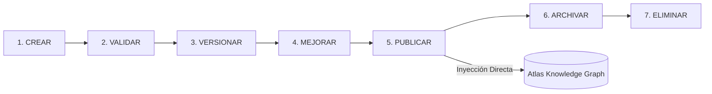

# 📚 GUAKI — KNOWLEDGE-BASED ENTERPRISE & KNOWLEDGE GRAPH BIBLE v1.0
> **ARQUITECTURA DE LA EMPRESA BASADA EN CONOCIMIENTO & CICLO DE VIDA DEL CAPITAL COGNITIVO**
> **EL CONOCIMIENTO ES EL ACTIVO MÁS VALIOSO DE GUAKI. TODO SE DOCUMENTA, TODO ES REUTILIZABLE, ATLAS NUNCA OLVIDA.**

---

## 🏛️ PARTE I — FILOSOFÍA: LA EMPRESA COMO UN SER COGNITIVO

Guaki no es una empresa que "hace cosas" y luego "las olvida". Guaki es una **Entidad Cognitiva Viva**.

Cada interacción, experimento fallido, victoria comercial, cambio de algoritmo o decisión legal no se queda en la mente de una persona ni se pierde en un chat de WhatsApp: se convierte en un **Activo Cognitivo Estructurado**, se almacena en el **Atlas Knowledge Graph**, se valida, se versiona y queda disponible para acelerar el trabajo de todos los agentes sintéticos y humanos para siempre.

### Principio 1: CERO RE-INVENCIÓN DE LA RUEDA
Si un problema se resolvió una vez en Guaki (ej. cómo posicionar "Cerrajeros en Bogotá"), la solución se convierte en un framework reutilizable que los agentes aplican en segundos para 1,000 ciudades más.

### Principio 2: APRENDIZAJE DE ERRORES (FAILURE AS ASSET)
Un error comercial o técnico documentado vale 10 veces más que un éxito no analizado. Los errores alimentan la Biblioteca de Errores para que ningún agente ni humano repita la misma falla dos veces.

### Principio 3: CONOCIMIENTO ACCIONABLE
El conocimiento que no se puede invocar mediante una API, un Prompt o un SOP de agente no es conocimiento: es distracción. Todo conocimiento debe tener interfaces de consumo claras.

---

## 🔄 PARTE II — CICLO DE VIDA DEL CONOCIMIENTO (7 ETAPAS)



---

### ETAPA 1: CREAR (Creation)
- **Definición:** Captura inicial de una idea, experimento, prompt, código, resolución de ticket o lección aprendida.
- **Actores:** Agentes IA (Knowledge Agent, Support, Research), Empleados humanos, Fundador.
- **Formato Mandatorio:** Archivo Markdown estructurado con Frontmatter YAML que incluye `id`, `autor`, `dominio`, `tags` y `version_inicial`.
- **Mecanismo:** `Knowledge Agent` sintetiza automáticamente transcripciones de llamadas, bitácoras de incidentes y chats cada 24 horas.

### ETAPA 2: VALIDAR (Validation & QA)
- **Definición:** Someter el nuevo conocimiento a pruebas empíricas y revisión de calidad antes de su uso masivo.
- **Actores:** `Argus QA Agent`, Líderes de Departamento, Atlas Consistency Checker.
- **Criterios de Aprobación:** 
  1. ¿Es técnicamente preciso y sin contradicciones con el estado actual del sistema?
  2. ¿Produce resultados repetibles?
  3. ¿Cumple con el estándar de seguridad y privacidad?
- **Resultado:** Conocimiento marcado como `status: validated` o devuelto a borrador.

### ETAPA 3: VERSIONAR (Versioning & Governance)
- **Definición:** Asignación de control de versiones semántico (`v1.0.0`, `v1.1.0`, `v2.0.0`) para rastrear la evolución histórica.
- **Regla de Modificación:** Nunca se sobreescribe conocimiento existente sin incrementar el parche o versión minor.
- **Trazabilidad:** Cada cambio requiere un registro de cambios (`CHANGELOG.md`) indicando qué se modificó y por qué.
- **Almacenamiento:** Git Repository oficial de Guaki + Atlas Vector Store Indexing.

### ETAPA 4: MEJORAR (Continuous Refinement)
- **Definición:** Optimización constante del activo basada en datos reales de rendimiento en producción.
- **Mecanismo:** Si un prompt, SOP o script es utilizado en 100 ejecuciones y su tasa de éxito es <90%, se dispara una tarea automática de refabricación.
- **Responsable:** `Atlas Manager` sugiere mejoras semánticas basándose en los resultados registrados en el Data Lake.

### ETAPA 5: PUBLICAR (Deployment & Ingestion)
- **Definición:** Inyección del activo validado en el Grafo de Conocimiento activo de Atlas y distribución a los agentes y equipos.
- **Disponibilidad:** 
  1. Ingesta semántica en Vector Store (Qdrant/pgvector) para búsqueda RAG.
  2. Indexación en documentación oficial accesible por interfaz web.
  3. Actualización de Prompts del Ejército de Agentes.

### ETAPA 6: ARCHIVAR (Deprecation & Archival)
- **Definición:** Desactivación de conocimiento que ha quedado obsoleto por cambios en la tecnología, leyes o producto, pero conservando su valor histórico.
- **Criterio:** Activo reemplazado por una versión mayor (`v2.0`) o cuya API asociada ya no existe.
- **Estado:** Marcado como `status: archived`. Ya no es invocado por los agentes en producción, pero sigue accesible para análisis histórico.

### ETAPA 7: ELIMINAR (Purge - Excepción Controlada)
- **Definición:** Borrado definitivo de datos o conocimiento que viole normativas de privacidad (GDPR/Habeas Data), contener credenciales expuestas o datos corruptos sin valor.
- **Protocolo:** Requiere aprobación explícita de `Legal Agent` + `CEO`. Queda registro en la bitácora inmutable de purgas.

---

## 🏛️ PARTE III — LAS 14 BIBLIOTECAS COGNITIVAS MAESTRAS

---

### 01. BIBLIOTECA SEO
- **Propósito:** Almacenar todo el conocimiento sobre keywords, intents de búsqueda, estructuras SERP y tácticas de indexación por país.
- **Contenido:** Matrix de Keywords por ciudad/categoría, Schemas JSON-LD aprobados, reglas de canibalización, patrones de penalización de Google.
- **Consumidores Clave:** `SEO Agent`, `Content Agent`.
- **Formato Reutilizable:** Plantillas de páginas programáticas y clusters de keywords en formato JSON/YAML.

### 02. BIBLIOTECA COMERCIAL
- **Propósito:** Registrar objeciones de clientes, scripts de cierre de alta conversión, propuestas ganadoras y perfiles de compradores (BANT).
- **Contenido:** Matriz de Objeciones y Respuestas, Diagnósticos Business MRI de referencia, Calculadoras de ROI sectoriales, Scripts de Closer.
- **Consumidores Clave:** `Sales Agent (Kronos)`, `Business Agent`, `Growth Agent`.
- **Formato Reutilizable:** Playbooks de venta interactivos y configuradores de propuestas dinámicas.

### 03. BIBLIOTECA DE INTELIGENCIA ARTIFICIAL (IA)
- **Propósito:** Documentar arquitecturas de modelos, benchmarks de precisión, estrategias de fine-tuning y evaluaciones de LLMs.
- **Contenido:** Evaluaciones de latencia vs costo por modelo, arquitecturas RAG, pesos del Grafo de Conocimiento, estrategias de caching.
- **Consumidores Clave:** `Atlas Manager`, `Hermes Orchestrator`, `DevOps Agent`.
- **Formato Reutilizable:** Benchmarks de modelos e índices de embeddings optimizados.

### 04. BIBLIOTECA LEGAL & COMPLIANCE
- **Propósito:** Mantener la normativa actualizada de protección de datos, consumo y comercio electrónico de todos los países de LATAM.
- **Contenido:** Términos y condiciones por país, cláusulas de Habeas Data, modelos de contrato B2B, jurisprudencia sobre marketplace.
- **Consumidores Clave:** `Legal Agent`, `Finance Agent`, `Verification Agent`.
- **Formato Reutilizable:** Plantillas de contrato auto-completables en formato Markdown/PDF.

### 05. BIBLIOTECA DE EXPERIENCIA DE USUARIO (UX)
- **Propósito:** Documentar patrones de diseño intuitivos, flujos de navegación sin fricción y micro-interacciones comprobadas.
- **Contenido:** Wireframes aprobados, principios de diseño móvil para App Brenda, flujos de conversión de WhatsApp, tests de usabilidad.
- **Consumidores Clave:** `Onboarding Agent`, `Support Agent`, Equipo de Producto.
- **Formato Reutilizable:** UI Design System Tokens y Componentes React/Next.js pre-construidos.

### 06. BIBLIOTECA DE DISEÑO & MARCA
- **Propósito:** Preservar la identidad visual, voz, tono y reglas estéticas de Guaki y sus productos asociados.
- **Contenido:** Enterprise Brand Identity Book, paletas HSL, guías de estilo para generadores de imágenes (Midjourney/Flux), iconos SVG.
- **Consumidores Clave:** `Image Agent`, `Video Agent`, `Content Agent`.
- **Formato Reutilizable:** Configuración de Prompts visuales y Tokens de estilos CSS/Tailwind.

### 07. BIBLIOTECA DE AUTOMATIZACIONES
- **Propósito:** Mantener el catálogo de event schemas, conectores de APIs y especificadores de procesos reactivos.
- **Contenido:** JSON Schemas de 50+ eventos en Kafka, especificadores de automatizaciones (AUT-01 a AUT-50), guías de integraciones con terceros.
- **Consumidores Clave:** `Hermes Orchestrator`, `DevOps Agent`, Integradores.
- **Formato Reutilizable:** Definiciones OpenAPI/Swagger y Event Schemas validados.

### 08. BIBLIOTECA DE PROMPTS (Prompt Engineering System)
- **Propósito:** Almacenar, versionar y evaluar todos los prompts del sistema empleados por los 23 agentes sintéticos.
- **Contenido:** System Prompts de los 23 agentes, Few-shot Examples por tarea, cadenas de razonamiento (Chain-of-Thought), prompts de guardrail.
- **Consumidores Clave:** `Todos los 23 Agentes IA`.
- **Formato Reutilizable:** Archivos `.prompt` versionados con metadata de performance (Token cost, Success rate).

### 09. BIBLIOTECA DE FRAMEWORKS OPERATIVOS
- **Propósito:** Guardar las metodologías de trabajo, SOPs paso a paso y modelos de gestión de la empresa.
- **Contenido:** Business MRI Framework, Metodología de Onboarding en 7 días, Framework de Gestión de Crisis, ICE Prioritization Framework.
- **Consumidores Clave:** CEO, `Customer Success Agent`, `Business Agent`.
- **Formato Reutilizable:** SOPs ejecutables y Checklists de operación.

### 10. BIBLIOTECA DE CASOS DE ÉXITO (Success Stories)
- **Propósito:** Documentar los resultados cuantitativos reales obtenidos por proveedores clientes usando Guaki.
- **Contenido:** Métricas antes vs después de Guaki, testimonios verificados, casos de estudio en PDF/Video, análisis de ROI por categoría.
- **Consumidores Clave:** `Sales Agent`, `Content Agent`, `Growth Agent`.
- **Formato Reutilizable:** Fichas de caso de estudio dinámicas para acompañar propuestas comerciales.

### 11. BIBLIOTECA DE ERRORES & LECCIONES (Failure Memory)
- **Propósito:** Registrar cada fallo técnico, experimento no exitoso, ticket escalado o insatisfacción de cliente para evitar su repetición.
- **Contenido:** Post-mortems de incidentes P0/P1, análisis de causas raíz (RCA), experimentos de marketing fallidos, bugs recurrentes.
- **Consumidores Clave:** `Hermes Orchestrator`, `Fraud Agent`, `Support Agent`.
- **Formato Reutilizable:** Reglas de prevención de errores y verificaciones pre-flight.

### 12. BIBLIOTECA DE DECISIONES STRATÉGICAS (ADRs - Architecture Decision Records)
- **Propósito:** Documentar la razón de ser de cada gran decisión técnica, financiera, de producto o de negocio tomada en Guaki.
- **Contenido:** Registros ADR (Título, Contexto, Opciones Evaluadas, Decisión Tomada, Consecuencias), minutas de comités ejecutivos.
- **Consumidores Clave:** CEO, Fundador, Board, Atlas AI.
- **Formato Reutilizable:** Archivos Markdown ADR en el repositorio central.

### 13. BIBLIOTECA DE EXPERIMENTOS (Growth & Product Labs)
- **Propósito:** Registrar la hipótesis, diseño, ejecución y resultados estadísticos de cada test A/B o experimento comercial realizado.
- **Contenido:** Registro de tests de conversión, pruebas de pricing, experimentos de ganchos en redes sociales, tests de funciones SaaS.
- **Consumidores Clave:** `Growth Agent`, `SEM Agent`, Equipo de Producto.
- **Formato Reutilizable:** Tarjetas de experimento con significancia estadística calculada.

### 14. BIBLIOTECA DE INTELIGENCIA SECTORIAL Y MERCADO
- **Propósito:** Consolidar el conocimiento macroeconómico, datos demográficos, densidad de negocios y hábitos de consumo por ciudad en LATAM.
- **Contenido:** Perfiles comerciales de 100+ ciudades de LATAM, precios promedio de servicios por barrio, mapas de penetración digital.
- **Consumidores Clave:** `Research Agent`, `SEO Agent`, `Expansion Team`.
- **Formato Reutilizable:** Datasets de mercado listos para consultas de Atlas.

---

## 📊 PARTE IV — ESTRUCTURA DE ALMACENAMIENTO Y ACCESO

```
C:/Users/Administrator/.gemini/antigravity/scratch/AI_STUDIO_ECOSYSTEM/02_GUAKI_MARKETPLACE/knowledge_base/
├── 01_SEO_LIBRARY/
├── 02_COMMERCIAL_LIBRARY/
├── 03_AI_LIBRARY/
├── 04_LEGAL_LIBRARY/
├── 05_UX_LIBRARY/
├── 06_DESIGN_LIBRARY/
├── 07_AUTOMATIONS_LIBRARY/
├── 08_PROMPTS_LIBRARY/
├── 09_FRAMEWORKS_LIBRARY/
├── 10_CASES_LIBRARY/
├── 11_ERRORS_LIBRARY/
├── 12_DECISIONS_ADR_LIBRARY/
├── 13_EXPERIMENTS_LIBRARY/
└── 14_MARKET_INTELLIGENCE_LIBRARY/
```

### Ingesta y Consumo por Atlas AI Core:
- **Vector Storage:** Todos los archivos de las 14 bibliotecas se convierten automáticamente en embeddings vectoriales mediante el modelo `text-embedding-3-large`.
- **Graph Storage:** Las entidades (Negocios, Ciudades, Servicios, Prompts, Leyes, Errores) se conectan mediante relaciones explícitas en el **Atlas Knowledge Graph**.
- **RAG Latency:** Cualquier agente puede consultar la totalidad del conocimiento de Guaki mediante RAG (Retrieval-Augmented Generation) en <150 milisegundos.

---

> **KNOWLEDGE-BASED ENTERPRISE BIBLE v1.0 — EL CAPITAL COGNITIVO DE GUAKI ESTRUCTURADO EN 14 BIBLIOTECAS Y 7 ETAPAS DE CICLO DE VIDA. APROBADO.**
