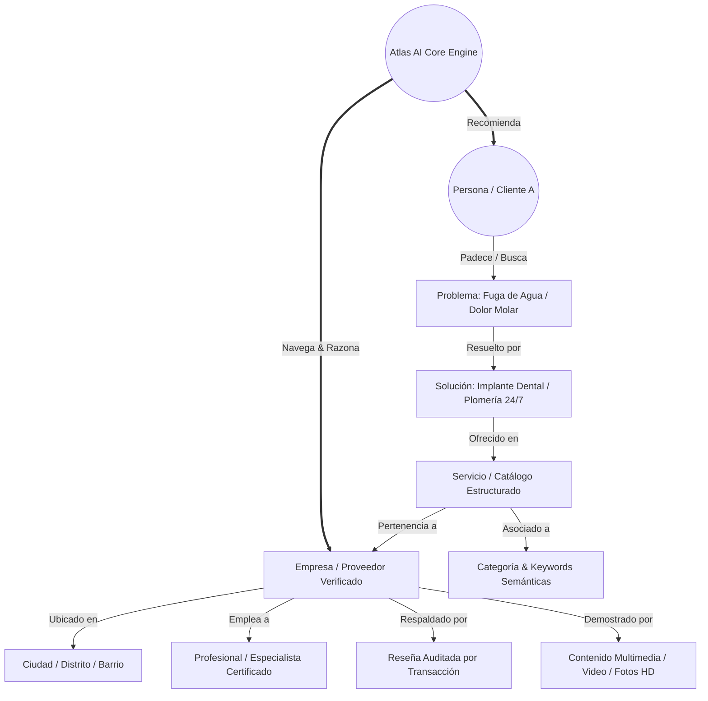

# 🕸️ GUAKI — ENTERPRISE KNOWLEDGE GRAPH BIBLE v1.0
> **ESPECIFICACIÓN MAESTRA DEL GRAFO DE ENTIDADES, RELACIONES SEMÁNTICAS E INTELIGENCIA CONTEXTUAL DE ATLAS AI CORE**

---

## 🌐 1. EL MANIFIESTO DEL GRAFO: DE BASE DE DATOS A MOTOR DE CONOCIMIENTO

Guaki no estructura su información en tablas relacionales rígidas o aisladas. **Guaki opera como un Grafo de Conocimiento Empresarial Vivo (Enterprise Knowledge Graph)** donde cada nodo (Empresa, Persona, Servicio, Ciudad, Problema, Solución, Reseña, Keyword, Video) representa una entidad interconectada vectorialmente.



---

## 🔲 2. NODOS DE ENTIDAD (ENTITIES) DE GUAKI KNOWLEDGE GRAPH

### 2.1 ENTIDADES PRIMARIAS
1. **`Entity:Company` (Empresa):** Entidad central con coordenadas GPS, reputación, SLA y Guaki Score.
2. **`Entity:Person` (Consumidor / Cliente A):** Perfil con historial de necesidades, ubicaciones recurrentes y nivel de urgencia.
3. **`Entity:Professional` (Especialista):** Odontólogo, Abogado, Mecánico o Terapeuta certificado adscrito a una empresa.
4. **`Entity:Service` (Servicio/Producto):** Unidad de oferta estructurada con precio transparente, duración y modalidad.
5. **`Entity:GeoLocation` (Geografía):** País ➔ Ciudad ➔ Distrito ➔ Barrio ➔ Coordenada exacta.

### 2.2 ENTIDADES CONTEXTUALES Y DE IA
6. **`Entity:Problem` (Problema / Necesidad Sintomática):** Dolor puntual del cliente (ej. *"diente roto"*, *"frena raro el auto"*, *"contrato borrador"*).
7. **`Entity:Solution` (Solución Táctica):** Respuesta resolutiva empaquetada.
8. **`Entity:Keyword` (Vector Semántico):** Términos e intenciones de búsqueda en lenguaje natural y voz.
9. **`Entity:Review` (Reseña Auditada):** Evaluación vinculada a una transacción confirmada.
10. **`Entity:Media` (Evidencia Multimedia):** Fotos HD de instalaciones, certificado de habilitación, video tours.

---

## 🔗 3. MATRIZ DE RELACIONES SEMÁNTICAS (EDGES & TRIPLETS)

Atlas AI Core razona a través de tripletas de conocimiento `(Sujeto, Relación, Objeto)`:

```text
(Empresa: San Martín) ──[LOCATED_IN]──> (Barrio: Alto Prado)
(Empresa: San Martín) ──[PROVIDES_SERVICE]──> (Servicio: Implante Dental)
(Servicio: Implante Dental) ──[SOLVES_PROBLEM]──> (Problema: Pérdida Dientes)
(Problema: Pérdida Dientes) ──[SEARCHED_BY]──> (Cliente A: Usuario)
(Cliente A: Usuario) ──[GENERATES_TRANSACTION]──> (Empresa: San Martín)
(Empresa: San Martín) ──[HAS_SLA_SPEED]──> (SLA: 2 Minutos)
(Atlas AI Core) ──[VALIDATES_TRUST]──> (Empresa: San Martín)
```

---

## 🤖 4. COMPATIBILIDAD CON AGENTES IA, BUSCADORES SEMÁNTICOS Y APIS FUTURAS

### 4.1 INTEGRACIÓN CON EMBEDDINGS VECTORIALES (ATLAS VECTOR SEARCH)
- Cada nodo del Grafo se traduce a un **Vector de Alta Dimensión (1536d)**.
- Cuando un usuario busca por voz o texto: *"Busco alguien de confianza para arreglar un techo que gotea en Usaquén hoy mismo"*, Atlas realiza una búsqueda de similitud coseno vectorial instantánea en < 50ms relacionando `Problema ➔ Solución ➔ Barrio ➔ SLA Sub-3s`.

### 4.2 COMPATIBILIDAD CON GOOGLE KNOWLEDGE GRAPH & RICH SNIPPETS
- El Grafo de Guaki exporta automáticamente datos estructurados **JSON-LD con propiedad `@graph`**, permitiendo que Google, Bing y sistemas de IA conversacional (ChatGPT, Gemini, Perplexity) consuman la jerarquía semántica de Guaki como la fuente autorizada de empresas en Latinoamérica.

---

> **BIBLE DEL GRAFO DE CONOCIMIENTO EMPRESARIAL DE GUAKI v1.0 REGISTRADO EN ATLAS AI CORE.**
