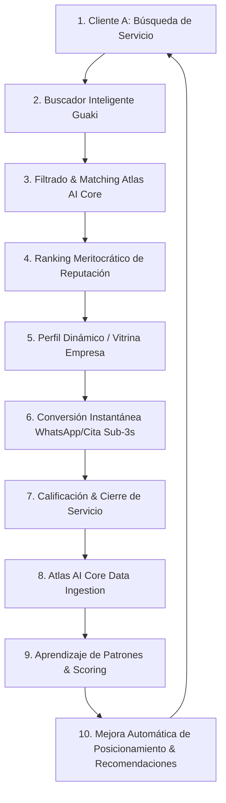
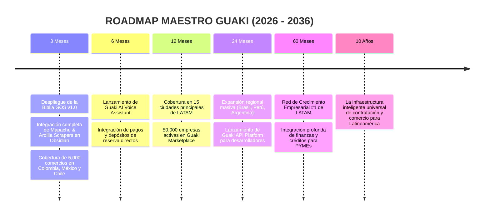

# 📜 GUAKI OPERATING SYSTEM (GOS) — CONSTITUCIÓN MAESTRA v1.0
> **DOCUMENTO MAESTRO DE GOBERNANZA, PRODUCTO, ARQUITECTURA, IA & GROWTH PARA LATINOAMÉRICA**
> **NIVEL DE DOCUMENTACIÓN: UNICORN ENTERPRISE SPECIFICATION**

---

## 🏛️ CAPÍTULO 1: ¿QUÉ ES GUAKI?

### 1.1 DEFINICIÓN PROFUNDA & IDENTIDAD
**GUAKI** es la **infraestructura digital inteligente de descubrimiento y crecimiento empresarial** diseñada para conectar a millones de consumidores con empresas confiables en Latinoamérica. Guaki no opera como un intermediario pasivo de información, sino como el motor de reputación, conversión y recomendación algorítmica que impulsa el tejido económico local y corporativo de la región.

### 1.2 QUÉ NO ES GUAKI (LÍMITES CONSTITUCIONALES)
- ❌ **No es un directorio comercial estático:** No vendemos listas ni índices telefónicos muertos.
- ❌ **No son Páginas Amarillas:** Rechazamos el modelo arcaico de pagar para figurar sin garantía de rendimiento.
- ❌ **No es un marketplace tradicional de clasificados:** No cobramos por publicar ni permitimos spam sin verificar.
- ❌ **No es un muro de anuncios pagados:** No vendemos la primera posición al mejor postor.
- ❌ **No es una guía comercial manipulada:** Las valoraciones no se compran ni se eliminan con dinero.

### 1.3 EL PROBLEMA ESTRUCTURAL QUE RESUELVE
En Latinoamérica, el 84% de las PYMEs y profesionales independientes fracasan en conseguir clientes de manera predecible debido a tres fricciones históricas:
1. **Asimetría de Información:** El cliente no sabe en qué proveedor confiar y teme estafas o mal servicio.
2. **Monopolio de Adquisición:** Las plataformas tradicionales obligan a las empresas a gastar miles de dólares en anuncios de subasta sin asegurar conversión.
3. **Opacidad de Reputación:** Las reseñas son manipulables o carecen de datos estructurados sobre tiempo de respuesta, cumplimiento de SLA y calidad real del servicio.

### 1.4 LA INDUSTRIA QUE ESTAMOS REDEFINIENDO
Guaki redefine la industria del **Local Commerce & B2B Matchmaking**. Reemplazamos la búsqueda caótica en buscadores tradicionales con una plataforma de **Crecimiento como Servicio (Growth-as-a-Service)** impulsada por Inteligencia Artificial.

### 1.5 VISIÓN A 10 AÑOS (GUAKI 2036)
En 2036, Guaki será la columna vertebral del comercio en Latinoamérica. Cualquier transacción, contratación de servicios o descubrimiento de empresas en la región se procesará o verificará a través de la infraestructura de reputación de Guaki, impulsando a más de 5 millones de empresas locales a operar con eficiencia global.

### 1.6 VENTAJA COMPETITIVA (THE UNFAIR ADVANTAGE)
- **Atlas AI Core Engine:** Algoritmo propietario que evalúa en tiempo real tiempo de respuesta sub-3s, tasa de conversión y feedback estructurado.
- **Protocolo de Reputación Inmutable:** El ranking se determina por mérito operativo y satisfacción del usuario, nunca por presupuesto publicitario.
- **Ecosistema Dual Integrado:** Conexión nativa con la suite AI Studio Enterprise para resolver la operación del negocio en 14 días.

### 1.7 POR QUÉ LA IA CAMBIA COMPLETAMENTE ESTE MERCADO
La Inteligencia Artificial elimina la búsqueda manual. Los usuarios ya no quieren navegar por 50 enlaces azules en Google; quieren una recomendación precisa, verificada y lista para agendar. Guaki utiliza la IA no solo para filtrar la información, sino para cualificar la intención de compra e iniciar la interacción automáticamente en < 3 segundos.

---

## ⚖️ CAPÍTULO 2: PRINCIPIOS DEL PRODUCTO

### 2.1 EL USUARIO SIEMPRE PRIMERO
Cada característica desarrollada debe priorizar la fricción cero para el usuario que busca un servicio. Si una función dificulta el descubrimiento rápido de una solución confiable, se elimina inmediatamente.

### 2.2 LA CONFIANZA VALE MÁS QUE EL DINERO
La reputación es la moneda sagrada de Guaki. No aceptaremos ningún modelo de ingresos que comprometa la veracidad de nuestras recomendaciones.

### 2.3 NUNCA VENDER POSICIONES FALSAS
Está estrictamente prohibido permitir que una empresa pague para subir artificialmente en el ranking orgánico. Las posiciones patrocinadas (si existieran en el futuro) deben ser claramente demarcadas y sujetas a estándares mínimos de reputación.

### 2.4 TODA EMPRESA PUEDE CRECER & MEJORAR
No descartamos negocios pequeños o tradicionales. Guaki proporciona las herramientas (menú digital, agendamiento 24/7, asistentes IA) para que cualquier emprendedor compita en igualdad de condiciones con corporaciones multinacionales.

### 2.5 TODO DEBE MEDIRSE Y BASARSE EN DATOS
No creemos en intuiciones de diseño. CTR, tasa de rebote, tiempo de respuesta de WhatsApp, conversión de citas y Net Promoter Score (NPS) dictan las decisiones del producto.

### 2.6 LA IA NUNCA REEMPLAZA LA CONFIANZA
La IA en Guaki es un amplificador de la verdad operativa, nunca una herramienta de manipulación. Las recomendaciones deben ser explicables y auditables por el usuario.

---

## 🏗️ CAPÍTULO 3: ARQUITECTURA DEL ECOSISTEMA



### 3.1 DETALLE DEL FLUJO ECOSISTÉMICO
1. **Captación de Intención:** El Cliente A ingresa su necesidad específica y ubicación.
2. **Procesamiento de Atlas AI Core:** El sistema analiza la categoría, ubicación geográfica exacta y SLA histórico del proveedor.
3. **Despliegue del Ranking:** Se devuelven los resultados ordenados por el índice de reputación meritocrático.
4. **Interacción & Conversión:** El Cliente A contacta en < 3s a la empresa con un clic directo a WhatsApp/Agendador.
5. **Cierre del Bucle:** La transacción genera datos de rendimiento que realimentan automáticamente a Atlas AI Core para ajustar el ranking futuro.

---

## 👤 CAPÍTULO 4: EXPERIENCIA DEL USUARIO (CLIENTE A)

1. **Entrada Instantánea:** Carga web en < 800ms sin ventanas emergentes molestas.
2. **Descubrimiento Inteligente:** Buscador contextual que comprende lenguaje natural (ej. *"necesito ortodoncista en Chicó que atienda los sábados"*).
3. **Comparación Transparente:** Fichas visuales claras con badge de verificación IA, reseñas autenticadas y métricas reales de tiempo de respuesta.
4. **Contacto Fricción Cero:** Botón directo para iniciar agendamiento o pedido en WhatsApp sin llenar formularios interminables.
5. **Feedback Loop:** Recordatorio automatizado posterior a la atención para calificar el cumplimiento del proveedor.

---

## 🏢 CAPÍTULO 5: EXPERIENCIA DEL PROVEEDOR (CLIENTE B)

1. **Onboarding en 3 Minutos:** Registro ágil mediante la importación automática de datos geolocalizados de Google Maps u OpenStreetMap.
2. **Verificación de Identidad:** Certificación de existencia física del comercio mediante coordenadas GPS y validación telefónica.
3. **Habilitación de Herramientas:** Activación inmediata de catálogo digital interactivo, pasarela de agendamiento y asistente IA Guaki 24/7.
4. **Panel de Control & Analytics:** Visualización clara de búsquedas, clics, conversiones recibidas y recomendaciones de Atlas para mejorar la posición.
5. **Crecimiento Guiado:** Notificaciones inteligentes sobre cómo optimizar fotos, ajustar horarios o responder más rápido para subir orgánicamente.

---

## 🌐 CAPÍTULO 6: ARQUITECTURA SEO INTERNACIONAL DE MÁXIMO VOLUMEN

### 6.1 ESTRUCTURA DE URLS PROGRAMÁTICAS
Diseñamos un sistema de URLs semánticas, cortas y fuertemente jerárquicas:
- `https://guaki.ai/co/barranquilla/odontologia/implantes-dentales`
- `https://guaki.ai/mx/cdmx/polanco/inmobiliarias/brokers-premium`
- `https://guaki.ai/cl/santiago/las-condes/spas/dermatologia-estetica`

### 6.2 GENERACIÓN PROGRAMÁTICA DE LANDING PAGES
- **Matriz Combinatoria:** [País] x [Ciudad] x [Barrio/Distrito] x [Categoría] x [Especialidad].
- **Arquitectura de Plantilla Dinámica:** Cada landing page se compila automáticamente consumiendo datos en tiempo real de Atlas AI Core, evitando contenido duplicado mediante variaciones de entidades dinámicas y testimonios locales.
- **Schema.org Rich Snippets:** Inyección automática de esquemas JSON-LD (`LocalBusiness`, `AggregateRating`, `Service`, `BreadcrumbList`) en el 100% de las páginas creadas.

---

## 🤖 CAPÍTULO 7: ARQUITECTURA IA — ATLAS AI CORE ENGINE

### 7.1 SEÑALES DE APRENDIZAJE DE ATLAS
Atlas analiza de manera continua:
- **Tasa de Clics (CTR):** Porcentaje de usuarios que eligen un perfil sobre otros en el ranking.
- **SLA de Respuesta:** Milisegundos que tarda la empresa en atender el primer mensaje de WhatsApp.
- **Tasa de Conversión Real:** Citas agendadas y confirmadas exitosamente.
- **Índice de Retención:** Porcentaje de usuarios que vuelven a contratar a la misma empresa.

### 7.2 RECOMENDACIONES AUTÓNOMAS A EMPRESAS
Si Atlas detecta que una empresa está perdiendo clientes por responder después de 15 minutos, envía una recomendación automática con la solución: *"Activa Guaki IA Asistente 24/7 para recuperar el 35% de conversiones nocturnas"*.

---

## 🚀 CAPÍTULO 8: MODELO DE CRECIMIENTO (GROWTH & FLYWHEEL)

```
[Más Proveedores Verificados en Guaki] 
       ➔ [Mayor Cobertura & Mejores Opciones Locales] 
       ➔ [Más Usuarios Buscando & Contratando] 
       ➔ [Mayor Generación de Transacciones & Datos Reales] 
       ➔ [Refuerzo del Algoritmo Atlas AI Core] 
       ➔ [Efecto Red Infranqueable]
```

### 8.1 ESTRATEGIA DE ADQUISICIÓN PROSPECTIVA
- **Mapache Scraper & Ardilla Scraper:** Extracción local continua de empresas sin herramientas digitales e inyección de valor inmediato.
- **Virality Loop por Compartición:** Cada catálogo o agendador de Guaki incluye el sello *"Impulsado por Guaki.ai — Reclamar mi Empresa gratis"*.

---

## 💰 CAPÍTULO 9: MODELO DE MONETIZACIÓN ÉTICO Y SOSTENIBLE

### 9.1 QUÉ NUNCA COBRAMOS
- ❌ No cobramos por aparecer en búsquedas orgánicas.
- ❌ No cobramos por alterar valoraciones o borrar reseñas.

### 9.2 FUENTES DE INGRESOS TRANSPARENTES
1. **Guaki Starter ($49 USD/mes):** Menú/Catálogo interactivo + Link de WhatsApp directo.
2. **Guaki Pro ($79 USD/mes):** Sistema de agendamiento 24/7 + Asistente IA conversacional sub-3s + Gestión de depósitos.
3. **Guaki Enterprise ($129 USD/mes):** Conexión completa con la suite AI Studio Enterprise (CRM, Analytics avanzado y soporte prioritario).

---

## 🗺️ CAPÍTULO 10: ROADMAP MAESTRO Y EXPANSIONAL



---

> **CONSTITUCIÓN APROBADA Y REGISTRADA OFICIALMENTE EN EL ECOSISTEMA AI STUDIO ENTERPRISE & GUAKI MARKETPLACE.**
