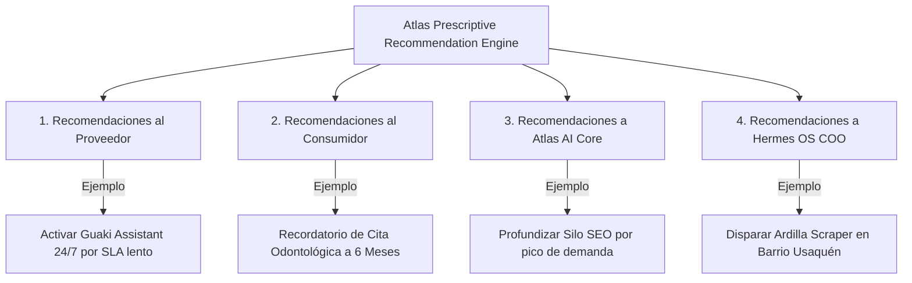

# 💡 GUAKI — PRESCRIPTIVE RECOMMENDATION ENGINE BIBLE v1.0
> **ESPECIFICACIÓN MAESTRA DEL MOTOR DE RECOMENDACIONES DE ACCIÓN TÁCTICA PARA PROVEEDORES, USUARIOS, ATLAS Y HERMES OS**
> **EVOLUCIÓN DE REGLAS LÓGICAS INTELIGENTES A MODELOS REINFORCEMENT LEARNING FROM HUMAN FEEDBACK (RLHF)**

---

## 🏛️ 1. LA ARQUITECTURA DE RECOMENDACIONES DE 4 VÍAS

El motor de recomendaciones de Guaki no se limita a sugerir "empresas similares". **Recomienda Acciones Tácticas Resolutivas** a los 4 actores del ecosistema:

---

## 💡 2. CATÁLOGO DE REGLAS PRESCRIPTIVAS ESTRUCTURADAS (RULES & ML)

### 2.1 RECOMENDACIONES AL PROVEEDOR (CLIENTE B)
1. **Regla SLA Respuesta Lento:** Si SLA > 10 min ➔ *"Tu empresa está perdiendo un 45% de conversiones. Activa Guaki IA Assistant 24/7 en 1 clic para responder en < 3s"*.
2. **Regla Calidad Visual Deficiente:** Si perfil sin fotos HD o resolución < 800px ➔ *"Perfiles con fotos profesionales convierten 3.2x más. Solicita el Kit de Producción Audiovisual Guaki"*.
3. **Regla Bajo SEO Local:** Si impresiones SEO cayeron un 20% ➔ *"Optimiza tu descripción con las 5 palabras clave emergentes de tu barrio sugeridas por Atlas"*.
4. **Regla Respuesta a Reseñas:** Si reseña < 3 estrellas sin respuesta en 24h ➔ *"Responder con empatía recupera el 40% de reputación. Usa la plantilla de respuesta sugerida por IA"*.

### 2.2 RECOMENDACIONES AL CONSUMIDOR (CLIENTE A)
1. **Regla Prevención Mantenimiento:** Si han pasado 180 días desde el último servicio vehicular/salud ➔ *"Es hora de tu revisión periódica. Agenda con tu especialista verificado en 1 clic"*.
2. **Regla Proximidad & Urgencia:** Si busca servicio nocturno ➔ *"Esta plomería verificada está a 400m de tu ubicación y atiende en este momento"*.

### 2.3 RECOMENDACIONES A ATLAS & HERMES OS
1. **Regla Desbalance de Oferta (Hermes COO):** Si búsquedas en Usaquén sin resultado > 15 MoM ➔ *"Hermes OS: Dispara a Ardilla Scraper para prospectar 20 cerrajeros en Usaquén"*.
2. **Regla Tendencia SEO (Atlas Core):** Si keyword *"estética masculina"* creció +80% ➔ *"Atlas Core: Genera programáticamente el sub-silo `/co/barranquilla/estetica-masculina`"*.

---

## 🤖 3. EVOLUCIÓN MEDIANTE MACHINE LEARNING (RLHF & MULTI-ARMED BANDIT)

El sistema evoluciona de **Reglas Lógicas Si/Entonces (If/Then Rules)** a un **Modelo de Aprendizaje por Refuerzo (Contextual Multi-Armed Bandit)**:
- Se evalúa qué recomendación genera mayor tasa de adopción y conversión real.
- Las recomendaciones con alta tasa de aceptación reciben mayor peso relacional en Atlas AI Core, auto-optimizando el motor sin intervención humana.

---

> **MANIFIESTO MAESTRO DEL MOTOR DE RECOMENDACIONES PRESCRIPTIVAS GUAKI v1.0 APROBADO.**
