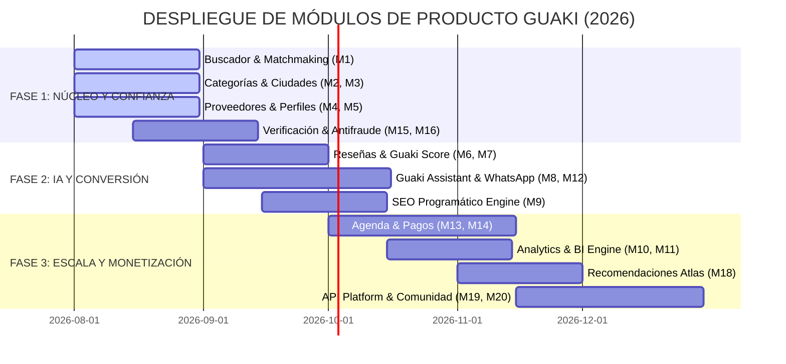

# 📘 GUAKI — PRODUCT BIBLE v1.0
> **ESPECIFICACIÓN ARQUITECTÓNICA COMPLETA DE MÓDULOS DE PRODUCTO DE GUAKI MARKETPLACE**
> **NIVEL DE DOCUMENTACIÓN: UNICORN PRODUCT SPECIFICATION**

---

## 🏗️ MATRIZ ARQUITECTÓNICA DE LOS 30 MÓDULOS DEL PRODUCTO

---

### MÓDULO 01: BUSCADOR INTELIGENTE & MATCHMAKING NATIVE
- **Objetivo:** Entender la intención exacta en lenguaje natural del consumidor y devolver emparejamientos instantáneos con proveedores calificados en < 300ms.
- **Usuarios:** Cliente A (Consumidores) / Cliente B (Proveedores).
- **Entradas:** Texto en lenguaje natural, comandos de voz, geolocalización GPS, filtros de urgencia.
- **Salidas:** Lista jerárquica de proveedores emparejados por relevancia, distancia, reputación y disponibilidad inmediata.
- **Integraciones:** Atlas AI Core, Google Maps Engine, Geolocation API.
- **KPIs:** CTR de búsqueda (> 42%), Latencia (< 300ms), Tasa de rebote de búsqueda (< 15%).
- **IA (Atlas AI Core):** NLP/LLM para desambiguación sintáctica de búsquedas ambiguas (ej. *"arreglo de fuga urgente"* ➔ Plomería 24/7).
- **Automatizaciones:** Re-consulta dinámica ante cero resultados sugiriendo áreas geográficas adyacentes.
- **Prioridad:** P0 (Crítica) | **Complejidad:** Alta (L3) | **Roadmap:** Mes 1.

---

### MÓDULO 02: SISTEMA DE CATEGORÍAS PROGRAMÁTICAS
- **Objetivo:** Estructurar de manera taxonómica y dinámica todas las industrias, sectores y nichos comerciales de Latinoamérica.
- **Usuarios:** Algoritmo SEO, Cliente A, Administradores.
- **Entradas:** Arboles taxonómicos, nuevas verticales comerciales solicitadas, queries emergentes.
- **Salidas:** Jerarquías navegables indexadas con breadcrumbs dinámicos.
- **Integraciones:** Engine SEO Programático, Atlas AI Taxonomy Classifier.
- **KPIs:** Cobertura de nichos (100%), Páginas indexadas en Google (> 500,000).
- **IA:** Auto-clasificación de nuevos negocios en subcategorías hiper-específicas mediante embeddings de texto.
- **Automatizaciones:** Creación automática de subcategorías emergentes cuando las búsquedas superan 500 impresiones mensuales.
- **Prioridad:** P0 (Crítica) | **Complejidad:** Media (L2) | **Roadmap:** Mes 1.

---

### MÓDULO 03: SISTEMA DE CIUDADES & GEOLOCALIZACIÓN HIPER-LOCAL
- **Objetivo:** Mapear distritos, barrios y polígonos de cobertura en las principales metrópolis de Latinoamérica.
- **Usuarios:** Cliente A, Cliente B, Motor de Búsqueda.
- **Entradas:** Coordenadas Lat/Lon, Geofencing KML, límites administrativos locales.
- **Salidas:** Landing pages geolocalizadas y ordenamiento por proximidad real.
- **Integraciones:** OpenStreetMap, Google Maps Platform, GeoIP Lookup.
- **KPIs:** Precisión de geolocalización (< 50m), Tiempo de carga por mapa (< 400ms).
- **IA:** Cálculo de tiempos de desplazamiento dinámicos según tráfico en vivo en la ciudad.
- **Automatizaciones:** Asignación automática del barrio del comercio según sus coordenadas GPS ingresadas.
- **Prioridad:** P0 (Crítica) | **Complejidad:** Media (L2) | **Roadmap:** Mes 1.

---

### MÓDULO 04: SISTEMA DE PROVEEDORES & ONBOARDING ÁGIL
- **Objetivo:** Registrar, validar e incorporar empresas a la plataforma en menos de 3 minutos sin fricción manual.
- **Usuarios:** Cliente B (Empresas / Proveedores).
- **Entradas:** NIT/RUT, Datos de contacto, Ubicación física, Fotos del comercio.
- **Salidas:** Cuenta de proveedor activada con catálogo base inicial habilitado.
- **Integraciones:** Registro mercantil oficial, WhatsApp Business API, Google Places.
- **KPIs:** Tiempo de onboarding (< 180s), Tasa de conversión de registro (> 65%).
- **IA:** Extracción OCR automática de datos desde certificados comerciales cargados por la empresa.
- **Automatizaciones:** Importación automática de reseñas e información existente desde Google Maps.
- **Prioridad:** P0 (Crítica) | **Complejidad:** Media (L2) | **Roadmap:** Mes 1.

---

### MÓDULO 05: SISTEMA DE PERFILES & VITRINA INTELIGENTE
- **Objetivo:** Presentar la identidad comercial, propuesta de valor y disponibilidad de la empresa con estándar Apple Native UX.
- **Usuarios:** Cliente A (Compradores), Cliente B (Proveedores).
- **Entradas:** Catálogo de productos/servicios, precios, horarios, distintivos de verificación, fotos.
- **Salidas:** Página de destino optimizada para conversión directa en móvil y web.
- **Integraciones:** Guaki IA Assistant, Stripe Checkout, WhatsApp API.
- **KPIs:** Tasa de conversión de perfil a contacto (> 18%), Tiempo de permanencia (> 2.5 min).
- **IA:** Personalización dinámica del orden del catálogo de servicios según el historial de búsqueda del visitante.
- **Automatizaciones:** Cambio de badge de estado *"Abierto Ahora / Cerrado"* sincronizado con el horario operativo.
- **Prioridad:** P0 (Crítica) | **Complejidad:** Media (L2) | **Roadmap:** Mes 1.

---

### MÓDULO 06: SISTEMA DE RESEÑAS AUDITADAS & VERIFICADAS
- **Objetivo:** Capturar valoraciones transparentes y combatir valoraciones falsas mediante confirmación de transacción.
- **Usuarios:** Cliente A (Evaluadores), Cliente B (Receptores).
- **Entradas:** Calificación en estrellas (1-5), texto, comprobantes de atención, fotos del servicio prestado.
- **Salidas:** Puntuación auditada con distintivo *"Reseña Verificada por Transacción Real"*.
- **Integraciones:** WhatsApp Webhook, Sistema Antifraude.
- **KPIs:** Porcentaje de reseñas auditadas (> 90%), Tasa de respuesta del proveedor (> 80%).
- **IA:** Análisis de sentimiento NLP para detectar ironías, lenguaje de odio o spam pagado.
- **Automatizaciones:** Envío automático de encuestas de satisfacción 2 horas después del agendamiento.
- **Prioridad:** P0 (Crítica) | **Complejidad:** Alta (L3) | **Roadmap:** Mes 2.

---

### MÓDULO 07: SISTEMA DE REPUTACIÓN MERITOCRÁTICA (GUAKI SCORE)
- **Objetivo:** Calcular el algoritmo inmutable de ordenamiento meritocrático (Guaki Score 0-100).
- **Usuarios:** Algoritmo Atlas AI Core, Proveedores.
- **Entradas:** Tasa de respuesta WhatsApp, reseñas auditadas, puntualidad en citas, antigüedad, quejas.
- **Salidas:** Guaki Score oficial y posición orgánica en el catálogo.
- **Integraciones:** Engine de Analytics, Atlas AI Core.
- **KPIs:** Retención de empresas con alto score (> 95%), Transparencia del cálculo (100%).
- **IA:** Ponderación dinámica de variables de rendimiento para prevenir manipulación del ranking.
- **Automatizaciones:** Recálculo nocturno diario del Guaki Score de todas las empresas registradas.
- **Prioridad:** P0 (Crítica) | **Complejidad:** Alta (L3) | **Roadmap:** Mes 2.

---

### MÓDULO 08: SISTEMA DE IA CONVERSACIONAL (GUAKI ASSISTANT)
- **Objetivo:** Atender a los clientes A en nombre de la empresa 24/7 en < 3 segundos.
- **Usuarios:** Cliente A, Cliente B.
- **Entradas:** Mensajes de chat, preguntas sobre precios, solicitud de citas, dudas frecuentes.
- **Salidas:** Respuestas precisas en lenguaje natural y agendamiento automático de servicios.
- **Integraciones:** Gemini API / Model Agnostic Provider, WhatsApp Cloud API.
- **KPIs:** Tiempo de respuesta (< 3s), Tasa de resolución autónoma de preguntas (> 85%).
- **IA:** Agente conversacional cualificador entrenado en las FAQs y catálogo del proveedor.
- **Automatizaciones:** Transferencia instantánea al equipo humano si el usuario solicita una cotización personalizada compleja.
- **Prioridad:** P0 (Crítica) | **Complejidad:** Muy Alta (L4) | **Roadmap:** Mes 2.

---

### MÓDULO 09: SISTEMA SEO PROGRAMÁTICO & ARCHITECTURE
- **Objetivo:** Indexar automáticamente millones de páginas de destino en motores de búsqueda globales.
- **Usuarios:** Bot de Google, Bingbot, Usuarios orgánicos.
- **Entradas:** Matriz de taxonomía, geolocalizaciones, servicios verificados.
- **Salidas:** Páginas dinámicas Server-Side Rendered (SSR) con Rich Snippets JSON-LD.
- **Integraciones:** Google Search Console API, Sitemap Generator, Vercel Edge SSR.
- **KPIs:** Tráfico orgánico mensual (> 1,000,000 visitas), Indexación de páginas (> 95%).
- **IA:** Generación programática de resúmenes meta-descriptions únicos para evitar sanciones de contenido duplicado.
- **Automatizaciones:** Re-generación automática de sitemaps XML diarios por país y ciudad.
- **Prioridad:** P0 (Crítica) | **Complejidad:** Alta (L3) | **Roadmap:** Mes 2.

---

### MÓDULO 10: SISTEMA DE ANALYTICS & BUSINESS INTELLIGENCE
- **Objetivo:** Proveer métricas operativas y comerciales transparentes para proveedores y administradores.
- **Usuarios:** Cliente B, Ejecutivos Guaki.
- **Entradas:** Eventos de clics, impresiones, tiempo de atención, conversaciones iniciadas.
- **Salidas:** Dashboards interactivos en tiempo real con gráficas de funnel comercial.
- **Integraciones:** PostHog / Mixpanel / BigQuery Data Lake.
- **KPIs:** Precisión de telemetría (100%), Latencia de actualización (< 5s).
- **IA:** Predicción de demanda de servicios por temporada geográfica.
- **Automatizaciones:** Resumen semanal de rendimiento enviado por correo y WhatsApp a los proveedores.
- **Prioridad:** P1 (Alta) | **Complejidad:** Media (L2) | **Roadmap:** Mes 3.

---

### MÓDULO 11: SISTEMA DE GESTIÓN DE LEADS & QUALIFICATION
- **Objetivo:** Capturar, clasificar y derivar prospectos con alta intención de compra.
- **Usuarios:** Cliente B (Vendedores/Recepcionistas).
- **Entradas:** Formularios de intención, interacciones de chat, solicitudes de presupuesto.
- **Salidas:** Fichas de leads cualificadas con scoring BANT (Budget, Authority, Need, Timeline).
- **Integraciones:** MapacheCRM, Hubspot, WhatsApp API.
- **KPIs:** Tasa de cualificación de leads (> 70%), Tiempo de primera respuesta (< 5 min).
- **IA:** Puntuación de probabilidad de cierre del prospecto según su comportamiento de navegación.
- **Automatizaciones:** Asignación automática del prospecto al asesor comercial libre de la empresa.
- **Prioridad:** P1 (Alta) | **Complejidad:** Media (L2) | **Roadmap:** Mes 3.

---

### MÓDULO 12: SISTEMA DE WHATSAPP INTEGRATED ENGINE
- **Objetivo:** Convertir WhatsApp en el canal primario de contratación y seguimiento transaccional.
- **Usuarios:** Cliente A, Cliente B.
- **Entradas:** Clics en el perfil, mensajes entrantes de clientes, eventos de agendamiento.
- **Salidas:** Notificaciones interactivas con botones de acción directa en WhatsApp.
- **Integraciones:** Meta WhatsApp Business API, Twilio Webhooks.
- **KPIs:** Entregabilidad de mensajes (99.9%), Tasa de apertura en WhatsApp (> 90%).
- **IA:** Detección del estado de ánimo del cliente para ajustar el tono del asistente IA.
- **Automatizaciones:** Recordatorio de confirmación de cita enviado 24h y 2h antes de la atención.
- **Prioridad:** P0 (Crítica) | **Complejidad:** Alta (L3) | **Roadmap:** Mes 2.

---

### MÓDULO 13: SISTEMA DE AGENDA & RESERVA 24/7
- **Objetivo:** Permitir la reserva de citas y turnos en tiempo real con sincronización de calendario.
- **Usuarios:** Cliente A (Reservantes), Cliente B (Proveedores).
- **Entradas:** Horarios disponibles, selección de profesional/servicio, datos del cliente.
- **Salidas:** Reserva confirmada en calendario con link de cancelación o reprogramación.
- **Integraciones:** Google Calendar, Outlook Calendar, iCal API.
- **KPIs:** Reducción de no-shows (60%), Total de reservas procesadas.
- **IA:** Optimización de huecos en la agenda para evitar espacios muertos entre citas.
- **Automatizaciones:** Bloqueo automático de horarios pasados o festivos locales.
- **Prioridad:** P0 (Crítica) | **Complejidad:** Alta (L3) | **Roadmap:** Mes 3.

---

### MÓDULO 14: SISTEMA DE PAGOS & DEPÓSITOS DE RESERVA
- **Objetivo:** Procesar pagos de servicios o abonos de reserva de forma segura y transparente.
- **Usuarios:** Cliente A, Cliente B, Sistema Financiero.
- **Entradas:** Tarjetas de crédito/débito, PSE, Nequi, Mercado Pago, Pix.
- **Salidas:** Transacción procesada, comprobante digital y dispersión de fondos.
- **Integraciones:** Stripe Connect, Mercado Pago API, Wompi.
- **KPIs:** Tasa de aprobación de pagos (> 92%), Fraude por contracargo (< 0.1%).
- **IA:** Motor de detección de patrones anómalos de pago en transacciones de alto monto.
- **Automatizaciones:** Dispersión automática de pagos hacia la cuenta bancaria del proveedor tras cumplir el servicio.
- **Prioridad:** P1 (Alta) | **Complejidad:** Muy Alta (L4) | **Roadmap:** Mes 4.

---

### MÓDULO 15: SISTEMA DE VERIFICACIÓN FÍSICA & DIGITAL
- **Objetivo:** Certificar la autenticidad operacional y ubicación real de las empresas en Guaki.
- **Usuarios:** Equipo de Trust & Safety, Proveedores.
- **Entradas:** Coordenadas GPS presenciales, documentos de registro público, recibos de servicios.
- **Salidas:** Insignia de *"Empresa Verificada 100% por Guaki Trust"*.
- **Integraciones:** OpenStreetMap, Google Maps Place API, Veriff / TuIdentidad.
- **KPIs:** Porcentaje de empresas verificadas (> 80%), Incidentes de falsedad (0%).
- **IA:** Cotejo de imágenes de fachada del local con registros satelitales mediante visión por computador.
- **Automatizaciones:** Suspensión preventiva del perfil si la dirección física no coincide con la geolocalización.
- **Prioridad:** P0 (Crítica) | **Complejidad:** Alta (L3) | **Roadmap:** Mes 2.

---

### MÓDULO 16: SISTEMA ANTIFRAUDE & MODERACIÓN
- **Objetivo:** Proteger a la comunidad contra spam, reseñas difamatorias, usurpación y fraude.
- **Usuarios:** Moderadores de Guaki, Algoritmos de seguridad.
- **Entradas:** Reportes de usuarios, patrones de clics sospechosos, textos de reseñas.
- **Salidas:** Bloqueo de IP/Cuentas fraudulentas y limpieza del ranking.
- **Integraciones:** Cloudflare WAF, reCAPTCHA v3, Safety NLP Engine.
- **KPIs:** Tiempo de detección de fraude (< 10s), Falsos positivos (< 0.5%).
- **IA:** Detección de granjas de reseñas falsas agrupadas por patrones de comportamiento.
- **Automatizaciones:** Cuarentena automática de perfiles con picos inusuales de reseñas de cuentas recién creadas.
- **Prioridad:** P0 (Crítica) | **Complejidad:** Alta (L3) | **Roadmap:** Mes 2.

---

### MÓDULO 17: SISTEMA DE SUSCRIPCIONES & FACTURACIÓN PRO
- **Objetivo:** Gestionar los cobros recurrentes de los planes éticos de Guaki (Starter, Pro, Enterprise).
- **Usuarios:** Cliente B (Suscritos), Departamento Financiero Guaki.
- **Entradas:** Selección de plan, datos de facturación electrónica.
- **Salidas:** Invoices digitales con facturación electrónica legal según el país.
- **Integraciones:** Stripe Billing, Facturador Electrónico DIAN/SAT.
- **KPIs:** Churn mensual (< 3%), Renovación automática (> 90%).
- **IA:** Predicción de riesgo de cancelación de suscripción según el uso del panel.
- **Automatizaciones:** Reintento automático de cobro ante tarjeta rechazada con aviso preventivo por WhatsApp.
- **Prioridad:** P1 (Alta) | **Complejidad:** Media (L2) | **Roadmap:** Mes 3.

---

### MÓDULO 18: SISTEMA DE RECOMENDACIONES AUTÓNOMAS PARA PROVEEDORES
- **Objetivo:** Decirle exactamente a la empresa qué acciones operativas debe realizar para conseguir más clientes.
- **Usuarios:** Cliente B (Empresarios/Administradores).
- **Entradas:** Métricas de rendimiento, comparación con competidores del mismo sector.
- **Salidas:** Tarjetas de recomendaciones de acción inmediata en el dashboard del proveedor.
- **Integraciones:** Atlas AI Core Analytics Engine.
- **KPIs:** Tasa de adopción de recomendaciones (> 50%), Incremento en conversión tras aplicar sugerencias (+25%).
- **IA:** Generador de planes de acción tácticos personalizados para cada negocio.
- **Automatizaciones:** Creación de alertas prioritarias cuando una empresa cae de posición por bajo tiempo de respuesta.
- **Prioridad:** P1 (Alta) | **Complejidad:** Alta (L3) | **Roadmap:** Mes 4.

---

### MÓDULO 19: SISTEMA DE COMUNIDAD & TRUST FORUMS
- **Objetivo:** Permitir que usuarios compartan testimonios profundos y guías de recomendación local.
- **Usuarios:** Clientes A, Creadores de contenido local.
- **Entradas:** Publicaciones de recomendaciones, guías de "Las mejores 10 empresas de X sector".
- **Salidas:** Artículos comunitarios indexables y validados.
- **Integraciones:** Community Engine, SEO Blog System.
- **KPIs:** Engagement de usuarios, Tráfico referido comunitario.
- **IA:** Moderación en tiempo real de contenido ofensivo o spam comercial.
- **Automatizaciones:** Asignación de insignias comunitarias a usuarios con reseñas más útiles.
- **Prioridad:** P2 (Media) | **Complejidad:** Media (L2) | **Roadmap:** Mes 6.

---

### MÓDULO 20: SISTEMA DE API PLATFORM PARA DESARROLLADORES
- **Objetivo:** Permitir que agencias, software de terceros y empresas integren sus catálogos con Guaki.
- **Usuarios:** Desarrolladores, Agencias partner, Clientes Enterprise.
- **Entradas:** Peticiones HTTP REST/GraphQL con API Keys autenticadas.
- **Salidas:** Respuestas en formato JSON estructurado sobre empresas, disponibilidad y servicios.
- **Integraciones:** API Gateway, OAuth2 Provider, Rate Limiting Engine.
- **KPIs:** Uptime de API (99.99%), Tiempo de respuesta de API (< 100ms).
- **IA:** Rate-limiting adaptativo que previene abusos de extracción sin afectar la navegación real.
- **Automatizaciones:** Documentación de API auto-generada mediante OpenAPI 3.0.
- **Prioridad:** P2 (Media) | **Complejidad:** Alta (L3) | **Roadmap:** Mes 6.

---

## 📅 ROADMAP GENERAL DE DESPLIEGUE ARQUITECTÓNICO

---

> **BIBLE DE PRODUCTO DE GUAKI MARKETPLACE v1.0 APROBADA Y REGISTRADA EN EL ECOSISTEMA CORPORATIVO.**
