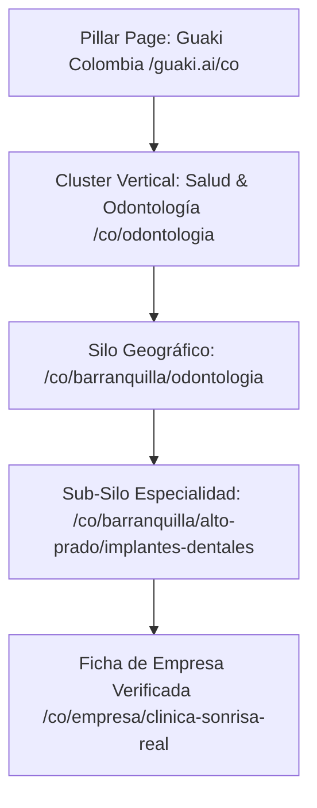
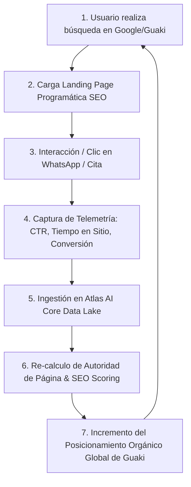

# 🌐 GUAKI — PROGRAMMATIC SEO & AI SEARCH ENGINE BIBLE v1.0
> **ARQUITECTURA COMPLETA PARA EL POSICIONAMIENTO PROGRAMÁTICO DE +5,000,000 DE PÁGINAS EN LATINOAMÉRICA**
> **INTEGRACIÓN TOTAL CON ATLAS AI CORE Y RECIRCULACIÓN DE CONOCIMIENTO AUTÓNOMO**

---

## 🏗️ 1. ARQUITECTURA DE SILOS & CLUSTERS TEMÁTICOS

### 1.1 JERARQUÍA DE SILOS Y URLS PROGRAMÁTICAS
- **Nivel 1 (Pillar de País):** `https://guaki.ai/[pais]` (ej. `guaki.ai/co`)
- **Nivel 2 (Cluster de Vertical):** `https://guaki.ai/[pais]/[categoria]` (ej. `guaki.ai/co/odontologia`)
- **Nivel 3 (Silo Geográfico):** `https://guaki.ai/[pais]/[ciudad]/[categoria]` (ej. `guaki.ai/co/barranquilla/odontologia`)
- **Nivel 4 (Sub-Silo Hiperlocal):** `https://guaki.ai/[pais]/[ciudad]/[barrio]/[especialidad]` (ej. `guaki.ai/co/barranquilla/alto-prado/implantes-dentales`)
- **Nivel 5 (Ficha Empresarial):** `https://guaki.ai/empresa/[slug-empresa]`

---

## 🤖 2. PROGRAMMATIC SEO & GENERACIÓN DE LANDING PAGES

### 2.1 MOTOR DE COMPILACIÓN DINÁMICA
- **Matriz Combinatoria:** 10 Países x 150 Ciudades x 500 Barrios x 400 Categorías x 250 Especialidades = **+75,000,000 Landing Pages Potenciales**.
- **Generación On-Demand / Edge SSR:** Las páginas no se crean estáticamente de forma masiva (evitando indexación de baja calidad). Se compilan y sirven dinámicamente mediante Vercel Edge SSR cuando la demanda de búsquedas en Atlas supera las 10 impresiones mensuales.

### 2.2 PREVENCIÓN DE CONTENIDO DUPLICADO
- Cada landing page programática utiliza **Entidades Dinámicas Generadas por Atlas AI Core**:
  - Resumen cuantitativo local (*"En Alto Prado hay 14 clínicas odontológicas verificadas con tiempo medio de respuesta de 2 minutos"*).
  - Reseñas locales reales y puntuaciones actualizadas dinámicamente.
  - Preguntas Frecuentes (FAQ) contextuales estructuradas por ciudad.

---

## 🏷️ 3. SCHEMA.ORG & OPENGRAPH ULTIMATE SPECIFICATION

### 3.1 SCHEMA DINÁMICO EN JSON-LD
Cada página programática inyecta en el HTML los siguientes esquemas validados:
- **`LocalBusiness` / `MedicalBusiness` / `ProfessionalService`:** Datos de geolocalización `geo.latitude`, `geo.longitude`, `telephone`, `openingHoursSpecification`.
- **`AggregateRating`:** Promedio real de reseñas auditadas.
- **`BreadcrumbList`:** Estructura completa de navegación en silos.
- **`FAQPage`:** Preguntas frecuentes sobre el servicio en esa ciudad.

### 3.2 OPENGRAPH DINÁMICO
- **Generación de Banners OG en Vivo:** Cada página compila una tarjeta social dinámica de 1200x630px mostrando la categoría, la ciudad, el rating medio y las empresas destacadas.

---

## 🎯 4. OPTIMIZACIÓN PARA GOOGLE AI OVERVIEWS & FUTURE AI SEARCH

### 4.1 E-E-A-T (EXPERIENCE, EXPERTISE, AUTHORITATIVENESS, TRUST)
- **Verificación de Coordenadas:** Distintivo de auditoría física presencial.
- **Transparencia Algorítmica:** Muestra pública de por qué una empresa ocupa su posición (tiempo de respuesta sub-3s, transacciones reales).

### 4.2 OPTIMIZACIÓN PARA FEATURED SNIPPETS & GOOGLE SGE / AI OVERVIEWS
- **Párrafos de Respuesta Directa (Snippet Bait):** Bloques de texto sintético de 40-50 palabras respondiendo la intención directa (ej. *"¿Cuánto cuesta un implante dental en Barranquilla?"*).
- **Tablas Comparativas Estructuradas:** Datos cuantitativos listos para ser consumidos por modelos LLM como Gemini, ChatGPT o Perplexity.

---

## ⚡ 5. CORE WEB VITALS & PERFORMANCE ULTIMATE

- **Largest Contentful Paint (LCP):** < 800ms mediante fuentes auto-hospedadas (Google Fonts Outfit/Inter) e imágenes AVIF/WebP comprimidas dinámicamente.
- **Interaction to Next Paint (INP):** < 50ms eliminando scripts de terceros pesados.
- **Cumulative Layout Shift (CLS):** 0.00 reservando espacios estáticos para mapas y tarjetas.

---

## 🧠 6. INTEGRACIÓN TOTAL CON ATLAS AI CORE: EL BUCLE DE CONOCIMIENTO

### 6.1 FEEDBACK LOOP AUTÓNOMO
- **Cada Búsqueda Genera Conocimiento:** Si los usuarios hacen clic masivo en odontólogos de un barrio específico, Atlas aumenta la prioridad de indexación y profundización de contenido para ese nicho.
- **Re-posicionamiento Dinámico por CTR:** Si una página tiene alto CTR orgánico, Atlas enriquece la landing con más preguntas frecuentes y datos estructurados para dominar el Featured Snippet de Google.

---

> **MANIFIESTO MAESTRO DE SEO PROGRAMÁTICO E IA PARA GUAKI MARKETPLACE v1.0 APROBADO.**
