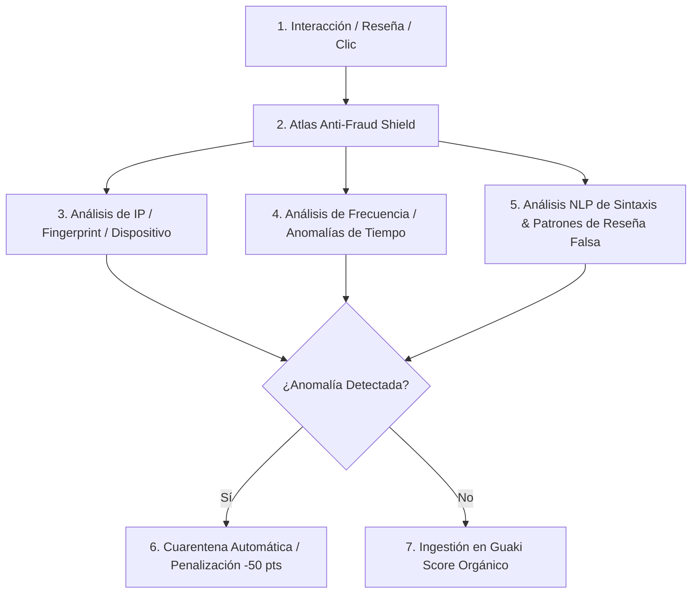

# 🧮 GUAKI — MERITOCRATIC RANKING ALGORITHM & ANTI-FRAUD BIBLE v1.0
> **ALGORITMO MAESTRO DE ORDENAMIENTO POR REPUTACIÓN, MATRIZ DE MATEMÁTICA MULTI-VARIABLE Y MOTOR DE DETECCIÓN DE FRAUDE DE ATLAS AI CORE**

---

## 📐 1. ECUACIÓN MAESTRA DEL GUAKI SCORE (0 - 100 PTS)

El posicionamiento orgánico de cualquier empresa en Guaki se calcula mediante una ecuación determinista no manipulable impulsada por **Atlas AI Core**:

$$\text{Guaki Score} = \sum_{i=1}^{10} (W_i \times S_i) - \text{Penalización por Fraude}$$

---

## 📊 2. PONDERACIÓN DETALLADA DE LAS 10 VARIABLES CONSTITUCIONALES

| Variable ($S_i$) | Descripción & Métrica Objetivo | Peso ($W_i$) | Rango | Criterio de Medición |
| :--- | :--- | :--- | :--- | :--- |
| **1. SLA de Respuesta** | Tiempo en responder el primer mensaje de WhatsApp / Cita. | **20%** | 0 - 100 | < 3 min = 100 pts \| > 1 hora = 0 pts |
| **2. Reputación & Reseñas** | Promedio de valoraciones auditadas por transacción real. | **18%** | 0 - 100 | 5.0⭐ = 100 pts \| 1.0⭐ = 0 pts |
| **3. Tasa de Conversión (CR)** | Porcentaje de perfiles vistos que convierten a contacto/cita. | **15%** | 0 - 100 | CR > 20% = 100 pts \| CR < 2% = 10 pts |
| **4. Verificación Física GPS** | Validación presencial de existencia física del negocio. | **12%** | 0 ó 100 | Coordenadas GPS auditadas presenciales. |
| **5. Explicitud de Catálogo** | Nivel de completitud del perfil, precios y fotos HD. | **10%** | 0 - 100 | 100% catálogo configurado = 100 pts. |
| **6. CTR de Búsqueda** | Porcentaje de clics recibidos en los resultados orgánicos. | **8%** | 0 - 100 | CTR > 12% = 100 pts. |
| **7. Antigüedad & Retención** | Tiempo operando en Guaki y tasa de clientes recurrentes. | **7%** | 0 - 100 | > 12 meses activo + alta fidelidad. |
| **8. Proximidad Geográfica** | Distancia física real entre el consumidor y el proveedor. | **5%** | 0 - 100 | Calculado en tiempo real en la búsqueda. |
| **9. Certificaciones & Registro** | Documentos mercantiles y de salud legales subidos. | **3%** | 0 ó 100 | Verificación legal completada. |
| **10. Contenido Multimedia** | Presencia de fotos de alta resolución y video tour. | **2%** | 0 - 100 | Fotos HD + Video interactivo cargado. |

---

## 🛡️ 3. SISTEMA IMPOSIBLE DE MANIPULAR & MOTOR ANTIFRAUDE ATLAS

### 3.1 DETECCIÓN DE FRAUDE DE CLICS (CLICK FRAUD PROTECTION)
- **Fingerprinting Criptográfico:** Atlas rastrea IP, User-Agent, Canvas Fingerprint y patrones de movimiento del ratón. Clics repetitivos de bots o agentes pagados son descartados automáticamente en < 50ms sin afectar el CTR orgánico.

### 3.2 DETECCIÓN DE RESEÑAS FALSAS Y GRANJAS DE SPAM
- **Confirmación por Transacción Real:** Solo las interacciones originadas mediante una cita o conversación registrada de WhatsApp pueden generar una reseña verificada.
- **Análisis Sintáctico NLP (Atlas NLP Engine):** Detecta textos genéricos repetidos (*"excelente servicio muy bueno"*) generados por bots o cuentas creadas el mismo día.

### 3.3 PENALIZACIONES SEVERAS E INMUTABLES
- **Nivel 1 (Advertencia Algorítmica):** Caída del 30% en la visibilidad si el tiempo de respuesta supera las 2 horas de manera recurrente.
- **Nivel 2 (Cuarentena Antifraude):** Descuento automático de 50 puntos en el Guaki Score si se detecta intento de inyección de reseñas falsas.
- **Nivel 3 (Expulsión Definitiva):** Expulsión inmutable del catálogo Guaki por intento de estafa o falsificación de identidad física.

---

> **BIBLE DEL ALGORITMO DE RANKING MERITOCRÁTICO Y ANTIFRAUDE GUAKI v1.0 REGISTRADO.**
