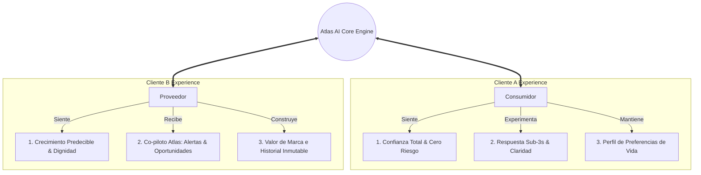

# 🤝 GUAKI — RELATIONSHIP EXPERIENCE & LIFETIME ENGAGEMENT BIBLE v1.0
> **DISEÑO DE RELACIONES PERMANENTES, ACOMPAÑAMIENTO AUTÓNOMO DE ATLAS Y FIDELIZACIÓN A DÉCADAS**

---

## 🤝 1. LA MATRIZ DE RELACIONES PERMANENTES

Guaki no diseña pantallas efímeras ni sesiones aisladas. **Guaki diseña Relaciones Duraderas**.

---

## 🧠 2. EL ACOMPAÑAMIENTO PERMANENTE DE ATLAS AI CORE

### 2.1 ATLAS CON EL CONSUMIDOR (CLIENTE A): ASESOR PERSONAL DE VIDA
- **Recordatorios de Mantenimiento / Cuidado:** Atlas recuerda periódicamente necesidades de salud, mantenimiento vehicular o servicios del hogar (ej. *"Han pasado 6 meses desde tu última limpieza dental en Clínica San Martín. ¿Deseas agendar en 1 clic?"*).
- **Protección Activa:** Si un proveedor sufre un contratiempo, Atlas ofrece alternativas inmediatas sin costo adicional.

### 2.2 ATLAS CON EL PROVEEDOR (CLIENTE B): CO-PILOTO EJECUTIVO DE CRECIMIENTO
- **Alertas de Oportunidad Comercial:** *"Atlas detectó un aumento del 40% en búsquedas de Implantes Dentales en Alto Prado este fin de semana. Activa tu asistente IA 24/7 para capturar la demanda"*.
- **Alertas de Retención Operativa:** *"Tu tiempo de respuesta aumentó a 12 minutos en las últimas 2 horas. Responde ahora para no perder 5 puntos en tu Guaki Score"*.
- **Educación & Playbooks Automáticos:** Envío de micro-cápsulas de aprendizaje para optimizar el catálogo y aumentar la conversión.

---

## 🔄 3. EL CICLO DE FIDELIZACIÓN DE DÉCADAS (RETENCIÓN PERMANENTE)

1. **Inercia de Datos & Reputación Colectiva:** Las empresas no se van de Guaki porque su **Guaki Score**, historial de transacciones verificadas y autoridad SEO acumulada valen millones de dólares.
2. **Habitualidad del Consumidor:** El cliente final no vuelve a buscar en Google tradicionales ni redes sociales caóticas; ingresa a Guaki como su **hub universal de contratación y confianza en Latinoamérica**.

---

> **BIBLE DE ARQUITECTURA DE RELACIONES Y FIDELIZACIÓN GUAKI v1.0 REGISTRADO.**
