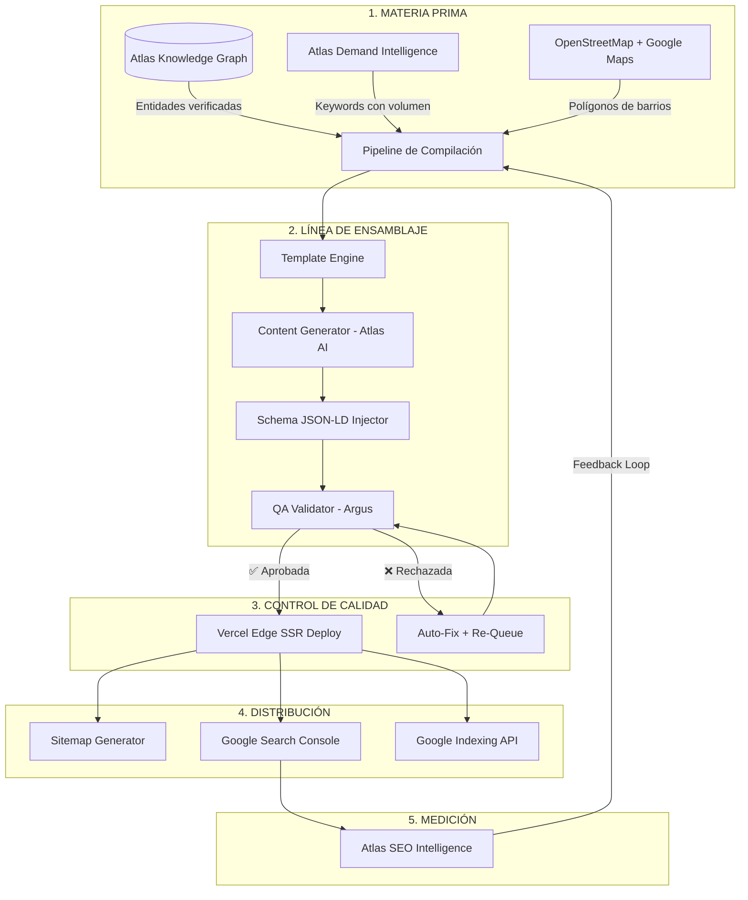

# 🏭 GUAKI — INDUSTRIAL SEO FACTORY BIBLE v1.0
> **SISTEMA DE PRODUCCIÓN MASIVA DE CONTENIDO SEO A ESCALA INDUSTRIAL: DE 100 PÁGINAS A 1,000,000**
> **FÁBRICA COMPLETAMENTE AUTOMATIZADA POR ATLAS AI. ZERO INTERVENCIÓN HUMANA POR PÁGINA.**

---

## 🏛️ PARTE I — FILOSOFÍA: SEO COMO FÁBRICA, NO COMO ARTESANÍA

### El Problema del SEO Tradicional
El SEO manual produce 10-20 páginas por mes. Un equipo de 5 personas produce 50-100. **Es imposible cubrir un mercado de 20 países, 250 ciudades, 50 categorías y miles de barrios con trabajo manual.**

### La Solución: Fábrica SEO Industrial
Guaki no "hace SEO". **Guaki opera una fábrica de contenido programático** que produce, valida, optimiza y mide decenas de miles de páginas sin que un humano toque una sola.

**Ecuación de Escala:**
$$\text{Páginas} = \text{Ciudades} \times \text{Categorías} \times \text{Barrios} \times \text{Tipos de Página}$$

**Ejemplo Año 1 (Colombia, 6 ciudades, 5 categorías, 50 barrios/ciudad, 14 tipos de página):**
$$6 \times 5 \times 50 \times 14 = 21{,}000 \text{ páginas}$$

**Ejemplo Año 5 (10 países, 70 ciudades, 16 categorías, 80 barrios/ciudad, 14 tipos):**
$$70 \times 16 \times 80 \times 14 = 1{,}254{,}400 \text{ páginas}$$

---

## 🏭 PARTE II — ARQUITECTURA DE LA FÁBRICA SEO



---

## 📦 PARTE III — LOS 14 TIPOS DE PÁGINA DE LA FÁBRICA

### TIPO 01: LANDING DE CATEGORÍA × CIUDAD
- **URL Pattern:** `/ciudad/categoria`
- **Ejemplo:** `/bogota/odontologia`
- **Contenido:** H1 dinámico, descripción de la categoría en la ciudad, top 10 proveedores verificados con Guaki Score, mapa interactivo, FAQ generadas, Schema LocalBusiness.
- **Volumen:** Ciudades × Categorías.
- **Año 1:** 6 × 5 = **30 páginas**.
- **Año 5:** 70 × 16 = **1,120 páginas**.

### TIPO 02: LANDING DE CATEGORÍA × BARRIO
- **URL Pattern:** `/ciudad/categoria/barrio`
- **Ejemplo:** `/bogota/odontologia/chapinero`
- **Contenido:** Proveedores verificados en ese barrio específico, distancias al usuario, reseñas destacadas, precios promedio de la zona.
- **Volumen:** Ciudades × Categorías × Barrios.
- **Año 1:** 6 × 5 × 50 = **1,500 páginas**.
- **Año 5:** 70 × 16 × 80 = **89,600 páginas**.

### TIPO 03: LANDING DE SUBCATEGORÍA × CIUDAD
- **URL Pattern:** `/ciudad/categoria/subcategoria`
- **Ejemplo:** `/bogota/odontologia/blanqueamiento-dental`
- **Contenido:** Proveedores que ofrecen ese servicio específico, precios comparativos, FAQ del procedimiento, Schema Service.
- **Volumen:** Ciudades × Subcategorías (~5 por categoría).
- **Año 1:** 6 × 25 = **150 páginas**.
- **Año 5:** 70 × 80 = **5,600 páginas**.

### TIPO 04: LANDING DE SERVICIO ESPECÍFICO × BARRIO
- **URL Pattern:** `/ciudad/categoria/subcategoria/barrio`
- **Ejemplo:** `/bogota/odontologia/blanqueamiento-dental/chapinero`
- **Contenido:** Máxima especificidad. Los 3-5 proveedores que ofrecen ESE servicio en ESE barrio con precios y disponibilidad.
- **Volumen:** Ciudades × Subcategorías × Barrios.
- **Año 1:** 6 × 25 × 50 = **7,500 páginas**.
- **Año 5:** 70 × 80 × 80 = **448,000 páginas**.

### TIPO 05: PÁGINA COMPARATIVA
- **URL Pattern:** `/comparar/servicio-a-vs-servicio-b/ciudad`
- **Ejemplo:** `/comparar/brackets-vs-invisalign/bogota`
- **Contenido:** Tabla comparativa de procedimientos, precios promedio, pros/contras, proveedores que ofrecen cada uno, recomendación de Atlas.
- **Volumen:** ~10 comparativas por subcategoría × Ciudades.
- **Año 1:** 250 × 6 = **1,500 páginas**.
- **Año 5:** 800 × 70 = **56,000 páginas**.

### TIPO 06: GUÍA DE SERVICIO
- **URL Pattern:** `/guia/nombre-del-servicio`
- **Ejemplo:** `/guia/como-elegir-un-buen-odontologo`
- **Contenido:** Guía educativa de 1500+ palabras generada por Atlas AI. Estructura: qué buscar, preguntas clave, rangos de precios, señales de alerta, CTA hacia proveedores verificados.
- **Volumen:** ~3 guías por subcategoría.
- **Año 1:** 75 guías = **75 páginas**.
- **Año 5:** 240 guías = **240 páginas**.

### TIPO 07: FAQ PROGRAMÁTICA
- **URL Pattern:** `/preguntas/categoria/ciudad`
- **Ejemplo:** `/preguntas/odontologia/bogota`
- **Contenido:** 20-30 preguntas frecuentes generadas por Atlas basadas en búsquedas reales de usuarios + datos de Google Autocomplete. Schema FAQPage.
- **Volumen:** Categorías × Ciudades.
- **Año 1:** 5 × 6 = **30 páginas**.
- **Año 5:** 16 × 70 = **1,120 páginas**.

### TIPO 08: BLOG EDUCATIVO
- **URL Pattern:** `/blog/titulo-del-articulo`
- **Ejemplo:** `/blog/5-senales-de-que-necesitas-un-tratamiento-de-conducto`
- **Contenido:** Artículos de 800-2000 palabras generados por Atlas AI, validados por Argus QA, con internal links hacia landings de categoría.
- **Volumen:** ~5 artículos por subcategoría/mes.
- **Año 1:** 125/mes = **1,500 páginas/año**.
- **Año 5:** 400/mes = **4,800 páginas/año**.

### TIPO 09: CASO DE ÉXITO
- **URL Pattern:** `/casos-de-exito/nombre-empresa`
- **Ejemplo:** `/casos-de-exito/clinica-dental-sonrie`
- **Contenido:** Historia del proveedor, métricas antes/después de Guaki, testimonial, fotos, CTA para proveedores similares.
- **Volumen:** ~5% de proveedores activos.
- **Año 1:** 250 = **250 páginas**.
- **Año 5:** 25,000 = **25,000 páginas**.

### TIPO 10: ESTUDIO DE MERCADO
- **URL Pattern:** `/estudios/categoria-en-ciudad-año`
- **Ejemplo:** `/estudios/mercado-odontologico-bogota-2027`
- **Contenido:** Informe anual generado por Atlas BI: tamaño del mercado, precios promedio, demanda estacional, competidores, tendencias. Posiciona a Guaki como autoridad de datos.
- **Volumen:** Categorías × Ciudades × Año.
- **Año 1:** 30 = **30 páginas**.
- **Año 5:** 1,120 = **1,120 páginas**.

### TIPO 11: RANKING / TOP EMPRESAS
- **URL Pattern:** `/mejores/categoria/ciudad`
- **Ejemplo:** `/mejores/odontologos/bogota`
- **Contenido:** Top 10-20 proveedores de esa categoría en esa ciudad rankeados por Guaki Score. Actualización semanal automática. Schema ItemList.
- **Volumen:** Categorías × Ciudades.
- **Año 1:** 5 × 6 = **30 páginas**.
- **Año 5:** 16 × 70 = **1,120 páginas**.

### TIPO 12: RANKING / TOP EMPRESAS × BARRIO
- **URL Pattern:** `/mejores/categoria/ciudad/barrio`
- **Ejemplo:** `/mejores/odontologos/bogota/chapinero`
- **Contenido:** Top 5-10 proveedores en ese barrio específico. Máxima relevancia local.
- **Volumen:** Categorías × Ciudades × Barrios.
- **Año 1:** 5 × 6 × 50 = **1,500 páginas**.
- **Año 5:** 16 × 70 × 80 = **89,600 páginas**.

### TIPO 13: PÁGINA DE PERFIL DE PROVEEDOR
- **URL Pattern:** `/empresa/slug-del-proveedor`
- **Ejemplo:** `/empresa/clinica-dental-sonrie-bogota`
- **Contenido:** Perfil completo del proveedor: servicios, precios, fotos, reseñas, Guaki Score, mapa, horarios, WhatsApp, agendamiento. Schema LocalBusiness completo.
- **Volumen:** 1 por proveedor verificado.
- **Año 1:** **5,000 páginas**.
- **Año 5:** **500,000 páginas**.

### TIPO 14: PÁGINA DE PRECIOS POR SERVICIO × CIUDAD
- **URL Pattern:** `/precios/servicio/ciudad`
- **Ejemplo:** `/precios/blanqueamiento-dental/bogota`
- **Contenido:** Rango de precios reales de proveedores verificados, precio promedio, precio mínimo, precio máximo, tabla comparativa, recomendación de Atlas.
- **Volumen:** Subcategorías × Ciudades.
- **Año 1:** 25 × 6 = **150 páginas**.
- **Año 5:** 80 × 70 = **5,600 páginas**.

---

## 📊 TABLA DE ESCALA TOTAL

| Tipo de Página | Año 1 | Año 2 | Año 3 | Año 5 | Año 10 |
|:---|---:|---:|---:|---:|---:|
| Categoría × Ciudad | 30 | 180 | 640 | 1,120 | 5,000 |
| Categoría × Barrio | 1,500 | 9,000 | 32,000 | 89,600 | 400,000 |
| Subcategoría × Ciudad | 150 | 900 | 3,200 | 5,600 | 25,000 |
| Servicio × Barrio | 7,500 | 45,000 | 160,000 | 448,000 | 2,000,000 |
| Comparativas | 1,500 | 9,000 | 20,000 | 56,000 | 250,000 |
| Guías | 75 | 150 | 200 | 240 | 500 |
| FAQs | 30 | 180 | 640 | 1,120 | 5,000 |
| Blog | 1,500 | 3,000 | 4,000 | 4,800 | 10,000 |
| Casos de Éxito | 250 | 1,250 | 4,000 | 25,000 | 250,000 |
| Estudios de Mercado | 30 | 180 | 640 | 1,120 | 5,000 |
| Rankings × Ciudad | 30 | 180 | 640 | 1,120 | 5,000 |
| Rankings × Barrio | 1,500 | 9,000 | 32,000 | 89,600 | 400,000 |
| Perfiles de Proveedor | 5,000 | 25,000 | 80,000 | 500,000 | 5,000,000 |
| Precios × Ciudad | 150 | 900 | 3,200 | 5,600 | 25,000 |
| **TOTAL** | **19,245** | **103,920** | **341,160** | **1,228,920** | **8,380,500** |

---

## ⚙️ PARTE IV — LA LÍNEA DE ENSAMBLAJE (PIPELINE DE PRODUCCIÓN)

### FASE 1: MATERIA PRIMA (Datos de Atlas)

```
Atlas Knowledge Graph proporciona:
├── Entidades verificadas (proveedores con GPS, fotos, precios)
├── Taxonomía (categorías → subcategorías → servicios)
├── Geografía (países → ciudades → barrios → polígonos)
├── Métricas (Guaki Score, reseñas, SLA, precios)
├── Demanda (volumen de búsquedas por keyword)
└── Competencia (densidad de proveedores por zona)
```

### FASE 2: DECISIÓN DE PRODUCCIÓN (¿Qué páginas crear?)

Atlas Demand Intelligence decide qué páginas producir basado en:

| Señal | Acción |
|:---|:---|
| Keyword con > 100 búsquedas/mes sin página existente | Crear página inmediatamente |
| Barrio con > 3 proveedores verificados sin landing | Crear landing del barrio |
| Subcategoría con > 5 proveedores sin página | Crear landing de subcategoría |
| Keyword estacional con pico próximo (< 30 días) | Crear página anticipadamente |
| Competidor posicionado en keyword donde Guaki no tiene página | Crear página competitiva |

**Regla de Oro:** Nunca crear una página "vacía". Cada página debe tener al menos 3 proveedores verificados o datos reales que justifiquen su existencia.

### FASE 3: COMPILACIÓN DE CONTENIDO (Template Engine + Atlas AI)

Cada tipo de página tiene un **template Jinja2/JSX** con slots dinámicos que se rellenan automáticamente:

```
Template: landing_categoria_barrio.jsx
├── H1: "Mejores {{categoría}} en {{barrio}}, {{ciudad}}"
├── Meta Description: generada por Atlas AI (única por página)
├── Párrafo Introductorio: generado por Atlas AI (150-200 palabras)
├── Lista de Proveedores: query a Atlas Knowledge Graph
├── Precios Promedio: calculados por Atlas Price Intelligence
├── FAQ: generadas por Atlas + Google Autocomplete
├── Schema JSON-LD: compilado automáticamente
├── Internal Links: a páginas padre/hermana/hija del silo
└── CTA: dinámico según intención del usuario
```

**Reglas de Generación de Contenido por Atlas AI:**
1. Cada meta-description es **única**. Nunca duplicar entre páginas.
2. Cada párrafo introductorio menciona el **barrio**, la **ciudad** y la **categoría** de forma natural.
3. El contenido incluye **datos reales** (precios, número de proveedores, Guaki Score promedio).
4. El tono es **informativo, confiable y local** — no genérico ni publicitario.
5. Cada página tiene **mínimo 3 internal links** a páginas del mismo silo.

### FASE 4: INYECCIÓN DE SCHEMA JSON-LD

Cada tipo de página recibe Schema estructurado automáticamente:

| Tipo de Página | Schema Aplicado |
|:---|:---|
| Landing Categoría/Barrio | `LocalBusiness`, `ItemList`, `BreadcrumbList` |
| Perfil de Proveedor | `LocalBusiness`, `Service`, `AggregateRating`, `OpeningHoursSpecification` |
| Comparativa | `ItemList`, `Product` (para servicios comparados) |
| FAQ | `FAQPage` |
| Blog/Guía | `Article`, `HowTo` |
| Ranking | `ItemList` con posiciones |
| Precios | `AggregateOffer`, `PriceSpecification` |

### FASE 5: CONTROL DE CALIDAD AUTOMÁTICO (Argus QA)

Antes de publicar, Argus QA ejecuta **18 validaciones automáticas** en cada página:

| # | Validación | Criterio de Aprobación |
|:---:|:---|:---|
| 1 | Meta title existe y tiene 50-60 caracteres | ✅ Obligatorio |
| 2 | Meta description existe y tiene 150-160 caracteres | ✅ Obligatorio |
| 3 | H1 único por página | ✅ Obligatorio |
| 4 | Jerarquía H1 → H2 → H3 correcta | ✅ Obligatorio |
| 5 | Contenido mínimo de 300 palabras | ✅ Obligatorio |
| 6 | Schema JSON-LD válido (Google Rich Results Test) | ✅ Obligatorio |
| 7 | Canonical URL correcta | ✅ Obligatorio |
| 8 | Hreflang correcto para el país | ✅ Obligatorio |
| 9 | Internal links mínimo 3 | ✅ Obligatorio |
| 10 | Imágenes con alt text descriptivo | ✅ Obligatorio |
| 11 | No duplicate content (> 85% similitud con otra página) | ✅ Obligatorio |
| 12 | LCP < 2.5s en Lighthouse | ✅ Obligatorio |
| 13 | CLS < 0.1 | ✅ Obligatorio |
| 14 | INP < 200ms | ✅ Obligatorio |
| 15 | Al menos 1 proveedor verificado visible | ✅ Obligatorio |
| 16 | Datos de precios actualizados (< 30 días) | ⚠️ Warning si > 30d |
| 17 | Sin errores 404 en internal links | ✅ Obligatorio |
| 18 | Mobile-friendly (viewport, touch targets) | ✅ Obligatorio |

**Si falla cualquier validación obligatoria:** la página se rechaza y vuelve a la cola de auto-fix. Argus intenta corregir automáticamente (ej. regenerar meta-description, corregir Schema). Si falla 3 veces, escala a revisión humana.

### FASE 6: DEPLOY AUTOMÁTICO (Vercel Edge SSR)

```
Páginas aprobadas por Argus QA
    ↓
Next.js ISR (Incremental Static Regeneration)
    ↓
Vercel Edge Network (CDN global)
    ↓
Cloudflare WAF (protección)
    ↓
Página live en < 10 segundos post-aprobación
```

### FASE 7: INDEXACIÓN ACELERADA

1. **Sitemap dinámico:** Actualizado cada 24h con todas las páginas nuevas y modificadas.
2. **Google Indexing API:** Para páginas de alta prioridad (rankings, perfiles nuevos).
3. **Google Search Console:** Monitoreo automático de cobertura de indexación.
4. **Ping a Bing/Yandex:** Notificación automática de nuevas URLs.

### FASE 8: MEDICIÓN Y OPTIMIZACIÓN (Feedback Loop)

Atlas SEO Intelligence monitorea cada página publicada:

| Métrica | Frecuencia | Acción si Bajo Rendimiento |
|:---|:---|:---|
| Impresiones en GSC | Diaria | Si 0 impresiones en 14 días → re-evaluar keyword |
| Posición promedio | Semanal | Si posición > 20 → optimizar contenido |
| CTR | Semanal | Si CTR < 3% → regenerar meta-title y description |
| Bounce rate | Semanal | Si > 70% → mejorar contenido + UX |
| Conversión (contacto) | Mensual | Si < 5% → re-diseñar CTA y layout |
| Canibalización | Mensual | Si 2+ páginas compiten → consolidar o diferenciar |

**Regla de Auto-Optimización:** Si una página tiene > 100 impresiones pero CTR < 2%, Atlas regenera automáticamente el meta-title y la meta-description con variantes A/B y mide durante 14 días.

---

## 🔗 PARTE V — ARQUITECTURA DE SILOS Y INTERNAL LINKING

### Estructura de Silo por Categoría

```
/bogota/odontologia                          ← Página pilar (Silo Head)
├── /bogota/odontologia/chapinero            ← Landing de barrio
├── /bogota/odontologia/usaquen              ← Landing de barrio
├── /bogota/odontologia/blanqueamiento       ← Landing de subcategoría
│   ├── /bogota/odontologia/blanqueamiento/chapinero  ← Long-tail
│   └── /bogota/odontologia/blanqueamiento/usaquen    ← Long-tail
├── /mejores/odontologos/bogota              ← Ranking
├── /precios/odontologia/bogota              ← Precios
├── /preguntas/odontologia/bogota            ← FAQ
├── /guia/como-elegir-odontologo             ← Guía educativa
└── /comparar/brackets-vs-invisalign/bogota  ← Comparativa
```

### Reglas de Internal Linking Automático

1. **Vertical (padre → hijo):** La página pilar enlaza a todas sus subpáginas.
2. **Horizontal (hermano → hermano):** Páginas de barrio del mismo silo se enlazan entre sí.
3. **Transversal (silo → silo):** Guías y comparativas enlazan a silos relacionados.
4. **Ascendente (hijo → padre):** Breadcrumb + enlace contextual a la página pilar.
5. **Proveedor → Silo:** Cada perfil de proveedor enlaza a su silo de categoría y barrio.

---

## 🧠 PARTE VI — ATLAS SEO INTELLIGENCE: EL CEREBRO DE LA FÁBRICA

### Lo que Atlas Aprende de Cada Página

| Dato | Cómo lo Usa |
|:---|:---|
| Posición en Google | Identifica qué templates y estructuras posicionan mejor |
| CTR por tipo de meta-title | Optimiza los patrones de meta-title con mayor CTR |
| Bounce rate por layout | A/B testea layouts para reducir bounce |
| Keywords de alto volumen sin página | Prioriza producción de páginas nuevas |
| Canibalizaciones | Consolida o diferencia contenido automáticamente |
| Estacionalidad de búsquedas | Pre-produce páginas antes de picos estacionales |
| Conversión por tipo de página | Invierte más en tipos de página con mayor conversión |

### Prompts de Atlas para la Fábrica SEO

- *"Atlas, ¿cuáles son las 50 keywords de mayor volumen en Colombia sin página existente en Guaki?"*
- *"Atlas, genera meta-description optimizada para CTR para la landing 'mejores odontólogos en Chapinero, Bogotá'."*
- *"Atlas, detecta todas las canibalizaciones activas en el silo de odontología en Bogotá."*
- *"Atlas, ¿qué páginas tienen > 100 impresiones pero CTR < 2%? Regenera meta-titles."*
- *"Atlas, ¿qué categorías tendrán pico estacional en los próximos 30 días? Pre-produce landings."*

---

## ⏱️ PARTE VII — CADENCIA DE PRODUCCIÓN

### Ciclo Nocturno de la Fábrica (03:00 AM - 06:00 AM)

| Hora | Acción |
|:---|:---|
| 03:00 | Atlas Demand Intelligence analiza keywords + demanda del día anterior |
| 03:15 | Pipeline decide qué páginas nuevas producir (prioridad por volumen de búsqueda) |
| 03:30 | Template Engine compila páginas con datos frescos del Knowledge Graph |
| 04:00 | Atlas AI genera contenido único para cada página (meta, párrafos, FAQ) |
| 04:30 | Schema JSON-LD Injector estructura los datos |
| 05:00 | Argus QA ejecuta 18 validaciones por página |
| 05:30 | Páginas aprobadas se despliegan en Vercel Edge SSR |
| 05:45 | Sitemap actualizado y enviado a Google/Bing |
| 06:00 | Reporte nocturno: páginas producidas, aprobadas, rechazadas, indexadas |

### Capacidad de Producción

| Escala | Páginas/Noche | Infraestructura Requerida |
|:---|---:|:---|
| Startup (Año 1) | 50-100 | 1 worker, 1 GPU para Atlas AI |
| Growth (Año 2-3) | 500-1,000 | 3 workers, 2 GPUs |
| Scale (Año 4-5) | 2,000-5,000 | 10 workers, 4 GPUs |
| Hyperscale (Año 6+) | 10,000-50,000 | Auto-scaling cluster, 8+ GPUs |

---

## 📈 PARTE VIII — MÉTRICAS DE LA FÁBRICA SEO

### Dashboard de la Fábrica (Real-Time)

| Métrica | Target Año 1 | Target Año 5 |
|:---|:---|:---|
| Páginas totales indexadas | > 15,000 | > 1,000,000 |
| Tráfico orgánico mensual | > 100,000 visitas | > 10,000,000 visitas |
| Posición promedio (long-tail) | < 5 | < 3 |
| CTR promedio | > 6% | > 10% |
| Conversión búsqueda → contacto | > 8% | > 15% |
| Páginas rechazadas por QA | < 5% | < 2% |
| Tiempo de compilación por página | < 30 segundos | < 10 segundos |
| Tiempo de indexación post-deploy | < 48 horas | < 12 horas |
| Canibalizaciones activas | < 2% | < 0.5% |
| Schema válido (Rich Results) | > 95% | > 99% |

### ROI de la Fábrica SEO

| Inversión | Costo Mensual |
|:---|:---|
| Infraestructura (Vercel + GPU) | $500-$2,000 USD |
| Atlas AI (tokens de generación) | $200-$1,000 USD |
| Desarrollador SEO (mantenimiento) | $3,000 USD |
| **Total Mensual** | **$3,700-$6,000 USD** |

| Resultado | Valor Mensual |
|:---|:---|
| Tráfico orgánico equivalente en SEM | $50,000-$500,000 USD (si pagáramos por cada clic) |
| **ROI de la Fábrica** | **10x-100x** |

---

> **FÁBRICA SEO INDUSTRIAL GUAKI v1.0 — SISTEMA DE PRODUCCIÓN MASIVA AUTOMATIZADA — APROBADO.**
