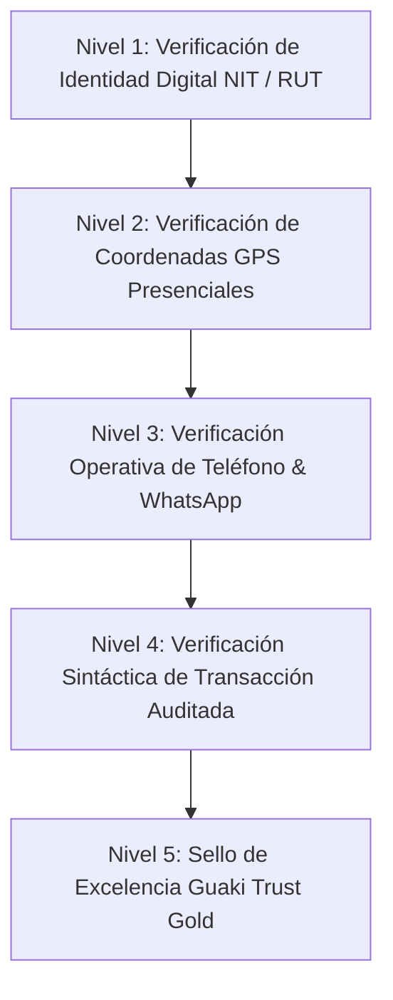

# 🛡️ GUAKI — TRUST & VERIFICATION ENGINE BIBLE v1.0
> **ESPECIFICACIÓN MAESTRA DEL SISTEMA DE CONFIANZA, VERIFICACIÓN CONTINUA Y TRANSPARENCIA ALGORTÍMICA SUPERIOR A GOOGLE MAPS**

---

## 🛡️ 1. LOS 5 NIVELES DE VERIFICACIÓN DE CONFIANZA DE GUAKI

A diferencia de Google Maps (donde cualquier persona puede crear un pin falso con una foto de stock), Guaki exige una cadena inquebrantable de 5 niveles de certificación:



### 1.1 DESGLOSE DE NIVELES DE VERIFICACIÓN
- **L1 (Identidad Mercantil):** Validación de registro legal tributario (NIT en Colombia, RFC en México, RUT en Chile).
- **L2 (Geolocalización Física Auditada):** Confirmación mediante coordenadas presenciales tomadas desde el dispositivo del dueño o fotogrametría satelital de fachada.
- **L3 (Canal Operativo Sub-3s):** Verificación de que el número telefónico y WhatsApp oficial responde en tiempo real.
- **L4 (Transacción Auditada):** Las reseñas solo se califican como *Verificadas* si provienen de un agendamiento o mensaje atendido dentro de la plataforma.
- **L5 (Guaki Trust Gold Badge):** Otorgado a empresas con Guaki Score > 90 mantenido durante 6 meses consecutivos.

---

## 🔬 2. MONITOR DE SALUD OPERATIVA CONTINUA (DETECCIÓN AUTÓNOMA)

Un bot sintético autónomo impulsado por **Argus QA** e integrado a **Atlas AI Core** realiza barridos de integridad 24/7:

1. **Detección de Negocios Cerrados:** Si un comercio no responde WhatsApp en 3 intentos consecutivos en días diferentes o registra 5 reportes de usuarios de *"comercio cerrado"*, se marca en cuarentena temporal.
2. **Detección de Páginas Caídas o Enlaces Rotos:** Argus audita la URL del sitio web del proveedor diariamente. Si devuelve error 404 o 500, se inhabilita el enlace y se notifica al empresario para corregirlo.
3. **Detección de Teléfonos Fuera de Servicio:** Verificación sintética de conectividad telefónica/WhatsApp semanal.

---

## 🏆 3. REHABILITACIÓN Y PREMIO A LA EXCELENCIA EMPRESARIAL

### 3.1 PREMIO A LAS EMPRESAS EXCELENTES
- **Círculo de Excelencia Guaki:** Mención pública en el boletín municipal trimestral enviado a la Cámara de Comercio.
- **Insignia "Top 1% de Reputación":** Destacado visual en los resultados sin alterar el algoritmo orgánico.

### 3.2 PLAN DE REHABILITACIÓN DE NEGOCIOS (RECOVERY PLAYBOOK)
Guaki no destruye empresas por cometer errores operativos pasados. Si una empresa cae en su Guaki Score por respuesta lenta o una mala reseña:
1. Atlas genera un **Plan Táctico de Recuperación de 30 Días**.
2. Al activar el asistente **Guaki IA 24/7** y mantener un SLA < 3 minutos durante 15 días, la empresa recupera progresivamente hasta 20 puntos en su score.

---

## 📢 4. TRANSPARENCIA TOTAL Y EXPLICABILIDAD DEL RANKING

Cualquier usuario o empresario puede hacer clic en la etiqueta *"¿Por qué esta empresa aparece aquí?"* y ver el desglose matemático transparente:

```text
===================================================================
 GUAKI SCORE TRANSPARENCY REPORT: CLINICA SAN MARTIN
===================================================================
 [✓] SLA de Respuesta (< 2 min):     20.0 / 20 pts
 [✓] Reputación Auditada (4.9⭐):    17.6 / 18 pts
 [✓] Tasa de Conversión Real (22%):  15.0 / 15 pts
 [✓] Verificación GPS Presencial:    12.0 / 12 pts
 [✓] Completitud de Catálogo:        10.0 / 10 pts
 [✓] CTR Orgánico (14%):              8.0 / 8 pts
 ------------------------------------------------------------------
 GUAKI SCORE TOTAL:                  92.6 / 100 PTS (RANGO #1 EN ALTO PRADO)
===================================================================
```

---

> **MANIFIESTO MAESTRO DEL SISTEMA DE CONFIANZA Y VERIFICACIÓN GUAKI v1.0 APROBADO.**
