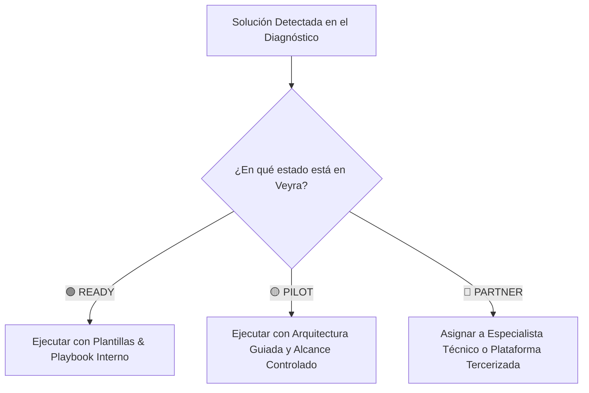
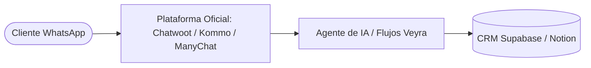

# 🧭 MANUAL DEL FUNDADOR & SISTEMA DE DELIVERY — VEYRA
### *Cómo operar, vender y entregar soluciones de alto impacto sin ser el técnico que programa cada línea*

---

## 💡 1. El Cambio de Mentalidad Fundamental (De "Técnico Solitario" a "Director de Soluciones")

> [!IMPORTANT]
> **La Realidad de Veyra:**
> Los clientes **no contratan a Edwin para que escriba código en Python a mano**. Contratan a **Veyra** para que **resuelva un dolor de negocio** (ej: *"no perder clientes que escriben por WhatsApp y conseguir más ventas"*).
> 
> * Tú eres el **Director de Soluciones y Arquitecto de Confianza**.
> * Tu rol es **diagnosticar, estructurar el plan, cotizar por valor, coordinar el delivery y garantizar la calidad**.
> * El delivery técnico lo ejecutan:
>   1. **Tus herramientas y playbooks estandarizados (Playbook Factory).**
>   2. **Plataformas no-code/low-code robustas (Make, n8n, Supabase, Chatwoot, Evolution API).**
>   3. **Especialistas técnicos / Partners de ejecución.**

---

## 🚦 2. La Matriz de Capacidades de Veyra (Veyra Delivery Matrix)

Antes de cotizar, clasificamos cada solución en el **Semáforo Operativo**:

| Solución | Estado Actual | ¿Cómo se entrega hoy? | Quién ejecuta |
| :--- | :---: | :--- | :--- |
| **Landing Page / Web Comercial** | 🟢 **READY** | Plantillas Neumorphic / Next.js en Vercel ya listas | Veyra / Plantilla |
| **Diagnóstico Business MRI™** | 🟢 **READY** | Calculadora interactiva `/admin/veyra` | Veyra Suite |
| **SEO Local & Google Business** | 🟢 **READY** | Checklist de optimización de perfil y reseñas | Procedimiento Veyra |
| **Captación de Leads por Web** | 🟢 **READY** | Formularios conectados a Supabase y correo | Stack Veyra |
| **CRM de Ventas Básico** | 🟡 **PILOT** | Tablero Supabase / Notion CRM / HubSpot Free | Playbook Guiado |
| **Email Marketing Automatizado** | 🟡 **PILOT** | Brevo / Resend / MailerLite con secuencias | Plantillas de Correo |
| **WhatsApp Automatizado (Atención)** | 🟡 **PILOT** | Chatwoot / ManyChat / n8n / Cloud API | Plataforma + Playbook |
| **Integraciones API a Medida** | 🔴 **PARTNER** | Se cotiza con margen (+40%) y se subcontrata | Especialista / Freelancer |
| **Voz IA / Telefonía Compleja** | 🔴 **PARTNER** | Bland AI / Vapi / Retell AI integrado | Partner Tecnológico |

> [!TIP]
> **Regla de Oro:** Lo que esté en 🔴 **nunca se rechaza**. Se cotiza incluyendo el costo del especialista externo + el margen de Veyra (35% a 50%), y Veyra actúa como la empresa contratista que audita la entrega.

---

## 📱 3. El Caso Específico de WhatsApp: Cómo Entregarlo sin Morir en el Intento

Tu preocupación sobre Meta y WhatsApp es 100% acertada:
1. **Métodos piratas (WhatsApp Web bots):** ❌ Bloquean números y arruinan la reputación.
2. **Meta Cloud API directa desde cero:** ⚠️ Requiere verificar empresa en Meta Business Manager, configurar tarjetas, webhooks y pagar por conversación.

### La Estrategia Inteligente de Veyra para WhatsApp:

#### En lugar de programar la API de Meta tú mismo:
1. **Usamos una Plataforma Intermediaria Oficial (BSP / SaaS):**
   * Herramientas como **Chatwoot**, **Kommo (ex-amoCRM)**, **ManyChat** o **Wati**.
   * El cliente conecta su número oficial en la plataforma en 10 minutos con código QR o Meta Login.
   * La plataforma gestiona las tarifas de Meta directamente con la tarjeta del cliente (tú no pagas sus mensajes).
2. **Lo que Veyra hace y cobra:**
   * Diseña el **flujo conversacional** (Preguntas, respuestas, calificación de leads).
   * Configura el **Prompt de Inteligencia Artificial** con el tono y servicios del cliente.
   * Conecta los webhooks hacia el CRM de la clínica/empresa.
   * **Cobras $1,500 – $3,500 USD** por la estrategia, configuración y puesta en marcha, sin haber tenido que programar el servidor de WhatsApp desde cero.

---

## 🛠️ 4. El Protocolo: ¿Qué haces exactamente cuando el cliente dice "SÍ, ACEPTO"?

### Día 1: El Cierre y Pago
1. Le envías la propuesta generada en `/admin/veyra` con el enlace de pago del **50% de anticipo**.
2. Una vez confirmado el pago, firmas el contrato digital.

### Día 2: Sesión de Kickoff (45 min)
No vas a programar. Vas a liderar la reunión:
* *"Hola [Cliente], bienvenidos. Hoy iniciamos el Plan de Transformación en 3 etapas."*
* Le entregas la **Lista de Accesos Requeridos**:
  * [ ] Acceso a su dominio (GoDaddy / Namecheap).
  * [ ] Acceso a su logo en alta resolución y fotos reales.
  * [ ] Número de WhatsApp oficial que utilizarán.
  * [ ] Tarifa o catálogo de servicios.

### Semanas 1 a 3: El Delivery en 3 Capas
* **Capa 1 (Tú / Veyra):** Creas la Landing Page en Next.js con el diseño ya probado.
* **Capa 2 (Herramientas / No-Code):** Configuras el flujo de WhatsApp en la plataforma aliada (Chatwoot / ManyChat / n8n) usando el Playbook de Atlas.
* **Capa 3 (Si hay algo complejo):** Si el cliente pide algo muy específico (ej: conectar su sistema contable viejo), contratas a un desarrollador en Upwork/Workana por $300 USD para que haga esa función específica, mientras tú cobraste $3,000 USD por el proyecto completo.

### Semana 4: QA y Demo en Vivo
1. Pruebas el flujo enviando mensajes reales desde tu teléfono.
2. Presentas la Demo al cliente: *"Escríbele a este número y mira cómo te atiende y te agenda"*.
3. El cliente queda fascinado porque ve resultados tangibles.

### Semana 5: Liquidación y Pase a Producción
1. Cobras el **20% de liquidación final**.
2. Le entregas el Acta de Handover (generada con 1 clic en `/admin/veyra`).
3. Le ofreces el plan de mantenimiento recurrente **Veyra Care ($550 USD/mes)** para monitorear que su sistema nunca se caiga.

---

## 🎯 5. Tu Hoja de Ruta Inmediata para Estar 100% Tranquilo

1. ✅ **Usa el Semáforo de Capacidades:** Si te piden algo que está en 🟢 (Web, Landing, SEO, Triage), lo entregamos con nuestros templates.
2. 📖 **Usa los Playbooks de Atlas Vault (`docs/atlas_vault/`):** Cada vez que vayas a implementar un servicio, abres el playbook correspondiente y sigues el paso 1, 2 y 3.
3. 🤝 **Crea tu Red de 2 o 3 Especialistas Freelance de Confianza:** Ten identificados 1 desarrollador de Python/APIs y 1 especialista en automatizaciones n8n/Make para cuando surja un proyecto Tier 3.
4. 💼 **Vende Resultados, no APIs:** Tu pitch es: *"Hacemos que ningún cliente potencial que te busque se quede sin respuesta inmediata"*.
