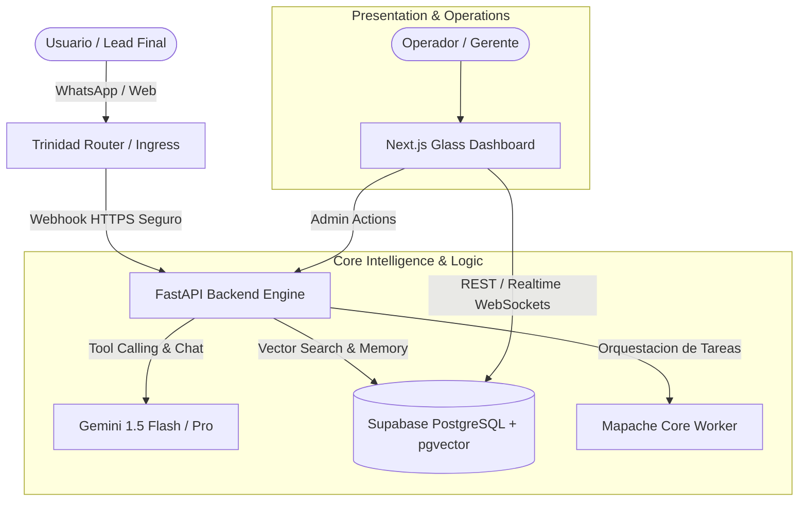

# 🏗️ Blueprint de Arquitectura Técnica

> [!NOTE]
> Especificación técnica formal para el despliegue del sistema de **{{client_name}}**.

---

## 📐 Diagrama de Arquitectura de Sistemas



---

## 🗄️ Esquema de Base de Datos y Modelado (Supabase)

```sql
-- Tabla Principal de Leads & Contactos
CREATE TABLE IF NOT EXISTS public.leads (
    id UUID PRIMARY KEY DEFAULT gen_random_uuid(),
    created_at TIMESTAMPTZ DEFAULT NOW() NOT NULL,
    full_name TEXT NOT NULL,
    phone TEXT NOT NULL UNIQUE,
    email TEXT,
    status TEXT DEFAULT 'NUEVO' CHECK (status IN ('NUEVO', 'CALIFICADO', 'EN_SEGUIMIENTO', 'CERRADO_GANADO', 'DESCARTADO')),
    metadata JSONB DEFAULT '{}'::jsonb
);

-- Habilitar Seguridad RLS
ALTER TABLE public.leads ENABLE ROW LEVEL SECURITY;
CREATE POLICY "Acceso restringido por tenant" ON public.leads
    FOR ALL USING (auth.uid() IS NOT NULL);
```

---

## 🔌 Especificación de APIs & Endpoints

| Método | Endpoint | Descripción | Auth Requerida |
| :--- | :--- | :--- | :--- |
| `POST` | `/api/v1/webhook/whatsapp` | Receptor de mensajes y audios entrantes | Bearer Secret |
| `POST` | `/api/v1/agent/infer` | Ejecución de agente con RAG contextual | JWT / API Key |
| `GET` | `/api/v1/dashboard/metrics` | Resumen de métricas de conversión en tiempo real | Session Token |

---

## 🛡️ Checklist de Seguridad y Cero Cartón
- [ ] Variables de entorno inyectadas vía secret manager (cero `.env` en repositorios).
- [ ] Políticas de RLS verificadas en todas las tablas de Supabase.
- [ ] Rate limiting activado en endpoints públicos de triage (`max 60 req/min por IP`).
- [ ] Sanitización y validación estricta con Pydantic v2 en cada payload de entrada.
