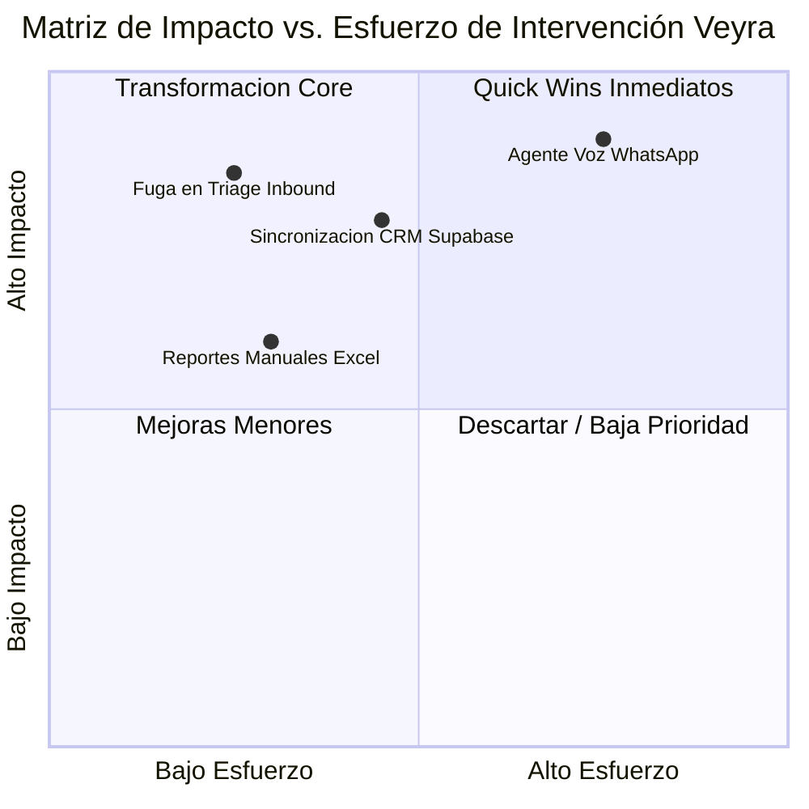

# 🩺 Business MRI™ — Diagnóstico Operativo & Tecnológico

> [!IMPORTANT]
> **Score de Madurez Digital:** `{{digital_maturity_score}} / 100`  
> **Fuga de Capital Estimada:** `$ {{leakage_cost_usd_monthly}} USD / mes` por procesos manuales, pérdida de leads y desconexión de sistemas.

---

## 🔬 Matriz de Evaluación en 4 Pilares

### 1. Pilar A — Flujo de Captación & Conversión
- **Tiempo de Primera Respuesta (T1R):** `{{actual_response_time}}` *(Meta Veyra: < 45 seg)*.
- **Tasa de Abandono de Prospectos:** `{{lead_drop_rate}}%`.
- **Canales Evaluados:** {{channels_evaluated}}.
- **Cuellos de Botella Identificados:**
  - {{captacion_bottleneck_1}}
  - {{captacion_bottleneck_2}}

### 2. Pilar B — Eficiencia Operativa & Horas Hombre
- **Horas/Semana en Tareas Repetitivas:** `{{manual_hours_weekly}} hrs`.
- **Costo Operativo de Fricción:** `$ {{friction_cost_usd}} USD / mes`.
- **Procesos Manuales Críticos:**
  1. *{{manual_process_1}}*: {{process_1_detail}}
  2. *{{manual_process_2}}*: {{process_2_detail}}

### 3. Pilar C — Stack Tecnológico & Conectividad de Datos
- **Nivel de Fragmentación de Datos:** {{data_fragmentation_level}} [Bajo / Medio / Crítico].
- **Sistemas en Silos:** {{siloed_systems}}.
- **Capacidad de Integración API:** {{api_readiness}} [Nula / Básica / Abierta].

### 4. Pilar D — Fuga de Capital Oculta
- **Pérdida por Lead No Contactado:** `$ {{loss_per_missed_lead}} USD`.
- **Pérdida por Errores de Facturación/SLA:** `$ {{loss_per_sla_error}} USD`.
- **Pérdida Total Anualizada:** `$ {{annual_capital_leakage}} USD`.

---

## 🎯 Veredicto y Recomendación de Intervención

| Hito Recomendado | Acción Prescrita | Impacto Esperado |
| :--- | :--- | :--- |
| **Fase 1 (Quick Win)** | {{phase_1_action}} | Reducción del 70% en tiempo de respuesta |
| **Fase 2 (Core Engine)** | {{phase_2_action}} | Ahorro de 25 hrs/semana en carga operativa |
| **Fase 3 (Scale & AI)** | {{phase_3_action}} | Incremento del 35% en conversión de leads |

---

## 🔗 Pasos Siguientes
- Convertir este diagnóstico a **Propuesta Blueprint:** [[02_Propuesta_Comercial|02_Propuesta_Comercial]]
- Definir **Arquitectura Técnica:** [[03_Arquitectura_Tecnica|03_Arquitectura_Tecnica]]
