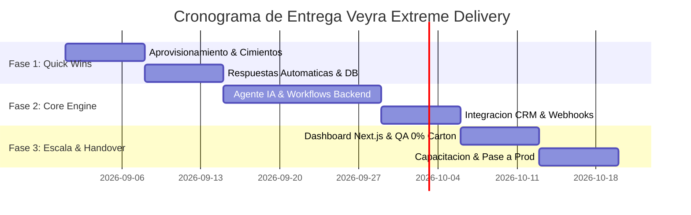

# 📑 Solution Blueprint & Propuesta de Alto Impacto

> [!NOTE]
> **Cliente:** `{{client_name}}`  
> **Inversión Total:** `$ {{investment_usd}} USD` | **Retorno Proyectado (ROI):** `{{estimated_roi_multiplier}}x en 6 meses`

---

## 1. El Diagnóstico Reconfirmado
Basado en la auditoría [[01_Diagnostico_MRI|Business MRI™]]:
- Identificamos una fuga de capital estimada en **$ {{leakage_cost_usd_monthly}} USD/mes**.
- Retraso en tiempo de respuesta actual: **{{actual_response_time}}**.
- Cuello de botella principal: {{primary_operational_bottleneck}}.

---

## 2. El Estado Futuro Deseado (Transformación Operativa)
La operación automatizada de `{{client_name}}` operará bajo el estándar Veyra:
- **Triage y respuesta instantánea:** Inferencia de IA en `< 45 segundos` 24/7 vía WhatsApp y Web.
- **Sincronización Unificada:** Base de datos relacional en PostgreSQL/Supabase con RLS y sincronización en tiempo real.
- **Dashboard Gerencial:** Visibilidad total de KPIs de conversión y rendimiento operativo.

---

## 3. Plan de Intervención en 3 Fases

### Fase 1: Cimientos & Quick Wins (Semanas 1-2)
- Despliegue de esquemas de datos Supabase con seguridad RLS.
- Enrutador de leads Trinidad Router conectado al WhatsApp oficial.
- *Entregable Hito 1:* Flujo base respondiendo y guardando leads verificados.

### Fase 2: Core Engine & AI Automation (Semanas 3-5)
- Agente conversacional Gemini 1.5 Pro / Flash con contexto de negocio y tool calling.
- Automatizaciones de backend en FastAPI / Mapache Core para agendamiento y cotización automática.
- *Entregable Hito 2:* Staging funcional al 100% probado en sesión en vivo.

### Fase 3: Dashboard, QA & Adopción (Semanas 6-8)
- Dashboard gerencial en Next.js con interfaz Neumorphic / Glass.
- Suite de pruebas de estrés, seguridad y rendimiento.
- Loom Academy y sesión práctica de capacitación para el equipo.
- *Entregable Hito 3:* Pase a producción, actas firmadas y Go-Live oficial.

---

## 4. Estructura de Inversión y Términos Comerciales

| Concepto | Monto (USD) | Hito de Cobro | Condición de Activación |
| :--- | :--- | :--- | :--- |
| **50% Anticipo de Kickoff** | `$ {{down_payment_usd}}` | Hito 0 | Firma de acuerdo y bloqueo de sprint |
| **30% Hito Intermedio Core** | `$ {{mid_payment_usd}}` | Hito 2 | Presentación de Staging funcional |
| **20% Liquidación Final** | `$ {{final_payment_usd}}` | Hito 3 | QA aprobado y entrega de producción |
| **Total Inversión** | **`$ {{investment_usd}}`** | — | — |

> [!WARNING]
> **Condición de Blindaje Veyra:** Validez de cotización estricta por 14 días. Cero despliegue en producción sin liquidación de hito.

---

## 5. Garantía de Desempeño Veyra
- **Garantía 0% Cartón:** 30 días de corrección gratuita de incidencias post-lanzamiento.
- **Propiedad Intelectual:** 100% del código y activos entregados al cliente tras la liquidación final.
