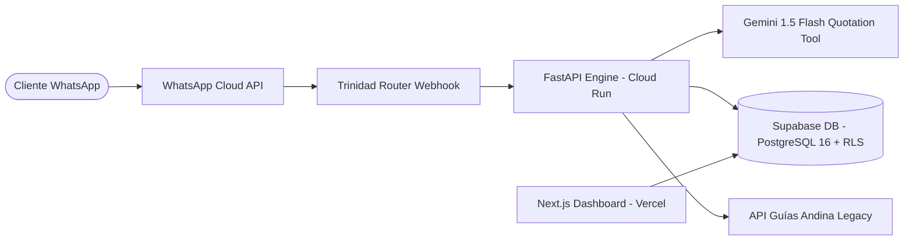

# 🏗️ Arquitectura Técnica Implementada: Andina Engine

- **Base de Datos:** Supabase PostgreSQL con RLS particionado por rutas nacionales.
- **Inferencia:** Google Gemini 1.5 Flash con latencia < 700ms y función `calculate_shipping_rate(origin, destination, weight, volume)`.
