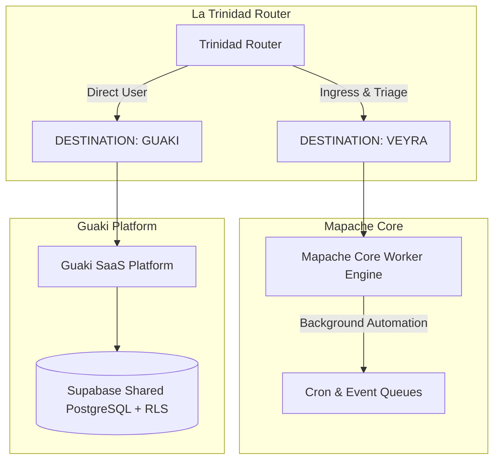

# ⚙️ 02_Sistemas — Arquitectura e Infraestructura Propietaria

> [!NOTE]
> Documentación técnica profunda de las 3 plataformas maestras que componen el ecosistema Veyra / La Trinidad / Guaki.

---

## 🏛️ Las Tres Columnas Tecnológicas

### 1. [[02_Sistemas/Mapache_Core/00_Index|Mapache_Core/]]
Motor de orquestación en background, colas asíncronas y automatización de procesos empresariales pesados.

### 2. [[02_Sistemas/Trinidad_Router/00_Index|Trinidad_Router/]]
Capa de enrutamiento omnicanal, detección de intención en tiempo real y triage inteligente de prospectos hacia Veyra o Guaki.

### 3. [[02_Sistemas/Guaki_Platform/00_Index|Guaki_Platform/]]
Plataforma SaaS multi-tenant, esquemas relacionales de Supabase, interfaces de usuario y catálogo de agentes cognitivos.
