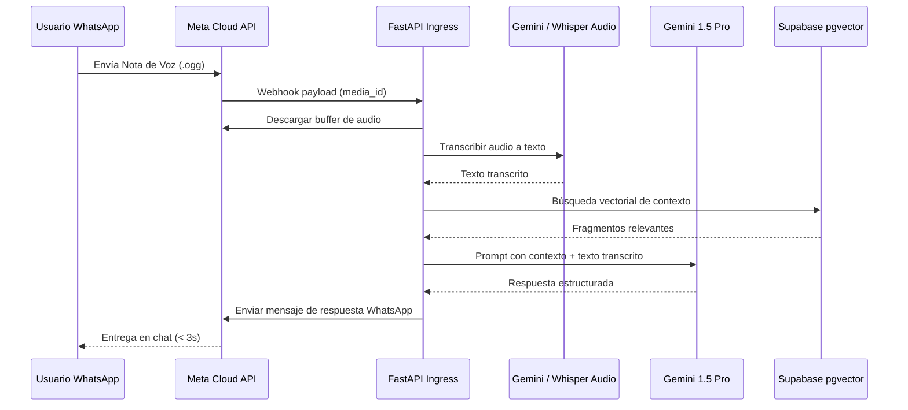

# 📖 Playbook: Agente de Voz y Texto Omnicanal (WhatsApp + Whisper + Gemini)

## 🎯 Objetivo
Configurar el pipeline de recepción de notas de voz en WhatsApp, transcripción asíncrona mediante OpenAI Whisper / Gemini Audio Ingestion, y generación de respuesta contextual de texto/audio en < 3 segundos.

## 🛠️ Pipeline de Audio

