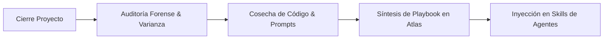

# 📖 Playbook: Protocolo de Extracción Post-Mortem & Fábrica de Playbooks (Paso 20)

> [!IMPORTANT]
> **La Ley de Escala Veyra:** *Ningún proyecto se considera cerrado hasta que su conocimiento ha sido extraído, sus componentes modulares cosechados y al menos un Playbook creado o actualizado.*

---

## 🎯 Objetivo
Ejecutar la auditoría forense al finalizar la entrega de un cliente (Paso 17/18), medir desviaciones presupuestales y de tiempo, empaquetar código reutilizable y sintetizar un Playbook auditable que aumente la eficiencia de futuros proyectos en un 10% y el margen en un 20%.

---

## 🛠️ Procedimiento en 4 Etapas

### Etapa 1: Auditoría Forense de Varianza (Día +1 tras Cierre)
1. Comparar horas cotizadas vs. horas reales registradas.
2. Identificar causas raíz de sobrecostos o fricciones técnicas.
3. Completar el documento `06_PostMortem_Cierre.md` en la carpeta del cliente.

### Etapa 2: Cosecha Modular (Asset Harvesting)
1. Extraer funciones, hooks, scripts SQL y prompts que no contengan datos sensibles del cliente.
2. Generalizar el código haciéndolo configurable mediante variables de entorno.
3. Registrar la ficha en `04_Componentes_Reutilizables/`.

### Etapa 3: Redacción / Actualización de Playbook
1. Si el flujo es nuevo, instanciar `Template_Playbook_Operativo.md` en `03_Playbooks/`.
2. Si el flujo ya existía, incrementar versión semántica (`MAJOR.MINOR.PATCH`) y documentar los casos borde superados.

### Etapa 4: Inyección en el Ecosistema de Agentes de IA
1. Sincronizar el contenido del playbook hacia las herramientas y skills de los agentes de IA (`.agents/skills/`).
2. Validar que los agentes cognitivos puedan invocar y referenciar el nuevo conocimiento en futuros desarrollos.
