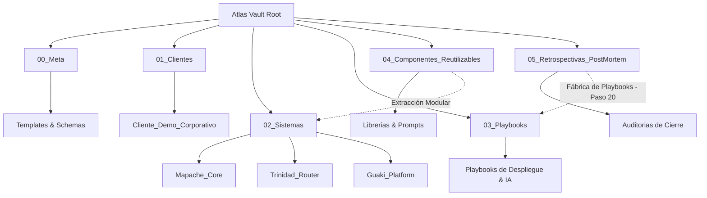

# 🧠 ATLAS VAULT — Bóveda de Conocimiento Operativo & Playbooks

> [!NOTE]
> **Atlas Vault** es el sistema nervioso central y base de conocimiento bidireccional de **Veyra** y **La Trinidad / Guaki**. Aquí se almacena cada diagnóstico, arquitectura, acta, componente reutilizable y playbook derivado de proyectos reales (Pasos 19 y 20 del MOP).

---

## 🗺️ Mapa de Contenidos (MOC - Map of Content)

---

## 📂 Estructura de Directorios

### 1. [[00_Meta/00_INDEX_META|00_Meta/]]
Plantillas maestras estandarizadas, esquemas YAML de metadatos y configuración de taxonomías para Obsidian.
- 📄 [[00_Meta/Templates/Template_Diagnostico_MRI|Template_Diagnostico_MRI]]
- 📄 [[00_Meta/Templates/Template_Propuesta_Solution_Blueprint|Template_Propuesta_Solution_Blueprint]]
- 📄 [[00_Meta/Templates/Template_Arquitectura_Tecnica|Template_Arquitectura_Tecnica]]
- 📄 [[00_Meta/Templates/Template_Acta_Reunion|Template_Acta_Reunion]]
- 📄 [[00_Meta/Templates/Template_Caso_de_Estudio|Template_Caso_de_Estudio]]
- 📄 [[00_Meta/Templates/Template_PostMortem_Retrospectiva|Template_PostMortem_Retrospectiva]]
- 📄 [[00_Meta/Templates/Template_Playbook_Operativo|Template_Playbook_Operativo]]
- 📄 [[00_Meta/Templates/Template_Ficha_Cliente|Template_Ficha_Cliente]]
- 📄 [[00_Meta/Templates/Template_Componente_Reutilizable|Template_Componente_Reutilizable]]

### 2. [[01_Clientes/00_CLIENTES_INDEX|01_Clientes/]]
Expediente vivo de cada cliente intervenido por Veyra. Contiene diagnósticos, cotizaciones, blueprints técnicos, actas de sprints y análisis de ROI.
- 📁 [[01_Clientes/Cliente_Demo_Corporativo/00_Ficha_Cliente|Cliente_Demo_Corporativo/]] (Caso ejemplar de referencia).

### 3. [[02_Sistemas/00_SISTEMAS_INDEX|02_Sistemas/]]
Documentación técnica profunda de la infraestructura propietaria del ecosistema Veyra / Guaki:
- 📁 [[02_Sistemas/Mapache_Core/00_Index|Mapache_Core/]]: Motor de automatización y orquestación de agentes.
- 📁 [[02_Sistemas/Trinidad_Router/00_Index|Trinidad_Router/]]: Enrutador omnicanal inteligente y triage de prospectos.
- 📁 [[02_Sistemas/Guaki_Platform/00_Index|Guaki_Platform/]]: Plataforma SaaS central, base de datos Supabase e inferencia de IA.

### 4. [[03_Playbooks/00_PLAYBOOKS_INDEX|03_Playbooks/]]
Procedimientos de ingeniería, delivery y operaciones paso a paso listos para ejecutar por squads humanos o agentes de IA.
- 📄 [[03_Playbooks/Veyra_Inbound_Triage_Playbook|Veyra_Inbound_Triage_Playbook]]
- 📄 [[03_Playbooks/FastAPI_Supabase_AI_Engine_Scaffolding|FastAPI_Supabase_AI_Engine_Scaffolding]]
- 📄 [[03_Playbooks/NextJS_Glass_Dashboard_Deployment|NextJS_Glass_Dashboard_Deployment]]
- 📄 [[03_Playbooks/Omnichannel_WhatsApp_Voice_Agent|Omnichannel_WhatsApp_Voice_Agent]]
- 📄 [[03_Playbooks/PostMortem_Extraction_Playbook|PostMortem_Extraction_Playbook]]

### 5. [[04_Componentes_Reutilizables/00_COMPONENTES_INDEX|04_Componentes_Reutilizables/]]
Catálogo de bloques modulares de código, arquitecturas de datos y Golden Prompts cosechados de proyectos exitosos.

### 6. [[05_Retrospectivas_PostMortem/00_POSTMORTEM_INDEX|05_Retrospectivas_PostMortem/]]
Auditorías post-cierre, análisis de varianza presupuestal/horas, lecciones aprendidas y disparadores de la Fábrica de Playbooks.

---

## ⚡ Reglas de Navegación e Hipervinculación
1. Toda nota debe contener YAML Frontmatter completo (`title`, `type`, `status`, `date`, `tags`, `version`).
2. Utilizar enlaces bidireccionales en formato Wikilink `[[Nota_Destino]]`.
3. Todo hallazgo relevante debe ser indexado con su tag correspondiente (`#diagnostico`, `#playbook`, `#arquitectura`, `#postmortem`).
