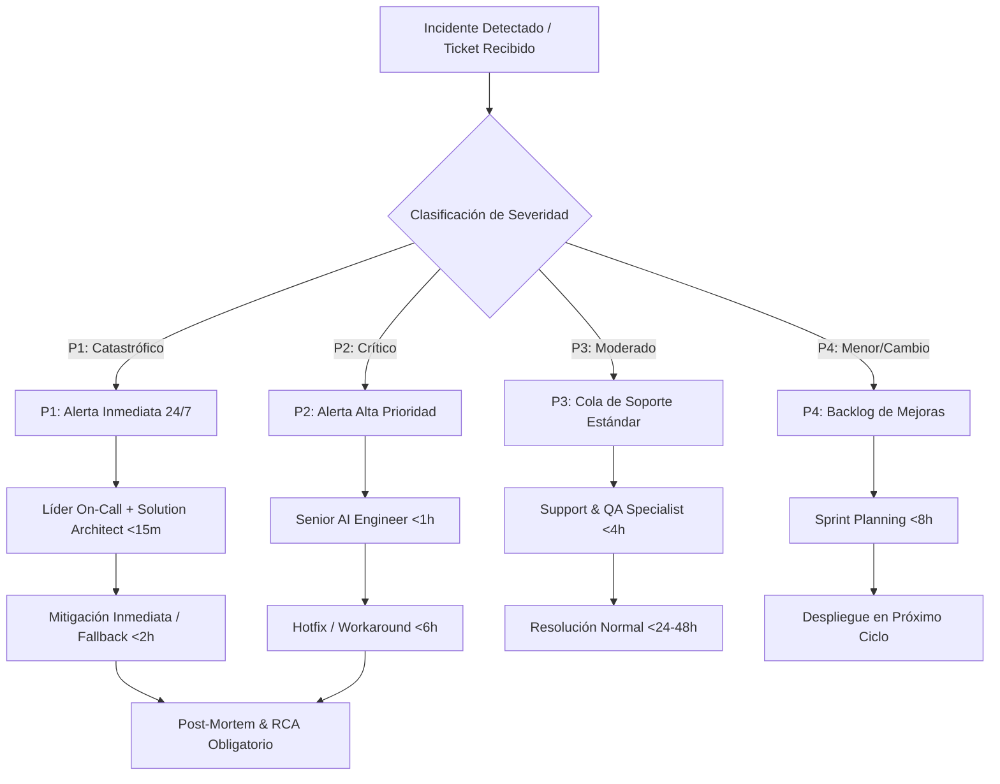
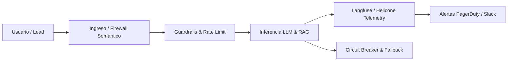

# 🛡️ FRAMEWORK DE SOPORTE, SLAs, ESCALAMIENTO Y RETAINERS — VEYRA
### *Paso 16 del Manual Operativo Maestro Veyra: Continuidad Operativa, SLAs (<2h), Matriz de Incidentes P1-P4, Catálogo Care & Scale y Protocolos de Observabilidad de IA*

---

## 1. Filosofía de Continuidad Operativa Veyra (0% Cartón)

En **Veyra**, un sistema de Inteligencia Artificial o automatización no se considera "entregado" solo porque compiló en producción. Los sistemas agénticos, las cadenas RAG y los pipelines de automatización son ecosistemas vivos sometidos a:
1. **Variabilidad estocástica de los modelos LLM** (alucinaciones, latencia flotante, cambios en APIs de proveedores).
2. **Dependencias externas** (APIs de CRM, webhooks de pagos, WhatsApp Business API, Meta/Twilio).
3. **Evolución continua del negocio del cliente** (cambios en catálogos, políticas, objeciones de ventas y flujos internos).

Nuestra premisa fundamental es: **La proactividad supera a la reactividad**. Monitoreamos y mitigamos antes de que el cliente o sus usuarios finales experimenten una falla en sus operaciones.

---

## 2. Definición de Niveles de Servicio (SLA Master Framework)

### 2.1 Métricas Clave de SLA
* **FRT (First Response Time / Tiempo de Primera Respuesta):** Tiempo transcurrido desde que se genera el ticket/alerta hasta que un ingeniero especializado diagnostica y emite acuse de recibo formal con plan de acción.
* **MTTR (Mean Time to Resolution / Tiempo Medio de Resolución):** Tiempo transcurrido hasta el restablecimiento completo del servicio o la aplicación de un *Workaround* (parche de mitigación) funcional garantizado.
* **Uptime Target:** Disponibilidad garantizada de los endpoints de orquestación (FastAPI/Make/n8n/Supabase) al **99.9%** mensual.

### 2.2 Ventanas Operativas y Horarios de Atención
| Canal / Modalidad | Horario de Cobertura | Canales Habilitados |
| :--- | :--- | :--- |
| **Soporte Estándar (Garantía & Care)** | Lunes a Viernes: 08:00 – 18:00 (GMT-5) | Slack Connect, Helpdesk Portal, WhatsApp VIP Desk |
| **Soporte Crítico P1 (Scale & Enterprise)** | **24/7/365** (Guardia On-Call PagerDuty) | PagerDuty Direct Trigger, Hot-line Telefónica + WhatsApp Urgent Desk |

---

## 3. Matriz de Escalamiento y Gestión de Incidentes (P1 a P4)



### 3.1 Tabla Detallada de Clasificación de Incidentes

| Nivel de Severidad | Criterio de Impacto Operativo | SLA Primera Respuesta | SLA Mitigación / Resolución | Responsable Principal | Canales de Notificación |
| :--- | :--- | :--- | :--- | :--- | :--- |
| **P1 — Catastrófico (Blocker)** | • Caída total del agente de IA en producción.<br>• Falla masiva en flujo de checkout o captura de leads.<br>• Fuga de datos o vulnerabilidad de seguridad.<br>• Bucle infinito de consumo de tokens en API externa. | **< 15 minutos** *(24/7)* | **< 2 horas** *(Workaround)*<br>**< 4 horas** *(Fix definitivo)* | Lead Solution Architect + Fractional CTO | PagerDuty + Llamada de Emergencia + Slack `#incidents-p1` |
| **P2 — Crítico (Major)** | • Degradación severa en calidad de respuestas (alucinaciones recurrentes).<br>• Latencia anormal de inferencia (>15 seg).<br>• Fallo intermitente de webhooks CRM o Make/n8n.<br>• No hay pérdida de datos pero afecta la operación central. | **< 1 hora** *(Horario Hábil / Extendido)* | **< 6 horas** *(Workaround)*<br>**< 12 horas** *(Fix definitivo)* | Senior AI & Automation Engineer | Slack Connect VIP + WhatsApp VIP + Ticket P2 |
| **P3 — Moderado (Minor)** | • Fallo en componente secundario (ej. reporte diario demorado).<br>• Inconsistencia estética en dashboards o interfaces Glassmorphic.<br>• Errores aislados de parsing con workaround operativo viable. | **< 4 horas** *(Horario Hábil)* | **< 24 a 48 horas** | QA & Support Specialist | Portal de Tickets / Slack `#support` |
| **P4 — Bajo (Service Request / Cosmetic)** | • Consultas técnicas y dudas de uso.<br>• Ajustes menores de copy o prompts que no bloquean ventas.<br>• Solicitudes de nuevas integraciones o cambios fuera del alcance inicial. | **< 8 horas** *(Horario Hábil)* | Programado en siguiente Sprint Semanal | Product Manager / Project Lead | Portal de Tickets Veyra |

---

## 4. Protocolo de Gestión de Incidentes P1 y Post-Mortem (RCA)

Cuando ocurre un incidente **P1 (Catastrófico)**, el equipo de Veyra sigue el siguiente protocolo estricto:

### 4.1 Fases del Incidente
1. **Triage & Aislamiento (Minuto 0 - 15):**
   * Se activa el *Circuit Breaker* si el problema involucra costos o respuestas descontroladas.
   * Se conmuta al *Fallback Engine* (ej. desvío de WhatsApp a agente humano o modelo de respaldo Gemini 1.5 Flash / Claude Haiku).
2. **War Room & Mitigación (Minuto 15 - 120):**
   * Creación de canal temporal `#incident-[ID]-[Cliente]` en Slack.
   * Diagnóstico a través de logs de Langfuse/Helicone y Sentry.
   * Despliegue de hotfix a staging y verificación antes de promoción a producción.
3. **Comunicación al Cliente:**
   * Actualizaciones cada **30 minutos** con estado técnico claro (sin tecnicismos confusos, 100% transparencia).
4. **Cierre y Post-Mortem (Primeras 48 horas post-incidente):**
   * Elaboración del documento formal de *Root Cause Analysis (RCA)*.
   * Implementación de pruebas automatizadas en CI/CD para evitar regresiones.

### 4.2 Plantilla de Post-Mortem Ejecutivo (RCA Template)
```markdown
# 📋 POST-MORTEM & ROOT CAUSE ANALYSIS (RCA) — VEYRA
**Incidente ID:** INC-2026-XXXX
**Cliente:** [Nombre del Cliente]
**Fecha y Hora:** YYYY-MM-DD HH:MM (GMT-5)
**Duración del Downtime:** XX minutos
**Severidad:** P1

---

### 1. Resumen Ejecutivo
Descripción concisa de qué ocurrió, impacto en el negocio y cómo fue restablecido el servicio.

### 2. Cronología de los Hechos (Timeline)
- **10:14** — Detección automática por alerta de Helicone (Spike de errores 500 en OpenAI API).
- **10:18** — Acuse de recibo y apertura de War Room por Senior AI Engineer.
- **10:32** — Activación del Circuit Breaker y desvío hacia motor de fallback en Gemini 1.5 Flash.
- **11:05** — Despliegue de parche de reintentos exponenciales y validación en Staging.
- **11:20** — Servicio 100% restablecido y verificado en Producción.

### 3. Causa Raíz (5 Whys)
1. *¿Por qué falló el agente?* Timeout recurrente en la API del proveedor de embeddings.
2. *¿Por qué hubo timeout?* La base vectorial no tenía índice HNSW optimizado para >50k vectores.
3. *¿Por qué creció la base a 50k?* Sincronización duplicada de registros históricos desde el CRM.
4. *¿Por qué se duplicó?* El webhook de actualización carecía de validación de idempotencia.
5. *Causa raíz definitiva:* Falta de deduplicación por hash (idempotency key) en el ingestor de webhooks.

### 4. Acciones Correctivas y Preventivas (Action Items)
| Acción Correctiva | Responsable | Fecha Límite | Estado |
| :--- | :--- | :--- | :--- |
| Implementar hash de idempotencia en todos los webhooks de ingestión | Lead Engineer | 24h post-incidente | COMPLETADO |
| Indexación HNSW optimizada en Supabase pgvector | Backend Lead | 48h post-incidente | EN CURSO |
| Agregar test de estrés de 100k vectores en pipeline de CI/CD | QA Lead | Fin de Sprint | PROGRAMADO |
```

---

## 5. Catálogo Comercial de Retainers Recurrentes (Care & Scale)

Nuestros planes de soporte continuo están diseñados para garantizar estabilidad, optimización constante del ROI y evolución tecnológica sin sorpresas.

```
┌─────────────────────────────────────────────────────────────────────────────┐
│                    CATÁLOGO DE RETAINERS VEYRA 2026                         │
├──────────────────────┬──────────────────────┬───────────────────────────────┤
│    ESSENTIAL CARE    │    GROWTH & SCALE    │     ENTERPRISE AI PARTNER     │
│   $550 USD / mes     │   $1,450 USD / mes   │       $3,200 USD / mes        │
│   ($2.2M COP/mes)    │   ($5.8M COP/mes)    │       ($12.8M COP/mes)        │
├──────────────────────┼──────────────────────┼───────────────────────────────┤
│ • Monitoreo Uptime   │ • Todo lo de Care    │ • Todo lo de Growth & Scale   │
│ • Backups diarios    │ • 15h desarrollo/mes │ • 40h ingeniería/mes          │
│ • Parches seguridad  │ • Optimización RAG   │ • Lead AI Architect Asignado  │
│ • 5h soporte/mes     │ • Fine-tuning prompt │ • SLA P1 < 15 min (24/7)      │
│ • SLA P1 < 2h        │ • Control de tokens  │ • Circuit Breakers Avanzados  │
│ • SLA P2 < 6h        │ • SLA P1 < 30 min    │ • Reunión Estratégica Quince. │
└──────────────────────┴──────────────────────┴───────────────────────────────┘
```

### 5.1 Fichas Detalladas por Nivel

#### Nivel 1: Veyra Essential Care™
* **Inversión:** **$550 USD / mes** ($2,200,000 COP).
* **Enfoque:** Mantenimiento preventivo, estabilidad de infraestructura y continuidad operativa.
* **Incluye:**
  * Monitoreo automatizado de Uptime 24/7 (endpoints, bases de datos y webhooks).
  * Backups diarios automáticos y cifrados de bases vectoriales y PostgreSQL.
  * Actualizaciones de dependencias críticas y parches de seguridad.
  * **5 horas mensuales** de soporte técnico, corrección de bugs o ajustes menores.
  * SLA de primera respuesta: `< 2 horas` hábiles para incidentes P1; `< 6 horas` para P2.
  * Reporte mensual de salud del sistema y uptime.

#### Nivel 2: Veyra Growth & Scale™ *(El Más Popular)*
* **Inversión:** **$1,450 USD / mes** ($5,800,000 COP).
* **Enfoque:** Optimización proactiva de IA, refinamiento de conversión y evolución funcional continua.
* **Incluye:**
  * **Todo lo incluido en Essential Care.**
  * **15 horas mensuales** de desarrollo ágil (creación de nuevos flujos, nuevos endpoints, integración de nuevas herramientas).
  * Monitoreo continuo de calidad de IA (Langfuse/Helicone): Detección de alucinaciones y ajustes de prompts quincenales.
  * Optimización de base de conocimiento RAG (limpieza de embeddings y chunks obsoletos).
  * Auditoría mensual de costos de APIs de IA y recomendaciones de reducción de gasto en tokens.
  * SLA de primera respuesta: `< 30 minutos` para incidentes P1; `< 2 horas` para P2.
  * Canal exclusivo de Slack Connect / WhatsApp VIP con acceso directo al Squad de Ingeniería.

#### Nivel 3: Enterprise AI Partner & Fractional CTO™
* **Inversión:** **$3,200 USD / mes** ($12,800,000 COP).
* **Enfoque:** Co-pilotaje tecnológico total, arquitectura avanzada multi-agente y soporte crítico 24/7.
* **Incluye:**
  * **Todo lo incluido en Growth & Scale.**
  * **40 horas mensuales** dedicadas de ingeniería full-stack, automatización y ciencia de datos.
  * **Lead Solution Architect / Fractional CTO asignado** para comités ejecutivos y estrategia de crecimiento.
  * Soporte crítico **P1 24/7/365** con SLA de respuesta `< 15 minutos` e intervención telefónica inmediata.
  * Fine-tuning periódico de modelos Open Source / Propietarios y evaluación de datasets sintéticos.
  * Pruebas de estrés mensuales (Chaos Engineering en webhooks y límites de cuota de LLM).
  * Sesión estratégica quincenal de ROI y nuevas oportunidades de automatización empresarial.

### 5.2 Políticas y Reglas Comerciales de Retainers
1. **Rollover de Horas:** Hasta un **25%** de las horas no utilizadas de un mes pueden acumularse exclusivamente para el mes siguiente. No son redimibles por dinero en efectivo.
2. **Bolsa de Horas Extra (Burst Capacity Pack):** Si el cliente requiere desarrollo adicional más allá de su plan, las horas extra se facturan a tarifa preferencial de retainer:
   * Horas adicionales en Essential Care: $45 USD / hora.
   * Horas adicionales en Growth & Scale: $40 USD / hora.
   * Horas adicionales en Enterprise Partner: $35 USD / hora.
3. **Plazo Mínimo:** Acuerdos trimestrales (3 meses) con renovación automática y preaviso de 30 días para cancelación.

---

## 6. Protocolos de Monitoreo & Observabilidad de IA (AI Guardrails)

Para asegurar la confiabilidad del sistema de IA, Veyra implementa una arquitectura de observabilidad en 5 capas:



### 6.1 Monitoreo de Latencia y Throughput
* **Métricas Rastreadas:**
  * TTFT (*Time to First Token*): Target `< 800ms`.
  * Latencia de Respuesta Total (E2E): Target `< 3.5s` en llamadas complejas RAG.
  * Tasa de throughput (Tokens/segundo) y colas de espera en webhooks.
* **Acción Automática:** Si la latencia media P95 supera 6.0 segundos durante 5 minutos consecutivos, el enrutador conmuta temporalmente a un modelo de inferencia ultrarrápido (Gemini 1.5 Flash) con prompts comprimidos.

### 6.2 Detección de Drift de Datos y Alucinaciones (Model & Data Drift)
* **Evaluación Continua RAG:**
  * **Faithfulness Score:** Medición de si la respuesta generada se sustenta al 100% en los documentos recuperados de la base vectorial. (Threshold mínimo: `>= 0.88`).
  * **Answer Relevance Score:** Pertinencia de la respuesta frente a la intención real del usuario. (Threshold mínimo: `>= 0.85`).
  * **Context Recall & Precision:** Precisión en la recuperación de chunks en Supabase pgvector.
* **Rutina de Auditoría:** Muestreo automático del **10% de las conversaciones diarias** evaluadas mediante un pipeline `LLM-as-a-Judge` (usando Claude 3.5 Sonnet con rúbrica estricta). Toda conversación con score `< 0.80` genera un ticket P3 para revisión de prompt/chunking.

### 6.3 Seguridad, Prompt Injection y Jailbreak Defense
* **Filtros de Entrada (Input Guardrails):**
  * Sanitización de texto para bloquear inyecciones comunes (*"Ignore previous instructions"*, *"System prompt dump"*, intentos de override de personalidad).
  * Filtro de datos sensibles (DLP): Detección y enmascaramiento automático de números de tarjetas de crédito, contraseñas y claves privadas antes de enviar al LLM.
* **Filtros de Salida (Output Guardrails):**
  * Validación de estructura JSON estricta (Pydantic schemas) para evitar respuestas truncadas o corrompidas hacia el frontend o webhooks.
  * Verificación de tono de marca y exclusión de respuestas con contenido lesivo, falso o fuera de la política comercial de la empresa.

### 6.4 Control de Presupuesto de Tokens y Circuit Breakers
* **Límites de Cuota por Usuario/IP:** Máximo 25 interacciones / hora por usuario no autenticado para prevenir ataques de denegación de servicio económico (*Denial of Wallet*).
* **Niveles de Alarma de Presupuesto:**
  * **Nivel 1 (80% del budget diario consumido):** Alerta en Slack `#alerts-costs` para revisión del equipo técnico.
  * **Nivel 2 (95% del budget diario consumido):** Activación de caché agresiva semántica (Redis / Upstash) y reducción de contexto de historial (máximo 4 mensajes anteriores).
  * **Nivel 3 (100% del budget diario consumido / Circuit Breaker):** Conmutación a modo de contingencia: respuestas deterministas basadas en FAQ pre-indexadas y desvío inmediato a agentes humanos en WhatsApp con notificación push.

---

## 7. Runbooks Operativos de Emergencia

### 7.1 Runbook: Caída Global de Proveedor de LLM (OpenAI / Anthropic / Google)
1. **Detección:** Alerta de Helicone: `Error Rate > 15% en ventana de 3 minutos`.
2. **Paso 1 — Fallback Multi-Provider:**
   * El sistema `Trinidad Router` / `Mapache Core` cambia automáticamente la variable de enrutamiento `ACTIVE_LLM_PROVIDER`:
     * Primario (Claude 3.5 Sonnet / OpenAI GPT-4o) $\rightarrow$ Secundario (Google Gemini 1.5 Pro / Flash) $\rightarrow$ Terciario (Mistral Large vía Groq / DeepSeek).
3. **Paso 2 — Notificación:** Mensaje automatizado al canal `#status` del cliente: *"Degradación detectada en proveedor principal; enrutando tráfico a motor secundario de alta velocidad sin interrupción de servicio."*
4. **Paso 3 — Retorno a la normalidad:** Monitoreo de health-checks cada 5 minutos. Tras 15 minutos continuos de 0% errores en el proveedor primario, se restablece el enrutamiento estándar.

### 7.2 Runbook: Desconexión de Webhook de WhatsApp / CRM
1. **Detección:** Falla en acuse de recibo HTTP 200 en endpoint `/webhooks/whatsapp` durante más de 60 segundos.
2. **Paso 1 — Cola de Persistencia (Dead Letter Queue):**
   * Todos los mensajes entrantes se almacenan en cola persistente Redis / Supabase `raw_webhook_events` para evitar pérdida de leads.
3. **Paso 2 — Reintentos con Backoff Exponencial:**
   * Ejecución de reintentos a los 5s, 30s, 2m, 10m y 30m.
4. **Paso 3 — Drenaje de Cola:**
   * Una vez restablecido el CRM o servicio de mensajería, se procesan los eventos en orden cronológico garantizando idempotencia.

---

## 8. Checklist de Auditoría Periódica de Salud de Sistemas (Health-Check)

### Diario (Automatizado vía Cron / Supabase Function):
- [ ] Verificación de 0 errores no controlados en Sentry.
- [ ] Verificación de saldo y límites de cuota en OpenAI, Anthropic, Google AI Studio y Twilio.
- [ ] Uptime status de endpoints de FastAPI y workflows en n8n/Make.

### Semanal (Squad de Soporte Veyra):
- [ ] Revisión del Top 10 de consultas con menor score de satisfacción o relevancia semántica.
- [ ] Detección y re-indexación de vectores con contenido desactualizado en la base de conocimiento.
- [ ] Verificación de logs de backup y pruebas aleatorias de restauración.

### Mensual (Revisión con el Cliente):
- [ ] Envío del Informe Ejecutivo de Continuidad Operativa (Uptime %, Tickets resueltos, Ahorro de tiempo, Costo de tokens).
- [ ] Planificación de mejoras para el siguiente ciclo del Retainer.
- [ ] Actualización de la Bóveda de Conocimiento en Atlas Vault.

---

*Documento aprobado para ejecución en producción por el Comité Técnico y de Operaciones de Veyra.*
