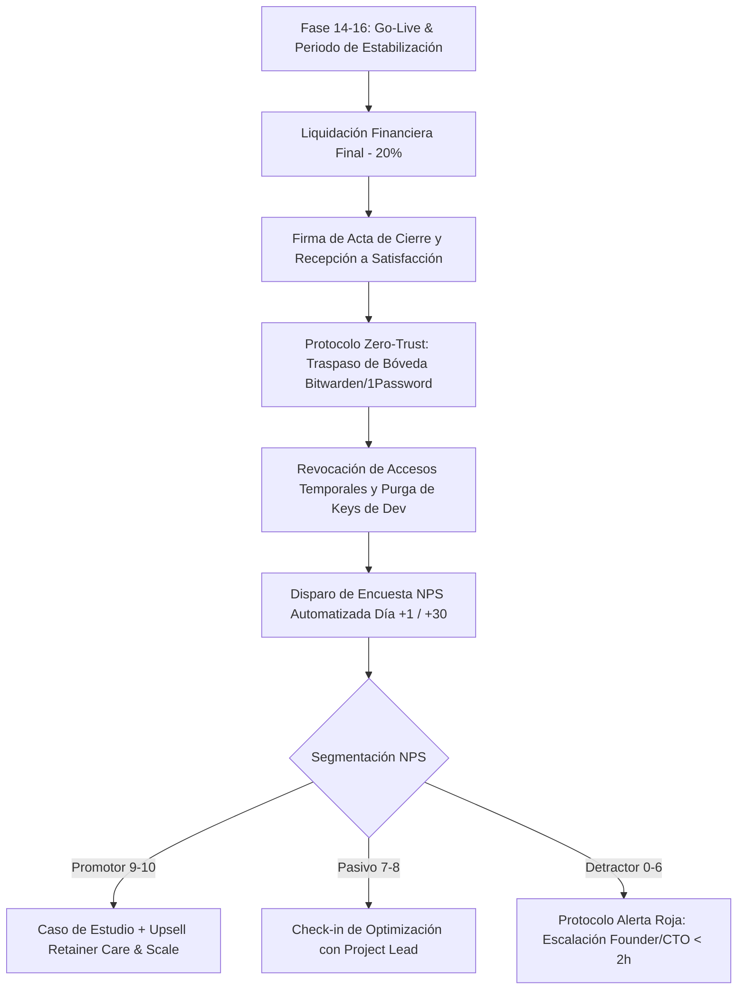
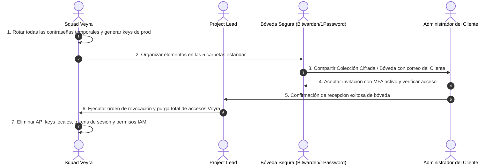
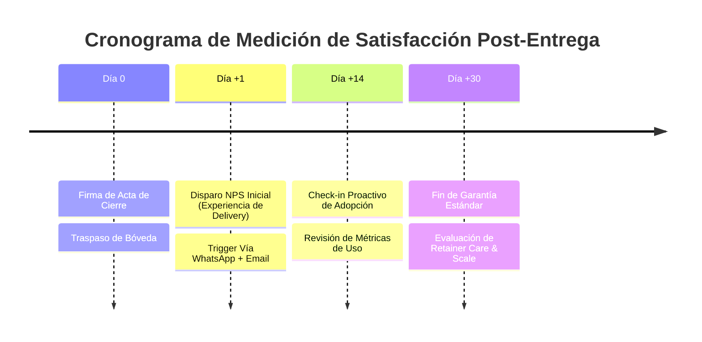
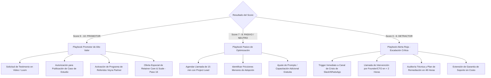

# 🛡️ PROTOCOLO OPERATIVO DE OFFBOARDING, HANDOVER Y CIERRE DE PROYECTO
### *Veyra Operational Framework — Paso 17: Acta de Cierre, Transferencia de Bóveda y NPS Engine*
**Versión:** 2.0.0 | **Estado:** Estándar Oficial de Producción | **Área:** Operaciones, Legal & Delivery

---

## 1. OBJETIVO Y ALCANCE

El presente documento establece el estándar institucional y obligatorio para la ejecución del **Paso 17 (Offboarding & Handover)** de la metodología Veyra. Su propósito es garantizar una transición ordenada, legalmente blindada, técnicamente segura y orientada a la fidelización del cliente una vez concluido el despliegue a producción.

### Principios Rectores:
1. **0% Deuda Operativa y Técnica:** Ningún proyecto se considera cerrado con accesos temporales activos, variables de entorno huérfanas o cobros pendientes.
2. **Blindaje de Propiedad Intelectual y Responsabilidad:** Transferencia explícita sujeta al 100% de liquidación financiera y deslinde formal sobre costos/políticas de APIs de terceros.
3. **Seguridad Zero-Trust en Handover:** Traspaso de credenciales maestras exclusivamente mediante bóvedas criptográficas de conocimiento cero (Bitwarden / 1Password), con revocación auditada de permisos de desarrollo.
4. **Ciclo de Retroalimentación Automatizado (NPS Loop):** Medición sistemática de la satisfacción para activar de inmediato estrategias de referidos, casos de estudio o protocolos de mitigación de fricciones.



---

## 2. ACTA DE CIERRE DE PROYECTO Y RECEPCIÓN A SATISFACCIÓN (PLANTILLA MAESTRA)

El siguiente instrumento legal y operativo debe ser diligenciado por el **Project Lead**, revisado por la Dirección Operativa y firmado digitalmente mediante plataforma certificada (DocuSign / SignWell / Adobe Sign) con valor probatorio pleno.

```markdown
================================================================================
          ACTA FORMAL DE CIERRE DE PROYECTO Y RECEPCIÓN A SATISFACCIÓN
                           REF: ACTA-VYR-[AÑO]-[ID_PROYECTO]
================================================================================

FECHA DE SUSCRIPCIÓN: [DD/MM/AAAA]
CIUDAD Y PAÍS: [Ciudad, País]
PROYECTO: [Nombre Oficial del Proyecto / Sistema Implementado]
CONTRATO MARCO / PROPUESTA COMERCIAL REF: [ID_PROPUESTA_O_CONTRATO]

ENTRE LAS PARTES:
1. DE UNA PARTE: VEYRA (en adelante "EL PROVEEDOR"), representada por su Líder de Soluciones / Representante Autorizado [Nombre y Cargo].
2. DE OTRA PARTE: [Razón Social o Nombre del Cliente] (en adelante "EL CLIENTE"), con Identificación Tributaria / NIT [Número de Identificación], representada legalmente por [Nombre del Representante Legal o Stakeholder Autorizado], con cargo [Cargo].

--------------------------------------------------------------------------------
CLÁUSULA PRIMERA — OBJETO DEL ACTA
--------------------------------------------------------------------------------
La presente acta tiene por objeto formalizar la entrega definitiva, puesta en producción, recepción a entera satisfacción y liquidación comercial y técnica del proyecto "[Nombre del Proyecto]", ejecutado de conformidad con el alcance acordado en el documento de propuesta comercial y especificaciones funcionales.

--------------------------------------------------------------------------------
CLÁUSULA SEGUNDA — HITOS Y ENTREGABLES VALIDADOS
--------------------------------------------------------------------------------
EL CLIENTE declara haber verificado, probado en entorno de producción y recibido a conformidad los siguientes componentes tecnológicos:

[X] 1. Arquitectura de Backend, Modelos de IA e Integraciones de Datos:
       - Configuración de pipelines en [FastAPI / Next.js / Supabase / Make / n8n].
       - Conexión e inferencia con modelos LLM [Google Gemini / Claude / OpenAI].
[X] 2. Interfaz de Usuario, Webhooks y Canales de Comunicación:
       - Frontend web, dashboard administrativo o flujos conversacionales de WhatsApp Business API.
[X] 3. Pruebas de Calidad (QA 0% Cartón):
       - Pruebas E2E superadas, validación de seguridad de datos y tiempos de latencia dentro de rangos operativos aceptados.
[X] 4. Documentación y Enablement de Equipo:
       - Entrega de Bóveda de Documentación Operativa (One-Pager, Loom Academy de roles, guías de usuario).

--------------------------------------------------------------------------------
CLÁUSULA TERCERA — LIQUIDACIÓN FINANCIERA
--------------------------------------------------------------------------------
Las partes hacen constar el cumplimiento íntegro del esquema de pagos acordado:

| Concepto de Pago                  | Porcentaje | Monto (USD/COP) | Estado / Factura N° |
| :-------------------------------- | :--------: | :-------------- | :------------------ |
| Anticipo de Kickoff (Hito 1)      |    50%     | $[Monto]        | PAGADO / Fac #[---] |
| Hito Intermedio Core (Hito 2)     |    30%     | $[Monto]        | PAGADO / Fac #[---] |
| Liquidación Final / Cierre (Hito 3)|   20%     | $[Monto]        | PAGADO / Fac #[---] |
| **TOTAL CONTRATADO Y LIQUIDADO**  |  **100%**  | **$[Monto]**    | **PAZ Y SALVO TOTAL**|

EL PROVEEDOR declara a EL CLIENTE en estado de **PAZ Y SALVO FINANCIERO Y CONTRACTUAL** derivado de las obligaciones del proyecto referenciado.

--------------------------------------------------------------------------------
CLÁUSULA CUARTA — TRANSFERENCIA DE PROPIEDAD INTELECTUAL Y DERECHOS
--------------------------------------------------------------------------------
1. En virtud de la liquidación del 100% del valor pactado, EL PROVEEDOR cede de manera formal a EL CLIENTE los derechos patrimoniales sobre los desarrollos específicos, código fuente a la medida, prompts de ingeniería diseñados y flujos de automatización construidos para el proyecto.
2. EL PROVEEDOR se reserva el derecho de uso de sus conocimientos preexistentes, librerías base de código abierto, frameworks genéricos de orquestación y metodologías de consultoría propietarias de Veyra.
3. EL CLIENTE autoriza a EL PROVEEDOR a incluir de forma anónima o con marca acordada las métricas de éxito y resultados generales en sus Casos de Estudio institucionales.

--------------------------------------------------------------------------------
CLÁUSULA QUINTA — TÉRMINOS DE GARANTÍA ESTÁNDAR Y EXCLUSIONES
--------------------------------------------------------------------------------
1. **Período de Garantía:** EL PROVEEDOR otorga una garantía técnica estándar de treinta (30) días calendario contados a partir de la firma de la presente acta.
2. **Alcance de la Garantía:** La garantía cubre exclusivamente la corrección de errores de código (bugs), fallos de lógica o inconsistencias funcionales imputables al desarrollo entregado y dentro del alcance originalmente pactado.
3. **Exclusiones Explícitas:** Quedan expresamente excluidos de la garantía:
   a) Cambios en políticas, cuotas, caídas globales o variaciones de precios en APIs de terceros (OpenAI, Google Cloud, Supabase, Twilio, Meta, Anthropic, Vercel, Hostinger).
   b) Manipulación o modificaciones al código fuente, bases de datos o infraestructura realizadas por personal ajeno a Veyra sin autorización previa.
   c) Solicitudes de nuevas funcionalidades o ajustes fuera del alcance original (las cuales deberán cotizarse como Change Orders independientes).

--------------------------------------------------------------------------------
CLÁUSULA SEXTA — FIRMAS DE CONFORMIDAD Y ACEPTACIÓN
--------------------------------------------------------------------------------
En señal de plena conformidad con todas las cláusulas expuestas, se firma electrónicamente el presente documento en dos ejemplares de idéntico tenor.

POR EL PROVEEDOR (VEYRA):                  POR EL CLIENTE:

_____________________________________      _____________________________________
Firma Digital Verificada                   Firma Digital Verificada
Nombre: [Nombre Representante Veyra]       Nombre: [Nombre Representante Cliente]
Cargo: Solution Architect / Director       Cargo: Representante Legal / Directivo
Fecha: [DD/MM/AAAA]                        Fecha: [DD/MM/AAAA]
Hash de Verificación: [HASH_DIGITAL]       Hash de Verificación: [HASH_DIGITAL]
================================================================================
```

---

## 3. CHECKLIST Y PROTOCOLO DE TRANSFERENCIA DE BÓVEDA MAESTRA (BITWARDEN / 1PASSWORD)

Para garantizar la seguridad integral y el cumplimiento de normativas de protección de datos, Veyra prohíbe terminantemente el envío de credenciales mediante chats no cifrados, correos electrónicos en texto plano o documentos compartidos sin autenticación multifactor.



### 3.1 Estructura y Taxonomía de la Bóveda del Proyecto

Toda entrega debe estructurarse dentro de la Bóveda del Cliente utilizando la siguiente nomenclatura uniforme:

```
📁 [CLIENTE] — Bóveda Maestra de Producción / Veyra
│
├── 📁 01_Infraestructura_Cloud_y_Hosting
│   ├── [ITEM] Proveedor de Dominio / DNS (Hostinger / Cloudflare / GoDaddy)
│   ├── [ITEM] Hosting Frontend / Edge (Vercel / Netlify / Cloudflare Pages)
│   └── [ITEM] Servidores Backend & Containers (Railway / Fly.io / GCP Cloud Run)
│
├── 📁 02_APIs_Modelos_IA_y_Credenciales
│   ├── [ITEM] Google AI Studio / Gemini API Pro & Flash Keys
│   ├── [ITEM] Anthropic Console (Claude API Keys)
│   ├── [ITEM] OpenAI Platform API Keys & Organization ID
│   └── [ITEM] Servicios de Voz / Multimodal (Whisper / ElevenLabs / Tavily Search)
│
├── 📁 03_Canales_Mensajeria_y_Webhooks
│   ├── [ITEM] Meta for Developers / WhatsApp Cloud API System User & Permanent Token
│   ├── [ITEM] Twilio Account SID, Auth Token & Phone Numbers
│   └── [ITEM] SMTP Transaccional (Hostinger Mail / SendGrid / Postmark)
│
├── 📁 04_Bases_de_Datos_Auth_y_Seguridad
│   ├── [ITEM] Supabase / PostgreSQL Direct URI, Pooler URI & Database Password
│   ├── [ITEM] Supabase anon/public key & service_role key (Admin)
│   └── [ITEM] Secrets de Cifrado JWT_SECRET, NEXTAUTH_SECRET, ENCRYPTION_KEY
│
└── 📁 05_Servicios_Terceros_CRMs_y_Pasarelas
    ├── [ITEM] Make.com / n8n API Keys & Webhook Signing Secrets
    ├── [ITEM] Pasarela de Pagos (Stripe Secret Key / Wompi Private Key / Webhook Secret)
    └── [ITEM] CRM & Workspace (HubSpot / Notion API / Google Service Account JSON)
```

### 3.2 Checklist de Ejecución y Revocación de Accesos

| Fase | Tarea Técnica Obligatoria | Responsable | Verificación |
| :--- | :------------------------ | :---------- | :----------: |
| **Paso 1: Rotación Pre-Entrega** | Generar nuevas contraseñas maestras alfanuméricas de ≥ 24 caracteres aleatorios para todos los accesos de producción. | Senior Engineer | `[ ]` |
| **Paso 2: Aprovisionamiento de Bóveda** | Crear o transferir la Bóveda/Colección en Bitwarden (Send seguro con contraseña y vencimiento) o 1Password (Bóveda Compartida de Invitado). | Project Lead | `[ ]` |
| **Paso 3: Transferencia de Propiedad (Ownership)** | Transferir la titularidad de cuentas a nombre del correo principal del cliente (GitHub Repo Transfer, Supabase Organization Owner, Vercel Team Transfer). | Solution Architect | `[ ]` |
| **Paso 4: Verificación del Cliente** | El cliente ingresa a cada servicio, verifica la autenticación 2FA a sus propios dispositivos y valida el funcionamiento. | Stakeholder Cliente | `[ ]` |
| **Paso 5: Purga Local de Veyra** | Eliminar archivos `.env.production` locales de los entornos de desarrollo del squad, revocar tokens personales de acceso (PAT) y destruir copias de seguridad temporales de bases de datos. | QA & Ops Lead | `[ ]` |
| **Paso 6: Emisión del Certificado Zero-Trust** | Registro del timestamp de revocación en la bitácora interna del proyecto en Atlas. | Project Lead | `[ ]` |

---

## 4. SISTEMA AUTOMATIZADO DE ENCUESTAS DE SATISFACCIÓN NPS

El sistema NPS de Veyra está diseñado para operar de forma 100% automatizada a través de **Mapache Core / Webhooks**, canalizado por **WhatsApp Concierge** y respaldado por **Correo SMTP Transaccional**.

### 4.1 Cronograma y Cadencia de Medición



1. **Disparo 1 (Día +1 tras firma de Acta):** Mide la experiencia del proceso de entrega, cumplimiento de tiempos y calidad del despliegue.
2. **Disparo 2 (Día +30 al concluir período de garantía):** Mide el impacto real en el negocio (ROI, horas ahorradas, leads convertidos) y define la continuidad del cliente en un contrato de Retainer mensual.

---

### 4.2 Formato y Estructura de la Encuesta

#### Pregunta Central NPS:
> *"Basado en los resultados y la experiencia de trabajo con el equipo de Veyra, en una escala del 0 al 10, ¿qué tan probable es que recomiendes nuestros servicios de consultoría e inteligencia artificial a otro colega, fundador o director de operaciones?"*

#### Preguntas de Profundidad Cualitativa:
1. **Impacto en el Negocio:** *"¿Cuál ha sido el cambio o ahorro operativo más notorio desde el lanzamiento del sistema?"*
2. **Calidad de Ejecución:** *"¿Cómo calificarías la velocidad de respuesta y comunicación técnica de nuestro Squad?"*
3. **Oportunidad de Mejora:** *"¿Qué aspecto podríamos perfeccionar en nuestros próximos proyectos?"*

---

### 4.3 Playbooks de Respuesta y Acción por Segmento



#### A. Protocolo Promotores (Score 9–10)
* **Objetivo:** Convertir el éxito en tracción comercial, reputación y venta recurrente.
* **Mensaje Automatizado:**
  > *"¡Muchas gracias por tu confianza [Nombre_Cliente]! Nos alegra enormemente saber que el impacto del sistema ha superado tus expectativas. Tu caso de éxito representa el estándar de innovación que buscamos en Veyra. ¿Nos permitirías estructurar un breve Caso de Estudio y grabar un testimonio de 60 segundos para destacar a tu empresa?"*
* **Acción Operativa:** Agendar sesión de 15 minutos para estructurar Caso de Estudio y presentar propuesta de Retainer *Care & Scale* (Tier 3 de servicios).

#### B. Protocolo Pasivos (Score 7–8)
* **Objetivo:** Descubrir oportunidades no aprovechadas y eliminar pequeñas fricciones antes de que se vuelvan insatisfacción.
* **Mensaje Automatizado:**
  > *"Gracias por tu sincera calificación, [Nombre_Cliente]. En Veyra no nos conformamos con entregas promedio; nuestro compromiso es la excelencia 0% Cartón. Queremos entender qué nos faltó para alcanzar un 10 contigo. Te contactaremos en breve para afinar cualquier detalle pendiente."*
* **Acción Operativa:** Llamada de 15 min con el Solution Architect para resolver dudas de uso o ajustar parámetros en los agentes.

#### C. Protocolo Detractores (Score 0–6) — ALERTA ROJA INMEDIATA
* **Objetivo:** Mitigar inconformidades, salvar la relación contractual y resolver fallos técnicos de forma expedita.
* **SLA de Contacto:** Menos de **120 minutos** hábiles por parte de la Dirección de Veyra.
* **Mensaje Automatizado:**
  > *"Estimado/a [Nombre_Cliente], lamentamos profundamente que tu experiencia no haya alcanzado tus expectativas. Para Veyra tu éxito es la máxima prioridad. Nuestro CTO y Director de Operaciones revisarán personalmente tu expediente y te contactarán de inmediato para subsanar cualquier inconveniente."*
* **Acción Operativa:**
  1. Activación de webhook a canal interno `#emergency-alerts`.
  2. Reunión de emergencia del Squad asignado.
  3. Plan de acción correctiva por escrito entregado al cliente en menos de 48 horas con extensión de garantía gratuita.

---

### 4.4 Esquema de Integración Técnica (Payload & Base de Datos)

#### Schema PostgreSQL en Supabase:
```sql
-- Tabla para registrar el cierre de proyectos y auditoría de handover
CREATE TABLE IF NOT EXISTS public.project_handovers (
    id UUID PRIMARY KEY DEFAULT gen_random_uuid(),
    project_token VARCHAR(64) UNIQUE NOT NULL,
    client_name VARCHAR(255) NOT NULL,
    client_email VARCHAR(255) NOT NULL,
    client_phone VARCHAR(50) NOT NULL,
    lead_architect VARCHAR(255) NOT NULL,
    acta_signoff_date TIMESTAMP WITH TIME ZONE DEFAULT timezone('utc'::text, now()),
    acta_document_url TEXT NOT NULL,
    vault_handover_status VARCHAR(50) DEFAULT 'COMPLETED' CHECK (vault_handover_status IN ('PENDING', 'COMPLETED', 'VERIFIED')),
    credentials_purged BOOLEAN DEFAULT FALSE,
    financial_cleared BOOLEAN DEFAULT TRUE,
    created_at TIMESTAMP WITH TIME ZONE DEFAULT timezone('utc'::text, now())
);

-- Tabla para almacenar los resultados del motor NPS
CREATE TABLE IF NOT EXISTS public.nps_surveys (
    id UUID PRIMARY KEY DEFAULT gen_random_uuid(),
    handover_id UUID REFERENCES public.project_handovers(id) ON DELETE CASCADE,
    survey_stage VARCHAR(20) DEFAULT 'DAY_1' CHECK (survey_stage IN ('DAY_1', 'DAY_14', 'DAY_30')),
    score INTEGER NOT NULL CHECK (score >= 0 AND score <= 10),
    segment VARCHAR(20) GENERATED ALWAYS AS (
        CASE 
            WHEN score >= 9 THEN 'PROMOTOR'
            WHEN score >= 7 THEN 'PASIVO'
            ELSE 'DETRACTOR'
        END
    ) STORED,
    business_impact_feedback TEXT,
    quality_feedback TEXT,
    improvement_feedback TEXT,
    action_playbook_triggered VARCHAR(50),
    resolved_by_ops BOOLEAN DEFAULT FALSE,
    survey_timestamp TIMESTAMP WITH TIME ZONE DEFAULT timezone('utc'::text, now())
);
```

#### JSON Webhook Payload (Disparo Automatizado NPS):
```json
{
  "event": "HANDOVER_COMPLETED",
  "timestamp": "2026-08-21T08:52:00Z",
  "project": {
    "token": "VYR-PROJ-2026-8841",
    "name": "Mapache Engine & AI Automation Core",
    "client": {
      "company": "Distribuciones Alpha S.A.S.",
      "contact_name": "Carlos Restrepo",
      "email": "carlos.restrepo@alpha.com",
      "phone": "+573001234567"
    },
    "lead_architect": "Ing. Mateo Gómez",
    "handover_date": "2026-08-21"
  },
  "automation_triggers": {
    "dispatch_nps_day1": true,
    "channel_primary": "WHATSAPP",
    "channel_fallback": "SMTP_EMAIL",
    "template_id": "veyra_nps_v2_prompt"
  }
}
```

---

## 5. ROLES Y RESPONSABILIDADES EN EL PROCESO DE OFFBOARDING

| Rol del Squad Veyra | Responsabilidad Clave en el Paso 17 | Entregable Específico |
| :--- | :--- | :--- |
| **Solution Architect / Project Lead** | Conducir la sesión de cierre, redactar y gestionar la firma digital del Acta de Cierre, asegurar el cobro del 20% final y realizar la entrega de la Bóveda Maestra. | Acta de Cierre firmada, Bóveda compartida y Paz y Salvo. |
| **Senior AI & Automation Engineer** | Realizar la rotación de contraseñas de staging a producción, configurar tokens finales del cliente y documentar cada variable en la bóveda. | Bóveda organizada con 5 carpetas estándar y credenciales probadas. |
| **QA & Operations Specialist** | Ejecutar la purga de credenciales locales en los repositorios de desarrollo, desaprovisionar accesos de prueba y verificar el webhook del sistema NPS. | Check de purga firmado y pipeline de encuestas activo. |
| **Account Manager / Founder** | Monitorear en tiempo real los scores NPS recibidos, gestionar testimonios de Promotores e intervenir de inmediato ante Detractores. | Caso de estudio documentado o ticket de soporte crítico cerrado. |

---

## 6. CONTROL DE VERSIONES Y AUDITORÍA

| Versión | Fecha | Autor / Cargo | Cambios Realizados |
| :---: | :---: | :--- | :--- |
| `1.0.0` | 10/01/2026 | Veyra Operations Board | Versión preliminar de cierre y entrega operativa. |
| `2.0.0` | 21/08/2026 | Offboarding & Handover Architect | Protocolo completo E2E: Plantilla formal de Acta de Cierre con blindaje legal/financiero, Taxonomía de Bóveda Bitwarden/1Password con proceso Zero-Trust, Sistema Automatizado NPS con Schemas SQL, Webhook JSON y Playbooks de Alerta Roja. |
