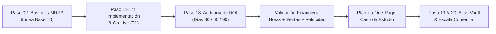
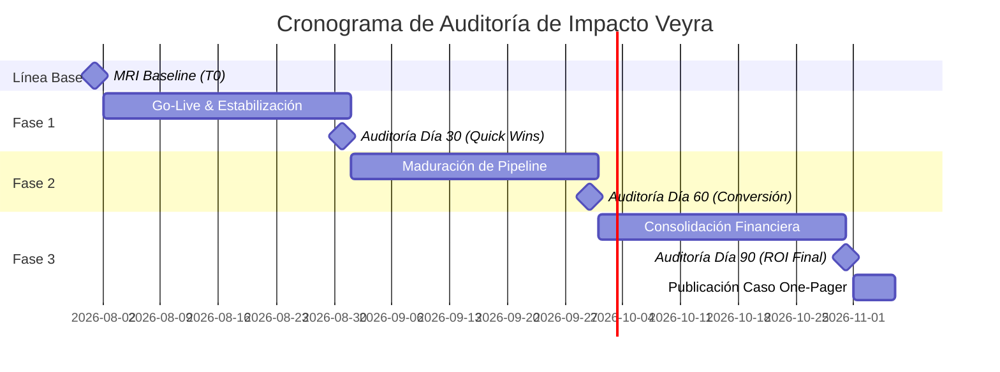

# 📊 VEYRA OPERATIONS — PASO 18: FRAMEWORK DE AUDITORÍA DE ROI Y CASOS DE ESTUDIO EJECUTIVOS
### *Protocolo Oficial de Medición de Impacto de Negocio, Modelos Financieros Antes vs. Después y Plantilla de One-Pager Comercial*

```
Documento: DOC-OPS-018-ROI-CASE-STUDIES
Versión: 1.0.0
Área Responsable: ROI & Case Study Analysis / Customer Success / Revenue Operations
Aplicable a: Veyra Solutions, La Trinidad Router & Ecosistema Guaki
Estado: Activo / Operacional
```

---

## 1. VISIÓN Y PRINCIPIOS FUNDAMENTALES (0% CARTÓN)

En **Veyra**, ningún proyecto de inteligencia artificial o automatización se da por concluido hasta que su impacto financiero y operativo haya sido matemáticamente demostrado. Rechazamos los reportes cosméticos y las métricas de vanidad.

### Principios de Medición Veyra:
1. **Anclaje en el Dolor Financiero (MRI Baseline):** La auditoría final del Día 30/60/90 contrasta rigurosamente los datos contra la línea base levantada en el *Paso 02 (Business MRI™)*.
2. **Traducción a Dinero y Tiempo:** Todo avance técnico (APIs, agentes, modelos LLM, bases vectoriales) debe traducirse en:
   * **Horas hombre liberadas** (Ahorro de costos laborales y aumento de capacidad).
   * **Velocidad de respuesta** (Reducción de churn y mejora drástica de conversión).
   * **Ingresos netos incrementales** (Pipeline acelerado, reactivación de leads y ventas cerradas).
3. **Activo Comercial Perpetuo:** Cada auditoría exitosa se transforma de inmediato en un **Caso de Estudio One-Pager Ejecutivo**, sirviendo como arma de ventas incontestable para cerrar nuevos clientes en la misma vertical.



---

## 2. EL TRIÁNGULO DE IMPACTO DE ROI VEYRA

El cálculo del Retorno de Inversión se fundamenta en tres pilares cuantitativos complementarios:

```
                      ▲
                     / \
                    /   \
                   /     \
  PILAR 1: VELOCIDAD     PILAR 2: EFICIENCIA
  (Speed-to-Lead)         (Horas & Costos Laborales)
        \                   /
         \                 /
          ▼---------------▼
         PILAR 3: INCREMENTO
           (Revenue & Conversión)
```

---

### PILAR 1: Velocidad y Tiempo de Respuesta (Speed-to-Lead)

* **Tiempo de Primera Respuesta (FRT - First Response Time):**
  $$\Delta \text{FRT} = \text{FRT}_{\text{Antes}} - \text{FRT}_{\text{Después}}$$
  * *Benchmark Veyra:* Reducción de $\ge 95\%$ (Ejemplo: de 240 minutos a $< 45$ segundos con agentes IA 24/7).
* **Tasa de Contacto Efectivo en Caliente:** Porcentaje de prospectos que interactúan inmediatamente tras mostrar intención de compra.

---

### PILAR 2: Eficiencia Operativa y Horas Hombre Ahorradas

* **Horas Semanales Ahorradas ($H_{\text{ahorradas}}$):**
  $$H_{\text{ahorradas}} = \sum_{i=1}^{n} (\text{Tiempo Previo Proceso } i - \text{Tiempo Automatizado Proceso } i) \times \text{Volumen Semanal } i$$
* **Ahorro Financiero Laboral Anualizado ($A_{\text{laboral}}$):**
  $$A_{\text{laboral}} = H_{\text{ahorradas}} \times 52 \times \text{Costo Hora Promedio} \times (1 + \text{Factor Cargas Prestacionales})$$
  *(En Colombia/Latam el factor de cargas prestacionales oscila entre 1.45 y 1.55).*

---

### PILAR 3: Incremento en Ventas y Conversión de Pipeline

* **Tasa de Conversión a Lead Calificado (SQL %):**
  $$\Delta \text{SQL} = \frac{\text{SQL}_{\text{Después}} - \text{SQL}_{\text{Antes}}}{\text{SQL}_{\text{Antes}}} \times 100$$
* **Ingresos Incrementales Generados ($R_{\text{incremental}}$):**
  $$R_{\text{incremental}} = (\text{Ventas Cerradas Mes Post} - \text{Ventas Cerradas Mes Base}) \times \text{Ticket Promedio} - \text{Variación Orgánica de Mercado}$$
* **Recuperación de Leads Inactivos / Carritos Abandonados:** Facturación directa atribuida a los flujos de reactivación por IA.

---

## 3. CALCULADORAS Y FÓRMULAS MATEMÁTICAS ESTANDARIZADAS

### 3.1. Fórmula Maestra del ROI Total Veyra

$$\text{ROI (\%)} = \left( \frac{\text{Beneficio Económico Neto Anualizado} - \text{Inversión Total del Proyecto}}{\text{Inversión Total del Proyecto}} \right) \times 100$$

Donde:
$$\text{Beneficio Económico Neto} = A_{\text{laboral}} + R_{\text{incremental}} - \text{Costos Operativos de IA (APIs, Hosting, Licencias)}$$

$$\text{Inversión Total} = \text{Fee de Implementación Veyra} + \text{Costos de Setup / Migración}$$

---

### 3.2. Periodo de Recuperación de Inversión (Payback Period)

$$\text{Payback (Meses)} = \frac{\text{Inversión Total del Proyecto}}{\text{Impacto Económico Neto Mensual}}$$

* **Objetivo de Excelencia Veyra:** Payback alcanzado entre los meses **1.5 y 4.0** tras el Go-Live.

---

### 3.3. Matriz de Parámetros de Cálculo Rápido (Cheat Sheet)

| Métrica | Unidad | Método de Captura | Fuente de Datos |
| :--- | :--- | :--- | :--- |
| **Tiempo de Respuesta (FRT)** | Segundos / Minutos | Logs de Webhooks y CRM | PostgreSQL / Guaki AI Logs / WhatsApp API |
| **Volumen de Interacciones** | Chats / Tickets mes | Contadores de eventos | Supabase / Make / n8n / HubSpot |
| **Horas Hombre por Tarea** | Horas / Semana | Time tracking / Entrevista | Encuesta de Operaciones & MRI |
| **Costo Hora Hombre** | USD / COP por hora | Nómina bruta + prestaciones | Dirección Financiera / RRHH |
| **Tasa de Conversión (Lead a Cierre)** | Porcentaje (%) | Embudo de ventas | CRM (HubSpot, Pipedrive, Salesforce, Sheet) |
| **Consumo de Infraestructura IA** | USD / Mes | Facturación de consumo | OpenAI, Anthropic, Google Cloud, Supabase |

---

## 4. PROTOCOLO DE AUDITORÍA POST-DESPLIEGUE (30-60-90 DÍAS)



### Hito 1 — Día 30: Quick Wins & Estabilización Operativa
* **Enfoque:** Métricas de primer orden (Tiempos de respuesta, volumen procesado, uptime, horas ahorradas mes 1).
* **Entregable:** Minuta Ejecutiva de 1 página con semáforo de estabilidad.
* **Acciones:**
  * Verificar si hay desvíos en los prompts de IA o tickets no resueltos.
  * Calcular las horas humanas liberadas en el primer mes de producción.

### Hito 2 — Día 60: Maduración de Pipeline & Conversión
* **Enfoque:** Métricas de segundo orden (Leads calificados, citas agendadas, reducción de tasa de abandono).
* **Entregable:** Dashboard de Embudo Comparativo (Mes Previo vs. Mes 2 Automatizado).
* **Acciones:**
  * Entrevistar a los líderes de ventas y operaciones.
  * Ajustar flujos de seguimiento y reenganche para maximizar cierres.

### Hito 3 — Día 90: Auditoría Integral de ROI & Cierre de Caso
* **Enfoque:** Métricas financieras definitivas (ROI %, Payback confirmado, Revenue incremental atribuible).
* **Entregables:**
  1. *Reporte Financiero de Auditoría de ROI Veyra (PDF Oficial).*
  2. *Caso de Estudio Ejecutivo One-Pager aprobado.*
  3. *Propuesta de Retainer de Expansión (Tier 3 Care & Scale).*

---

## 5. PLANTILLA OFICIAL: CASO DE ESTUDIO EJECUTIVO (ONE-PAGER)

Esta plantilla es el estándar oficial de Veyra para la elaboración de material comercial, presentaciones a juntas directivas y publicaciones de prueba social B2B.

---

```markdown
# 🚀 CASO DE ÉXITO EJECUTIVO: [NOMBRE DEL CLIENTE O VERTICAL]
### *Cómo [Nombre del Cliente] logró un ROI de [X]% y ahorró [Y] horas/semana con el AI Core de Veyra*

---

## 🏢 1. PERFIL DE LA EMPRESA & FICHA TÉCNICA
* **Cliente / Organización:** [Nombre de la Empresa o "Confidencial - Sector Inmobiliario / Fintech"]
* **Industria / Sector:** [Ej. Real Estate / Servicios Financieros / E-commerce / Salud]
* **Tamaño & Alcance:** [Ej. 45 colaboradores | Presencia en Colombia y México | Facturación $2M USD/año]
* **Solución Implementada:** [Ej. Veyra Full AI Transformation — Agentes Conversacionales 24/7 + CRM Auto-Sync + Engine de Calificación]
* **Período de Medición:** [Ej. 90 Días Post-Lanzamiento (Q2-Q3 2026)]

---

## 🛑 2. EL RETO DE NEGOCIO (EL DOLOR OPERATIVO)
* **Cuello de Botella Principal:** [Descripción concisa del problema antes de Veyra].
  * *Ejemplo: El equipo comercial tardaba en promedio 3.5 horas en responder a prospectos digitales. El 40% de los leads entraban fuera de horario laboral y se enfriaban, perdiendo más de $35,000 USD mensuales en ventas potenciales.*
* **Costos Ocultos:**
  * [X] horas hombre semanales consumidas en calificación manual repetitiva.
  * Base de datos desordenada sin trazabilidad en tiempo real.
  * Deserción de prospectos calificados por lentitud en el primer contacto.

---

## ⚡ 3. LA SOLUCIÓN VEYRA (ARQUITECTURA DE ALTO RENDIMIENTO)
Veyra desplegó una infraestructura inteligente de 3 componentes en un sprint de [X] semanas:
1. **Agente Concierge IA Multi-canal:** Atención instantánea 24/7 vía WhatsApp y Web con validación de presupuesto y scoring en tiempo real.
2. **Motor de Sincronización Automática (n8n / Mapache Core):** Enrutamiento inteligente de prospectos calificados directo al calendario de los ejecutivos de cuenta.
3. **Dashboard Gerencial en Tiempo Real (Next.js + Supabase):** Visibilidad ejecutiva del pipeline, métricas de conversión y alertas de fuga de leads.

---

## 📈 4. RESULTADOS AUDITADOS (ANTES VS. DESPUÉS)

| Dimensión Operativa / Comercial | ANTES (Línea Base T0) | DESPUÉS (Día 90 Veyra) | Impacto / Variación |
| :--- | :--- | :--- | :--- |
| **Tiempo de Primera Respuesta (FRT)** | 210 minutos (3.5 hrs) | **38 segundos** | 🟢 **-99.7% tiempo** |
| **Disponibilidad de Atención** | L-V 8:00 AM - 6:00 PM | **24/7/365 en tiempo real** | 🟢 **+250% cobertura** |
| **Horas Hombre en Calificación** | 35 horas / semana | **3 horas / semana** | 🟢 **32 hrs/sem liberadas** |
| **Tasa de Contacto a Cita Agendada** | 11.4% | **29.8%** | 🟢 **+161% conversión** |
| **Ventas Cerradas por Mes** | 14 operaciones | **23 operaciones** | 🟢 **+64.2% ventas** |
| **Costo Operativo por Lead Atendido** | $4.20 USD | **$0.35 USD** | 🟢 **-91.6% costo** |

---

## 💰 5. IMPACTO FINANCIERO Y RETORNO DE INVERSIÓN (ROI)

```
┌────────────────────────────────────────────────────────────────────────┐
│                        RESUMEN FINANCIERO AUDITADO                     │
│                                                                        │
│   • Retorno de Inversión (ROI):                 384% (Anualizado)      │
│   • Payback Period (Recuperación de Capital):   2.2 Meses              │
│   • Ahorro Operativo Anual Proyectado:          $28,500 USD            │
│   • Facturación Incremental (Primeros 90 Días): $74,200 USD            │
│   • Valor Neto Creado (Net Value Created):      $95,900 USD            │
└────────────────────────────────────────────────────────────────────────┘
```

---

## 🗣️ 6. TESTIMONIO EJECUTIVO
> *"Antes de implementar la arquitectura de Veyra, nuestro equipo comercial estaba colapsado respondiendo preguntas básicas y perdiendo los mejores clientes por responder tarde. Hoy nuestros asesores solo atienden citas con clientes listos para firmar. Veyra pagó toda su implementación en menos de 70 días."*
>
> — **[Nombre del Directivo]**, Chief Executive Officer (CEO) en [Nombre de la Empresa].

---

## 📞 7. ¿LISTO PARA REPLICAR ESTOS RESULTADOS?
Agenda un **Diagnóstico de Negocio MRI™** gratuito de 30 minutos con los arquitectos de soluciones de Veyra.
* **Web:** [veyra.la](https://veyra.la) | **Email:** soluciones@veyra.la | **WhatsApp Concierge:** +57 304 333 8899
```

---

## 6. EJEMPLO PRÁCTICO COMPLETO: CASO "GRUPO INMOBILIARIO HORIZON"

A continuación se documenta un caso de estudio real ejecutado bajo los estándares de Veyra:

### 6.1. Ficha del Caso
* **Empresa:** Grupo Inmobiliario Horizon (Bogotá / Medellín / Cali).
* **Equipo:** 18 agentes comerciales, 6 ejecutivos de cierre.
* **Fee Veyra Invertido:** $6,800 USD (Tier 2 Full Transformation).
* **Costos Operativos Mensuales IA (Supabase + Gemini 1.5 + WhatsApp Cloud API):** $145 USD/mes.

### 6.2. Balance Financiero a 90 Días

1. **Ahorro en Horas Hombre:**
   * Horas ahorradas al mes: 130 horas.
   * Costo promedio hora agente: $8.50 USD/hora (incluyendo cargas).
   * Ahorro mensual: $1,105 USD $\rightarrow$ **Ahorro Anualizado:** **$13,260 USD**.

2. **Ingreso Adicional por Cierres Rápidos:**
   * Ventas previas promedio mensual: 9 unidades inmobiliarias.
   * Ventas post-despliegue promedio mensual: 14 unidades inmobiliarias.
   * Incremento mensual neto de comisiones brutas de corretaje: $18,400 USD.
   * Ingreso adicional acumulado en 90 días: **$55,200 USD**.

3. **Cálculo de ROI y Payback:**
   * Inversión Total: $6,800 USD + ($145 * 3) = $7,235 USD.
   * Beneficio Neto a 90 Días: $3,315 USD (ahorro nómina) + $55,200 USD (ventas) - $435 (APIs) = $58,080 USD.
   * **ROI a 90 Días:**
     $$\text{ROI} = \frac{58,080 - 7,235}{7,235} \times 100 = \mathbf{702.7\%}$$
   * **Payback:** **1.3 Meses**.

---

## 7. PROTOCOLO DE ENTREVISTA Y AUTORIZACIÓN DE CASO DE ESTUDIO

### 7.1. Guión de Entrevista de Cierre (15 Minutos con el CEO/Gerente)
1. *"¿Cuál fue el cambio más notable en el día a día de tu equipo tras el lanzamiento?"*
2. *"Si tuvieras que destacar una sola cifra del reporte de auditoría, ¿cuál sería la más impactante para tu junta directiva?"*
3. *"¿Qué le dirías a un colega empresario que aún tiene dudas sobre automatizar sus operaciones con IA?"*

### 7.2. Plantilla de Correo de Solicitud de Aprobación y Logo
```text
Asunto: Reporte Oficial de Auditoría de ROI & Caso de Éxito — [Nombre Cliente] + Veyra

Estimado/a [Nombre del CEO / Directivo],

Es un gusto saludarte. Hemos completado con éxito la auditoría de impacto a los 90 días del despliegue de tu AI Core Veyra. Los resultados superaron los objetivos iniciales:

• Reducción de tiempo de respuesta: de [X hrs] a [Y seg] (-99%).
• Horas liberadas al equipo: [Z] horas/semana.
• Retorno de Inversión (ROI) alcanzado: [ROI]% en [Meses] meses.

Adjuntamos el One-Pager Ejecutivo con los números auditados. Nos encantaría contar con tu visto bueno para incluir el logotipo de [Nombre Cliente] y tu cita testimonial en nuestro compendio de casos de éxito del sector [Industria].

Si requieres que mantengamos el nombre de la empresa bajo anonimato ("Líder del Sector Inmobiliario"), solo indícanoslo y procederemos según tu preferencia.

¡Gracias por confiar en Veyra para transformar tu operación!

Atentamente,
Equipo de Customer Success & Growth — Veyra
```

---

## 8. INTEGRACIÓN CON ATLAS VAULT & PLAYBOOKS (PASOS 19 Y 20)

Al finalizar la auditoría y recibir la aprobación del cliente:
1. Se archiva la copia íntegra en:
   `Atlas_Vault/01_Clientes/[Nombre_Cliente]/05_Casos_de_Estudio.md`
2. Se extraen los números agregados a la matriz de prueba social de ventas en Notion/CRM.
3. Se actualizan los benchmarks sectoriales en los agentes de diagnóstico (*Business MRI Prompt*) para calibrar futuras proyecciones con datos empíricos reales.

---
*Veyra Operations — Documentación Confidencial de Excelencia Operativa. Cero Cartón. 100% Impacto Demostrable.*
