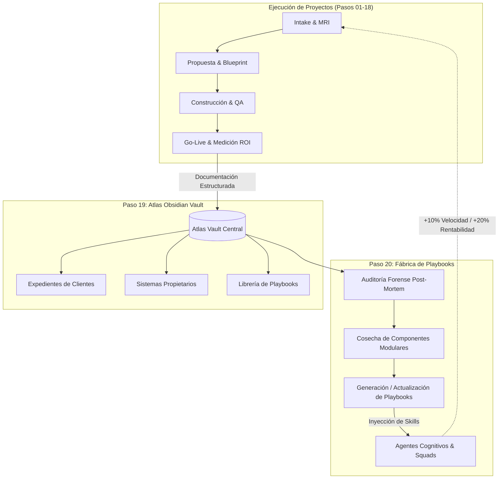
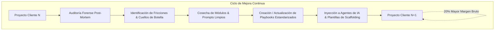
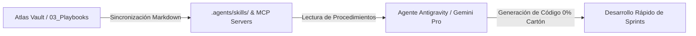

# 🏛️ MANUAL DE OPERACIONES: ATLAS OBSIDIAN VAULT & FÁBRICA DE PLAYBOOKS
### *Sistemas 19 y 20 del Manual Operativo Maestro Veyra & Guaki (MOP)*
### *Versión 1.0.0 — Estado: Activo en Producción*

---

## 📑 Tabla de Contenido
1. [Resumen Ejecutivo & Visión Arquitectónica](#1-resumen-ejecutivo--visión-arquitectónica)
2. [Paso 19: Arquitectura de Atlas Obsidian Vault](#2-paso-19-arquitectura-de-atlas-obsidian-vault)
   - [2.1 Taxonomía y Jerarquía de Carpetas](#21-taxonomía-y-jerarquía-de-carpetas)
   - [2.2 Estándar de Metadatos YAML (Frontmatter)](#22-estándar-de-metadatos-yaml-frontmatter)
   - [2.3 Enlaces Bidireccionales, MOCs y Navegación de Grafo](#23-enlaces-bidireccionales-mocs-y-navegación-de-grafo)
   - [2.4 Expediente Vivo de Clientes (Ciclo E2E)](#24-expediente-vivo-de-clientes-ciclo-e2e)
   - [2.5 Documentación de Sistemas Propietarios](#25-documentación-de-sistemas-propietarios)
3. [Paso 20: Protocolo de Post-Mortem & Fábrica de Playbooks](#3-paso-20-protocolo-de-post-mortem--fábrica-de-playbooks)
   - [3.1 El Flywheel de Escala Iterativa (+10% Velocidad / +20% Margen)](#31-el-flywheel-de-escala-iterativa-10-velocidad--20-margen)
   - [3.2 Auditoría Forense de Varianza (Tiempo, Horas, Margen)](#32-auditoría-forense-de-varianza-tiempo-horas-margen)
   - [3.3 Cosecha de Activos Modulares (Asset Harvesting)](#33-cosecha-de-activos-modulares-asset-harvesting)
   - [3.4 Ciclo de Vida y Versionamiento de Playbooks (SOPs)](#34-ciclo-de-vida-y-versionamiento-de-playbooks-sops)
   - [3.5 Inyección Cognitiva a Agentes de IA (`.agents/skills/`)](#35-inyección-cognitiva-a-agentes-de-ia-agentsskills)
4. [Guía Práctica de Ejecución Paso a Paso](#4-guía-práctica-de-ejecución-paso-a-paso)
   - [4.1 Inicialización de la Bóveda en Obsidian](#41-inicialización-de-la-bóveda-en-obsidian)
   - [4.2 Onboarding de un Nuevo Cliente](#42-onboarding-de-un-nuevo-cliente)
   - [4.3 Ejecución de la Retrospectiva Post-Mortem](#43-ejecución-de-la-retrospectiva-post-mortem)
   - [4.4 Publicación de un Componente Reutilizable](#44-publicación-de-un-componente-reutilizable)
5. [Gobernanza, Seguridad & Matriz RACI (0% Cartón)](#5-gobernanza-seguridad--matriz-raci-0-cartón)

---

## 1. Resumen Ejecutivo & Visión Arquitectónica

En las organizaciones tradicionales de desarrollo y consultoría, el conocimiento se disipa al concluir cada proyecto: el código queda enterrado en repositorios aislados, las soluciones a problemas complejos se olvidan y las lecciones aprendidas rara vez se estructuran.

**Veyra** y **La Trinidad / Guaki** operan bajo un paradigma radicalmente opuesto: **Ingeniería Capitalizada**. Cada interacción con un cliente, cada línea de código construida y cada error superado se transforma de inmediato en un activo intelectual reutilizable.



Este manual formaliza la arquitectura técnica, los estándares de documentación y los protocolos de gobernanza que rigen los **Pasos 19 y 20** del Manual Operativo Maestro (MOP), garantizando que la empresa escale con rendimientos crecientes.

---

## 2. Paso 19: Arquitectura de Atlas Obsidian Vault

**Atlas Vault** está alojado físicamente en la ruta:
[`E:\Proyectos IA\AI_STUDIO\GUAKI\docs\atlas_vault\`](file:///E:/Proyectos%20IA/AI_STUDIO/GUAKI/docs/atlas_vault/)

Ha sido diseñado específicamente para ser abierto directamente como un **Obsidian Vault**, aprovechando su motor de renderizado Markdown, soporte nativo de YAML Frontmatter, grafos de enlaces bidireccionales y compatibilidad con plugins como Dataview, Kanban y Mermaid.

---

### 2.1 Taxonomía y Jerarquía de Carpetas

La estructura física del Vault está organizada en 6 directorios troncales:

```
docs/atlas_vault/
├── README.md                                  # MOC (Map of Content) Raíz de la Bóveda
├── 00_Meta/                                   # Gobernanza, esquemas y plantillas maestras
│   ├── 00_INDEX_META.md
│   └── Templates/                             # 9 Plantillas oficiales estandarizadas
│       ├── Template_Ficha_Cliente.md
│       ├── Template_Diagnostico_MRI.md
│       ├── Template_Propuesta_Solution_Blueprint.md
│       ├── Template_Arquitectura_Tecnica.md
│       ├── Template_Acta_Reunion.md
│       ├── Template_Caso_de_Estudio.md
│       ├── Template_PostMortem_Retrospectiva.md
│       ├── Template_Playbook_Operativo.md
│       └── Template_Componente_Reutilizable.md
├── 01_Clientes/                               # Expedientes vivos de clientes
│   ├── 00_CLIENTES_INDEX.md
│   └── Cliente_Demo_Corporativo/              # Caso de referencia navegable
│       ├── 00_Ficha_Cliente.md
│       ├── 01_Diagnostico_MRI.md
│       ├── 02_Propuesta_Comercial.md
│       ├── 03_Arquitectura_Tecnica.md
│       ├── 04_Actas_Reuniones.md
│       ├── 05_Casos_de_Estudio.md
│       └── 06_PostMortem_Cierre.md
├── 02_Sistemas/                               # Infraestructura propietaria del ecosistema
│   ├── 00_SISTEMAS_INDEX.md
│   ├── Mapache_Core/00_Index.md               # Motor asíncrono y workers
│   ├── Trinidad_Router/00_Index.md            # Enrutador inteligente omnicanal
│   └── Guaki_Platform/00_Index.md             # Plataforma SaaS y Supabase DB
├── 03_Playbooks/                              # Procedimientos operativos estándar (SOPs)
│   ├── 00_PLAYBOOKS_INDEX.md
│   ├── Veyra_Inbound_Triage_Playbook.md
│   ├── FastAPI_Supabase_AI_Engine_Scaffolding.md
│   ├── NextJS_Glass_Dashboard_Deployment.md
│   ├── Omnichannel_WhatsApp_Voice_Agent.md
│   └── PostMortem_Extraction_Playbook.md
├── 04_Componentes_Reutilizables/              # Cosecha de activos modulares
│   ├── 00_COMPONENTES_INDEX.md
│   ├── Librerias_Python/                      # Módulos backend de alta reusabilidad
│   │   └── Supabase_Async_Client.md
│   ├── Templates_Frontend/                    # Componentes React / Next.js / Tailwind
│   │   └── Glass_Metric_Card.md
│   └── Prompts_Golden_Set/                    # Prompts de sistema evaluados en producción
│       └── B2B_Sales_Triage_Prompt.md
└── 05_Retrospectivas_PostMortem/              # Auditorías de cierre consolidadas
    ├── 00_POSTMORTEM_INDEX.md
    └── 2026-Q1_Retrospectiva_Maestra.md
```

---

### 2.2 Estándar de Metadatos YAML (Frontmatter)

Toda nota generada en Atlas Vault debe iniciar obligatoriamente con un bloque de metadatos estructurado en YAML. Esto permite indexar, consultar con Dataview y conectar programáticamente la base de conocimiento:

```yaml
---
title: "Título Descriptivo y Preciso"
type: [ficha_cliente | diagnostico_mri | propuesta_comercial | arquitectura_tecnica | acta_reunion | caso_de_estudio | postmortem_retrospectiva | playbook_operativo | componente_reutilizable | sistema_doc]
status: [borrador | revision | activo | entregado | completado | archivado]
client: "[[01_Clientes/Nombre_Cliente/00_Ficha_Cliente|Nombre_Cliente]]"
author: "[[Equipo/Nombre_Especialista]]"
date: 2026-08-21
tags:
  - veyra
  - dominio/subdominio
version: 1.0.0
---
```

---

### 2.3 Enlaces Bidireccionales, MOCs y Navegación de Grafo

Atlas Vault utiliza el estándar **Wikilink bidireccional (`[[Nombre_Nota]]` o `[[Ruta/Nota|Texto_Visible]]`)** para tejer una red neuronal de conocimiento:

1. **Map of Content (MOC):** Cada directorio principal cuenta con un archivo `00_*_INDEX.md` que actúa como concentrador y mapa de contenidos.
2. **Backlinks Activos:** Al consultar cualquier componente en `04_Componentes_Reutilizables/`, el panel lateral de Obsidian revela instantáneamente qué clientes lo están utilizando en producción y qué playbooks lo referencian.
3. **Obsidian Callouts:** Se utilizan callouts estandarizados para jerarquizar la información crítica:
   - `> [!NOTE]` — Contexto operativo o instrucciones clave.
   - `> [!TIP]` — Optimizaciones, atajos y ahorros comprobados.
   - `> [!IMPORTANT]` — Métricas de ROI, SLAs o requisitos mandatorios.
   - `> [!WARNING]` — Advertencias sobre scope creep o políticas financieras.

---

### 2.4 Expediente Vivo de Clientes (Ciclo E2E)

Cada proyecto se aloja en `01_Clientes/[Nombre_Cliente]/` y contiene la secuencia estandarizada de 7 documentos:

| Archivo | Paso MOP Relacionado | Contenido y Función |
| :--- | :--- | :--- |
| `00_Ficha_Cliente.md` | Paso 01 (Intake) | Datos del negocio, contactos, accesos cifrados y estado de hitos. |
| `01_Diagnostico_MRI.md` | Paso 02 (Diagnóstico) | Score de madurez digital, fuga de capital estimada y cuellos de botella. |
| `02_Propuesta_Comercial.md` | Pasos 03, 04, 05 (Blueprint) | Propuesta de valor, fases de entrega, precios y esquema de pagos 50-30-20. |
| `03_Arquitectura_Tecnica.md` | Pasos 08, 09, 11 (Construcción) | Diagrama de sistemas, esquemas Supabase SQL, APIs y modelos de IA. |
| `04_Actas_Reuniones.md` | Pasos 07, 13, 14 (Sprints) | Historial cronológico de Kickoff, Demo Days semanales y acuerdos. |
| `05_Casos_de_Estudio.md` | Paso 18 (Medición ROI) | Métricas Antes vs. Después (Día 30), ROI generado y testimonios. |
| `06_PostMortem_Cierre.md` | Paso 20 (Fábrica de Playbooks) | Análisis forense de varianza, horas reales y componentes cosechados. |

---

### 2.5 Documentación de Sistemas Propietarios

En `02_Sistemas/` se documentan los 3 pilares técnicos del ecosistema:
- **`Mapache_Core`:** Orquestación asíncrona, colas con Redis, workers en Python y cron jobs resilientes.
- **`Trinidad_Router`:** Reglas de inferencia y triage omnicanal (WhatsApp Cloud API, formularios web y routing dinámico `DESTINATION: VEYRA` vs. `DESTINATION: GUAKI`).
- **`Guaki_Platform`:** Plataforma SaaS multi-tenant, esquemas relacionales PostgreSQL con RLS en Supabase y suites de UI reactivas en Next.js.

---

## 3. Paso 20: Protocolo de Post-Mortem & Fábrica de Playbooks

El **Paso 20** representa el mecanismo de autorrefuerzo de Veyra. La regla inquebrantable de la organización dicta:

> **"Ningún proyecto se declara liquidado ni archivado hasta que la retrospectiva forense haya sido aprobada, sus activos cosechados y el aprendizaje cristalizado en un Playbook."**

---

### 3.1 El Flywheel de Escala Iterativa (+10% Velocidad / +20% Margen)



Cada iteración reduce el tiempo de desarrollo inicial y elimina los errores recurrentes mediante la reutilización de código probado.

---

### 3.2 Auditoría Forense de Varianza (Tiempo, Horas, Margen)

Al completar el Paso 17 (Offboarding) y el Paso 18 (Medición de Impacto), el Project Lead convoca la sesión de análisis forense para auditar cuatro dimensiones:

1. **Varianza de Cronograma:** Comparación de días estimados de entrega vs. días reales a producción.
2. **Varianza de Horas de Ingeniería:** Horas presupuestadas vs. horas reales registradas por el squad en cada fase.
3. **Varianza Financiera & Margen:** Margen proyectado vs. margen neto real obtenido tras descontar costos de infraestructura y consumo de APIs de IA.
4. **Análisis de 3 Preguntas Retrospectivas:**
   - *¿Qué funcionó de manera sobresaliente y debe convertirse en estándar permanente?*
   - *¿Qué causó fricción, retraso o retrabajo y cómo lo eliminamos de raíz?*
   - *¿Qué nueva tecnología o patrón debemos adoptar en el próximo sprint?*

---

### 3.3 Cosecha de Activos Modulares (Asset Harvesting)

Durante el desarrollo de un proyecto, los ingenieros construyen soluciones a problemas técnicos reales. El proceso de cosecha extrae estas soluciones del repositorio del cliente:

1. **Desacoplamiento:** Se eliminan referencias a marcas, URLs o llaves específicas del cliente.
2. **Generalización:** El componente se parametriza con variables de entorno (`process.env` / `pydantic-settings`).
3. **Clasificación en Bóveda:**
   - **`Librerias_Python/`:** Clientes de API, decoradores asíncronos, parsers y pipelines de datos.
   - **`Templates_Frontend/`:** Tarjetas de métricas, formularios validados, layouts Glassmorphism.
   - **`Prompts_Golden_Set/`:** Prompts de sistema testeados con evaluación humana y baja tasa de alucinaciones.

---

### 3.4 Ciclo de Vida y Versionamiento de Playbooks (SOPs)

Los playbooks en `03_Playbooks/` siguen versionamiento semántico (`vMAJOR.MINOR.PATCH`):
- **`PATCH` (ej. 1.0.1):** Corrección de un comando, tipografía o actualización menor de dependencia.
- **`MINOR` (ej. 1.1.0):** Adición de una nueva funcionalidad, manejo de un caso borde adicional o soporte de un nuevo canal.
- **`MAJOR` (ej. 2.0.0):** Rediseño arquitectónico completo del procedimiento (ej. migración de API v1 a v2).

---

### 3.5 Inyección Cognitiva a Agentes de IA (`.agents/skills/`)

Para que los playbooks no sean "documentos muertos", el conocimiento de Atlas Vault se sincroniza bidireccionalmente con los agentes de IA de desarrollo y soporte:



Cuando un ingeniero o agente autónomo inicia un nuevo proyecto, consulta directamente la skill correspondiente, ejecutando el scaffolding en minutos sin inventar la rueda.

---

## 4. Guía Práctica de Ejecución Paso a Paso

### 4.1 Inicialización de la Bóveda en Obsidian
1. Abrir la aplicación **Obsidian**.
2. Seleccionar *Open folder as vault* (Abrir carpeta como bóveda).
3. Seleccionar la ruta: `E:\Proyectos IA\AI_STUDIO\GUAKI\docs\atlas_vault`.
4. El archivo `README.md` se abrirá como pantalla de bienvenida y mapa de contenidos.

### 4.2 Onboarding de un Nuevo Cliente
1. Crear una nueva carpeta en `01_Clientes/[Nombre_Empresa]/`.
2. Duplicar las plantillas de `00_Meta/Templates/` renombrándolas:
   - `00_Ficha_Cliente.md`
   - `01_Diagnostico_MRI.md`
   - `02_Propuesta_Comercial.md`
   - `03_Arquitectura_Tecnica.md`
   - `04_Actas_Reuniones.md`
   - `05_Casos_de_Estudio.md`
   - `06_PostMortem_Cierre.md`
3. Completar el YAML Frontmatter con los datos de Intake (Paso 01).

### 4.3 Ejecución de la Retrospectiva Post-Mortem
1. Al recibir la liquidación final (Paso 17), el Project Lead abre `06_PostMortem_Cierre.md`.
2. Diligenciar la tabla de varianza financiera y de horas.
3. Extraer al menos 1 componente reutilizable hacia `04_Componentes_Reutilizables/`.
4. Generar o actualizar el Playbook correspondiente en `03_Playbooks/`.

### 4.4 Publicación de un Componente Reutilizable
1. Crear el archivo en la subcarpeta respectiva de `04_Componentes_Reutilizables/`.
2. Usar `Template_Componente_Reutilizable.md`.
3. Validar que el código compile y cuente con instrucciones de importación inmediatas.
4. Actualizar el índice general `04_Componentes_Reutilizables/00_COMPONENTES_INDEX.md`.

---

## 5. Gobernanza, Seguridad & Matriz RACI (0% Cartón)

### 🔒 Blindaje de Seguridad y Cero Credenciales en Texto Plano
- **Regla Estricta:** Ningún archivo en Atlas Vault puede contener contraseñas, API Keys reales de producción ni credenciales de clientes en texto claro.
- **Protocolo de Enlace Seguro:** Se debe colocar únicamente el identificador seguro del gestor de contraseñas corporativo (`vault_item_id` en Bitwarden / 1Password).

### 👥 Matriz de Responsabilidades (RACI)

| Actividad Operativa | Project Lead | AI Engineer | Frontend Engineer | QA Specialist | CTO / Master Architect |
| :--- | :---: | :---: | :---: | :---: | :---: |
| **Creación de Ficha & MRI** | **R / A** | C | C | I | I |
| **Documentación de Arquitectura** | C | **R** | **R** | I | **A** |
| **Registro de Actas de Sprint** | **R / A** | I | I | I | I |
| **Medición de ROI & Caso de Estudio** | **R / A** | C | C | I | I |
| **Auditoría Forense Post-Mortem** | **R** | C | C | C | **A** |
| **Cosecha de Componentes** | C | **R** | **R** | I | **A** |
| **Aprobación de Nuevos Playbooks** | C | C | C | C | **R / A** |

*Convenciones RACI: **R** = Responsable de Ejecución, **A** = Aprobador Final, **C** = Consultado, **I** = Informado.*
